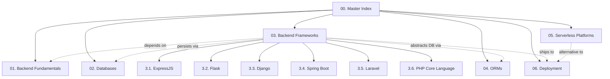

# Master Index — Backend Engineering Vault

> [!info] Vault Purpose
> A long-term, exhaustive knowledge base for **backend engineering** — APIs, frameworks, databases, ORMs, authentication, deployment, and serverless technologies.
>
> This vault **deliberately excludes** deep System Design topics (scalability theory, sharding math, distributed consensus, capacity planning) — those live in a dedicated System Design vault. Cross-references are kept to a minimum by design.

This file is the Map of Content (MOC) for the entire vault. Every note in the vault should be reachable, directly or transitively, from this index.

---

## How This Vault Is Organized

The vault follows a strict **chapter → topic → note** hierarchy:

1. **Numbering convention.** Folders and files use `Number. Title` (e.g., `1.1. HTTP Protocol and Lifecycle.md`). No underscores are used anywhere in filenames.
2. **Chapter indexes.** Every chapter folder starts with a `X.0. Chapter Index.md` that lists every note in the chapter, plus the learning order and prerequisites.
3. **Tag-driven navigation.** Every note has a YAML `tags:` block so the Obsidian tag pane and graph view work as a secondary navigation layer.
4. **Wikilinks for cross-references.** Notes use `[[Note Name]]` links rather than relative paths so they survive folder moves.
5. **Mermaid-only diagrams.** No raw ASCII art is used anywhere. All structural diagrams are Mermaid.

---

## Chapter Map

| Chapter | Folder | Purpose | Start Here |
| ------- | ------ | ------- | ---------- |
| **01** | `01. Backend Fundamentals` | HTTP, REST, cookies, sessions, authentication — the substrate every backend sits on. | [[1.0. Chapter Index\|01 Index]] |
| **02** | `02. Databases` | Database **engines** (not SQL syntax): PostgreSQL, MySQL, MariaDB, Oracle, MongoDB — internals, storage, transactions, clustering. | [[2.0. Chapter Index\|02 Index]] |
| **03** | `03. Backend Frameworks` | One sub-folder per framework: ExpressJS, Flask, Django, Spring Boot, Laravel, plus a dedicated PHP Core Language reference. | [[3.0. Chapter Index\|03 Index]] |
| **04** | `04. ORMs` | Object-Relational Mappers, with a deep focus on SQLAlchemy (Core vs ORM). | [[4.0. Chapter Index\|04 Index]] |
| **05** | `05. Serverless Platforms` | Firebase, Supabase, Cloudflare Workers, Vercel — managed backend platforms. | [[5.0. Chapter Index\|05 Index]] |
| **06** | `06. Deployment` | Docker, Nginx, VPS hardening, and the Docker-vs-Apache decision for PHP workloads. | [[6.0. Chapter Index\|06 Index]] |

---

## Recommended Reading Order

If you are reading this vault end-to-end, follow this order:

1. **[[1.1. HTTP Protocol and Lifecycle]]** — without this, nothing else makes sense.
2. **[[1.2. RESTful API Design and Constraints]]** — the lingua franca of modern APIs.
3. **[[1.3. Cookies and Session Management]]** → **[[1.4. Token-Based Authentication]]** — the state problem.
4. **[[2.1. Database Engine Fundamentals]]** — vocabulary for the entire databases chapter.
5. **[[2.7. Relational vs Non-Relational Storage Engines]]** — the strategic fork.
6. Pick **one** framework chapter in `03.` and read it fully. ExpressJS is the fastest on-ramp; PHP Core Language pairs naturally with the Laravel notes.
7. **[[4.1. ORM Fundamentals]]** → **[[4.2. SQLAlchemy Core vs ORM Internals]]**.
8. **[[6.1. Docker Containerization and Networking]]** — required to read the rest of the deployment chapter.
9. Skim `05. Serverless Platforms` once you understand Docker — most serverless platforms are Docker under the hood.

---

## Cross-Chapter Reference Map

The most useful cross-references:

- HTTP lifecycle → [[1.1. HTTP Protocol and Lifecycle]] is referenced by Flask (`3.2.`), ExpressJS (`3.1.`), Nginx (`6.3.`), and Docker (`6.1.`).
- Cookie / session model → [[1.3. Cookies and Session Management]] is referenced by Flask sessions (`3.2.10.`), token auth (`1.4.`), and Stateless APIs (`1.5.`).
- Database engine fundamentals → [[2.1. Database Engine Fundamentals]] is the conceptual root for every `2.x` note.
- Docker → [[6.1. Docker Containerization and Networking]] is referenced by Oracle DBMS (`2.5.`), Cloudflare Workers (`5.3.`), and Supabase (`5.2.`).
- PHP execution model → [[3.6.1. PHP Execution Models]] is the conceptual root for everything in `3.6.` and is referenced by Laravel (`3.5.`) and the Apache/Nginx notes (`6.2.`, `6.3.`).

---

## Vault Conventions

See **[[00. README and Vault Conventions]]** for the full style guide. The short version:

- **No underscores in filenames.** Use `Number. Title.md` with spaces.
- **No raw ASCII diagrams.** Use Mermaid fenced code blocks only.
- **Long notes.** Every note is structured for self-contained reading — no implicit assumptions.
- **YAML frontmatter.** Every note starts with a `tags:` block.
- **English only.**
- **System Design is out of scope.** If a topic bleeds into capacity planning, sharding math, or consensus algorithms, it gets a one-paragraph summary and a note: *"Covered in the System Design vault."*

---

## Maintenance Notes

- This index is hand-maintained. When you add a new note, add it to the relevant chapter index in the same session.
- The graph view in Obsidian should remain readable. If a single note accumulates more than ~15 inbound links, consider splitting it.
- Tags are flat (no nested tags). Add new tags sparingly — prefer chapter-folder + note-title as the primary identifier.

---

*Last updated: 2026-06-25. This vault supersedes the previous "idk" vault (PHP/MySQL, ExpressJS, Django, Flask) and merges its content into the new chapter structure.*
