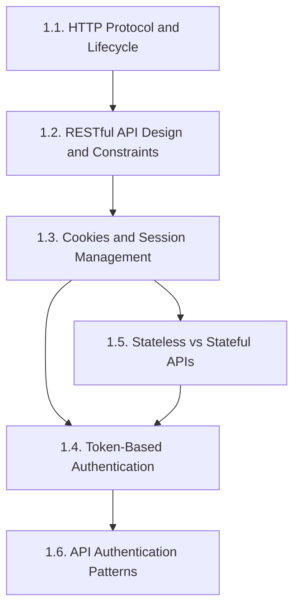
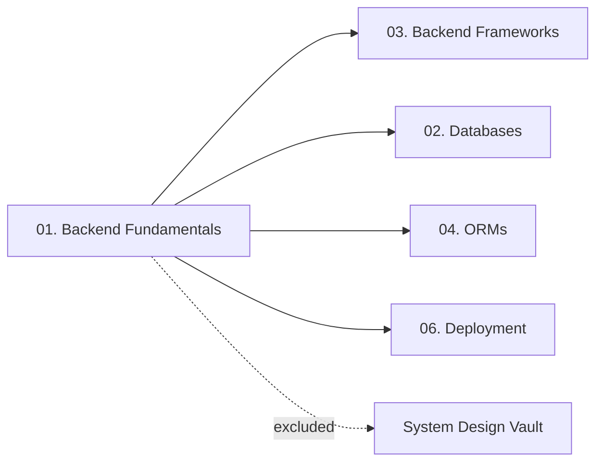

# 01. Backend Fundamentals — Chapter Index

> [!info] Chapter Purpose
> This chapter covers the **substrate** every backend sits on: how clients and servers talk (HTTP), how APIs are structured (REST), how state is tracked across stateless requests (cookies, sessions, tokens), and the patterns used to authenticate API callers. Every framework in chapter `03.` assumes this material as background.

If you read nothing else first, read **[[1.1. HTTP Protocol and Lifecycle]]** — without that vocabulary, the rest of the vault will not make sense.

---

## Notes in This Chapter

| # | Note | Topic |
| - | ---- | ----- |
| 1.1 | [[1.1. HTTP Protocol and Lifecycle]] | The full request/response lifecycle: DNS, TCP, TLS, methods, status codes, HTTP/1.1 vs HTTP/2 vs HTTP/3, essential headers. |
| 1.2 | [[1.2. RESTful API Design and Constraints]] | The 6 REST constraints, resource naming, CRUD mapping, versioning, pagination, anti-patterns. |
| 1.3 | [[1.3. Cookies and Session Management]] | `Set-Cookie` directive, attributes, session stores, fixation/hijacking mitigations, SameSite and CSRF. |
| 1.4 | [[1.4. Token-Based Authentication]] | JWT structure, signing algorithms, access vs refresh tokens, storage trade-offs, common pitfalls. |
| 1.5 | [[1.5. Stateless vs Stateful APIs]] | Definitions, where state lives, scalability and security trade-offs, authentication as the canonical example. |
| 1.6 | [[1.6. API Authentication Patterns]] | Basic auth, API keys, OAuth 2.0 grants, mTLS, service-to-service auth. |

---

## Recommended Reading Order

1. Start with **1.1. HTTP** — every other note assumes this vocabulary.
2. **1.2. REST** — the architectural style most modern APIs follow.
3. **1.3. Cookies and Sessions** — the original state-management mechanism.
4. **1.5. Stateful vs Stateless** — sharpens *why* cookies/sessions exist and what their alternative is.
5. **1.4. Token-Based Auth** — the modern alternative to sessions.
6. **1.6. API Auth Patterns** — synthesizes 1.3 and 1.4 into the patterns you will meet in production.

---

## Prerequisites

- Basic familiarity with the idea of a "client" and a "server".
- Comfort with command-line tools (`curl`, `nc`).
- No programming language is required to read 1.1–1.3 — they are protocol-level. Notes 1.4–1.6 use small code snippets in language-agnostic pseudocode plus occasional Python/JS for JWT examples.

---

## What This Chapter Does NOT Cover

- **Network protocols below the application layer** (TCP, TLS internals, QUIC packet format). These are mentioned functionally but not explained deeply. *Covered in networking references, not this vault.*
- **System design** (API gateway patterns at scale, rate-limiter math, CDN edge caching strategies). *Covered in the System Design vault.*
- **WebSocket / Server-Sent Events / gRPC**. Worth a dedicated note in a future revision; for now, treated as out of scope.

---

## How This Chapter Connects to the Rest of the Vault

- Every framework in `03.` (Express, Flask, Django, Spring Boot, Laravel, PHP) builds on HTTP and the auth patterns covered here.
- The Databases chapter (`02.`) shows where session tokens and refresh tokens are stored.
- The Deployment chapter (`06.`) shows how to terminate TLS and route requests — both require the HTTP vocabulary from 1.1.

---

## Maintenance Notes

- When adding a new note to this chapter, update the table above and the reading-order graph.
- If a note grows past 2,500 words, consider splitting it.
- New auth patterns (WebAuthn, Passkeys, mTLS for service mesh) may belong as new notes here in a future revision.

---

*See also: [[00. Master Index]] — [[00. README and Vault Conventions]]*
