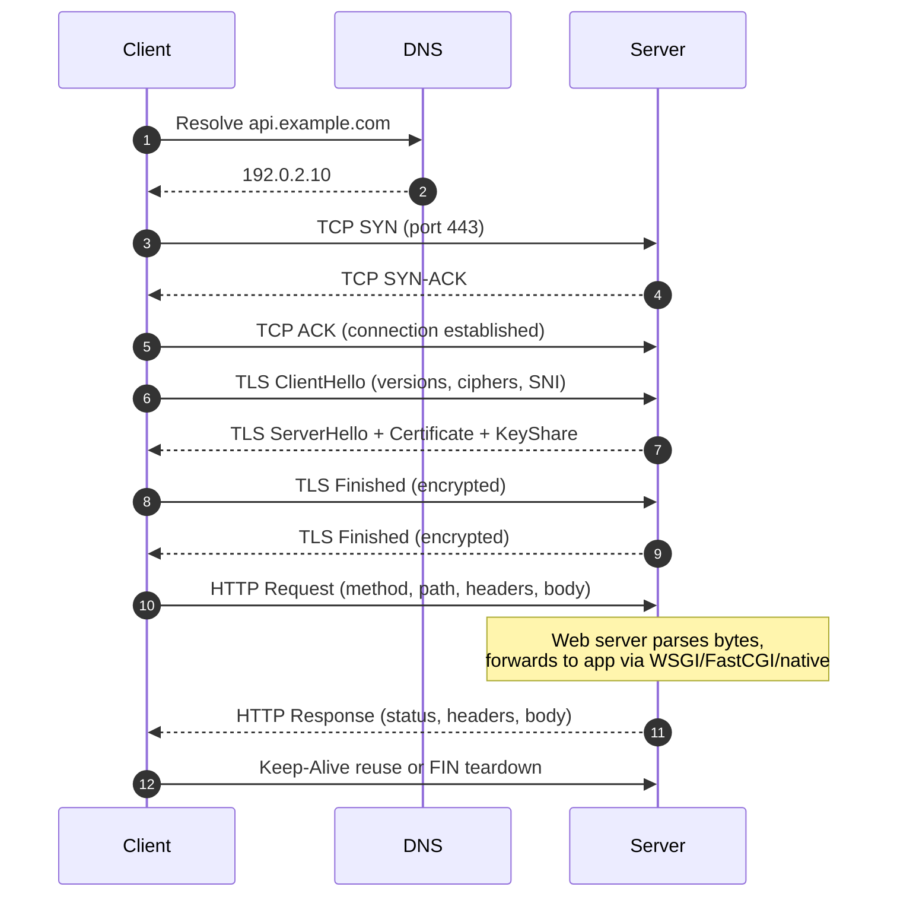

# 1.1. HTTP Protocol and Lifecycle

> [!info] Orientation
> HTTP is the request-response protocol that the entire web — and almost every modern backend API — is built on. This note walks through what HTTP actually is, the exact mechanical steps of a single request/response cycle, the wire format of requests and responses, the methods and status codes you use every day, and the differences between HTTP/1.1, HTTP/2, and HTTP/3 that matter to backend engineers.

## 1. What HTTP Is and Where It Sits

The Hypertext Transfer Protocol (HTTP) is an application-layer protocol designed to transfer hypermedia documents and structured data between networked devices. In the OSI seven-layer model, HTTP lives at layer 7 — the topmost layer — and relies entirely on the transport layer beneath it for reliable byte delivery. Originally HTTP/1.0 and HTTP/1.1 ran over TCP, HTTP/2 also runs over TCP but with binary framing, and HTTP/3 runs over QUIC which is itself layered on UDP.

HTTP is a **stateless** request-response protocol: each request is independent and the protocol itself retains no memory between requests. All "remembering" (sessions, tokens, cookies) is built on top of HTTP using headers and bodies, not inside the protocol. HTTP is also **text-oriented** in HTTP/1.x (requests and responses are human-readable ASCII with CRLF line terminators), but HTTP/2 and HTTP/3 switched to a binary framing format for efficiency while preserving the same semantic model. Backend engineers mostly reason about HTTP semantics — methods, status codes, headers, bodies — and treat the underlying framing as an optimization detail.

## 2. The Request-Response Lifecycle

When a client issues an HTTP request to a URL, a long sequence of events happens before the response payload arrives. Understanding this sequence is essential for debugging latency, TLS errors, proxy misconfigurations, and connection reuse issues.



Step 1 is **DNS resolution**: the client consults its local cache (browser, OS, `/etc/hosts`), then a recursive resolver, and finally an authoritative nameserver to translate the hostname into an IP address. Step 2 is the **TCP three-way handshake**: the client sends `SYN`, the server replies `SYN-ACK`, and the client completes the handshake with `ACK`. Step 3, for HTTPS, is the **TLS handshake**: client and server negotiate a TLS version and cipher suite, the server presents its X.509 certificate, the client verifies the certificate chain, and both sides derive shared symmetric session keys via Diffie-Hellman or RSA key exchange.

Step 4 is the **transmission of the HTTP request** itself: the client serializes the method, target URI, headers, and optional body onto the encrypted channel. Step 5 is **server-side processing**: the kernel reassembles IP packets into a TCP byte stream, hands bytes to the web server's socket buffer, the web server (Nginx, Apache, Caddy) parses the request, and forwards it to the application runtime via FastCGI, WSGI, ASGI, AJP, or a native reverse-proxy connection. Step 6 is the **HTTP response**: the application code executes, generates a payload, and the server writes the status line, headers, and body back onto the wire. Step 7 is **connection teardown or reuse**: with HTTP/1.1 Keep-Alive or HTTP/2 multiplexing, the TCP connection is held open for subsequent requests; otherwise a `Connection: close` triggers a TCP `FIN` sequence.

## 3. Anatomy of an HTTP Request and Response

A raw HTTP/1.1 request has four parts: the request line, the headers, a blank CRLF line, and an optional body. The request line is `<METHOD> <REQUEST-TARGET> <HTTP-VERSION>`.

```http
POST /v1/users HTTP/1.1
Host: api.example.com
Content-Type: application/json
Content-Length: 35
Authorization: Bearer eyJhbGciOi...
Accept: application/json
User-Agent: curl/8.4.0

{"name": "Alice", "role": "admin"}
```

A raw HTTP/1.1 response mirrors this with a status line, headers, a blank CRLF line, and an optional body. The status line is `<HTTP-VERSION> <STATUS-CODE> <REASON-PHRASE>`.

```http
HTTP/1.1 201 Created
Content-Type: application/json
Content-Length: 45
Location: /v1/users/42
Date: Thu, 25 Jun 2026 02:00:00 GMT

{"id": 42, "name": "Alice", "role": "admin"}
```

Headers are case-insensitive in HTTP/1.x, but in HTTP/2 they must be lowercase because HPACK compression relies on that invariant. Header values may not contain literal CRLF or NUL bytes; binary values must be encoded (typically base64). The `Host` header is mandatory in HTTP/1.1 because a single IP commonly serves many virtual hosts.

## 4. HTTP Methods, Safety, and Idempotency

HTTP methods carry semantic meaning that backend code is expected to honor. The two properties that distinguish them are **safety** (the method does not modify server state, so caches and crawlers may issue it freely) and **idempotency** (issuing the method N times has the same end-state effect as issuing it once).

| Method | Safe | Idempotent | Typical purpose |
| :--- | :--- | :--- | :--- |
| `GET` | Yes | Yes | Retrieve a representation of a resource. |
| `HEAD` | Yes | Yes | Like `GET` but return headers only, no body. |
| `OPTIONS` | Yes | Yes | Describe communication options (CORS preflight). |
| `POST` | No | No | Create a resource or trigger an action. |
| `PUT` | No | Yes | Replace a resource at a known URI with a new representation. |
| `PATCH` | No | No (usually) | Apply a partial update to a resource. |
| `DELETE` | No | Yes | Remove a resource. |

Safety is about side effects on server state; idempotency is about repeatable side effects. `DELETE /users/42` issued twice must leave the system in the same state as issuing it once — the second call returns `404` instead of `204`, but the end state is identical. `POST /orders` issued twice creates two orders, which is why POST is non-idempotent and clients must use idempotency keys (e.g., `Idempotency-Key` header) when retry is possible.

## 5. Status Codes by Class

Status codes are grouped by leading digit. Backend engineers should know the common ones in each class.

| Class | Meaning | Common codes |
| :--- | :--- | :--- |
| `1xx` | Informational | `100 Continue`, `101 Switching Protocols` |
| `2xx` | Success | `200 OK`, `201 Created`, `202 Accepted`, `204 No Content` |
| `3xx` | Redirection | `301 Moved Permanently`, `302 Found`, `304 Not Modified`, `307 Temporary Redirect`, `308 Permanent Redirect` |
| `4xx` | Client error | `400 Bad Request`, `401 Unauthorized`, `403 Forbidden`, `404 Not Found`, `409 Conflict`, `422 Unprocessable Entity`, `429 Too Many Requests` |
| `5xx` | Server error | `500 Internal Server Error`, `502 Bad Gateway`, `503 Service Unavailable`, `504 Gateway Timeout` |

Note that `401 Unauthorized` is actually about **authentication** (no valid credentials), while `403 Forbidden` is about **authorization** (valid credentials but not permitted). The reason phrases (`OK`, `Not Found`) are advisory; clients must key off the numeric code, not the text.

## 6. HTTP/1.1 vs HTTP/2 vs HTTP/3

| Feature | HTTP/1.1 | HTTP/2 | HTTP/3 |
| :--- | :--- | :--- | :--- |
| Transport | TCP | TCP | QUIC (UDP) |
| Wire format | Plain text | Binary frames | Binary frames |
| Multiplexing | No | Yes, multiple streams per TCP connection | Yes, independent streams per QUIC connection |
| Header compression | None | HPACK | QPACK |
| Head-of-line blocking | At HTTP and TCP layers | Only at TCP layer | None |
| Connection setup | 2-3 RTTs (TCP + TLS) | 2-3 RTTs | 1 RTT (combined QUIC + TLS 1.3) |

HTTP/1.1 can pipeline requests but most browsers disable pipelining because a slow response blocks everything behind it (HTTP-level head-of-line blocking). HTTP/2 introduced binary framing and multiplexing so many streams share one TCP connection, but a dropped TCP packet stalls all streams until retransmission (TCP-level head-of-line blocking). HTTP/3 replaces TCP with QUIC over UDP, where each stream has independent loss recovery — a dropped packet for stream A does not block stream B.

For backend engineers, the practical takeaway is: terminate HTTP/2 at your reverse proxy (Nginx, Caddy, Cloudflare), and let the proxy speak HTTP/1.1 or a binary protocol like gRPC to your application servers. HTTP/3 support is now broad enough that enabling it at the edge is a low-risk latency win for mobile clients on lossy networks.

## 7. Headers Every Backend Developer Must Know

A small set of headers appears in almost every request and response; knowing them cold is table stakes.

| Header | Direction | Purpose |
| :--- | :--- | :--- |
| `Host` | Request | Required in HTTP/1.1; identifies the virtual host. |
| `Content-Type` | Both | Media type of the body (`application/json`, `multipart/form-data`). |
| `Content-Length` | Both | Byte length of the body; allows connection reuse. |
| `Authorization` | Request | Credentials (`Basic`, `Bearer`, `Digest`). |
| `Cache-Control` | Both | Caching directives (`no-store`, `max-age=3600`, `private`). |
| `Cookie` | Request | Cookies previously set by `Set-Cookie`. |
| `Set-Cookie` | Response | Send a cookie to the browser; one per header line. |
| `X-Forwarded-For` | Request | Client IP chain through proxies. |
| `X-Real-IP` | Request | The original client IP as seen by the first proxy. |
| `X-Forwarded-Proto` | Request | Original protocol (`http` or `https`) before TLS termination. |
| `User-Agent` | Request | Client identifier string. |
| `Accept` | Request | Media types the client will accept. |

The `X-Forwarded-*` headers are written by your reverse proxy when it terminates TLS, so your application sees a connection from the proxy's IP rather than the client's. Always configure your proxy to set these, and always strip any incoming `X-Forwarded-*` headers from untrusted clients to prevent IP spoofing. The `Forwarded` standard header (RFC 7239) is the formal replacement, but the `X-Forwarded-*` variants remain ubiquitous.

## Summary

HTTP is a stateless application-layer request-response protocol whose semantics — methods, status codes, headers, and bodies — are the contract every backend exposes to its clients. The lifecycle of a single request spans DNS, TCP, TLS, the HTTP wire format, application processing, the response, and connection reuse, and each step is a potential source of latency or failure. The method set encodes safety and idempotency contracts that backend code must honor; the status code classes tell clients what category of outcome occurred. The protocol has evolved through HTTP/1.1, HTTP/2, and HTTP/3 to address head-of-line blocking and handshake latency, but the underlying semantics have remained stable. Mastery of HTTP is the substrate on which everything else in this vault — REST, sessions, tokens, framework request handling — is built.

## See Also

- [[1.2. RESTful API Design and Constraints]]
- [[1.3. Cookies and Session Management]]
- [[1.4. Token-Based Authentication]]
- [[1.5. Stateless vs Stateful APIs]]
- [[6.3. Nginx Reverse Proxy and Load Balancing]]

## References

- RFC 9110 — HTTP Semantics
- RFC 9112 — HTTP/1.1
- RFC 9113 — HTTP/2
- RFC 9114 — HTTP/3
