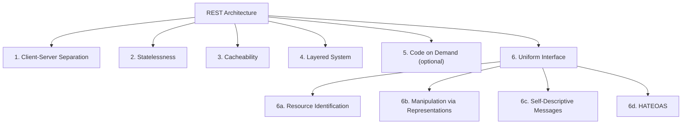

# 1.2. RESTful API Design and Constraints

> [!info] Orientation
> REST is the dominant architectural style for public web APIs. This note defines REST precisely, walks through Roy Fielding's six constraints and the four sub-constraints of the Uniform Interface, then covers the practical engineering details — resource naming, method-to-CRUD mapping, status code selection, versioning, pagination, and the anti-patterns that production APIs fall into.

## 1. What REST Actually Is

REST stands for **REpresentational State Transfer**. It is an **architectural style** — not a protocol, not a standard, not a technology — first described by Roy Fielding in his 2000 PhD dissertation, *Architectural Styles and the Design of Network-based Software Architectures*. An API is "RESTful" when it conforms to a set of constraints Fielding derived from observing what made the web scale. Crucially, REST says nothing about JSON, HTTP verbs, or URLs — those are simply the most common implementation choices that happen to satisfy the constraints.

The web itself is the canonical REST system: HTTP is the protocol that embodies the constraints, URLs identify resources, and media types describe representations. REST is therefore best understood as a *generalization* of how HTTP already behaves, applied to API design. A consequence of this is that "REST over HTTP" and "REST" are usually the same thing in practice, and the rules below are framed in HTTP terms.

## 2. The Six Constraints of REST

An API must satisfy all six constraints (five mandatory, one optional) to be considered RESTful in Fielding's strict sense. The diagram below shows how they compose.



### 2.1 Client-Server Separation

User-interface concerns (rendering, navigation, form state) are separated from data-storage and business-logic concerns. The client and server evolve independently; the only contract between them is the set of HTTP messages they exchange. This separation lets a single backend serve a web SPA, a mobile app, and a CLI tool without any server-side branching on client type.

### 2.2 Statelessness

The server must not store any client session state between requests. Every request must contain all the information the server needs to understand and complete it — authentication credentials, pagination cursors, idempotency keys, and so on. The engineering payoff is enormous: any server in a fleet can serve any request, so horizontal scaling is just a matter of adding instances behind a load balancer. There is no need for sticky sessions or cross-node session replication. Note that "stateless" does **not** mean "no database" — resources themselves still have durable state. It means only that the *conversation state* between client and server lives entirely in the messages they exchange. This is covered in depth in [[1.5. Stateless vs Stateful APIs]].

### 2.3 Cacheability

Responses must explicitly declare whether they are cacheable, and for how long. This is what `Cache-Control`, `ETag`, `Last-Modified`, and `Vary` are for. Cacheability lets intermediate proxies, CDNs, and the client browser reuse responses, dramatically reducing origin load. A REST API that returns responses with no caching headers is technically still RESTful, but it forfeits one of the style's main scalability levers.

### 2.4 Layered System

The client cannot tell whether it is connected directly to the origin server, to a reverse proxy, to a CDN, or to a load balancer in front of a microservice mesh. Each layer only knows about its immediate neighbor. This lets you insert caching layers, rate limiters, or WAFs transparently. It also forces you to design messages that are self-contained, because no layer can rely on conversation memory held by another layer.

### 2.5 Code on Demand (Optional)

Servers may temporarily extend client behavior by shipping executable code — JavaScript snippets, compiled applets — in responses. This is the only optional constraint. It is rarely used in modern JSON APIs and most production APIs simply omit it.

### 2.6 Uniform Interface

The uniform interface is the most important and most violated constraint. It has four sub-constraints.

**Identification of resources.** Every resource is identified by exactly one URI — for example, `/v1/orders/1024`. A resource is any conceptual entity the API exposes: a user, an order, a collection of orders, a PDF rendering of an invoice.

**Manipulation of resources through representations.** Clients never edit a resource directly; they send a representation of the desired state (typically JSON or XML) and the server reconciles it. A `PUT /v1/orders/1024` with a JSON body says "make the order at this URI match this representation," not "apply these SQL updates."

**Self-descriptive messages.** Each message carries enough metadata to be processed in isolation — `Content-Type`, `Content-Length`, `Authorization`, and so on. A server reading a request should not have to infer the media type or encoding from out-of-band knowledge.

**HATEOAS — Hypermedia As The Engine Of Application State.** Clients discover the available next actions by following hypermedia links returned in responses, not by hardcoding URL patterns. A HATEOAS-compliant response looks like this:

```json
{
  "account_number": "98201",
  "balance": 1500.00,
  "currency": "USD",
  "_links": {
    "self":     { "href": "/v1/accounts/98201" },
    "deposit":  { "href": "/v1/accounts/98201/deposits" },
    "withdraw": { "href": "/v1/accounts/98201/withdrawals" },
    "transfer": { "href": "/v1/accounts/98201/transfers" }
  }
}
```

If the account balance drops below zero, a subsequent `GET` might omit the `withdraw` link entirely, signaling that the action is not currently permitted. In practice, very few production APIs implement HATEOAS — the web frontend ecosystem prefers typed clients and hardcoded URL templates — so most "RESTful" APIs are more accurately described as "HTTP APIs with resource-oriented URLs."

## 3. Resource Naming Conventions

REST resource names follow predictable conventions because the URL is part of the API contract.

| Rule | Correct | Wrong |
| :--- | :--- | :--- |
| Use nouns, not verbs | `/v1/users/42` | `/v1/getUser?id=42` |
| Use plurals for collections | `/v1/users` | `/v1/user` |
| Use lowercase | `/v1/order-items` | `/v1/OrderItems` |
| Hyphenate multi-word names | `/v1/order-items` | `/v1/order_items`, `/v1/orderItems` |
| Put identifiers in path, filters in query | `/v1/users/42?fields=name,email` | `/v1/users?id=42&fields=name,email` |
| Express hierarchy through nesting | `/v1/users/42/orders` | `/v1/orders?userId=42` (acceptable but less idiomatic) |

Verbs in URLs are an RPC smell. If you find yourself writing `/v1/users/42/activate`, consider whether `PATCH /v1/users/42` with `{"status": "active"}` does the same job — it usually does, and it composes better with future field additions.

## 4. HTTP Method to CRUD Mapping

| CRUD | Method | Typical URI | Success status | Idempotent |
| :--- | :--- | :--- | :--- | :--- |
| Create | `POST` | `/v1/users` | `201 Created` | No |
| Read (list) | `GET` | `/v1/users` | `200 OK` | Yes |
| Read (one) | `GET` | `/v1/users/42` | `200 OK` | Yes |
| Update (full) | `PUT` | `/v1/users/42` | `200 OK` | Yes |
| Update (partial) | `PATCH` | `/v1/users/42` | `200 OK` | No |
| Delete | `DELETE` | `/v1/users/42` | `204 No Content` | Yes |

`POST` returning `201 Created` should also set the `Location` header to the URI of the newly created resource. `PUT` returning `200 OK` is fine; some teams prefer `200 OK` with the updated representation, others return `204 No Content`. The choice is a team convention; the important thing is consistency.

## 5. Status Code Selection per Action

Choosing the right status code is the difference between a polite API and a confusing one. For creation, `201 Created` (with `Location`) beats a generic `200 OK`. For deletion, `204 No Content` is conventional. For validation failures, prefer `422 Unprocessable Entity` over `400 Bad Request` when the body is well-formed JSON but fails business-rule validation. For conflicts (duplicate email on `POST`, stale `If-Match` on `PUT`), return `409 Conflict`. For authentication problems use `401 Unauthorized`; for authorization problems use `403 Forbidden`. For rate limiting use `429 Too Many Requests` with a `Retry-After` header.

The cardinal anti-pattern is returning `200 OK` with an error body like `{"error": "user not found"}`. This breaks every well-behaved client, hides problems from monitoring tools that key off status codes, and signals that the API designer does not understand HTTP semantics. Use the right status code; the body is for details.

## 6. Versioning Strategies

Three strategies are in common use; each has trade-offs.

| Strategy | Example | Pros | Cons |
| :--- | :--- | :--- | :--- |
| URI versioning | `/v1/users`, `/v2/users` | Visible in logs, easy to route, cacheable cleanly | Ugly URLs, version churn in path |
| Header versioning | `Accept: application/vnd.api+json; version=2` | URLs stay clean, multiple versions coexist on same URI | Invisible in casual curl, harder to debug, harder to cache by URL |
| Query param | `/users?version=2` | Easy to add retroactively | Easy to forget, breaks caching by URL, no precedent in HTTP |

URI versioning (`/v1/`) is the most common choice in public APIs (GitHub, Stripe, Twitter) because it is the most operationally friendly: it shows up in access logs, it routes cleanly at the proxy layer, and caches key off the full URL. Header versioning is preferred by purists but is operationally awkward. Pick one and stick with it; mixing strategies is the worst option.

## 7. Pagination, Filtering, and Sorting

List endpoints should always be paginated. The two dominant styles are **offset/limit** (`?page=3&page_size=20` or `?offset=40&limit=20`) and **cursor-based** (`?cursor=eyJpZCI6MTAwfQ&limit=20`). Offset pagination is simpler but degrades on large tables (the database still scans the first N rows) and is unstable when new rows are inserted between page fetches. Cursor pagination is stable and efficient — each page returns a cursor that points to the next row — but breaks the "jump to page 7" UX.

Filtering belongs in query parameters: `GET /v1/orders?status=paid&min_total=100&sort=-created_at`. Convention is to use `-` prefix for descending sort, comma-separate multi-field sorts (`?sort=-created_at,id`), and snake_case or camelCase consistently. For complex filtering (full-text search, multi-field AND/OR), consider a dedicated search endpoint or a query language like the JSON-API filtering spec.

## 8. Common REST Anti-Patterns

A few mistakes appear so often in production code that they are worth naming explicitly.

**Verbs in URLs.** `/v1/getUser`, `/v1/createOrder`, `/v1/deleteAccount`. The HTTP method already encodes the verb; the URL should encode only the resource.

**Returning 200 with an error body.** Covered above. The status code is the contract; the body is detail.

**Leaking internals.** Returning primary keys, internal enum values, stack traces, database column names, or implementation hints (e.g., `{"_type": "MongoDocument"}`) couples clients to your storage layer. Use stable external IDs and explicitly designed enum strings.

**Chatty APIs.** Requiring ten round trips to render a single page defeats REST's caching and batching advantages. Consider embedding related resources (`/v1/users/42?include=orders`) or moving to GraphQL when chatty-ness becomes a measured problem.

**Tunneling everything through GET or POST.** Using `GET /v1/users/delete/42` or `POST /v1/users/42?action=delete` discards the semantic richness of HTTP and confuses caches, proxies, and idempotency reasoning. Use `DELETE /v1/users/42`.

**Inconsistent naming.** Mixing `/v1/user-profiles` and `/v1/orderProfiles` and `/v1/payment_profiles` in the same API forces clients to memorize per-resource conventions. Pick a style (lowercase, hyphenated, plural) and enforce it with linting.

## Summary

REST is an architectural style, not a protocol, defined by six constraints — five mandatory (client-server, statelessness, cacheability, layered system, uniform interface) and one optional (code on demand). The uniform interface's four sub-constraints, especially HATEOAS, are the most routinely violated part of the style; most production "RESTful" APIs are really HTTP APIs with resource-oriented URLs. Resource naming, method-to-CRUD mapping, status code selection, versioning, and pagination are all matters of convention built on top of HTTP semantics, and the conventions exist to make APIs predictable for clients and observable for operators. The recurring anti-patterns — verbs in URLs, 200-with-error-body, internal leakage, chattiness, verb tunneling — are all symptoms of treating HTTP as a transport rather than as an application protocol.

## See Also

- [[1.1. HTTP Protocol and Lifecycle]]
- [[1.5. Stateless vs Stateful APIs]]
- [[1.6. API Authentication Patterns]]
- [[3.1.6. Express Middleware Architecture]]

## References

- Roy Thomas Fielding, *Architectural Styles and the Design of Network-based Software Architectures*, Chapter 5, 2000.
- RFC 9110 — HTTP Semantics (the modern authoritative spec for the methods and status codes REST builds on).
- JSON:API specification — a strict, opinionated REST profile with conventions for pagination, filtering, and HATEOAS.
