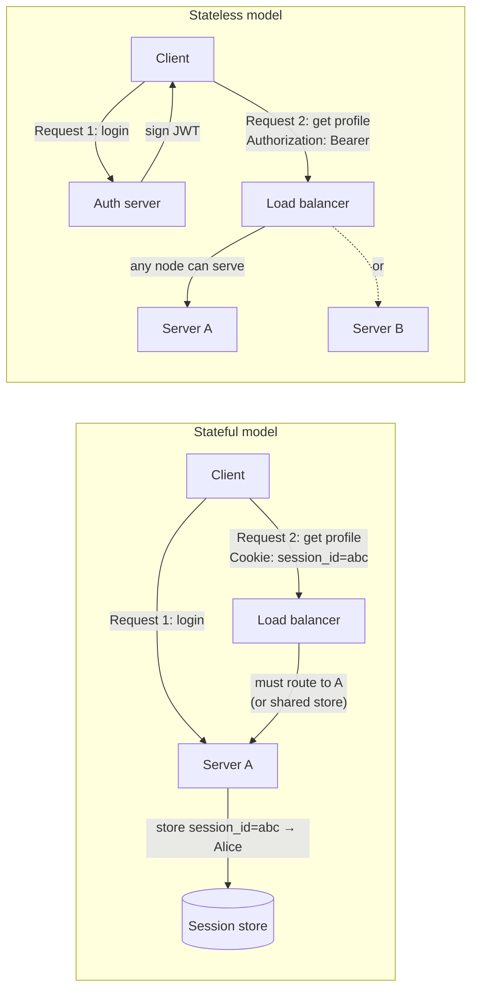

# 1.5. Stateless vs Stateful APIs

> [!info] Orientation
> "Stateless" is one of the most misunderstood words in backend engineering. It does not mean "no database," "no memory," or "no sessions." It is a precise architectural property with concrete engineering consequences. This note defines stateful and stateless APIs, explains what statelessness actually requires, shows where state lives when the server is stateless, contrasts session-based and token-based authentication through that lens, and lays out the trade-offs that should drive the choice for a given system.

## 1. Definitions

A **stateful API** is one where the server maintains conversational state about each client between requests. The server remembers that "this client is Alice, halfway through checkout, with cart containing items X, Y, Z, having already validated payment method P." Each request is interpreted in the context of accumulated server-side state. Classical examples are session-cookie-based web apps where the server stores a per-user session record in Redis, WebSocket connections where the server holds an open socket and per-connection buffers, and old-school SOAP services that maintain conversational context.

A **stateless API** is one where every request is self-contained: the server does not need to recall any prior request to interpret the current one. Each request carries the full context required to process it — authentication credentials in an `Authorization` header, the resource identifier in the URL, the desired operation in the HTTP method, and any state needed to disambiguate (idempotency keys, pagination cursors). The server processes the request, returns the response, and forgets everything about it. REST's statelessness constraint (Fielding's second constraint, see [[1.2. RESTful API Design and Constraints]]) demands exactly this property.

## 2. What "Stateless" Actually Means

The most common confusion is equating "stateless" with "no database" or "no persistent state." That is wrong. A stateless server can absolutely have a database — that is where the resource state lives — and the resource state can be enormous. What the server must not hold is **client conversational state**: per-client, between-request memory that is needed to interpret the next request.

Consider the difference between two endpoints. `GET /v1/cart/1024` is stateless: the cart ID is in the URL, the cart contents live in the database, and any server can serve the request by reading from the shared database. `GET /v1/cart` where the server uses an in-memory `current_cart` variable tied to the client's session is stateful: the server must recall which cart belongs to this client, and only the server holding that session record can answer. The cart data is the same; what differs is whether the client identity is bound into a server-side conversation or carried explicitly in the request.

A useful test: **if you restart the server, can the same client resume making requests without re-authenticating or losing in-flight work?** If yes, the API is stateless (or the state is durably persisted in a shared store). If no — if restarting the server logs everyone out or drops shopping carts — the API is stateful with in-memory state.

## 3. Where State Lives When the Server Is Stateless

Statelessness does not eliminate state; it relocates it. There are three places state can live in a stateless architecture.

**On the client.** Authentication tokens (JWTs), client-side pagination cursors, idempotency keys, and preference flags carried in query strings or headers all live on the client. The client must resend them with every relevant request, which is exactly what makes the server stateless with respect to them.

**In the database.** Durable resource state — user records, orders, posts, comments — lives in the database. This is shared state, accessible to every server instance, but it is not "conversational state" in the stateful sense because no server holds it in memory between requests; each request reads and writes it via the database.

**In a shared cache.** Often-queried, rarely-changed data (feature flags, rate-limit counters, idempotency-key registries, hot configuration) lives in a cache like Redis. The cache is a shared store like the database, but optimized for low-latency reads. Caches do not make the server stateful because, again, the state is shared and queried per-request rather than held in per-server memory.

The architecture decision is not "should we have state" — it is "where should state live, and how is it accessed?" Stateless architectures move conversational state to the client and durable state to shared stores, leaving the application process itself free to be restarted, scaled, or replaced at will.

## 4. Authentication State: Sessions vs Tokens

Authentication is the canonical case where the stateful-vs-stateless choice has visible consequences.

**Session-based authentication is stateful.** The server stores a session record indexed by a session ID, sends the ID to the client in a cookie, and looks up the session on every request. The session record holds the user ID, role, login timestamp, and any other authentication-related state. Restarting the session store logs everyone out; if the store is per-instance, only that instance can serve that user's requests until the session expires.

**Token-based authentication (JWT) is stateless.** The server signs a token containing the user ID, role, and expiry, and sends it to the client. On every request, the client presents the token; the server verifies the signature and reads the claims without any server-side lookup. Any server instance can serve any request because no instance needs to recall anything about that client. The trade-off is revocation: a stateless JWT cannot be silently revoked before expiry without a server-side denylist (which reintroduces state). See [[1.4. Token-Based Authentication]] for the full discussion.

In practice, many systems are hybrid: stateless JWTs for the bulk of API requests (no session lookup → fast, horizontally scalable), backed by a stateful session store for the small set of operations that genuinely require server-side state (active logout, "log out all sessions," forced password reset). The hybrid model is honest about where state lives instead of pretending it does not exist.

## 5. Trade-offs

| Dimension | Stateful | Stateless |
| :--- | :--- | :--- |
| Horizontal scaling | Hard — requires sticky sessions or shared session store | Easy — any instance serves any request |
| Memory per instance | High — holds per-client state | Low — only request-scoped memory |
| Restart resilience | Poor — in-memory state lost | Excellent — no in-memory state to lose |
| Debuggability | Easier — server has the conversation context | Harder — each request is isolated, must replay full context |
| Bandwidth | Lower — only session ID per request | Higher — credentials and context in every request |
| Revocation | Trivial — delete the session row | Hard — requires denylist or short expiry |
| Per-client customization | Natural — server-side per-client state | Awkward — client must resend preferences |
| Caching | Harder — response may depend on session | Easier — same request → same response |
| Latency | Higher — per-request session lookup | Lower — no lookup, just verify |

The choice is rarely binary. Real systems pick statelessness where it pays off (public API endpoints, mobile/SPA clients, high-throughput read paths) and keep statefulness where it is genuinely easier (admin consoles, multi-step wizards, WebSocket-based real-time collaboration). The mistake to avoid is accidental statefulness in a system that was meant to be stateless — an in-memory `Map<userId, Cart>` in a "REST API" that breaks the moment you deploy a second instance.

## 6. Why REST Demands Statelessness

Fielding's dissertation is explicit: statelessness is a **constraint** of REST, not a suggestion. The reasoning is about three properties.

**Visibility.** A stateless request is self-describing: a monitoring tool or proxy can read the request in isolation and know exactly what it is doing, without needing to consult server-side session state. This makes tracing, auditing, and debugging far easier.

**Reliability.** A stateless server can be restarted, replaced, or scaled without affecting in-flight clients. A stateful server's restart drops every active client's conversation. For systems that must survive deployments and partial failures, statelessness is the recovery primitive.

**Scalability.** A stateless server holds no per-client resources between requests, so its memory usage is proportional to *concurrent* requests, not *total* clients. You can serve a million logged-in users with a small fleet of stateless servers as long as the concurrent request rate is modest. A stateful server, by contrast, holds resources for every logged-in user even when they are idle.

The cost of these properties is paid in request size (every request carries its full context) and in the awkwardness of operations that genuinely need server-side state (revocation, multi-step workflows). REST accepts that cost because the properties matter more for the systems REST was designed for — large-scale, public-facing, heterogeneous-client systems.

## Summary

Stateful APIs keep conversational state on the server between requests; stateless APIs require every request to be self-contained. Statelessness is not the absence of state — durable resource state still lives in databases and caches — but the absence of per-client, between-request server memory. Authentication is the clearest illustration: session-based auth is stateful (the server holds a session record), while JWT-based auth is stateless (the signed token carries the claims). The trade-offs are concrete: stateless systems scale horizontally and survive restarts, while stateful systems make revocation and per-client customization easier. REST mandates statelessness for visibility, reliability, and scalability reasons, which is why REST APIs are usually paired with tokens rather than sessions. Real production systems are frequently hybrid, accepting statelessness where it pays off and keeping statefulness where it is genuinely simpler.

## See Also

- [[1.1. HTTP Protocol and Lifecycle]]
- [[1.2. RESTful API Design and Constraints]]
- [[1.3. Cookies and Session Management]]
- [[1.4. Token-Based Authentication]]

## References

- Roy Thomas Fielding, *Architectural Styles and the Design of Network-based Software Architectures*, Chapter 5 — the original statement of the statelessness constraint.
- RFC 7231 / RFC 9110 — HTTP Semantics, on the connection-state implications of HTTP methods.
- OAuth 2.0 for Native Apps (RFC 8252) — practical example of why stateless tokens matter for non-browser clients.
