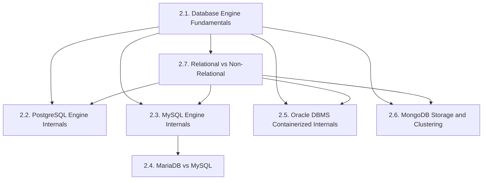
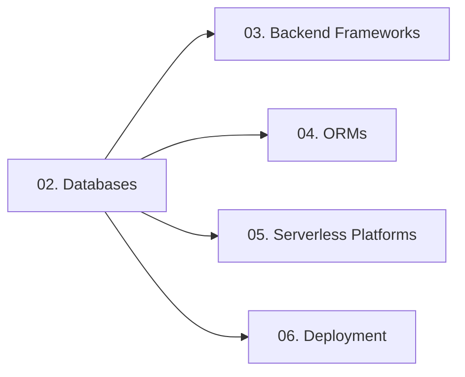

# 02. Databases — Chapter Index

> [!info] Chapter Purpose
> This chapter covers database **engines** — not the SQL language itself. The author already knows SQL and PL/SQL. The goal here is to understand how each major database works *under the hood*: storage formats, indexing, transaction models, concurrency control, replication, and clustering. The chapter closes with a strategic comparison (relational vs non-relational) so you can pick the right engine for a workload.

The conceptual root for every note in this chapter is **[[2.1. Database Engine Fundamentals]]** — read it first.

---

## Notes in This Chapter

| # | Note | Topic |
| - | ---- | ----- |
| 2.1 | [[2.1. Database Engine Fundamentals]] | DBMS subsystems, ACID, isolation levels, MVCC vs 2PL vs OCC, WAL, buffer pool, indexing fundamentals. The vocabulary for the whole chapter. |
| 2.2 | [[2.2. PostgreSQL Engine Internals]] | Process-per-connection model, 8KB pages, MVCC via xmin/xmax, WAL streaming replication, B-tree/GIN/GiST/BRIN indexes, JSONB, extensions. |
| 2.3 | [[2.3. MySQL Engine Internals]] | Server layer + pluggable storage engines, InnoDB internals (clustered index, 16KB pages, doublewrite, change buffer), binlog replication, Group Replication. |
| 2.4 | [[2.4. MariaDB vs MySQL]] | Fork history, compatibility/divergence, license, storage engine lineup, Galera vs Group Replication, when to pick each. |
| 2.5 | [[2.5. Oracle DBMS Containerized Internals]] | Why and how to run Oracle XE in Docker, SGA/PGA, background processes, CDB/PDB multitenant architecture, tablespace/block hierarchy. |
| 2.6 | [[2.6. MongoDB Storage and Clustering]] | BSON document model, WiredTiger engine, replica sets, oplog, sharding, mongos, index types, aggregation pipeline, multi-document transactions. |
| 2.7 | [[2.7. Relational vs Non-Relational Storage Engines]] | CAP one-paragraph summary, BASE model, the four NoSQL families, a concrete decision tree, hybrid architectures. |

---

## Recommended Reading Order

1. **2.1. Fundamentals** — non-negotiable prerequisite. Defines ACID, isolation levels, MVCC, WAL, buffer pool.
2. **2.7. Relational vs Non-Relational** — strategic fork. Helps you decide which engine to deep-dive into.
3. Pick one engine deep-dive based on your current project:
   - Web app / Laravel / WordPress → **2.3. MySQL** + **2.4. MariaDB vs MySQL**.
   - Analytics / JSON / geo / extensions → **2.2. PostgreSQL**.
   - Enterprise / PL/SQL background → **2.5. Oracle DBMS**.
   - Document model / horizontal scale → **2.6. MongoDB**.

---

## Prerequisites

- Solid SQL fluency (joins, subqueries, window functions, CTEs).
- Basic understanding of what a transaction is and why we use them.
- Comfort with reading Mermaid diagrams.

---

## What This Chapter Does NOT Cover

- **SQL language tutorial.** The author already knows SQL.
- **PL/SQL / T-SQL / pgPLSQL stored procedure language.** Mentioned where relevant but not taught.
- **Sharding math, CAP theorem proofs, Paxos/Raft consensus, distributed transaction theory.** *Covered in the System Design vault.*
- **Database administration as a discipline** (backup strategies in depth, capacity planning, query plan forensics). Mentioned where relevant, but not the focus.

---

## How This Chapter Connects to the Rest of the Vault

- The PHP sub-chapter (`3.6.`) has a developer-perspective note on MariaDB vs MySQL (`3.6.4.`) that complements `2.4.` here.
- The Laravel notes (`3.5.`) discuss Eloquent which targets MySQL/Postgres/SQL Server.
- The SQLAlchemy note (`4.2.`) discusses how the ORM abstracts the engine internals covered here.
- The Oracle DBMS note (`2.5.`) cross-references the Docker note (`6.1.`) for the container mechanics.
- Supabase (`5.2.`) is built on PostgreSQL — `2.2.` explains what's under Supabase's hood.

---

## Maintenance Notes

- When a new database engine becomes relevant (CockroachDB, TiDB, ClickHouse, DuckDB), add a new note here.
- Keep the relational-vs-non-relational note `2.7.` as a "decision tree" — update it as the industry evolves (e.g., the rise of vector DBs).
- If the author decides to learn a NoSQL family in depth (Redis internals, Cassandra internals), expand the chapter accordingly.

---

*See also: [[00. Master Index]] — [[00. README and Vault Conventions]]*
