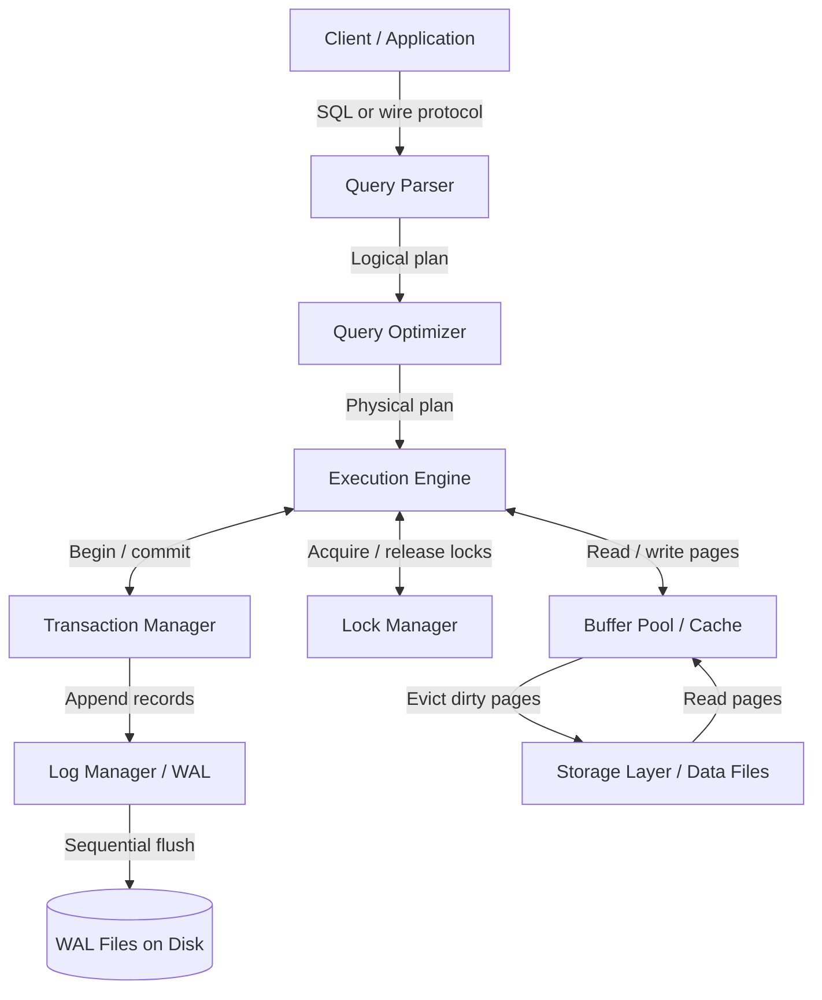
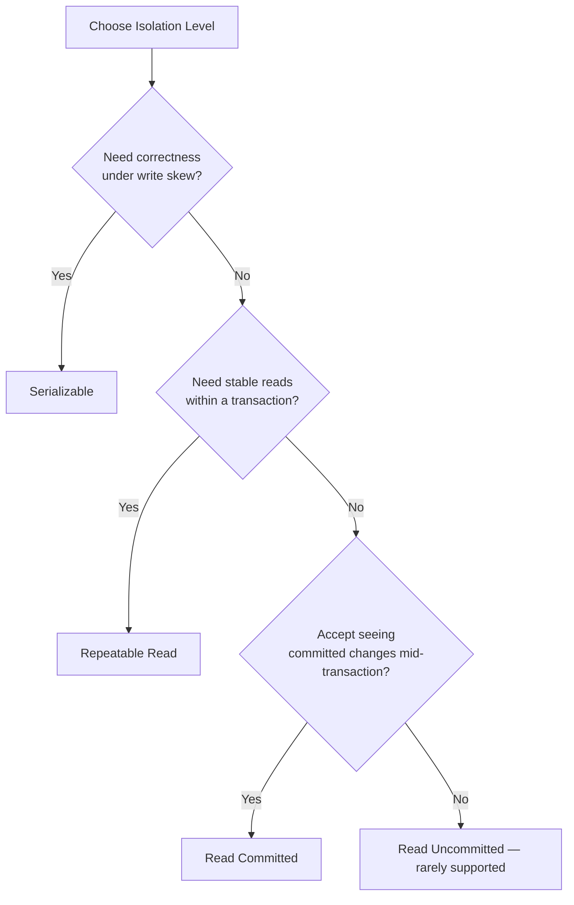

# 2.1. Database Engine Fundamentals

> [!info] This note establishes the vocabulary used across the entire Databases chapter.
> It separates three terms that are routinely conflated — *database*, *DBMS*, and *storage engine* — then walks through the subsystems every modern DBMS shares, the ACID guarantees, isolation levels, concurrency control strategies, and the indexing primitives that every other note in the chapter assumes you already know.

---

## 1. Database, DBMS, and Storage Engine

A **database** is the logical collection of data — tables, indexes, materialized views, sequences — together with the metadata that describes them. The database lives on disk as a set of files (or blocks inside a few files) and is, by itself, inert. Opening those files with `cat` does not give you rows; you need a program that understands the layout.

A **Database Management System (DBMS)** is the software that mediates between the database files and the applications that want to use them. PostgreSQL, MySQL, Oracle, MongoDB, and SQL Server are DBMSes. The DBMS accepts queries, parses them, plans execution, manages transactions, handles concurrency, replicates data, and writes durably to disk. The DBMS is the orchestra; the database is the score.

The **storage engine** is the component *inside* the DBMS that owns the bytes. It allocates pages, manages the buffer pool, organizes rows on disk, builds and maintains indexes, and writes the write-ahead log. In MySQL the storage engine is pluggable (InnoDB, MyISAM, MyRocks), so the term maps to a concrete module. In PostgreSQL, Oracle, and MongoDB the storage engine is not a swappable boundary, but the same conceptual layer exists — in PostgreSQL it is roughly the heap and index access-method code; in MongoDB it is WiredTiger; in Oracle it is the buffer cache and the tablespace layer.

The distinction matters because two DBMSes that both "speak SQL" can have radically different storage engines, and storage engine choice dictates the trade-offs that an engineer will live with in production. The remainder of this chapter compares engines on exactly those terms.

---

## 2. The Major Subsystems of a DBMS

Every modern DBMS can be decomposed into the same handful of cooperating subsystems. The exact names vary by vendor, but the responsibilities are stable.

The **query parser** turns the text of a SQL statement (or, in MongoDB's case, a BSON command document) into an abstract syntax tree, validates object names against the catalog, and rejects syntactic errors before any resources are consumed. Parsing is cheap and stateless, which is why prepared statements cache the parsed form.

The **query optimizer** takes the parsed tree and produces a physical execution plan: which indexes to use, which join algorithm to apply, in which order to scan tables, whether to sort or hash. Optimizers are cost-based — they estimate CPU and I/O cost using table statistics — and the quality of the optimizer is the single biggest reason PostgreSQL and Oracle outperform MySQL on complex analytical queries.

The **execution engine** walks the physical plan and produces rows. It is usually implemented as a pipeline of iterators (volcano model): each operator pulls a row from its child, transforms it, and emits it to its parent. Some engines, like SQL Server and Oracle, also support vectorized execution where rows are processed in batches to amortize per-row overhead.

The **buffer pool** (Oracle calls it the *database buffer cache*; MongoDB calls it the *WiredTiger cache*) is a chunk of shared RAM that holds copies of recently used disk pages. Reads hit the buffer pool first; writes modify the in-memory page and mark it *dirty* — the dirty page is later flushed to disk by a background process. Buffer pool hit ratio is the single most important performance metric on any DBMS.

The **transaction manager** assigns transaction IDs, tracks which transactions are in-flight, and decides when a transaction is allowed to commit. It is the gatekeeper of atomicity and isolation.

The **lock manager** records which transaction holds which lock on which object. In 2PL-based engines (SQL Server, DB2) locks are acquired explicitly and held until commit. In MVCC engines (PostgreSQL, InnoDB, Oracle) locks are mostly limited to write conflicts; reads are non-locking.

The **log manager** serializes every change into a write-ahead log (WAL). The WAL is the source of truth for durability: a transaction is not committed until its WAL records are on stable storage. On crash recovery, the engine replays the WAL to reconstruct any in-memory state that was lost.

The **storage layer** is the lowest subsystem — it manages the physical layout of pages on disk, the B+tree structures for indexes, and the free-space maps. Different storage engines optimize this layer differently, which is the entire subject of [[2.2. PostgreSQL Engine Internals]] and [[2.3. MySQL Engine Internals]].

---

## 3. ACID Properties Precisely

ACID is the contract a transactional DBMS offers. The four letters are routinely summarized in a single sentence each, but each one carries subtle scope that an engineer must internalize.

**Atomicity** means that every statement inside a transaction is all-or-nothing. If the transaction commits, every change persists. If it aborts — whether due to a deadlock, a constraint violation, or a power loss before commit — none of the changes are visible to other transactions. Atomicity is implemented with undo logs: the engine records the *before-image* of every modified row so it can roll back on failure.

**Consistency** in the ACID sense means the database moves from one valid state to another. "Valid" is defined by declared constraints: primary keys, foreign keys, check constraints, unique indexes, and any triggers. The DBMS does not invent consistency rules — it only enforces the ones you declared. This is different from the *consistency* in the CAP theorem, which is about replica convergence.

**Isolation** means concurrent transactions cannot observe each other's intermediate states. Full isolation is expensive (it serializes everything), so the SQL standard defines four levels of weakening isolation that trade correctness for throughput. We cover them in section 4 below.

**Durability** means once a transaction is reported committed to the client, its changes survive any subsequent crash — power loss, kernel panic, kernel reboot. Durability is implemented with the write-ahead log: the commit record is synchronously flushed to disk (typically with `fsync`) before the client receives the "commit ok" response. After that, even if the data pages themselves are still dirty in RAM and lost on power-off, the WAL on disk is sufficient to redo the changes during crash recovery.

---

## 4. Isolation Levels and Anomalies

The SQL standard defines four isolation levels. Each level permits a specific set of *anomalies* — deviations from serial execution that can produce incorrect results. The table below maps the relationship; "" means the anomaly is possible at that level.

| Isolation Level | Dirty Read | Non-Repeatable Read | Phantom Read | Serialization Anomaly |
| --------------- | ---------- | ------------------- | ------------ | --------------------- |
| Read Uncommitted |  |  |  |  |
| Read Committed   | — |  |  |  |
| Repeatable Read  | — | — |  (standard) / — (InnoDB, Postgres) |  |
| Serializable     | — | — | — | — |

A **dirty read** occurs when transaction B reads a row that transaction A has modified but not yet committed. If A rolls back, B has read data that never officially existed. Almost no engine allows this in practice — even at the *Read Uncommitted* level, most engines internally upgrade to *Read Committed*.

A **non-repeatable read** occurs when transaction B reads the same row twice and gets different values, because transaction A committed an update between the two reads. *Read Committed* permits this; *Repeatable Read* forbids it.

A **phantom read** occurs when transaction B re-executes a range query and sees new rows that transaction A inserted between the two queries. The SQL standard says *Repeatable Read* permits phantoms, but in practice both PostgreSQL and InnoDB implement Repeatable Read using MVCC snapshots that also eliminate phantoms. True *Serializable* (PostgreSQL's SSI, SQL Server's memory-based SSI) adds protection against *serialization anomalies* — situations where the concurrent execution of two transactions produces a result that no serial order could have produced.

In production, *Read Committed* (PostgreSQL default) and *Repeatable Read* (InnoDB default) cover the overwhelming majority of workloads. *Serializable* is reserved for workloads with subtle write-skew risks — medical scheduling, financial ledgers, inventory reservations.

---

## 5. Concurrency Control: MVCC vs 2PL vs OCC

**Multi-Version Concurrency Control (MVCC)** keeps multiple versions of each row, each tagged with the transaction ID that created it. Readers see the version that was the latest committed version at the time their transaction started — they never wait for writers. PostgreSQL, InnoDB, Oracle, and SQL Server all use MVCC. The cost is dead-row cleanup: when no transaction can see an old version anymore, the engine must reclaim the space (PostgreSQL calls this *vacuum*; InnoDB purges the undo log).

**Two-Phase Locking (2PL)** acquires locks on rows before reading or writing them and releases them only at commit. 2PL is conceptually simpler and provides strict serializability, but it produces more blocking and is more deadlock-prone. Classic 2PL is rare in modern DBMSes — most engines that "use locking" actually combine short-duration latches for buffer pool protection with MVCC for transaction isolation.

**Optimistic Concurrency Control (OCC)** assumes conflicts are rare. Each transaction reads and writes freely in a private workspace; at commit time, the engine validates that no concurrent transaction modified the same rows. If validation passes, the changes are merged; otherwise the transaction aborts and the application retries. WiredTiger (MongoDB's storage engine) uses OCC at the document level. OCC is excellent for read-heavy or low-contention workloads and catastrophic for high-contention hot rows.

---

## 6. Logging: WAL, Redo, and Undo

The **write-ahead log (WAL)** is the sequential file that records every change to the database. The discipline is strict: a page may not be flushed to disk until the WAL records describing its changes have been flushed first. This guarantees that on recovery, the WAL can be replayed to reconstruct any state that the (now lost) dirty page held. PostgreSQL calls it WAL; InnoDB calls it the *redo log*; Oracle calls it the *redo log*; MongoDB calls it the *journal*.

The **redo log** is the WAL itself — it contains the *after-image* of every modification, so the engine can redo the change during recovery.

The **undo log** (PostgreSQL: old tuple versions stored inline in the heap; InnoDB: separate rollback segments; Oracle: undo tablespace) contains the *before-image* of every modification. It is used to roll back aborted transactions and to reconstruct older versions of rows for MVCC snapshots in engines like InnoDB and Oracle.

The combination is elegant: redo enables durability without forcing every dirty page to disk at commit; undo enables atomicity and non-blocking reads.

---

## 7. Buffer Pool Internals

The buffer pool is divided into fixed-size pages (8 KB in PostgreSQL, 16 KB in InnoDB, 8 KB default in Oracle, 32 KB WiredTiger internal). A page is either *clean* (matches disk) or *dirty* (has been modified in memory but not yet flushed). A **page replacement algorithm** decides which page to evict when the pool is full; the canonical choice is some variant of LRU (Least Recently Used), often refined with a "middle" region to resist full-table scans from evicting hot pages.

Dirty pages are flushed by a background process — the *checkpointer* in PostgreSQL, the *page cleaner threads* in InnoDB, the *DBWn* process in Oracle, the *checkpoint thread* in WiredTiger. A checkpoint is the moment in the WAL up to which all dirty pages have been written; on recovery, the engine only needs to replay WAL records after the last checkpoint.

Buffer pool sizing is the single most impactful tunable. Too small and the working set does not fit, causing cache misses and physical reads. Too large and the OS page cache starves, which is bad if the engine does double-buffering (PostgreSQL historically did; InnoDB has `innodb_flush_neighbors` and `O_DIRECT` to bypass the OS cache).

---

## 8. Indexing Fundamentals

A **B-tree** is a self-balancing search tree where every internal node holds sorted keys and pointers to children, and every leaf holds the actual data or a pointer to it. B-trees handle equality and range queries efficiently and remain the default index type for almost every relational engine.

A **B+tree** is a B-tree variant where only leaf nodes hold values; internal nodes are pure routing. This increases fanout (more keys per node), which reduces tree height and thus disk reads. InnoDB, PostgreSQL, and Oracle all use B+tree internally, even when the documentation says "B-tree".

A **hash index** maps a key to a bucket via a hash function. It supports only equality lookups — no ranges, no ordering. Hash indexes are useful for in-memory engines (MEMORY in MySQL) and as auxiliary structures (PostgreSQL hash indexes became WAL-logged and crash-safe in version 10).

A **bitmap index** stores one bitmap per distinct key value, with one bit per row in the table. Bitmaps are extremely compact for low-cardinality columns (gender, status flags) and can be combined with AND/OR very efficiently. The downside is that they are expensive to update, so they are most common in analytical engines (Oracle, PostgreSQL's `bloom` extension approximates the idea).

Specialized index types — GIN, GiST, BRIN, SP-GiST in PostgreSQL; full-text and spatial in MySQL; TTL and geospatial in MongoDB — are covered in the engine-specific notes that follow.

## Summary

This note provided the conceptual root for the entire Databases chapter. A DBMS is the software; the storage engine is the part that owns the bytes; the database is the data itself. Every engine shares the same major subsystems — parser, optimizer, executor, buffer pool, transaction manager, lock manager, log manager, storage — even when the implementations diverge wildly. ACID is the contract; isolation levels trade correctness for throughput; MVCC, 2PL, and OCC are the three strategies engines use to deliver isolation; WAL plus undo logs deliver atomicity and durability without forcing synchronous page writes. The engine-specific notes that follow build on this vocabulary.

## See Also
- [[2.2. PostgreSQL Engine Internals]]
- [[2.3. MySQL Engine Internals]]
- [[2.5. Oracle DBMS Containerized Internals]]
- [[2.6. MongoDB Storage and Clustering]]
- [[2.7. Relational vs Non-Relational Storage Engines]]

## References
- PostgreSQL Documentation, "Internals" chapter — *Overview of PostgreSQL Internals*.
- MySQL Reference Manual, "InnoDB Architecture" section.
- Oracle Database Concepts, "Memory Architecture" and "Process Architecture".
- Hellerstein, Stonebraker, Hamilton, *Architecture of a Database System*, Foundations and Trends in Databases, 2007.
- Berenson et al., *A Critique of ANSI SQL Isolation Levels*, SIGMOD 1995 — the canonical paper on isolation anomalies.
