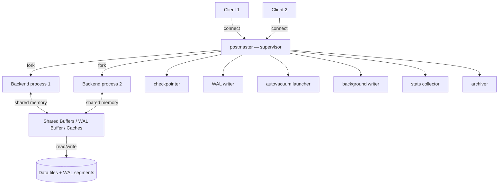
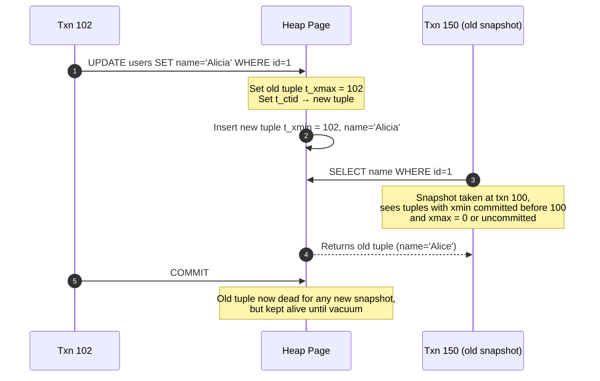

# 2.2. PostgreSQL Engine Internals

> [!info] PostgreSQL is an object-relational DBMS with a process-per-connection architecture, a heap-organized storage layout, and an MVCC implementation that never updates rows in place.
> This note covers the process model, the 8 KB page and tuple structure, MVCC and vacuum, the WAL and replication pipeline, the rich set of index access methods, the cost-based query planner, and the features — JSONB, partial indexes, extensions — that distinguish PostgreSQL from every other engine in this chapter.

---

## 1. Process-Per-Connection Architecture

PostgreSQL does not use threads for client connections. Every connection is handled by a dedicated operating system process, forked from the supervisory `postmaster` process when the client first connects. This is the same model the original Berkeley POSTGRES used in the 1980s, and it has been preserved deliberately because process isolation delivers strong fault containment: a backend that segfaults (because of a corrupted C extension or a buffer-overflow bug) crashes only itself, never the whole server.

The trade-off is process weight. Each backend consumes 5–10 MB of private RSS even before running a query, and the OS context-switch cost between processes is higher than between threads. A naive application that opens one connection per request will exhaust process slots long before PostgreSQL runs out of CPU. Production deployments therefore front PostgreSQL with a connection pooler — **PgBouncer** in transaction-pooling mode is the de-facto standard — so that a few dozen backend processes can serve thousands of application connections.

The postmaster also forks a fixed set of **background workers** that run continuously: the *checkpointer* writes dirty pages to disk at checkpoint time; the *background writer* trickle-flushes dirty pages between checkpoints to smooth I/O; the *WAL writer* flushes the WAL buffer every `wal_writer_delay`; the *autovacuum launcher* dispatches vacuum workers to tables that need cleanup; the *stats collector* aggregates per-table and per-index statistics; the *archiver* copies completed WAL segments to archival storage for point-in-time recovery.

---

## 2. Storage: Heap-Organized Tables and 8 KB Pages

PostgreSQL tables are **heap-organized** — rows are appended to the table file as they arrive, with no implicit ordering. This is the opposite of InnoDB's index-organized tables (see [[2.3. MySQL Engine Internals]]). Heap organization makes inserts fast and uniform, but it means every secondary index points back to the heap via a tuple identifier (TID), so an index-only scan requires a separate visibility check on the heap unless the index has the *visibility map* bit set.

The on-disk unit is the **page**, fixed at 8 KB (configurable at compile time, almost never changed). A page holds an item-pointer array at the top, free space in the middle, and tuple data growing from the bottom. Each row (called a **tuple** in PostgreSQL terminology) is prefixed by a 23-byte `HeapTupleHeader` that contains:

- `t_xmin` — transaction ID of the transaction that inserted this tuple.
- `t_xmax` — transaction ID of the transaction that deleted or updated this tuple (0 if still live).
- `t_cid` — command ID within the inserting transaction.
- `t_ctid` — TID of the next version of this tuple (self-pointer if it is the latest).
- `t_infomask` / `t_infomask2` — status bits (committed, aborted, has OIDs, etc.).
- Null bitmap.

Large values that do not fit in a page are **TOASTed** (The Oversized-Attribute Storage Technique). PostgreSQL moves them to a hidden side table (`pg_toast_<oid>`) and stores an 18-byte pointer in the main tuple. TOAST is transparent to SQL — a `SELECT` reassembles the value on demand — but it means a query that touches large text or bytea columns pays extra I/O even when the column is not in the SELECT list, because the page that holds the main tuple still needs to be read.

---

## 3. MVCC: xmin/xmax and No In-Place Updates

PostgreSQL's MVCC is implemented entirely in the heap. When a transaction updates a row, the engine does not modify the existing tuple. Instead, it sets `t_xmax` on the old tuple (marking it deleted by the current transaction), inserts a brand-new tuple with `t_xmin` set to the current transaction, and updates the old tuple's `t_ctid` to point to the new one. The result is a version chain that lives physically inside the heap.

This design has three consequences. First, **readers never block writers and writers never block readers** — a reader with an old snapshot simply sees the old tuple, ignoring the new one until its transaction ends. Second, the heap accumulates **dead tuples** (the old versions) until something reclaims the space; that something is `VACUUM`. Third, every update is effectively a delete-plus-insert, which means an update-heavy workload on PostgreSQL writes twice as much as the same workload on InnoDB (which updates in place and writes the old version to the undo log).

**Autovacuum** runs continuously, scanning tables for dead tuples that are no longer visible to any open transaction. When it finds them, it marks the space as free in the page's free-space map. Vacuum does not shrink the file — to reclaim space at the OS level you must run `VACUUM FULL` (which rewrites the table and requires an exclusive lock) or use `pg_repack` (which does the same online). A misconfigured autovacuum on an update-heavy workload leads to **bloat** — tables and indexes that are 2x–10x their logical size — which is the single most common PostgreSQL performance problem in production.

---

## 4. WAL and Replication

PostgreSQL's write-ahead log is a stream of 16 MB (by default) segment files in `pg_wal/`. Every modification — DML, DDL, sequence advances, transaction commits — appends a record. The WAL is the source of truth for durability: a transaction is not acknowledged to the client until its commit record has been flushed (`synchronous_commit = on`, the default).

Replication is **physical**, based on shipping WAL records to standby servers. **Streaming replication** ships WAL over a TCP connection as it is generated, with sub-second lag under normal load. **Asynchronous replication** (the default) lets the primary commit without waiting for the standby — minimal latency, but a primary crash can lose the last few transactions. **Synchronous replication** (`synchronous_standby_names` set, `synchronous_commit = on`) blocks the primary's commit until at least one named standby has acknowledged the WAL record — zero data loss at the cost of commit latency.

Logical replication (introduced in PostgreSQL 10) decodes the WAL into a stream of row-level changes and replays them on a subscriber that can run a different major version, a different schema, or a different table layout. It is the foundation for zero-downtime major version upgrades and selective table replication.

---

## 5. Index Access Methods

PostgreSQL's index story is its richest differentiator. The default is **B-tree**, suitable for equality and range queries on any sortable type. Beyond B-tree, PostgreSQL ships five additional access methods, each tuned for a specific data pattern.

| Access method | Best for | Typical workload |
| ------------- | -------- | ---------------- |
| B-tree | Equality and range on scalar values | Default for primary keys, foreign keys, unique constraints |
| Hash | Equality only, no ordering | In-memory lookups, rare in OLTP due to lack of range support |
| GIN | Composite values: arrays, full-text, JSONB | `@>` containment queries, tsvector search |
| GiST | Balanced-tree-over-data with custom predicates | Geospatial (PostGIS), range overlap, trigram fuzzy search |
| SP-GiST | Space-partitioned trees | Non-balanced structures: telephone area codes, IP routing |
| BRIN | Block-range indexes on naturally ordered data | Time-series tables where rows are appended in time order |

**GIN** (Generalized Inverted Index) is the engine behind PostgreSQL's full-text search and JSONB containment queries. For a column holding `{"tags": ["postgres", "mvcc", "vacuum"]}`, a GIN index lets `WHERE tags @> '["postgres"]'` resolve in logarithmic time instead of a full scan. The trade-off is that GIN indexes are slower to update than B-trees, which is why `fastupdate` batches inserts into a pending list.

**GiST** is the foundation for PostGIS — every geographic query (`ST_DWithin`, `ST_Contains`) runs through a GiST R-tree on the geometry column. Without GiST, geospatial queries on a table of millions of points would be unusable.

**BRIN** (Block Range Index) stores, for each range of consecutive pages, the minimum and maximum value of a column. On a time-series table where rows are appended in timestamp order, a BRIN index on `created_at` is 1/1000th the size of a B-tree and prunes 99% of the table from a range scan. BRIN is the index type that makes PostgreSQL credible as a time-series store without TimescaleDB.

---

## 6. Query Planner

PostgreSQL's planner is **cost-based** and operates on a catalog of statistics maintained by `ANALYZE`. For each table it stores the number of rows, the number of pages, and a most-common-values histogram for each column. The planner combines these with configurable cost constants (`seq_page_cost`, `random_page_cost`, `cpu_tuple_cost`) to estimate the cheapest plan.

`EXPLAIN` shows the chosen plan; `EXPLAIN ANALYZE` executes the query and shows actual row counts and timings per node; `EXPLAIN (ANALYZE, BUFFERS)` adds buffer-pool hit information. The standard production-debugging loop is to read `EXPLAIN ANALYZE` output, look for nodes where the estimated row count diverges wildly from the actual, and run `ANALYZE` (or raise the column's statistics target) to fix the estimate.

PostgreSQL supports several join strategies: nested loop (best when one side is small or there is an index on the inner side), hash join (best for large unordered joins on equality), and merge join (best when both sides are already sorted on the join key). The planner is generally considered more sophisticated than MySQL's, which is why complex analytical queries on PostgreSQL often outperform identical queries on MySQL.

---

## 7. Notable Features

**JSONB** stores JSON in a parsed binary format that supports indexing (via GIN) and fast containment checks (`@>`, `?`, `?|`, `?&`). Unlike MySQL's JSON, which stores as a binary blob and re-parses on access, JSONB is parsed once at insert and never re-parsed. JSONB is the reason many teams choose PostgreSQL for hybrid relational/document workloads — you get document flexibility without leaving the relational engine.

**Partial indexes** let you index only the rows matching a `WHERE` clause. A common pattern is `CREATE INDEX ... WHERE deleted_at IS NULL`, which keeps the index tiny on a table where most rows are soft-deleted.

**Expression indexes** index the result of an immutable function: `CREATE INDEX ON users (lower(email))` makes case-insensitive email lookups fast without storing a separate column.

**CTEs** (Common Table Expressions) include `WITH RECURSIVE`, which makes tree-traversal and graph-walk queries expressible in a single SQL statement. Since PostgreSQL 12, CTEs are inlined by default unless marked `MATERIALIZED`, which lets the optimizer choose between recomputation and materialization.

**Materialized views** snapshot the result of a query and store it on disk; `REFRESH MATERIALIZED VIEW` rebuilds the snapshot, optionally `CONCURRENTLY` (without blocking reads, but requires a unique index).

**Extensions** are PostgreSQL's killer feature. `PostGIS` adds geospatial types and operators; `pg_stat_statements` records per-query statistics; `pgvector` adds vector similarity search; `uuid-ossp` generates UUIDs; `pg_partman` automates time-series partitioning. Extensions install with `CREATE EXTENSION` and live in the database as first-class objects.

---

## 8. Use Cases, Strengths, and Limitations

PostgreSQL excels at **OLTP workloads with complex queries**: financial applications, multi-tenant SaaS, systems that need both transactional integrity and analytical reporting on the same database. Its rich type system, partial and expression indexes, JSONB, and the extension ecosystem make it a credible choice for almost any workload that fits on a single primary.

The limitations are well-known. **Native sharding does not exist** — horizontal scaling requires external products like Citus, CockroachDB, or Vitess-style proxies. **Vacuum tuning is a real operational burden** on update-heavy workloads; bloat is a recurring production incident. **The process-per-connection model** caps the connection count at a few thousand even with ample RAM, mandating a pooler. **Replication is single-threaded on the standby** — a primary with high write throughput can outpace a single standby's ability to apply WAL, leading to replication lag that rules out synchronous replicas in some workloads. Despite these limits, PostgreSQL's combination of correctness, feature depth, and license makes it the default choice for new backend projects in 2025.

## Summary

PostgreSQL is a process-per-connection, heap-organized, MVCC database that never updates rows in place and relies on autovacuum to reclaim dead tuple space. Its 8 KB pages, TOASTed large values, and xmin/xmax versioning form a storage layer that is simple to reason about and rich to query. WAL-based physical replication delivers durable failover with sub-second lag. The index ecosystem — B-tree, GIN, GiST, BRIN, SP-GiST — combined with JSONB, partial indexes, expression indexes, and extensions like PostGIS, gives PostgreSQL a feature surface that no other engine in this chapter matches. The trade-offs are vacuum overhead, single-threaded replication apply, no native sharding, and a connection model that demands a pooler in production.

## See Also
- [[2.1. Database Engine Fundamentals]]
- [[2.3. MySQL Engine Internals]]
- [[2.6. MongoDB Storage and Clustering]]
- [[2.7. Relational vs Non-Relational Storage Engines]]
- [[4.2. SQLAlchemy Core vs ORM Internals]]

## References
- PostgreSQL Documentation, Part VII — *Internals*.
- *The Internals of PostgreSQL* — interdb.jp/pginternals.
- Stonebraker, *The Design of the POSTGRES Storage System*, VLDB 1987.
- Fussell, Stonebraker, *Postgres — A Next Generation Database System*, 1987.
