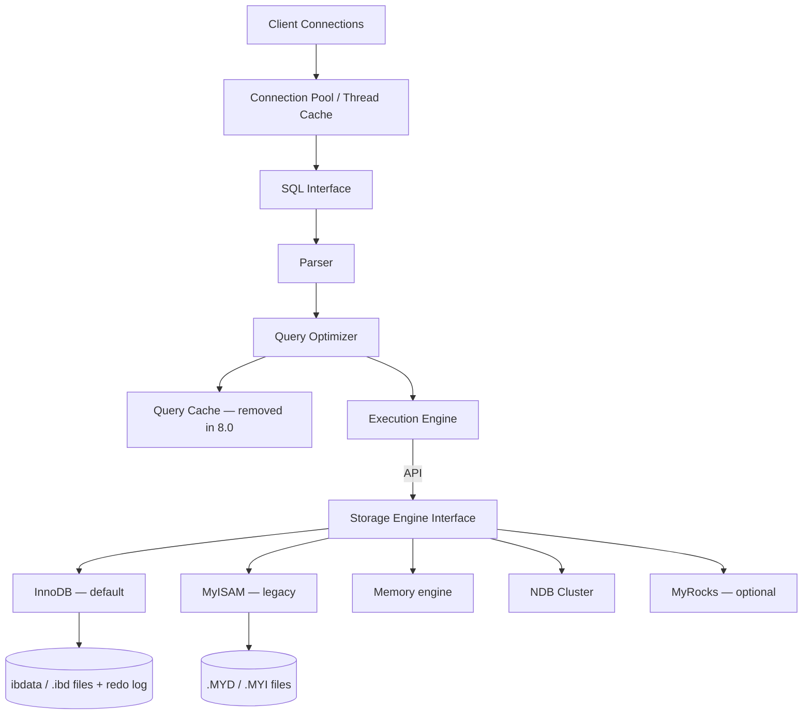
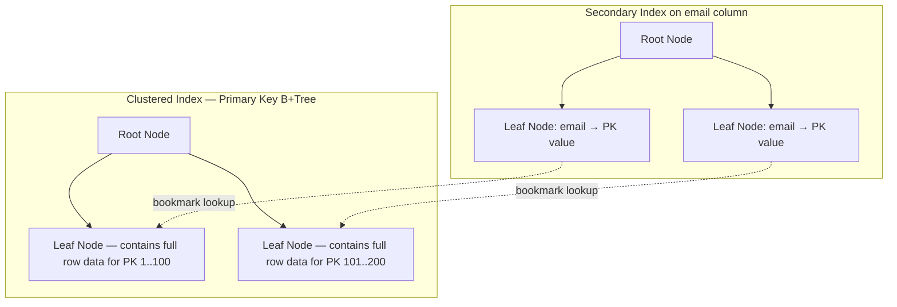
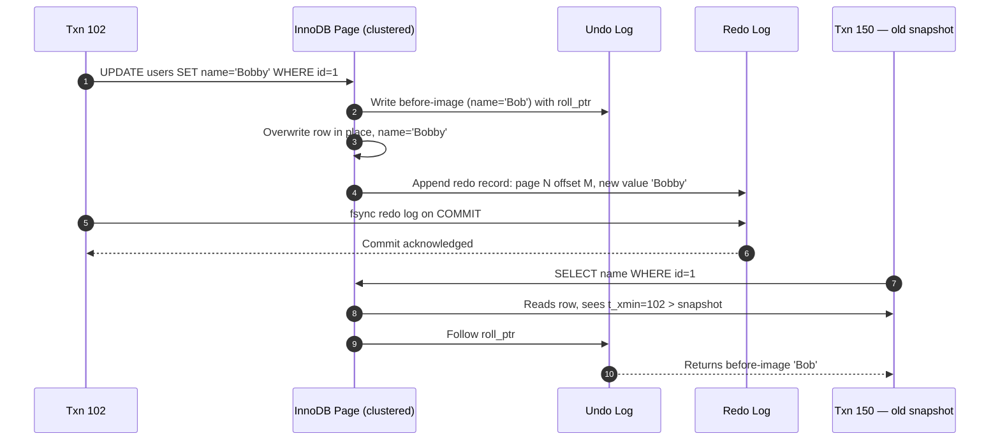

# 2.3. MySQL Engine Internals

> [!info] MySQL is a thread-based DBMS with a pluggable storage engine architecture.
> The server layer (parser, optimizer, caches, replication) is shared; everything below the SQL interface is delegated to a storage engine that owns the on-disk layout. This note covers the server layer, the dominant InnoDB engine (clustered index, redo/undo logs, MVCC), the binlog replication pipeline, the cost-based optimizer, and the index types MySQL supports. The comparison with PostgreSQL's process model and heap-organized tables is woven through every section.

---

## 1. Server Layer and Pluggable Storage Engines

MySQL is divided into a **server layer** (everything above the storage engine interface) and a **storage engine layer** that does the actual reads and writes. The server layer is shared across every storage engine; the storage engine is selected per table with `CREATE TABLE ... ENGINE=InnoDB`.

The server layer holds the connection pool (which assigns one thread per connection — much lighter than PostgreSQL's process model), the SQL interface (which validates the dialect — MySQL vs SQL Server vs Oracle compatibility modes), the parser (a yacc-generated grammar), the optimizer (cost-based, less sophisticated than PostgreSQL's on complex joins), and historically a query cache (removed in MySQL 8.0 because its hit rate was too low to justify the lock contention).

The **pluggable storage engine interface** is the architectural decision that defines MySQL. The server layer talks to engines through a fixed C API; engines implement table open, row insert, row read by primary key, index scan, transaction begin/commit/rollback, and a handful of other primitives. This means you can swap the on-disk format without changing a line of SQL — but it also means the optimizer has limited visibility into storage-engine internals, which is one reason MySQL's optimizer is sometimes weaker than PostgreSQL's on complex queries.

---

## 2. InnoDB: The Default Storage Engine

InnoDB has been the default storage engine since MySQL 5.5 (2010). It is a transactional, MVCC, row-locking engine with foreign keys, crash recovery, and a clustered index layout. Almost everything in modern MySQL engineering is InnoDB engineering.

**Clustered index (index-organized tables).** InnoDB organizes each table as a B+tree on the primary key. The leaf nodes of this B+tree contain the **actual row data** — not pointers to it. This is fundamentally different from PostgreSQL's heap-organized tables, where the heap is a separate structure and every secondary index stores a TID pointer back to the heap. The consequence is that primary-key lookups in InnoDB are a single B+tree descent; secondary-index lookups require a second descent into the clustered index.

The engineering impact is significant. Queries that filter by primary key are exceptionally fast — one B+tree traversal, one page read. Queries that use a secondary index but need columns not in that index must perform a **bookmark lookup** (also called a key lookup): descend the secondary index, find the PK value, then descend the clustered index to fetch the full row. This is why covering indexes (`INDEX(email, name, age)`) are so valuable on InnoDB — they let the engine satisfy the query entirely from the secondary index leaf.

**Pages and extents.** InnoDB's page size is 16 KB by default (configurable to 4 KB, 8 KB, 32 KB, or 64 KB in 5.7+). Pages are grouped into extents of 64 pages (1 MB), which is the unit of allocation for large segments. Tables and indexes are stored in `.ibd` files (one per table when `innodb_file_per_table = ON`, the default since 5.6) or in a shared `ibdata1` system tablespace.

**Buffer pool.** The InnoDB buffer pool (`innodb_buffer_pool_size`) is the single most important tunable — on a dedicated database server it should hold 50–75% of RAM. The pool caches 16 KB pages from both the clustered index and secondary indexes, plus the insert buffer, the adaptive hash index, and the change buffer. Pages are organized into an LRU list with a "midpoint insertion" refinement: a page read by a sequential full-table scan is inserted at the midpoint (configurable via `innodb_old_blocks_pct`), so it ages out quickly and does not evict hot pages.

---

## 3. Redo Log, Undo Log, Doublewrite, Change Buffer

InnoDB durability and atomicity rest on four on-disk structures working together.

**Redo log** (`ib_logfile0`, `ib_logfile1`, or `#ib_redoN` in 8.0.30+). The redo log is a circular, sequential file that records the *physical* modification made to each page. When a transaction commits, InnoDB flushes the redo log records for that transaction to disk before acknowledging the commit to the client. This is InnoDB's write-ahead log — the same concept as PostgreSQL's WAL but stored in a circular file rather than a sequence of segment files. The redo log is what makes crash recovery possible: on boot, InnoDB reads the redo log and re-applies every modification up to the last committed transaction.

**Undo log** (stored in the `mysql.ibd` system tablespace or in dedicated undo tablespaces in 8.0). The undo log records the *before-image* of every modified row. It serves two purposes: rolling back aborted transactions, and providing the old row versions that MVCC readers see when their snapshot predates the modification. Each modified row in the page has a 7-byte `roll_ptr` field that points to the most recent undo record for that row; multiple undo records form a version chain that InnoDB walks to construct the row as of a given snapshot.

**Doublewrite buffer.** InnoDB writes dirty pages to a small sequential area called the doublewrite buffer *before* writing them to their final location in the tablespace. If a partial page write happens (the OS writes 4 KB of a 16 KB page before a crash), InnoDB can recover the original page from the doublewrite buffer and then apply redo. Without doublewrite, a half-written page would be unrecoverable because redo is applied at the page level and assumes a consistent starting state. The cost is one extra sequential write per dirty page flush — usually a small percentage of total I/O.

**Change buffer.** When a secondary index page is not in the buffer pool, InnoDB does not read it from disk just to apply an insert. Instead, it records the insert in the change buffer and merges it later, when the page is read anyway. This dramatically reduces random I/O on insert-heavy workloads with many secondary indexes. The change buffer only applies to secondary indexes (not the clustered index, because clustered index inserts always touch the actual row data) and only to non-unique indexes (because uniqueness must be checked immediately).

---

## 4. InnoDB MVCC

InnoDB implements MVCC with snapshot isolation at the default isolation level, which is **REPEATABLE READ**. Each transaction is assigned a consistent read view at its first read — a snapshot of which transactions were committed at that moment. A row version is visible to a transaction if the row's `trx_id` was committed before the snapshot was taken.

The key difference from PostgreSQL is **where the old versions live**. In PostgreSQL, old versions are physically in the heap until vacuum removes them; the table bloats. In InnoDB, old versions live in the undo log; the table page holds only the current row, with a `roll_ptr` to the version chain. This means InnoDB tables do not bloat the same way — but it also means that long-running transactions force InnoDB to retain undo log records, growing the undo tablespace and slowing down reads that must walk a long version chain.

The other difference is the isolation level: PostgreSQL's default is READ COMMITTED (a new snapshot per statement); InnoDB's default is REPEATABLE READ (one snapshot per transaction). InnoDB's REPEATABLE READ also eliminates phantom reads via next-key locking on range scans, which is stricter than the SQL standard requires. PostgreSQL's REPEATABLE READ also eliminates phantoms but via snapshot isolation rather than locking.

---

## 5. Replication: Binlog, GTID, Group Replication

MySQL replication is built on the **binary log** (binlog), a separate sequential file written by the server layer (not by InnoDB). Every committed transaction is appended to the binlog as one of three formats:

- **STATEMENT** — logs the SQL text. Compact, but unsafe for non-deterministic functions like `NOW()` or `UUID()`.
- **ROW** — logs the before- and after-image of each modified row. Larger, but deterministic and the default in 8.0.
- **MIXED** — picks statement or row per statement based on safety.

A replica connects to the primary, fetches binlog events over the network, and applies them. Replication is single-threaded by default, but **multi-threaded slave** (MTS) since 5.7 can apply transactions in parallel when they touch different databases or when they were committed in parallel on the primary (based on `slave_parallel_workers` and `slave_parallel_type = LOGICAL_CLOCK`).

**GTID** (Global Transaction Identifier) gives each transaction a unique identifier of the form `server_uuid:sequence_number`. With GTID enabled, you can change a replica's primary without computing binlog offsets manually — the replica simply requests "all transactions I have not seen yet." GTID is essential for any modern replication topology.

**Group Replication** (since 8.0) is a built-in plugin that provides multi-primary or single-primary clusters with failure detection and automatic recovery, using a group communication system based on Paxos. **InnoDB Cluster** is the higher-level product built on Group Replication plus MySQL Router (which handles read/write splitting). This is MySQL's answer to PostgreSQL's third-party solutions like Patroni.

**Semisynchronous replication** — the primary waits for at least one replica to acknowledge the binlog event before reporting commit to the client. This trades a small latency increase for data-loss protection. Fully synchronous replication is not supported natively; if you need it, you need Group Replication or Galera (in MariaDB).

---

## 6. Query Optimizer and Indexing

MySQL's optimizer is cost-based, using index cardinality statistics gathered by `ANALYZE TABLE`. It supports nested-loop joins (the dominant strategy), hash joins (since 8.0.18 for equi-joins without an index), and batched key access. The optimizer is generally considered less sophisticated than PostgreSQL's on complex multi-table joins, particularly when subqueries are involved — MySQL historically struggled with subquery decorrelation, though 8.0 has improved this significantly.

`EXPLAIN` shows the plan; `EXPLAIN ANALYZE` (since 8.0.18) executes and shows actual timings per iterator, comparable to PostgreSQL's `EXPLAIN ANALYZE`. `EXPLAIN FORMAT=TREE` shows the new iterator-based execution engine (also since 8.0) that replaced the old "monolithic" executor.

Index types:

- **B+tree** — the default for InnoDB. Clustered on primary key, secondary on any other column.
- **FULLTEXT** — inverted index for `MATCH ... AGAINST` text search. Available on InnoDB since 5.6.
- **SPATIAL** — R-tree index on `GEOMETRY` columns for spatial predicates (`ST_Contains`, `ST_DWithin`).
- **Hash** — only available on the MEMORY engine; InnoDB has an *adaptive hash index* that builds hash structures automatically on hot B+tree pages, but you cannot declare a hash index on InnoDB.

InnoDB indexes are B+tree only — no equivalent of PostgreSQL's GIN, GiST, BRIN, or SP-GiST. This is a structural reason why PostgreSQL dominates workloads that need full-text search, geospatial, or composite-type indexing: the index infrastructure simply does not exist in MySQL without external solutions like Elasticsearch.

---

## 7. JSON Support

MySQL has a native `JSON` type since 5.7. The JSON is stored in a binary format (not raw text) with the document parsed into elements, allowing functions like `JSON_EXTRACT`, `JSON_SET`, and `JSON_CONTAINS` to navigate the structure without re-parsing. Functional indexes on JSON paths (`CREATE INDEX ON t((CAST(j->'$.email' AS CHAR(255))))`) let you index individual fields.

The implementation is, however, less rich than PostgreSQL's JSONB. MySQL's JSON has no equivalent of GIN indexing for containment queries — `JSON_CONTAINS` queries on large documents will often full-scan. For workloads that need serious document indexing inside a relational database, PostgreSQL with JSONB and GIN is the stronger choice.

---

## 8. Use Cases and Limitations

MySQL's sweet spot is **web application backends**: read-heavy OLTP with simple queries, primary-key lookups, and modest analytical needs. WordPress, Laravel's default driver, Django's default driver, and countless SaaS products run on MySQL. The clustered index makes primary-key lookups blazingly fast, the thread-based model handles thousands of idle connections cheaply, and the binlog-based replication topology is well-understood operationally.

The limitations mirror PostgreSQL's strengths. **Complex analytical queries** — multi-table joins with subqueries, window functions over large partitions — run slower because the optimizer is weaker. **JSON workloads** that need containment queries on large documents are better on PostgreSQL. **No native sharding** — horizontal scaling requires Vitess, ProxySQL, or application-level partitioning. **The pluggable storage engine model** has fragmented engineering effort: InnoDB is the only engine that receives serious investment, and the others (MyISAM, MEMORY, ARCHIVE, BLACKHOLE, FEDERATED) are niche or legacy. For new projects, MySQL is an excellent default for web workloads; PostgreSQL is the better default for systems that need richer indexing, JSON, or complex queries.

## Summary

MySQL is a thread-based, pluggable-storage-engine DBMS whose modern story is almost entirely the InnoDB story. InnoDB stores tables as clustered B+trees on the primary key, with secondary indexes pointing to PK values rather than physical row locations — a design that makes PK lookups fast and bookmark lookups the cost to optimize away. Redo, undo, doublewrite, and the change buffer together deliver ACID, MVCC, and crash recovery without the table bloat that plagues PostgreSQL. Binlog-based replication with GTID and Group Replication covers the high-availability spectrum. The optimizer is less sophisticated than PostgreSQL's on complex queries, and the index ecosystem is narrower — no GIN, no GiST, no BRIN — which is the main reason engineers pick PostgreSQL for analytically richer workloads.

## See Also
- [[2.1. Database Engine Fundamentals]]
- [[2.2. PostgreSQL Engine Internals]]
- [[2.4. MariaDB vs MySQL]]
- [[2.7. Relational vs Non-Relational Storage Engines]]
- [[3.5.2. Laravel Service Container and Eloquent]]

## References
- MySQL Reference Manual, *InnoDB Storage Engine* chapter.
- MySQL Reference Manual, *Replication* chapter.
- Jeremy Cole, *How InnoDB works* — series at jcole.us/blog.
- Lenkov, *InnoDB IO implementation details*.
