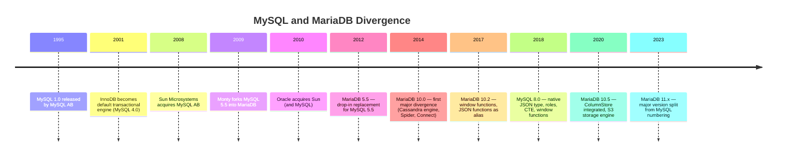

# 2.4. MariaDB vs MySQL

> [!info] MariaDB is a community-developed fork of MySQL, created in 2009 by the original MySQL author after Oracle's acquisition of Sun Microsystems.
> The two databases were drop-in compatible until about 2015, but they have since diverged in storage engines, replication topology, optimizer behavior, and JSON handling. This note covers the fork history, the technical divergences that matter for production, the storage engine and replication trade-offs, and a pragmatic decision framework.

---

## 1. The Fork History

MySQL was created in 1995 by Michael "Monty" Widenius and David Axmark at the Swedish company MySQL AB. The product grew to dominate open-source web databases through the LAMP stack era. In 2008, Sun Microsystems acquired MySQL AB for approximately $1 billion. In 2010, Oracle Corporation acquired Sun Microsystems — and with it, ownership of MySQL.

Monty Widenius publicly opposed the Oracle acquisition, fearing that Oracle would either neglect MySQL (to protect the commercial Oracle Database) or shift it toward a closed-source model. In January 2009 — before the Sun-to-Oracle transition was even complete — he forked MySQL 5.5 and launched MariaDB, named after his youngest daughter Maria (MySQL itself was named after his eldest daughter My). The MariaDB Foundation was established as a non-profit to steward the project and guarantee that it remained free and open-source.

The two codebases share a common ancestor but are no longer binary-compatible at the file format or protocol level. The divergence is now significant enough that you should treat them as separate products when planning migrations.

---

## 2. Licensing and Governance

**MySQL** is dual-licensed by Oracle. The Community Edition is free under the GNU General Public License v2 (GPLv2). The Enterprise Edition (which adds the thread pool plugin, Enterprise Backup, Enterprise Audit, Enterprise Monitor, and Enterprise Firewall) is a commercial product. Some features that the community considers basic for production — most notably the *thread pool* — are paywalled in MySQL Enterprise. Oracle also sells commercial licenses for ISVs who want to embed MySQL without GPL obligations.

**MariaDB** is purely GPLv2 for all features, including thread pooling, audit, and backup. The MariaDB Foundation owns the trademark and stewards the project; commercial support and a cloud offering are sold by MariaDB plc (a publicly traded company). The license is the single biggest philosophical difference — and the reason many large organizations, especially in the EU public sector and at Red Hat, default to MariaDB.

---

## 3. Compatibility and Divergence

MariaDB 5.5 (2012) was a true drop-in replacement: same client protocol, same on-disk format, same function names. You could uninstall MySQL, install MariaDB, and existing applications would continue to work. From MariaDB 10.0 onward, the projects have diverged in ways that break drop-in compatibility:

| Area | MySQL 8.0 | MariaDB 10.x / 11.x |
| ---- | --------- | -------------------- |
| **JSON type** | Native binary JSON type with `JSON_*` functions | `JSON` is an alias for `LONGTEXT`; JSON functions parse on each call. Stored as text, slower for queries on large documents. |
| **System tables** | `mysql` schema with new data dictionary in 8.0 | Different schema layout; binary compatibility with MySQL 8.0 system tables is broken. |
| **Optimizer** | Cost-based with hash joins, subquery decorrelation, descending indexes | Rewritten optimizer with cost model changes, supports `EXPLAIN FORMAT=JSON` differently |
| **Sequences** | No native sequences (use `AUTO_INCREMENT`) | Native `CREATE SEQUENCE` since 10.3 |
| **System-versioned tables** | No native support | Supported since 10.3 — query the table as of any timestamp |
| **ColumnStore** | Not available | Integrated since 10.5 — columnar engine for analytical workloads |
| **RETURNING** (DML returning) | Not supported | `DELETE ... RETURNING`, `UPDATE ... RETURNING` since 10.5 |
| **Roles** | Supported since 8.0 | Supported since 10.0 (predates MySQL) |

The practical implication: **migrating from MySQL 8.0 to MariaDB 11 requires testing, not just a binary swap.** Migrating from MySQL 5.7 to MariaDB 10.x is still mostly transparent, but the incompatibilities grow with each release.

---

## 4. Storage Engine Comparison

The most visible difference between the two databases is the storage engine ecosystem.

| Engine | MySQL | MariaDB | Notes |
| ------ | ----- | ------- | ----- |
| **InnoDB** | Default, Oracle-developed | Default, forked from InnoDB and continuously rebased | Both are full ACID engines. MariaDB's InnoDB fork has minor divergences in compression and full-text indexing. |
| **XtraDB** | Not available | Used in older MariaDB as InnoDB replacement (deprecated in 10.2) | Originally a Percona fork of InnoDB; now MariaDB uses its own InnoDB fork. |
| **MyISAM** | Available, legacy | Available, legacy | Non-transactional, table-level locks. Effectively obsolete. |
| **Aria** | Not available | Available — crash-safe MyISAM replacement | Used internally for system tables in MariaDB. |
| **ColumnStore** | Not available | Available — columnar analytical engine | Originally InfiniDB; competes with ClickHouse / Vertica. |
| **Spider** | Not available | Available — built-in sharding | Transparent sharding across multiple MariaDB servers. |
| **S3** | Not available | Available since 10.5 — read-only tables on S3 | Archive cold tables to S3 without a separate engine. |
| **MyRocks** | Available (Facebook) | Available | LSM-tree engine optimized for compression; mostly used at Facebook scale. |
| **Memory / HEAP** | Available | Available | In-memory, hash-based. |
| **NDB Cluster** | Available — MySQL Cluster | Not available | Distributed, shared-nothing cluster engine. |

The implication is asymmetric. **MariaDB ships a wider engine menu**, but most of those engines have small user bases. **MySQL's smaller set is better supported** because Oracle's engineering investment is concentrated.

---

## 5. Replication and High Availability

**MySQL** uses the binlog for replication, with GTID since 5.6 and Group Replication since 8.0 for multi-primary failover. The standard production stack is **InnoDB Cluster**: a Group Replication cluster (single-primary or multi-primary) fronted by MySQL Router, which provides read/write splitting and automatic failover. Semisynchronous replication is a built-in plugin.

**MariaDB** uses the binlog with its own GTID format (incompatible with MySQL's GTID — a real migration pain point). For multi-master synchronous replication, MariaDB integrates **Galera Cluster**, a third-party technology that Oracle's MySQL does not include. Galera provides true multi-master synchronous replication: any node accepts writes, conflicts are detected at commit time using certification, and a write is either committed on all nodes or rolled back on all. Galera is mature and widely deployed, but it imposes constraints: large transactions perform poorly, DDL is replicating and blocking, and the certification algorithm can deadlock on conflicting writes.

The two replication philosophies reflect the two organizations: Oracle's Group Replication is newer, more flexible (supports single-primary mode), and tightly integrated with the MySQL Router; MariaDB's Galera integration is older, simpler to reason about (every node is equal), but harder to operate through schema changes.

---

## 6. Performance Claims — Treat With Skepticism

MariaDB marketing claims wins on certain TPC-C workloads, complex analytical queries (with the rewritten optimizer), and the ColumnStore engine for analytical scans. MySQL marketing claims wins on InnoDB hot workloads, MySQL 8.0 hash joins, and Group Replication failover performance.

In practice, the truth depends entirely on the workload:

- For **simple primary-key OLTP** (the LAMP-stack workload), the two engines are within 5–10% of each other on most benchmarks, and the difference is dominated by hardware and configuration rather than the engine.
- For **analytical queries** that benefit from columnar storage, MariaDB ColumnStore dramatically outperforms MySQL — but you could also just use ClickHouse or PostgreSQL with columnar extensions.
- For **multi-master writes**, Galera is more mature than Group Replication in multi-primary mode — but Group Replication in single-primary mode is competitive and easier to operate.
- For **JSON-heavy workloads**, MySQL's native JSON type wins decisively; MariaDB's text-based JSON is a clear regression.

The honest summary: **do not pick a database based on vendor benchmarks**. Pick based on feature fit, ecosystem, and operational constraints.

---

## 7. When to Choose Which

**Choose MySQL if:**

- Your organization has standardized on Oracle tooling or has a commercial support contract with Oracle.
- Your application relies on the native binary JSON type and JSON functions.
- You want Group Replication / InnoDB Cluster as the supported high-availability path.
- You are deploying on AWS RDS or Aurora, where MySQL is the better-supported default.
- You want the largest community of operators and the most third-party tooling (ProxySQL, Vitess, dbt, etc.).

**Choose MariaDB if:**

- You want to avoid Oracle lock-in for licensing or philosophical reasons.
- You need Galera Cluster for multi-master synchronous replication.
- You need a feature that exists only in MariaDB: system-versioned tables, native sequences, ColumnStore, Spider sharding, S3 archive tables.
- Your Linux distribution ships MariaDB by default (Red Hat Enterprise Linux, Debian, Ubuntu, SUSE).
- You want thread pooling, audit, and backup without paying for an Enterprise license.

For most new projects where neither specific feature nor licensing constraint dominates, MySQL is the safer default because of its larger community, broader cloud-provider support, and tighter integration with modern replication tooling. MariaDB is the right choice when an organizational or feature requirement pushes you there.

---

## 8. Migration Notes

Migrating **MySQL → MariaDB** within the same major version (e.g., MySQL 5.7 → MariaDB 10.4) is usually painless: dump with `mysqldump`, restore, test. Migrating **MySQL 8.0 → MariaDB** requires testing because of the JSON type, the new data dictionary, and optimizer differences. Migrating **MariaDB → MySQL** is similarly painful in the other direction: native sequences, system-versioned tables, and ColumnStore tables need to be rewritten.

For applications that must support both engines (e.g., a commercial product that customers install on either), the safe path is to avoid engine-specific features entirely: stick to standard SQL, use `AUTO_INCREMENT` instead of sequences, store JSON as text, and accept the performance penalty.

## Summary

MariaDB and MySQL share a common ancestor but have diverged into distinct products. MariaDB is GPLv2 with a richer storage engine menu (Aria, ColumnStore, Spider, S3), Galera-based multi-master replication, and unique features like system-versioned tables. MySQL is Oracle's dual-licensed product with a native JSON type, Group Replication / InnoDB Cluster, and the larger community. The choice is rarely about raw performance — it is about licensing philosophy, ecosystem fit, and specific feature requirements. For new LAMP-stack workloads without constraints, MySQL is the safer default; for organizations that want to avoid Oracle or need MariaDB-specific features, the fork is a strong choice.

## See Also
- [[2.3. MySQL Engine Internals]]
- [[2.1. Database Engine Fundamentals]]
- [[3.6.4. MariaDB vs MySQL]]
- [[3.5.2. Laravel Service Container and Eloquent]]

## References
- MariaDB Foundation, *About MariaDB* — mariadb.org/about.
- MySQL Documentation, *MySQL Licensing*.
- Galera Cluster Documentation, *How Galera Replication Works*.
- Widenius, *Saving MySQL* — monty-says.blogspot.com (2009).
