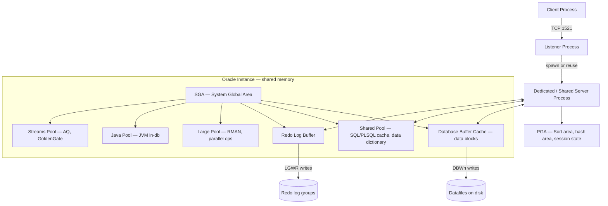
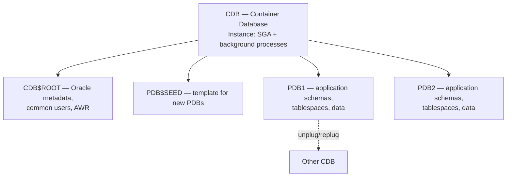

# 2.5. Oracle DBMS Containerized Internals

> [!info] Oracle Database is a flagship enterprise RDBMS, and running it in a Docker container is the practical way for a developer to get a local Oracle instance without a multi-gigabyte GUI installer.
> This note covers why containerize, the official image options, the XE licensing and resource caps, the Oracle memory and process architecture (SGA, PGA, background processes), the multitenant CDB/PDB model, the storage hierarchy, and the practical `docker-compose` configuration that prevents the most common container crashes.

---

## 1. Why Containerize Oracle

Oracle Database has historically been painful to install: a 10+ GB download, a Java-based GUI installer, dozens of pre-install OS packages, kernel parameter changes, dedicated `oracle` user, `ORA_*` environment variables, and a system reboot if any precheck failed. For application developers who just need a local Oracle to test their SQL or PL/SQL, this overhead was a permanent friction.

Containers solve this. A prebuilt image ships Oracle already installed and configured; `docker run` produces a working database in 2–5 minutes. The same image works on every developer's laptop, eliminating the "works on my machine" failure mode. For CI, an Oracle container can be spun up per test run, eliminating shared-environment flakiness.

The other reason is **licensing**. Oracle Database Enterprise Edition is licensed per CPU core with a list price that makes most engineering teams blanch. **Oracle Database Express Edition (XE)** is free, with hard-coded resource caps that make it suitable for development and small production workloads. The XE binary is what ships in the most popular container images, putting a usable Oracle within reach of every developer.

---

## 2. Image Options

Two image families dominate:

- **`container-registry.oracle.com/database/free`** — the official Oracle image, published by Oracle since the 23c release (renamed from "XE" to "Free"). Available in `regular` and `lite` variants. `lite` is roughly 1.5 GB; `regular` is 6+ GB but includes more preinstalled components.
- **`gvenzl/oracle-xe`** — the community image maintained by Gerald Venzl (an Oracle employee, but on his own time). Available in `full`, `regular`, `slim`, and `faststart` variants. The `slim` tag is the most popular for CI: it is 1.2 GB and boots in under a minute.

The `gvenzl/oracle-xe` image is more developer-friendly: it supports init scripts in `/container-entrypoint-initdb.d`, exposes `ORACLE_PASSWORD` and `APP_USER`/`APP_USER_PASSWORD` env variables for easy setup, and ships in slim variants. For most local development, `gvenzl/oracle-xe:21-slim` is the right choice; for production evaluation, use the official Oracle image.

---

## 3. Oracle XE Caps

Oracle Database XE 21c (and the renamed "Free" 23c) imposes hard limits that cannot be lifted without buying a license:

- **2 CPU threads** — the engine uses at most two OS threads regardless of host size.
- **2 GB of RAM** for the SGA + PGA combined. The instance will refuse to start if you attempt to configure higher.
- **12 GB of user data** (XE 21c) or 32 GB (Free 23c) — the database refuses to allocate new extents beyond this.
- **No Real Application Clusters (RAC).** Single-instance only.
- **No Data Guard** for physical standby replication.
- **No parallel query, no partitioning, no advanced compression, no advanced security** — many enterprise options are disabled.
- **Production use is permitted by the license** for XE/Free (a change from older XE versions that forbade it), but the resource caps make it unsuitable for serious production workloads anyway.

The implication for the engineer: XE/Free is excellent for development, CI, small production workloads, and proofs of concept. It is not a production backend for a high-traffic application — those need Enterprise Edition with the appropriate licenses.

---

## 4. SGA, PGA, and the Memory Architecture

Oracle's memory model is split into the **System Global Area (SGA)** — shared by all server processes — and the **Program Global Area (PGA)** — private to each server process. The sum of SGA and PGA across all processes is the total Oracle memory footprint.



The **database buffer cache** holds copies of data blocks read from datafiles. Blocks are organized into a working set, kept set, and recycle set; the working set uses a touch-count algorithm (more sophisticated than simple LRU) to decide which blocks to evict.

The **shared pool** caches parsed and optimized SQL plans, compiled PL/SQL code (shared cursor cache, library cache), the data dictionary cache (row cache), and the result cache. A poorly written application that does not use bind variables will fill the shared pool with thousands of nearly-identical parsed statements — the classic cause of "latch: shared pool" waits. The fix is always to use bind variables, or to set `CURSOR_SHARING=FORCE` as a workaround.

The **redo log buffer** is a small circular buffer (typically 50–150 MB) that holds redo records before LGWR writes them to the redo log files. The buffer is flushed on commit, every three seconds, when one-third full, or when 1 MB has accumulated.

The **PGA** holds per-session state: sort areas (controlled by `PGA_AGGREGATE_TARGET` since 9i), hash join areas, bitmap merge areas, PL/SQL variables, and cursor state. Sort operations that exceed the PGA spill to the temporary tablespace, which is far slower. Monitoring `v$pgastat` and `v$sql_workarea_active` is the standard way to detect under-provisioned PGA.

In a Docker container, memory discipline is critical. If the SGA + PGA exceeds the container memory limit, the Linux OOM killer terminates the Oracle process, the database crashes, and you lose any uncommitted work. Setting `MEMORY_TARGET` (the combined automatic SGA+PGA) to roughly 70% of the container limit is the standard rule of thumb.

---

## 5. Background Processes

Oracle runs a fixed set of background processes that implement durability, recovery, and maintenance. Each process is visible in the OS process list and named with a recognizable suffix.

```mermaid
graph TD
    PMON[PMON — Process Monitor<br/>Cleans up dead sessions]
    SMON[SMON — System Monitor<br/>Instance recovery, cleanup]
    DBWn[DBWn — Database Writer<br/>Writes dirty buffers to datafiles]
    LGWR[LGWR — Log Writer<br/>Flushes redo log buffer to redo log files]
    CKPT[CKPT — Checkpoint<br/>Updates datafile headers, signals DBWn]
    ARCn[ARCn — Archiver<br/>Copies full redo logs to archive log destination]
    MMON[MMON — Manageability Monitor<br/>AWR snapshots, alert log]
    RECO[RECO — Recoverer<br/>Resolves distributed txn in-doubt]
    LREG[LREG — Listener Registration<br/>Registers the instance with the listener]
```



**PMON** monitors server processes; if a client crashes, PMON rolls back the transaction and frees the PGA and locks. **SMON** performs instance recovery on startup — it reads the redo log from the last checkpoint and re-applies (rolls forward) every committed change, then rolls back any uncommitted transactions using the undo tablespace. **DBWn** writes dirty buffers from the buffer cache to the datafiles — Oracle can have multiple DBWn processes (`DBW0` through `DBW9` and `DBWa` through `DBWj`) to parallelize writes on multi-disk systems. **LGWR** writes the redo log buffer to the redo log files at every commit — this is the synchronous path that makes Oracle durable. **CKPT** updates datafile headers and control files at checkpoint time, and signals DBWn to flush. **ARCn** copies filled redo log files to an archive destination, enabling point-in-time recovery. **MMON** takes Automatic Workload Repository snapshots every hour by default and writes alerts to the alert log.

The naming is distinctive: `ora_pmon_ORCL`, `ora_smon_ORCL`, `ora_dbw0_ORCL`, etc. The `ORCL` suffix is the `ORACLE_SID`.

---

## 6. Multitenant Architecture: CDB and PDB

Since Oracle 12c (2013), Oracle supports a **multitenant architecture** where a single **Container Database (CDB)** hosts one or more **Pluggable Databases (PDB)**. The CDB contains the instance (memory, background processes) and a root container (`CDB$ROOT`) with the Oracle metadata. Each PDB is a self-contained database with its own schemas, tablespaces, and data — but it shares the instance's SGA and background processes with the parent CDB.



The multitenant model matters for containerization because it lets one Oracle image serve many logical databases. You can spin up a new PDB per environment (`dev`, `test`, `staging`) or per microservice in seconds, sharing the SGA cost. The PDBs are isolated at the SQL level — users in one PDB cannot see another PDB without a database link — but they share the instance's CPU and memory.

In XE/Free, **only one user-created PDB is allowed** (the limit was raised to three in 23c Free). In Enterprise Edition, you can plug hundreds of PDBs into a single CDB; that capability is the architectural foundation of Oracle's cloud database service.

The PDB lifecycle is the killer feature for development: `ALTER PLUGGABLE DATABASE pdb1 CLOSE; ALTER PLUGGABLE DATABASE pdb1 UNPLUG INTO '/tmp/pdb1.xml';` produces a single file you can `scp` to another host and plug into a different CDB. This is far simpler than `pg_dump` / `pg_restore` for PostgreSQL or `mysqldump` for MySQL — the PDB is a self-contained unit of data.

---

## 7. Storage Hierarchy: Tablespace, Segment, Extent, Block

Oracle organizes physical storage in four layers:

- **Tablespace** — the largest logical unit. A database has multiple tablespaces (`SYSTEM`, `SYSAUX`, `USERS`, `UNDOTBS1`, `TEMP`, plus user-created). Each tablespace consists of one or more datafiles on disk.
- **Segment** — a single database object that consumes storage: a table, an index, a partition, an undo segment, a temporary segment. Each segment belongs to exactly one tablespace.
- **Extent** — a contiguous run of blocks allocated to a segment. Segments grow by allocating new extents; the extent size is controlled by the tablespace's allocation policy (uniform or system-managed).
- **Block** — the smallest unit of I/O. Default block size is 8 KB (configurable at tablespace level via `DB_BLOCK_SIZE` for the default, and via `BLOCKSIZE` for non-standard tablespaces).

This hierarchy is more explicit than PostgreSQL's (which has only block and relation) or InnoDB's (which has page, extent, segment). The additional layers give Oracle fine-grained control over space management — but they also add complexity to operations like reclaiming space after a `DELETE` (which requires `ALTER TABLE ... SHRINK SPACE` rather than just `VACUUM`).

The **undo tablespace** holds undo segments, which store the before-images that MVCC readers and rollback use. This is Oracle's equivalent of InnoDB's undo log, but it lives in its own dedicated tablespace and is managed by the engine.

The **redo log** consists of at least two **redo log groups**, used in circular fashion. When LGWR fills one group, it switches to the next and the ARCn process archives the filled one. The redo log is Oracle's write-ahead log, conceptually identical to PostgreSQL's WAL and InnoDB's redo log.

---

## 8. Connecting to the Container

Oracle listens on TCP port **1521** for SQL*Net connections. The listener process (`ora_lreg_<SID>`) registers the instance and routes incoming connections to dedicated or shared server processes.

Connection parameters:

- **Hostname** — the container's host or IP.
- **Port** — 1521.
- **Service name** — `XE` (for XE 21c) or `FREEPDB1` (for Free 23c). The service name maps to a PDB; `XE` typically points to the default PDB.
- **`ORACLE_SID`** — the instance name, used for local connections via `sqlplus / as sysdba`. Inside the container this is set in the environment.

The standard clients are **SQL*Plus** (`sqlplus` — the legacy CLI), **SQLcl** (`sql` — the modern Java-based CLI with inline editing and `info` commands), and **Oracle Instant Client** libraries for language drivers (Python `cx_Oracle`/`oracledb`, Node.js `node-oracledb`, PHP `OCI8`, Java JDBC `ojdbc`).

```bash
docker exec -it oracle_xe sqlplus system/YourPassword@//localhost:1521/FREEPDB1
```

For application code, the connection string is typically `host:port/service_name`. The service-name model (rather than SID) is the modern approach and supports Transparent Application Failover in RAC configurations.

---

## 9. Practical Docker Compose Workflow

The following `docker-compose.yml` runs a developer-grade Oracle XE container with persistent storage, sufficient shared memory, and an init-script directory.

```yaml
version: "3.8"

services:
  oracle:
    image: gvenzl/oracle-xe:21-slim
    container_name: oracle_xe
    environment:
      ORACLE_PASSWORD: OraclePassword123
      APP_USER: appuser
      APP_USER_PASSWORD: AppPassword123
      ORACLE_CHARACTERSET: AL32UTF8
    ports:
      - "1521:1521"
    volumes:
      - oracle_data:/opt/oracle/oradata
      - ./init-scripts:/container-entrypoint-initdb.d:ro
    shm_size: 2gb
    deploy:
      resources:
        limits:
          memory: 4g
        reservations:
          memory: 2g

volumes:
  oracle_data:
    driver: local
```

Three directives in this file are critical, in the order in which they bite:

- **`shm_size: 2gb`** — Oracle's SGA uses `/dev/shm` for shared memory IPC. Docker's default `/dev/shm` is 64 MB, which is far too small. Oracle will fail to start with `ORA-27102: out of memory` if this is not raised.
- **`memory: 4g`** — Oracle XE caps SGA + PGA at 2 GB, but the engine itself, the listener, and the OS each consume additional memory. A 2 GB container will OOM; 4 GB is the practical minimum.
- **`/container-entrypoint-initdb.d`** — any `.sql`, `.sql.gz`, or `.sh` files in this directory run on first startup (when the datafiles do not exist) in alphabetical order. This is how you bootstrap schema and seed data.

On the host, raise `vm.max_map_count` before the first start, or Oracle will refuse to mount:

```bash
sudo sysctl -w vm.max_map_count=262144
```

Persist this in `/etc/sysctl.conf` or a `/etc/sysctl.d/oracle.conf` file. Then `docker compose up -d` produces a working Oracle in two to five minutes; the database is ready when the container log shows `DATABASE IS READY TO USE!`.

---

## 10. Limitations vs Full Oracle

The XE/Free container is missing features that production Oracle workloads rely on: no RAC for multi-instance clustering, no Data Guard for physical standby replication, no parallel query for analytical scans, no partitioning for large tables, no advanced compression, no advanced security options (TDE, redaction, vault). The 2 GB RAM cap rules out workloads with large working sets, and the 12 GB / 32 GB user-data cap limits how much data you can host.

For local development these limits rarely matter. For evaluating Oracle-specific features (PL/SQL packages, hierarchical queries, model clauses, flashback query), the XE/Free container is sufficient. For production, you need a licensed Oracle Database — and at that point you will not be running it in a container at all.

## Summary

Containerized Oracle is the practical way to run a local Oracle instance. The `gvenzl/oracle-xe:21-slim` image boots in under a minute, consumes roughly 1.2 GB on disk, and exposes a fully functional XE 21c instance with a 2 CPU / 2 GB RAM / 12 GB data ceiling. Oracle's memory model — SGA shared, PGA per-process — combined with the PMON/SMON/DBWn/LGWR/CKPT/ARCn background processes, forms the engine that delivers ACID and recovery. The multitenant CDB/PDB architecture lets one container serve multiple logical databases, and PDBs can be unplugged and replugged across containers. The critical Docker configuration is `shm_size`, the memory limit, and `vm.max_map_count` on the host; without these, Oracle will refuse to start or will be OOM-killed. For more on containerization in general, see [[6.1. Docker Containerization and Networking]].

## See Also
- [[2.1. Database Engine Fundamentals]]
- [[2.2. PostgreSQL Engine Internals]]
- [[2.3. MySQL Engine Internals]]
- [[6.1. Docker Containerization and Networking]]

## References
- Oracle Database Documentation, *Concepts* — Memory Architecture, Process Architecture, Multitenant Architecture.
- Gerald Venzl, *gvenzl/oracle-xe image documentation* — github.com/gvenzl/oci-oracle-xe.
- Oracle Database Express Edition Licensing Guide.
