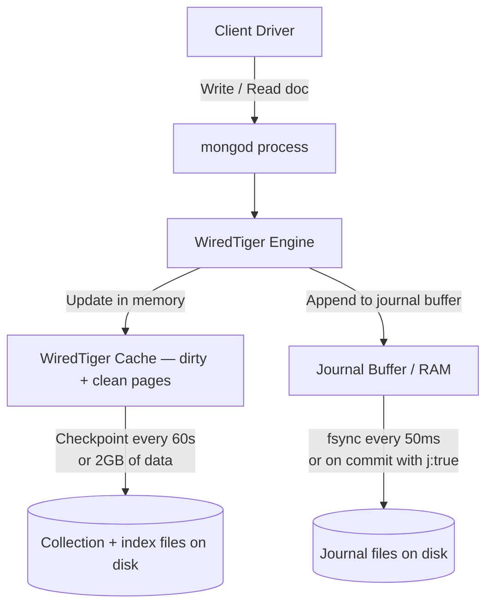
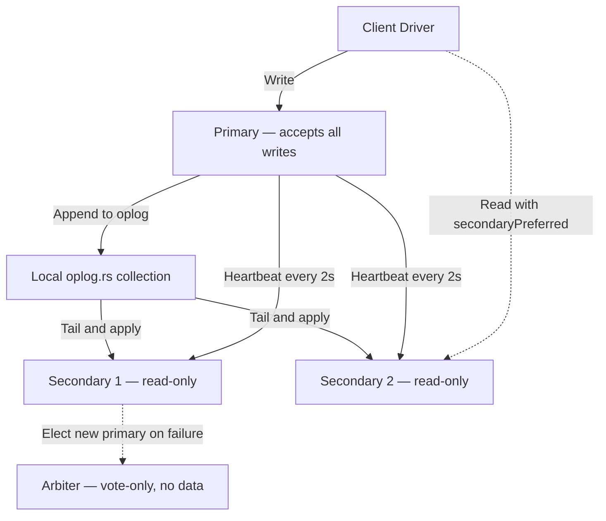
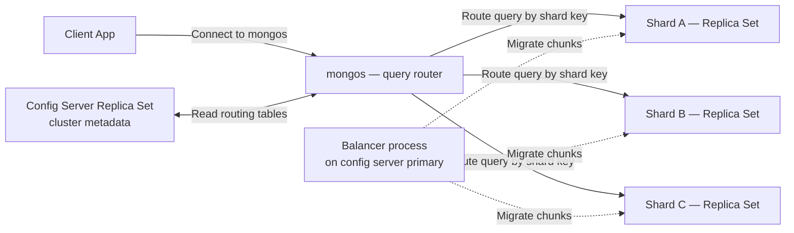

# 2.6. MongoDB Storage and Clustering

> [!info] MongoDB is a document-oriented NoSQL database that stores BSON documents, runs the WiredTiger storage engine by default, and ships built-in replication (replica sets) and horizontal sharding.
> This note covers the document model, WiredTiger internals, document-level concurrency, replica sets and the oplog, sharding and the mongos router, the index types MongoDB supports, multi-document ACID transactions, and the aggregation pipeline. The comparison with PostgreSQL's MVCC and MySQL's InnoDB is woven through every section.

---

## 1. The Document Model: BSON, Collections, Documents

MongoDB stores data in **documents** — JSON-like objects with field names and values — that are serialized on disk in **BSON** (Binary JSON). BSON extends JSON with additional types that JSON lacks: `ObjectId` (12-byte identifier combining timestamp, machine, process, counter), `Date` (millisecond Unix timestamp), `BinData` (binary blob), `Decimal128` (128-bit decimal for financial precision), `Long` (64-bit integer), `Regex`, `Timestamp` (used internally in the oplog), and `DBRef` (legacy cross-collection reference). A BSON document can be up to 16 MB; larger files use GridFS, which splits them into 255 KB chunks stored across two collections.

A **collection** is the MongoDB equivalent of a table. Collections group documents that typically share a similar shape, but no schema is enforced at the collection level by default. Two documents in the same collection can have entirely different fields. Since MongoDB 3.2, you can attach a **JSON Schema validator** to a collection to enforce required fields, types, and ranges — this is the closest MongoDB comes to schema-first design, and it is opt-in.

A **database** is a namespace grouping collections. Database names become part of the on-disk file path; collection names are case-sensitive and limited to 128 characters. The MongoDB query language is not SQL — it is a JSON-based command syntax: `db.users.find({age: {$gte: 18}})` instead of `SELECT * FROM users WHERE age >= 18`. The aggregation pipeline (covered in section 8) is the equivalent of SQL's `SELECT ... GROUP BY ... HAVING ... JOIN`.

---

## 2. WiredTiger Storage Engine

WiredTiger has been the default storage engine since MongoDB 3.2 (2016), replacing the older MMAPv1. WiredTiger is a modern engine that supports document-level concurrency, snapshot isolation, and built-in compression.



WiredTiger's memory-first execution model works as follows. A write operation modifies the document's page in the **WiredTiger Cache** in RAM. Simultaneously, the operation is appended to the **Journal Buffer** in RAM. The Journal Buffer is flushed to the on-disk journal file every 50 milliseconds (or immediately, if the write concern `j: true` was specified). The dirty pages in the cache are *not* written to the actual data files on every write — instead, a background checkpoint every 60 seconds (or after 2 GB of modifications, whichever comes first) flushes all dirty pages to the data files in a single large sequential write.

This separation of concerns is identical in spirit to the WAL/dirty-page split in PostgreSQL and InnoDB: a small sequential journal write makes the transaction durable, while large block writes to data files happen asynchronously. On crash recovery, WiredTiger replays the journal from the last checkpoint to reconstruct any dirty pages that were lost.

**Compression** is built in. WiredTiger compresses documents on disk with **Snappy** by default (about 50% compression ratio, very fast) and indexes with a prefix-compression scheme that often achieves 60–70% compression. You can switch to **zstd** (better ratio, slightly higher CPU) or **zlib** (best ratio, slowest) per collection. Compression is transparent — the engine decompresses on read and recompresses on write — and it is one of the reasons MongoDB can be competitive on storage cost against row-oriented relational engines.

The **WiredTiger Cache** size defaults to `max(50% of RAM - 1GB, 256MB)` and is configured with `--wiredTigerCacheSizeGB`. This cache is MongoDB's equivalent of PostgreSQL's `shared_buffers` or InnoDB's `innodb_buffer_pool_size`. The OS page cache sits below it and caches the same data files; this double-buffering is wasteful but is the default behavior.

---

## 3. Document-Level Concurrency

WiredTiger implements **optimistic concurrency control** at the document level. When a write operation begins, WiredTiger does not acquire a lock on the document. Instead, it reads the document's current version, modifies it in a private copy, and at commit time checks whether the document's version has changed since the read. If it has, the operation is aborted and MongoDB transparently retries it (typically up to a configurable retry limit).

The implications are significant. Two operations modifying *different documents* in the same collection never block each other — there are no collection-level or database-level locks. Throughput on insert and update workloads is limited by I/O and CPU, not by lock contention. The downside is that two operations modifying the *same document* will cause one to retry; on a hot document (a counter that is incremented from many threads), this can cause throughput collapse, and MongoDB provides atomic find-and-modify operations (`findOneAndUpdate` with `$inc`) precisely to handle those patterns without application-level retries.

This is fundamentally different from MMAPv1 (the legacy engine, removed in 4.2), which used collection-level locks and could serialize entire collections on write-heavy workloads. It is also different from PostgreSQL's MVCC (which never updates in place and uses tuple-level xmin/xmax) and from InnoDB's MVCC (which uses row-level locks for writes and undo logs for reads).

---

## 4. Replica Sets and the Oplog

MongoDB's unit of high availability is the **replica set** — a small cluster of mongod processes that hold identical copies of the data. A replica set has one **primary** that accepts all writes, and one or more **secondaries** that replicate the primary's operations log and apply it asynchronously.



The **oplog** (`oplog.rs` collection in the `local` database) is a **capped collection** — a fixed-size, FIFO collection that overwrites the oldest entries when full. Every write operation on the primary is appended to the oplog as an idempotent description (e.g., `{op: "i", ns: "app.users", o: {_id: ..., name: ...}}` for an insert). Secondaries continuously tail the oplog and apply each operation locally. The oplog size is critical: if a secondary falls behind by more than the oplog window, it cannot catch up and must perform a full initial sync.

**Elections** use a Raft-like consensus protocol. Each member sends heartbeats every 2 seconds; if a secondary does not hear from the primary within the election timeout (default 10 seconds), it initiates an election, requests votes, and (if it wins a majority) becomes the new primary. Elections require a majority of voting members; this is why replica sets have an odd number of voting members (typically 3) — to avoid split-brain. An **arbiter** is a voting member that holds no data, useful for breaking ties when you have two data-bearing nodes.

**Read preference** controls which member a query is routed to. The options are: `primary` (default, always reads from primary), `primaryPreferred` (primary unless it is unavailable), `secondary` (always secondary, fails if no secondary is up), `secondaryPreferred` (secondary unless none is available), and `nearest` (lowest-latency member). Reading from secondaries trades consistency for read scalability — a secondary may lag behind the primary by seconds, so a read-your-write guarantee requires `primary` reads.

**Write concern** controls how many members must acknowledge a write before the client is told it succeeded. `w: 1` (default) — primary acknowledges only. `w: "majority"` — a majority of voting members have applied the write to their oplog. `w: 3` — exactly three members acknowledge. `j: true` — the write must be flushed to the journal before acknowledgement. The combination `w: "majority", j: true` is the strongest practical write concern and is the only setting that guarantees no data loss on a primary failover.

---

## 5. Sharding

When a single replica set cannot hold the data or absorb the write throughput, MongoDB scales horizontally via **sharding**. A sharded cluster consists of three component types: the **mongos** router (a stateless query router that clients connect to), the **config servers** (a three-member replica set storing cluster metadata and chunk-to-shard mappings), and the **shards** (each a replica set holding a subset of the data).



The **shard key** is a field (or compound field) in every document that determines which shard the document lives on. MongoDB divides the shard key's value range into **chunks** (default 128 MB each) and assigns each chunk to a shard. The **balancer** is a background process on the config server primary that periodically migrates chunks between shards to keep the data evenly distributed.

Choosing the shard key is the single most consequential decision in a sharded MongoDB deployment, because **the shard key cannot be changed after the collection is sharded** (MongoDB 5.0 added the ability to *refine* a shard key by adding a suffix, and to *change* a shard key in limited cases, but the underlying cardinality and distribution problem remains). A shard key with low cardinality (e.g., a status field with three values) leads to a small number of huge chunks (jumbo chunks) that cannot be migrated, causing data skew. A shard key whose values arrive in monotonically increasing order (e.g., an ObjectId timestamp) causes all writes to land on the same shard (the "hot shard" problem), defeating horizontal scaling. The ideal shard key has high cardinality, even distribution, and supports the most common query patterns (because queries without the shard key must be scatter-gathered across all shards).

Shard keys are either **range-based** (default) or **hashed** (a hash of the field, ensuring even distribution at the cost of range query efficiency). Hashed shard keys solve the hot-shard problem for monotonic IDs but make range queries scatter-gather.

---

## 6. Indexing

MongoDB uses B-tree indexes as the default, with several specialized types layered on top:

| Index type | Use case | Notes |
| ---------- | -------- | ----- |
| **Single field** | Equality or range on one field | Equivalent to a single-column B-tree in SQL. |
| **Compound** | Multiple fields, ordered | Follows the same leftmost-prefix rule as SQL compound indexes. |
| **Multikey** | Indexing array fields | One index entry per array element; automatic when an indexed field holds an array. |
| **Text** | Full-text search | Tokenizes text, supports `$text` queries; limited compared to dedicated search engines. |
| **2dsphere** | Geospatial on spherical geometry | Supports `near`, `geoWithin`, `intersects` on GeoJSON points/polygons. |
| **2d** | Geospatial on flat 2D plane | Legacy, used for pre-GeoJSON data. |
| **Hashed** | Hash of a field, for hashed sharding | Used as a shard key distribution mechanism. |
| **TTL** | Auto-expire documents | Background job deletes documents after `expireAfterSeconds`. Used for session cleanup, log rotation. |
| **Wildcard** | Index all fields matching a pattern | For schemas with unpredictable field names (e.g., user-defined metadata). |
| **Unique** | Enforce uniqueness | Cannot be created on a field with duplicate values. |
| **Partial** | Index only documents matching a filter | Equivalent to PostgreSQL partial indexes. |

Indexes are per-collection, B-tree structured (the WiredTiger index format uses B-trees with prefix compression), and consume significant disk space — typically 30–50% of the data size for a single compound index. Over-indexing is a common MongoDB operational failure mode: every index must be updated on every write, and write throughput collapses as indexes accumulate.

The `explain()` method on a query (`db.users.find(...).explain("executionStats")`) shows the chosen plan, the indexes used, and the number of documents scanned — analogous to `EXPLAIN ANALYZE` in PostgreSQL. A query that scans the entire collection (`COLLSCAN` in the plan) is the most common MongoDB performance problem; the fix is to add an index that supports the query's filter.

---

## 7. Transactions

Until MongoDB 4.0, transactions were limited to a single document — atomicity was guaranteed per document (a multi-field update to one document was atomic), but multi-document operations required application-level rollback or two-phase commit.

**Multi-document ACID transactions** arrived in MongoDB 4.0 for replica sets and 4.2 for sharded clusters. A transaction is opened with `session.startTransaction()`, operations are issued against the session, and the transaction is committed or aborted. The transaction sees a snapshot of the data at the start, and on commit WiredTiger coordinates a two-phase commit across all participating documents (and shards, if sharded).

The cost is real. A multi-document transaction holds locks and snapshots that must be coordinated; throughput drops dramatically compared to single-document operations. Long-running transactions can grow the WiredTiger cache pressure and the oplog window. The MongoDB documentation is explicit: transactions are not a replacement for the document model. If you find yourself needing transactions on every operation, you have modeled your data relationally and you should probably use a relational database.

The honest summary: MongoDB supports transactions to remove the "but what if I need atomic multi-document updates?" objection, but the optimal usage pattern remains embedding related data in a single document whenever possible.

---

## 8. Aggregation Pipeline

The aggregation pipeline is MongoDB's answer to SQL's `SELECT ... GROUP BY ... HAVING ... JOIN`. Each stage of the pipeline transforms a stream of documents and passes the result to the next stage.

```javascript
db.orders.aggregate([
  { $match: { status: "completed", created_at: { $gte: ISODate("2024-01-01") } } },
  { $unwind: "$items" },
  { $group: { _id: "$items.category", total: { $sum: "$items.price" }, count: { $sum: 1 } } },
  { $lookup: { from: "categories", localField: "_id", foreignField: "_id", as: "category" } },
  { $project: { category: { $arrayElemAt: ["$category.name", 0] }, total: 1, count: 1 } },
  { $sort: { total: -1 } },
  { $limit: 10 }
]);
```

The pipeline stages each have a specific role:

- `$match` — filter documents; should come early to reduce the working set. Equivalent to `WHERE`.
- `$project` — select or compute fields. Equivalent to `SELECT`.
- `$group` — aggregate by key. Equivalent to `GROUP BY`.
- `$unwind` — explode an array field into one document per element. Often paired with `$group` for nested-array analytics.
- `$lookup` — left outer join from another collection. The only join MongoDB supports natively, and it is significantly slower than a relational join because there is no concept of foreign keys or hash joins at the storage layer.
- `$sort`, `$limit`, `$skip` — pagination and ordering.
- `$facet` — run multiple sub-pipelines in parallel, useful for dashboards that need multiple aggregations over the same data.

The aggregation pipeline runs in the mongod process (or mongos, for sharded clusters). Large aggregations that exceed the per-stage 100 MB memory limit must use `allowDiskUse: true` to spill to disk, which is dramatically slower. For analytical workloads at scale, the typical pattern is to materialize aggregations into a separate collection (via `$out` or `$merge`) on a schedule, then query that collection directly.

---

## 9. Use Cases and Limitations

MongoDB excels at workloads where the data is naturally hierarchical, the schema evolves rapidly, and the read pattern is "fetch the whole aggregate in one go." **Content management systems** (a blog post with embedded comments and tags), **product catalogs** (a product with nested variants, attributes, and reviews), **event logs and IoT metadata** (variable event payloads), and **mobile backends** (per-user data shaped differently per app version) are all classic MongoDB workloads.

The limitations are equally clear. **No real joins** — `$lookup` works but is slow, and the recommended pattern is denormalization, which trades write complexity for read simplicity. **Memory usage on large aggregations** is a recurring production issue. **Schema drift** — documents in the same collection with subtly different fields — is a constant maintenance burden, and the JSON Schema validator only catches the most obvious violations. **Transactional cost** — multi-document transactions work but are not the engine's sweet spot, and you will pay for them in throughput. Compared to PostgreSQL for transactional workloads with relationships, MongoDB is usually the wrong choice; compared to PostgreSQL for document-shaped workloads with rapid schema evolution, MongoDB is usually the right one.

## Summary

MongoDB is a document store that runs the WiredTiger storage engine, with a memory-first write path (journal flushed every 50ms, dirty pages checkpointed every 60s), document-level optimistic concurrency, and built-in compression. High availability comes from replica sets — a primary plus async secondaries, with Raft-like elections and the oplog as the replication log. Horizontal scale comes from sharding via mongos routers and config servers, with the shard key as the irreducible design decision. Indexes are B-tree based with specialized types for text, geospatial, TTL, and wildcard patterns. Multi-document ACID transactions exist since 4.0 but are not the engine's sweet spot — the optimal pattern remains embedding related data in a single document. The aggregation pipeline is MongoDB's answer to SQL, with `$lookup` as the only join. Use MongoDB for hierarchical, schema-flexible workloads; use a relational database when transactions and joins dominate.

## See Also
- [[2.1. Database Engine Fundamentals]]
- [[2.2. PostgreSQL Engine Internals]]
- [[2.7. Relational vs Non-Relational Storage Engines]]

## References
- MongoDB Documentation, *Storage* — WiredTiger Storage Engine.
- MongoDB Documentation, *Replication* and *Sharding*.
- MongoDB Documentation, *Transactions*.
- WiredTiger Documentation, *Architecture* — source.wiredtiger.com.
