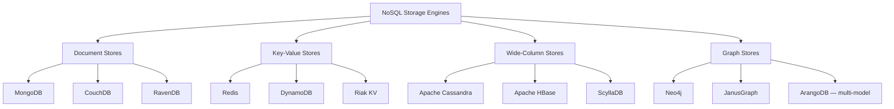
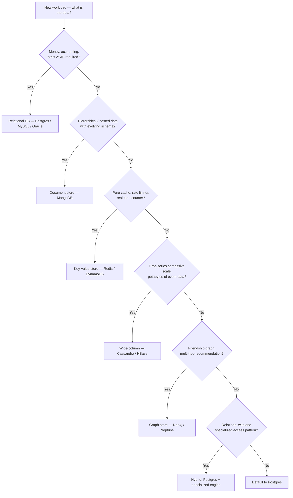

# 2.7. Relational vs Non-Relational Storage Engines

> [!info] This note is the strategic counterpart to the engine-specific notes in this chapter.
> It maps the NoSQL landscape (document, key-value, wide-column, graph) against the relational model, explains the ACID vs BASE consistency trade-off, gives a concrete decision flowchart for picking a database, and dismantles the most common myths that surround the SQL/NoSQL debate. Distributed-systems theory (CAP proofs, Paxos/Raft, sharding math) is out of scope — those belong to the System Design vault and are mentioned only as a one-paragraph summary.

---

## 1. The CAP Theorem in One Paragraph

The CAP theorem (Brewer, 2000; formalized by Gilbert and Lynch, 2002) says that a distributed system can provide at most two of three guarantees simultaneously: **Consistency** (every read returns the latest write or an error), **Availability** (every request receives a non-error response, without the guarantee that it is the latest write), and **Partition tolerance** (the system continues to operate despite network messages being dropped between nodes). Because network partitions are inevitable in real systems, the practical choice is between **CP** (consistency under partition — refuse some requests to avoid serving stale data) and **AP** (availability under partition — serve the best available answer, accept that it may be stale). The CAP theorem is a starting point for distributed-systems reasoning, not a guide to picking a database. *Detailed CAP analysis, consistency-model proofs, and consensus algorithms are covered in the System Design vault.*

---

## 2. The Relational Model

A **relational database** (PostgreSQL, MySQL, Oracle, SQL Server, DB2, SQLite) organizes data into **tables** of typed columns and unbounded rows. Tables are linked by **foreign keys** that the engine enforces, ensuring referential integrity. The **schema is declared first** — you must `CREATE TABLE` with column types before you can insert a single row, and the engine rejects any insert that violates the schema. This is called **schema-on-write**: validation happens at the moment of write, not at the moment of read.

Relational databases are **normalized** — the data model is decomposed to eliminate redundancy, with relationships expressed through foreign keys and resolved at query time via `JOIN`. A user and their orders live in two tables; a query that needs both joins them on `user_id`. The trade-off is that writes are simple (one row updated in one place) but reads that span relationships require join operations, which the engine optimizes through indexes, hash joins, and merge joins.

The **ACID** transaction model (covered in [[2.1. Database Engine Fundamentals]]) is the relational database's defining contract: every transaction is Atomic, Consistent, Isolated, and Durable. This makes relational databases the default choice for any workload where correctness is non-negotiable — financial transactions, inventory, medical records, anything involving money or regulatory compliance.

---

## 3. The NoSQL Families

The term "NoSQL" covers a heterogeneous collection of database engines that reject one or more assumptions of the relational model. The four major families are document, key-value, wide-column, and graph stores. They are not interchangeable — each is optimized for a specific data shape and access pattern.

**Document stores** (MongoDB, CouchDB, RavenDB) hold semi-structured documents, typically JSON or BSON. Documents are self-contained — a user document with embedded orders is one unit of storage and retrieval. The schema is implicit and enforced at the application layer (or optionally with a JSON Schema validator). Document stores are covered in detail in [[2.6. MongoDB Storage and Clustering]].

**Key-value stores** (Redis, DynamoDB, Riak, etcd) are the simplest model: every value is associated with a key, and the only operation is `get(key)`, `put(key, value)`, `delete(key)`. Some engines (Redis) support richer value types (lists, sets, hashes, sorted sets) and operations on them; others (etcd) keep the value opaque. Key-value stores are extraordinarily fast because they skip query parsing, planning, and execution — the key directly addresses the storage location. The trade-off is that you cannot query by value contents; if you need that, you maintain a secondary index yourself.

**Wide-column stores** (Cassandra, HBase, ScyllaDB, Bigtable) organize data into rows identified by a partition key, with each row holding a variable set of columns grouped into column families. The model is closest to a sparse, two-dimensional map: `(row_key, column_name) → value`. Wide-column stores are designed for massive write throughput across many nodes, with strict control over partitioning. They are the foundation of time-series, event-log, and IoT workloads at petabyte scale. Cassandra's partition key (which determines which node holds the data) and clustering key (which orders rows within a partition) are the analogue of MongoDB's shard key — and the choice is equally consequential and difficult to change.

**Graph databases** (Neo4j, JanusGraph, Amazon Neptune) store data as nodes and edges, with first-class support for traversing relationships. The query language (Cypher for Neo4j, Gremlin for JanusGraph/Neptune) expresses multi-hop traversals directly: "find all friends-of-friends of Alice who live in Berlin and have purchased a product in the last 30 days." In a relational database, this query requires multiple self-joins and degrades catastrophically as the depth grows; in a graph database, it is the native operation and scales linearly with the result size.

---

## 4. The BASE Consistency Model

Where relational databases follow ACID, many NoSQL databases follow **BASE**: **B**asically Available, **S**oft state, **E**ventual consistency. The contrast is sharper if you take each term apart:

- **Basically Available** — the system remains responsive even if nodes fail or partitions occur. It may return stale data or a partial result, but it does not return an error simply because a replica is unreachable.
- **Soft state** — the state of the system can change over time without input, as background replication converges replicas. The application cannot assume that the data it just read will be the same data it reads a moment later, even without a write in between.
- **Eventual consistency** — if no new updates are made, all replicas will eventually converge to the same value. "Eventually" is not bounded; under heavy load and partition, it can be seconds, minutes, or longer.

BASE is the consistency model of Dynamo-style systems (DynamoDB, Riak, Cassandra at its default consistency levels). It is not the model of MongoDB, which is strongly consistent at the primary and offers tunable consistency on reads via read concern and read preference. It is also not the model of Redis, which is single-threaded and strongly consistent. The SQL/NoSQL divide does not map cleanly to ACID/BASE — many NoSQL databases offer strong consistency as a tunable option, and many relational databases offer eventual consistency via async replication.

The practical takeaway: ACID vs BASE is a trade-off between correctness and availability under partition. Pick the consistency model that matches your workload. Money → ACID. A social-media feed → BASE is fine. A shopping cart → ACID. A product recommendation → BASE is fine.

---

## 5. Decision Tree: Which Database When

The flowchart below is a pragmatic starting point, not a substitute for benchmarking. It maps the most common workload patterns to a database family.

Concrete mappings:

| Workload | Pick | Why |
| -------- | ---- | --- |
| **Banking ledger, accounting, e-commerce checkout** | PostgreSQL, MySQL, Oracle | ACID guarantees, foreign keys, multi-row transactions. |
| **CMS, blog, product catalog, user profiles with variable fields** | MongoDB | Document model matches the data shape; schema evolution is cheap. |
| **Cache layer, session store, rate limiter, leaderboard** | Redis | Sub-millisecond in-memory key-value lookups; rich data types. |
| **IoT telemetry, clickstream, log aggregation at petabyte scale** | Cassandra, HBase | Wide-column throughput scales linearly with nodes; partition key maps to time. |
| **Friend-of-friend recommendations, fraud rings, network topology** | Neo4j, Neptune | Multi-hop traversal is the native operation; no self-join explosion. |
| **Hybrid transactional + analytical on one system** | PostgreSQL (with columnar extensions or `pg_stat_statements`) | Avoids the operational cost of two databases. |
| **Search over documents with relevance ranking** | Elasticsearch, OpenSearch | Inverted index with TF-IDF/BM25 scoring; not a primary store. |
| **Blob storage — images, videos, backups** | S3, GCS, Azure Blob | Object storage, not a database. |

---

## 6. Hybrid Architectures Are the Norm

In production, almost no real system uses one database. The typical stack looks like this:

- **PostgreSQL** (or MySQL) as the system of record — users, accounts, orders, transactions. The ACID guarantee makes it the trusted source of truth.
- **Redis** as a cache in front of PostgreSQL — session state, hot queries, rate-limit counters.
- **Elasticsearch** as a search index — denormalized copies of PostgreSQL data, indexed for full-text search and analytics.
- **MongoDB** for a specific workload with variable schema (e.g., user-uploaded form definitions) where PostgreSQL's schema would be too rigid.
- **S3** for blob storage — user-uploaded images, generated PDFs, database backups.
- **ClickHouse** (or Snowflake, or BigQuery) for analytical queries that would crush the OLTP primary.

The cost of a hybrid architecture is **operational complexity** — multiple systems to monitor, patch, back up, and recover. The benefit is that each component is the best tool for its specific job. The discipline required is to be explicit about which database is the source of truth for each piece of data, and to architect the data flow so that failures in the secondary stores (Redis cache wiped, Elasticsearch index corrupted) are recoverable from the primary.

---

## 7. Myths That Need to Die

**Myth 1: "NoSQL means no schema."** False. Every database has a schema — the question is whether it is enforced at write time (relational, with `CREATE TABLE` constraints) or at read time (NoSQL, where the application code interprets the document). A MongoDB collection that has accumulated documents from five different versions of your application has a schema — it is just a messy, undocumented schema that you discover by inspecting documents. The discipline of declaring your schema (even if you declare it in code, in a Pydantic model, in a TypeScript interface) is independent of which database you use.

**Myth 2: "NoSQL is faster than SQL."** False in general. The right statement is "NoSQL is faster for the specific access pattern it was designed for." Redis is faster than PostgreSQL for key-value lookups, but PostgreSQL is faster than Redis for analytical queries with joins. MongoDB is faster than PostgreSQL for fetching a hierarchical document in one read, but PostgreSQL with JSONB and a GIN index is competitive and PostgreSQL with normalized tables is dramatically faster for updates that touch one row. Speed is a function of (database, workload, schema, indexes, hardware) — not of the SQL/NoSQL axis.

**Myth 3: "Relational databases can't scale."** False, with caveats. A single PostgreSQL or MySQL instance handles terabytes of data and tens of thousands of transactions per second on commodity hardware. Vertical scaling (more RAM, more CPU, faster disks) takes you further than most workloads ever need. When you outgrow a single node, read replicas handle read scaling; for write scaling, sharding solutions exist (Citus for PostgreSQL, Vitess for MySQL, MongoDB's native sharding). The reason NoSQL is "more scalable" in marketing is that sharding is built into the engine, not bolted on as a separate product — but the operational difficulty of running a sharded system is roughly the same in both worlds. The honest statement is "horizontal scaling is hard, regardless of which database you use."

**Myth 4: "Use MongoDB because it's web-scale."** This meme from 2010 needs to die. MongoDB is the right choice when the document model fits your data and your access pattern is single-document reads. It is not the right choice because "it scales" — every database scales, and the trade-offs are more interesting than the marketing.

**Myth 5: "JSON in PostgreSQL makes MongoDB redundant."** Partially true. PostgreSQL JSONB with a GIN index is a credible document store, and for many workloads it removes the need for a separate MongoDB. The cases where MongoDB still wins are: when the document model dominates every access pattern (so you pay no cost for the absence of joins), when horizontal sharding via mongos is more operationally tractable than PostgreSQL sharding, and when the aggregation pipeline is more natural for your team than SQL. For everything else, JSONB in PostgreSQL is a better default.

---

## 8. Summary Decision Framework

When starting a new project, the default should be **PostgreSQL** unless you have a specific reason to pick something else. PostgreSQL handles transactions, JSON, geospatial, full-text search, time-series (with extensions), and analytics on moderate data — it is the most versatile single database available. Reach for **MongoDB** when the document model dominates. Reach for **Redis** for caching and ephemeral state. Reach for **Cassandra** when you have petabytes of time-series data. Reach for **Neo4j** when graph traversal is the core operation. Reach for **Oracle** when your enterprise ecosystem requires it. Reach for **MySQL** when your stack defaults to it (Laravel, Django, WordPress). In every case, benchmark on your real workload before committing — vendor benchmarks lie, and the only benchmark that matters is yours.

## Summary

Relational and non-relational databases represent different trade-offs, not a hierarchy of quality. Relational databases give you schema-on-write, ACID transactions, joins, and foreign keys; they are the default for transactional workloads. NoSQL is a heterogeneous family — document stores for hierarchical data, key-value stores for caches and counters, wide-column stores for massive time-series, graph stores for relationship traversal. ACID vs BASE is the consistency trade-off, orthogonal to the SQL/NoSQL axis. Hybrid architectures are the production norm: PostgreSQL for truth, Redis for cache, Elasticsearch for search, S3 for blobs. The five myths — no schema in NoSQL, NoSQL is faster, SQL can't scale, MongoDB is web-scale, JSON-B replaces MongoDB — are all false in different ways. The honest engineering position is: pick the database that matches your data shape and access pattern, benchmark on your workload, and treat every scaling claim with skepticism.

## See Also
- [[2.1. Database Engine Fundamentals]]
- [[2.2. PostgreSQL Engine Internals]]
- [[2.3. MySQL Engine Internals]]
- [[2.6. MongoDB Storage and Clustering]]
- [[00. Master Index]]

## References
- Brewer, *CAP Theorem* — keynote at PODC 2000.
- Gilbert and Lynch, *Brewer's Conjecture and the Feasibility of Consistent, Available, Partition-Tolerant Web Services*, SIGACT News 2002.
- Fowler and Sadalage, *NoSQL Distilled*, Addison-Wesley, 2012.
- Kleppmann, *Designing Data-Intensive Applications*, O'Reilly, 2017 — chapters 1–5.
