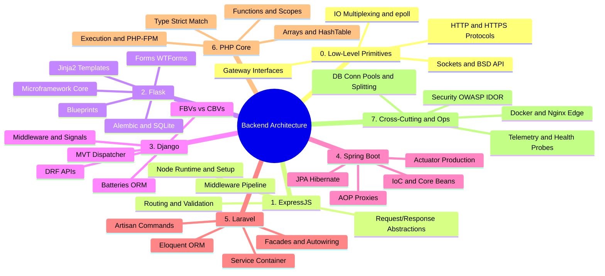

# 03. Backend Frameworks — Chapter Index

> [!info] Map of Content (MOC) Purpose
> This index organizes the Backend Frameworks and System Architecture curriculum. It is structured hierarchically from low-level operating system and networking primitives to individual language ecosystems, and finally cross-cutting production deployment patterns. Select a sub-chapter below to read end-to-end, or use the Mermaid mind map to trace learning pathways.

---

## 1. Curriculum Sub-Chapters

| Sub-Chapter | Language | Notes | Key Focus Areas |
| :--- | :--- | :--- | :--- |
| **[[3.0.0. Low-Level Primitives MOC\|3.0. Low-Level Primitives]]** | C / POSIX | 5 notes | Sockets, I/O Multiplexing (epoll), HTTP/S Protocols, Gateways (WSGI, ASGI, PHP-FPM) |
| **[[3.1.0. ExpressJS MOC\|3.1. ExpressJS]]** | JavaScript / Node.js | 13 notes | Node runtime foundations, Request/Response abstractions, Routing, Middleware architecture |
| **[[3.2.0. Flask MOC\|3.2. Flask]]** | Python | 17 notes | WSGI, Jinja2 templating, WTForms, SQLAlchemy integration, Session security, Blueprints |
| **[[3.3.0. Django MOC\|3.3. Django]]** | Python | 13 notes | Model-View-Template pattern, ORM, generic CBVs, Middleware onion, Signals engine, DRF |
| **[[3.4.0. Spring Boot MOC\|3.4. Spring Boot]]** | Java | 13 notes | Dependency Injection styles, Bean lifecycles, AOP proxies, Spring Data JPA, Actuator |
| **[[3.5.0. Laravel MOC\|3.5. Laravel]]** | PHP | 13 notes | Service Container binds, Facades mechanics, Eloquent Active Record, Migrations, collections |
| **[[3.6.0. PHP Core Language MOC\|3.6. PHP Core Language]]** | PHP | 22 notes | Share-Nothing runtimes, strict types, Match expression, HashTables, variable scopes, XSS escaping |
| **[[3.7.0. Cross-Cutting Patterns and Infrastructure MOC\|3.7. Cross-Cutting & Ops]]** | Multi / Cloud | 11 notes | Session/JWT storage, OAuth2/PKCE, OWASP Top 10, connection pools, Docker & Nginx edge, metrics |

---

## 2. Curriculum Concept Mind Map

The mind map below visualizes the entire system architecture curriculum, showing how low-level OS primitives flow into language frameworks, and converge at deployment and security operations:

---

## 3. Recommended Reading Paths

* **The Low-Level Path (Highly Recommended):** Start with **3.0. Low-Level Primitives** to understand socket descriptors and I/O loops. This makes learning the Node.js event loop or Gunicorn deployment parameters much more intuitive.
* **The Quick Framework On-Ramp:** If you want to jump straight to building applications, pick **3.1. ExpressJS** (if you know JavaScript) or **3.2. Flask** (if you know Python). Both provide clean, lightweight on-ramps.
* **The Enterprise Web Path:** Read **3.6. PHP Core Language** followed by **3.5. Laravel**, or dive into **3.4. Spring Boot** to understand Java's Dependency Injection patterns.
* **The Production-Ready Finish:** After completing any framework chapter, read **3.7. Cross-Cutting & Ops** to learn how to secure, containerize, and monitor your service in production.

---

## 4. Prerequisites

* **[[1.1. HTTP Protocol and Lifecycle]]** — Foundational knowledge of HTTP request/response flows.
* **[[1.2. RESTful API Design and Constraints]]** — Core tenets of API design.
* **[[1.3. Cookies and Session Management]]** — Explains stateful session properties.

---

## 5. Maintenance and Growth Guide

* **Adding New Frameworks:** If a new framework is adopted (such as FastAPI, Go Gin, or NestJS), assign it a new sub-chapter prefix (e.g., `3.8. Go Gin`) and integrate it into this Map of Content.
* **Updating Core Language References:** When PHP or Python release major new versions, audit **3.6. PHP Core Language** and **3.2. Flask** to ensure deprecations are updated.

---

*See also: [[00. Master Index]] — [[00. README and Vault Conventions]]*
