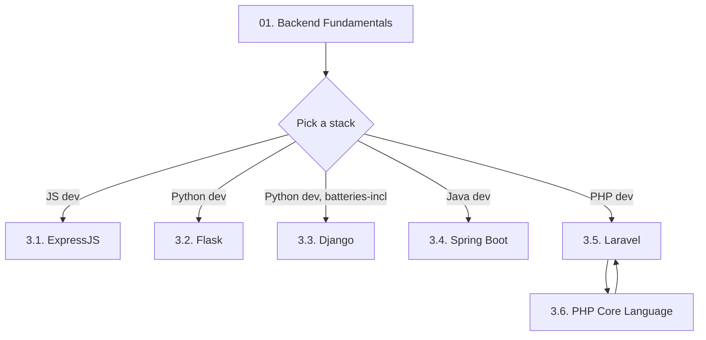
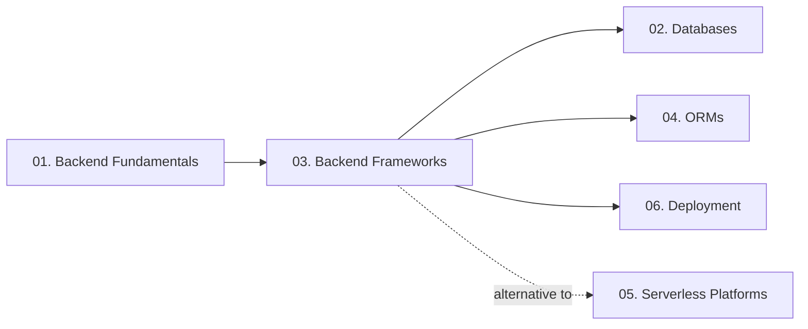

# 03. Backend Frameworks — Chapter Index

> [!info] Chapter Purpose
> One sub-folder per framework: **ExpressJS** (Node.js), **Flask** (Python), **Django** (Python), **Spring Boot** (Java), **Laravel** (PHP). A sixth sub-folder, **PHP Core Language**, holds the language-level reference for PHP — it is the prerequisite for the Laravel notes and the natural home for the substantial PHP content migrated from the previous vault.

Pick **one** framework sub-folder and read it end-to-end. Cross-framework reading (e.g., "how does Flask do middleware vs Express") is encouraged once you know one well.

---

## Sub-Chapters

| # | Sub-chapter | Language | Notes |
| - | ----------- | -------- | ----- |
| 3.1 | [[3.1.1. Installing Express.js\|ExpressJS]] | JavaScript / Node.js | 6 notes. The fastest on-ramp if you already know JavaScript. |
| 3.2 | [[3.2.1. Introduction to Flask\|Flask]] | Python | 16 notes. The most complete sub-chapter — covers the full path from "hello world" to deployment. |
| 3.3 | [[3.3.1. Django Overview and MVT Pattern\|Django]] | Python | 2 notes. Overview + a quiz review note. |
| 3.4 | [[3.4.1. Spring Boot Overview and Starters\|Spring Boot]] | Java | 2 notes. Overview + IoC/DI internals. |
| 3.5 | [[3.5.1. Laravel Overview and Installation\|Laravel]] | PHP | 2 notes. Overview + Service Container & Eloquent. |
| 3.6 | [[3.6.1. PHP Execution Models\|PHP Core Language]] | PHP | 21 notes. The language-level PHP reference. Prerequisite for the Laravel notes. |

---

## Recommended Reading Order

- If you are **brand new to backend**, start with **3.1. ExpressJS** or **3.2. Flask** — both have gentle on-ramps and small mental models.
- If you are coming from the previous PHP vault, read **3.6. PHP Core Language** first (it preserves and expands everything from the old vault), then **3.5. Laravel** to see the framework layer.
- If you are evaluating frameworks for a new project, read the "Overview" note of each (3.1.1, 3.2.1, 3.3.1, 3.4.1, 3.5.1) — they all contain the comparison context you need.

---

## Prerequisites

- **[[1.1. HTTP Protocol and Lifecycle]]** — every framework is fundamentally an HTTP request processor.
- **[[1.2. RESTful API Design and Constraints]]** — for the API-focused notes.
- **[[1.3. Cookies and Session Management]]** — for the session/auth notes.
- Basic familiarity with the language of the framework you choose (JavaScript, Python, Java, or PHP).

---

## How This Chapter Connects to the Rest of the Vault

- **Frameworks → Databases**: every framework here can talk to every database in chapter 02. The Laravel/PHP notes are MySQL-centric by tradition; the Flask notes use SQLite for dev and Postgres for prod.
- **Frameworks → ORMs**: SQLAlchemy (`4.2.`) is the ORM underneath Flask-SQLAlchemy (`3.2.9.`). Eloquent (`3.5.2.`) is Laravel's Active Record ORM. Django ORM is covered in `3.3.1.`.
- **Frameworks → Deployment**: Docker (`6.1.`) and Nginx (`6.3.`) are the deployment substrate for every framework here. The PHP-specific deployment notes (`3.6.1.` PHP execution models, `3.6.2.` Apache/PHP-FPM) feed directly into `6.2. Docker vs Apache for PHP`.
- **Frameworks vs Serverless**: serverless platforms (`05.`) are alternatives to "build your own backend with a framework." Use this chapter to understand what a framework gives you; use chapter 05 to know when to skip the framework and go serverless.

---

## What This Chapter Does NOT Cover

- **Frontend frameworks** (React, Vue, Angular, Svelte) — out of scope, except where a serverless platform (Vercel) directly couples to them.
- **Mobile backend frameworks** (Firebase SDK clients) — those live in `05. Serverless Platforms`.
- **Micro-frontend / BFF patterns** — *Covered in the System Design vault.*
- **Performance benchmarking across frameworks** — intentionally omitted; benchmarks age fast and rarely reflect real workloads.

---

## Framework Comparison Cheat-Sheet

| Framework | Language | Pattern | Philosophy | Sweet Spot |
| --------- | -------- | ------- | ---------- | ---------- |
| ExpressJS | JavaScript | Middleware pipeline | Minimal, unopinionated | APIs, SPAs backends, Node.js ecosystem |
| Flask | Python | Micro-framework | "Bring your own batteries" | Small-to-medium APIs, prototyping, science |
| Django | Python | MVT, batteries-included | "Everything included" | Content sites, admin-heavy apps, teams that want convention |
| Spring Boot | Java | IoC + DI + AOP | Enterprise-grade, opinionated | Large enterprise apps, Java teams |
| Laravel | PHP | Active Record + Service Container | "PHP for artisans", expressive syntax | Web apps with a PHP team, rapid CRUD |

---

## Maintenance Notes

- The PHP sub-chapter (`3.6.`) is the largest. When PHP 9 ships with new features (JIT improvements, enum enhancements, etc.), update the relevant notes in place.
- If the author adopts a new framework (FastAPI, NestJS, Quarkus, Symphony 7), add a new sub-chapter following the same pattern.
- The Flask sub-chapter (`3.2.`) has 16 notes — when Flask 3.0+ becomes standard, audit them for outdated patterns.

---

*See also: [[00. Master Index]] — [[00. README and Vault Conventions]]*
