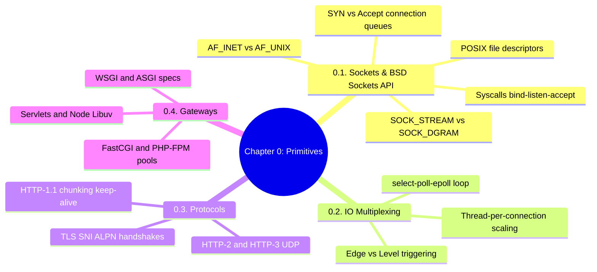

# 3.0.0. Low-Level Primitives MOC

> [!info] Map of Content Purpose
> This local index acts as your navigation hub for Chapter 0: Low-Level System, Networking & Runtime Primitives. Before diving into high-level frameworks like Express or Spring Boot, it is crucial to understand how operating systems manage connections, schedule events, and interact with the physical network.

---

## 1. Chapter Mind Map

The mind map below structures the core systems-level and protocol-level abstractions covered in this chapter:

---

## 2. Topic Outline & Atomic Notes

Each file in this chapter is a deep dive into an essential piece of low-level systems engineering. We recommend reading them in sequential order:

### [[3.0.1. Socket Abstractions and BSD Sockets API|1. Socket Abstractions & BSD Sockets API]]
*Explore how kernels manage connection buffers and how application code communicates via socket file descriptors.*
* **Key Concepts:** Sockets as FDs, `AF_INET`/`AF_INET6` vs local `AF_UNIX` (UNIX Domain Sockets) optimization.
* **TCP Streams vs UDP Datagrams:** Stream boundaries vs Datagram reliability metrics.
* **Syscall Lifecycles:** `socket()`, `bind()`, `listen()`, `accept()`, `connect()`, `close()`.
* **Kernel Connection Queues:** Sizing and tuning the **SYN Queue** (half-open) and **Accept Queue** (fully open) backlogs to mitigate connection overflows (`ECONNREFUSED`).

### [[3.0.2. IO Multiplexing and Event-Driven Concurrency|2. I/O Multiplexing & Event-Driven Concurrency]]
*Understand how modern servers scale to millions of concurrent connections (the C10k problem).*
* **Concurrency Models:** Multi-threading / Process-per-connection vs Async Event-Loop models.
* **Kernel Event-Driven Primitives:** Comparing legacy `select()` and `poll()` to highly performant `epoll` (Linux) and `kqueue` (macOS/BSD).
* **Triggering Modes:** Level-Triggered (notifying when data is available) vs Edge-Triggered (notifying only on state changes) event loops.

### [[3.0.3. HTTP and HTTPS Protocol Mechanisms|3. HTTP & HTTPS Protocol Mechanisms]]
*Breaking down the structure of network protocols that power the web.*
* **HTTP/1.1 Core:** Headers, Keep-Alive, Chunked transfer encodings, and pipelining constraints.
* **HTTP/2 & HTTP/3:** Binary framing, connection multiplexing, header compression (HPACK), and UDP-based QUIC acceleration.
* **Encryption Protocols:** TLS/SSL handshake, Server Name Indication (SNI), Application-Layer Protocol Negotiation (ALPN), session resumption, and edge termination.

### [[3.0.4. Gateway Interfaces and Web Server Runtimes|4. Gateway Interfaces & Web Server Runtimes]]
*Bridging the gap between raw web servers and high-level language runtimes.*
* **Python Contracts:** Synchronous **WSGI** (PEP 3333) vs Asynchronous **ASGI** (WebSockets, Server-Sent Events).
* **PHP execution models:** FastCGI protocol, PHP-FPM worker pools, and persistent process runners.
* **Enterprise Java:** Java Servlet specification lifecycle (`init()`, `service()`, `destroy()`), HttpServletRequest models, and filter chains.
* **JavaScript Engine:** Node.js V8 Engine runtime, the multi-phase Libuv event loop, and thread pool task offloading.

---

## 3. Prerequisite Knowledge & Downstream Impact

* **Prerequisites:** A solid understanding of basic CPU, memory, and IP network topologies is helpful.
* **Downstream Relevance:** 
  - Having a firm grasp of BSD sockets and event loops will help you configure Node's cluster module in [[3.1.12. Graceful Shutdown and WebSocket Upgrades]].
  - Epoll loops directly explain the Gunicorn worker architectures covered in [[2.15. WSGI Production Deployment]].
  - Process pool structures explain the PHP-FPM resource tuning in [[3.6.2. Apache Server and PHP-FPM]].

---

*See also: [[00. Master Index]] — [[3.0. Chapter Index]]*
