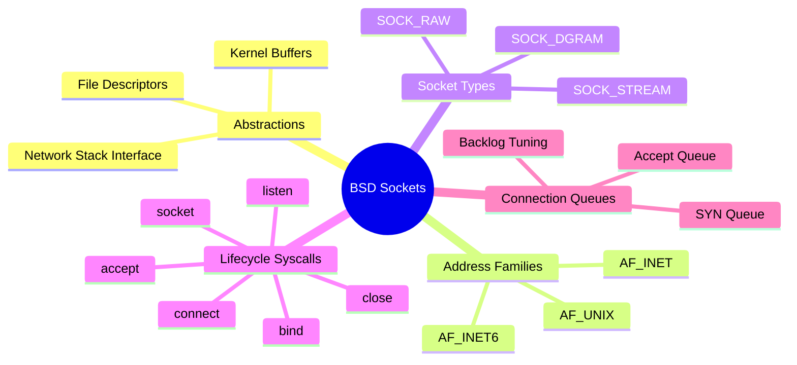

# 3.0.1. Socket Abstractions and BSD Sockets API

> [!info] Chapter Orientation
> This note explores low-level socket abstractions, addressing structures, and the POSIX/BSD sockets API. We examine how operating system kernels bridge the network stack to application-layer code through file descriptors, the distinct behaviors of address families and socket types, and the precise mechanics of socket lifecycle system calls and connection queues.

---

## 1. Sockets as File Descriptors in Unix

In Unix-like operating systems (such as Linux and macOS), the design philosophy is anchored on the principle that "everything is a file." This abstraction simplifies system design by allowing the same interfaces and system calls (`read()`, `write()`, `close()`) to interact with hardware devices, pipes, regular files, and network sockets.

A **socket** is a kernel-managed abstraction that acts as an endpoint for bidirectional communication over a network. When an application creates a socket, the kernel allocates an entry in the process’s file descriptor (FD) table. This integer FD points to an underlying `struct socket` in kernel memory, which manages:
* **Receive and Send Buffers:** Dedicated segments of system memory allocated to store incoming and outgoing network data.
* **TCP/IP State Machine:** The current connection state (e.g., `LISTEN`, `SYN_SENT`, `ESTABLISHED`, `TIME_WAIT`).
* **Connection Metadata:** Source and destination IP addresses and ports.
* **Device Driver Queues:** Direct references to network interface card (NIC) buffers.



---

## 2. Address Families and Socket Types

When initializing a socket, two primary parameters must be specified: the **Address Family** (how addresses are identified) and the **Socket Type** (how data is transmitted).

### Address Families (AF)

Address families dictate the syntax of addresses and the protocols used to route data.

* **`AF_INET` (IPv4 Addressing):**
  * Uses 32-bit (4-byte) addresses (e.g., `192.168.1.1`).
  * Utilizes `struct sockaddr_in` for socket address configuration.
  * Extremely prevalent, but bounded by the absolute IPv4 address space limit.

* **`AF_INET6` (IPv6 Addressing):**
  * Uses 128-bit (16-byte) addresses (e.g., `2001:db8::1`).
  * Utilizes `struct sockaddr_in6` for configuration.
  * Designed to replace IPv4, resolving address exhaustion and introducing native routing optimizations.

* **`AF_UNIX` / `AF_LOCAL` (Unix Domain Sockets):**
  * Binds to a filesystem path (e.g., `/var/run/redis.sock`) instead of an IP address and port.
  * Used strictly for inter-process communication (IPC) on the *same physical machine*.
  * **Performance Advantage:** Bypasses the entire TCP/IP network stack (including packet assembly, checksumming, routing, and TCP state-tracking overhead). Instead, the kernel performs a direct memory copy from the sending process's buffer to the receiving process's buffer, yielding massive throughput gains and latency reductions.

### Socket Types

Socket types define the communication semantics.

* **`SOCK_STREAM` (Stream Sockets / TCP):**
  * Connection-oriented, requiring an active three-way handshake before data transfer.
  * Highly reliable: guarantees in-order, error-free delivery via acknowledgments and automatic retransmissions.
  * **Byte-Stream Semantics:** Does *not* preserve message boundaries. If a client calls `send()` twice with 50 bytes each, the server may read all 100 bytes in a single `recv()` call, or read 10 bytes first, then 90 bytes. The application layer must handle message framing (e.g., using delimiters or length headers).

* **`SOCK_DGRAM` (Datagram Sockets / UDP):**
  * Connectionless: packets are routed independently and can arrive out of order, or not at all.
  * No retransmissions or acknowledgments (unreliable), resulting in minimal overhead.
  * **Message Boundary Semantics:** Preserves message boundaries. One `sendto()` of 100 bytes results in exactly one `recvfrom()` of 100 bytes on the receiver side (or the packet is dropped).

* **`SOCK_RAW` (Raw Sockets):**
  * Bypasses the kernel's transport layer processing, providing direct access to the IP header or even link-layer frames (e.g., ethernet).
  * Used for building network diagnostic utilities (like `ping` via ICMP, or packet sniffers like `tcpdump`).
  * Creation requires superuser privileges (`CAP_NET_RAW` capability in Linux) to prevent malicious packet injection.

---

## 3. Socket Lifecycle System Calls (Syscalls)

The POSIX sockets API defines a standard set of system calls that orchestrate network operations.

```
       Server                                Client
      socket()                              socket()
         |                                     |
      bind()                                   |
         |                                     |
      listen()                                 |
         |                                     |
      accept() <----- [Three-Way Handshake] <- connect()
  (blocks waiting)                             |
         |                                     |
      recv()   <------------------------------ send()
         |                                     |
      send()   ------------------------------> recv()
         |                                     |
      close()  <----- [Connection Teardown] -> close()
```

### Server-Side Lifecycle

1. **`socket(domain, type, protocol)`**
   * Allocates a new socket descriptor.
   * *Parameters:* `domain` (e.g., `AF_INET`), `type` (e.g., `SOCK_STREAM`), `protocol` (typically `0` to let the kernel choose the default, like TCP for stream sockets).

2. **`bind(sockfd, struct sockaddr *addr, addrlen)`**
   * Assigns a local IP address and port number to the socket descriptor.
   * If binding a port below 1024 (privileged ports, like HTTP 80 or HTTPS 443), the process must run with elevated privileges (`CAP_NET_BIND_SERVICE`).
   * Binding to `0.0.0.0` tells the kernel to listen on *all* available network interfaces (loopback, ethernet, Wi-Fi).

3. **`listen(sockfd, backlog)`**
   * Converts the active socket (used to initiate connections) into a passive listening socket (used to receive incoming connections).
   * Transitions the socket's internal TCP state to `LISTEN`.
   * The `backlog` argument defines the queue limit for incoming connections.

4. **`accept(sockfd, struct sockaddr *addr, socklen_t *addrlen)`**
   * Extracts the first connection request from the fully established connection queue (the Accept Queue).
   * **Crucial Detail:** Returns a *brand new* file descriptor specifically for communicating with this client. The original listening socket (`sockfd`) remains open and continues listening for new connection requests on the bound port.
   * If the queue is empty, a standard blocking socket will halt execution until a client connects.

5. **`recv(connfd, buf, len, flags)` & `send(connfd, buf, len, flags)`**
   * Read data from the receive buffer and write data to the send buffer of the connection-specific socket.
   * `flags` can modify behavior (e.g., `MSG_PEEK` to inspect data without consuming it, or `MSG_DONTWAIT` for non-blocking operations).

6. **`close(connfd)`**
   * Decrements the file descriptor reference count. If the reference count reaches zero, the kernel initiates the standard TCP connection teardown sequence (FIN packet exchange) and frees the associated socket buffers.

### Client-Side Lifecycle

1. **`socket(domain, type, protocol)`**
   * Instantiates the local client-side socket.

2. **`connect(sockfd, struct sockaddr *addr, addrlen)`**
   * Initiates the active connection. For TCP sockets, this triggers the three-way handshake:
     1. Client sends `SYN` packet.
     2. Server responds with `SYN-ACK`.
     3. Client sends `ACK`.
   * **Port Assignment:** If the client socket has not been explicitly bound using `bind()`, the kernel automatically assigns a random local port from the ephemeral port range (typically `32768` to `60999` on Linux) and binds it before sending the initial `SYN`.

---

## 4. The Connection Backlog: Kernel Queues and Tuning

When a server is listening for connections, the kernel maintains **two separate queues** on behalf of each listening socket. Understanding this separation is essential for diagnosing high-load server failures.

```
Incoming SYN ---> [ SYN Queue ] ---> SYN-ACK Sent
                        |
                 Client ACK Received
                        |
                        v
                  [ Accept Queue ] ---> App calls accept()
```

### The SYN Queue (Half-Open Connections)
* Stores connection requests that have sent a `SYN` packet and received a `SYN-ACK` from the server, but have not yet sent the final `ACK` to complete the handshake.
* Sockets in this queue are in the `SYN_RECV` state.
* **SYN Flood Attacks:** Attackers flood a server with `SYN` packets but never send the final `ACK`, exhausting the memory allocated for the SYN queue and preventing legitimate users from completing the handshake. Modern kernels defend against this using **SYN Cookies**, which encode connection state inside the initial `SYN-ACK` sequence number, removing the need to allocate memory in the SYN queue entirely.

### The Accept Queue (Fully Established Connections)
* Stores connections that have successfully completed the TCP three-way handshake but have *not yet* been retrieved by the application via `accept()`.
* Sockets in this queue are in the `ESTABLISHED` state.
* Once the application calls `accept()`, the kernel removes the socket from this queue and returns it as a new file descriptor to the program.

### Backlog Depth Tuning
The `backlog` parameter passed to `listen(sockfd, backlog)` sets the maximum depth of the Accept Queue. However, the kernel limits this value to the system-wide maximum defined in `/proc/sys/net/core/somaxconn`.
* If an application calls `listen(fd, 4096)` but `somaxconn` is set to `128`, the kernel silently truncates the queue limit to `128`.
* **Production Tuning:** For high-throughput services (like Nginx reverse proxies or busy APIs), `somaxconn` must be increased (e.g., to `1024` or `4096`) alongside the application's backlog setting to prevent connection drops.

### Handling Queue Overflows
When the Accept Queue is completely full because the application cannot call `accept()` fast enough, the kernel's behavior is dictated by the system setting `/proc/sys/net/ipv4/tcp_abort_on_overflow`:
* **Default (`tcp_abort_on_overflow = 0`):** The kernel ignores the incoming final `ACK` from the client. Since the client believes the connection is established (having received the `SYN-ACK` and sent the `ACK`), it will transition to `ESTABLISHED` and attempt to send data. However, because the server dropped the `ACK`, it will retransmit the `SYN-ACK` to the client. If the server application drains the queue before a timeout, the handshake succeeds late; otherwise, the client eventually times out.
* **Aggressive (`tcp_abort_on_overflow = 1`):** The server kernel immediately responds to the client's `ACK` with a `RST` (Reset) packet, closing the connection. This manifests on the client side as an immediate `ECONNREFUSED` error.

---

## 5. Non-Blocking Sockets & Asynchronous Operations

By default, socket system calls operate in **blocking mode**:
* `recv()` halts execution until data is copied into the receive buffer.
* `send()` halts execution if the network card's send buffer is full, waiting for space to clear.
* `accept()` halts until a client initiates a connection.
* `connect()` halts until the full three-way handshake completes.

### Configuring Non-Blocking Mode
To make a socket non-blocking, we alter its file status flags using the `fcntl()` system call:

```c
int flags = fcntl(sockfd, F_GETFL, 0);
fcntl(sockfd, F_SETFL, flags | O_NONBLOCK);
```

Once `O_NONBLOCK` is set, system calls return immediately instead of waiting:
* **`recv()` / `read()`:** If no data is available in the kernel buffer, the call returns `-1` and sets the global error variable `errno` to `EAGAIN` or `EWOULDBLOCK`. The application must try again later.
* **`send()` / `write()`:** If the kernel's send buffer is full, the call returns `-1` and sets `errno` to `EAGAIN` or `EWOULDBLOCK`. If only partial space is available, it writes as much as possible and returns the number of bytes written.
* **`connect()`:** Initiating a connection on a non-blocking socket returns `-1` with `errno` set to `EINPROGRESS`. The TCP handshake continues in the background. The application must monitor the socket's writability using multiplexing interfaces (like `select`, `poll`, or `epoll`) to determine when the handshake completes successfully.

---

## 6. Tips, Tricks and Common Gotchas

* **Address Already in Use (`EADDRINUSE`):**
  * When a server process is killed or crashes, its listening port often enters the `TIME_WAIT` state for 1–4 minutes to capture any stray packets remaining in flight across the network. If you try to restart the server immediately, `bind()` will fail with `EADDRINUSE`.
  * **Solution:** Enable socket address reuse *before* calling `bind()` using `setsockopt()` with the `SO_REUSEADDR` option:
    ```c
    int opt = 1;
    setsockopt(sockfd, SOL_SOCKET, SO_REUSEADDR, &opt, sizeof(opt));
    ```

* **The Nagle Algorithm and `TCP_NODELAY`:**
  * By default, TCP buffers data to combine multiple small writes into a single larger packet, reducing network header overhead. This is known as **Nagle's Algorithm**.
  * While efficient for bulk file transfers, it introduces up to 40ms of latency for real-time interactive APIs (like WebSockets or RPCs) where small updates must be sent instantly.
  * **Solution:** Disable Nagle's algorithm by setting `TCP_NODELAY` on the connection socket:
    ```c
    int opt = 1;
    setsockopt(connfd, IPPROTO_TCP, TCP_NODELAY, &opt, sizeof(opt));
    ```

* **Handling `SIGPIPE`:**
  * If a client abruptly disconnects and closing is unhandled, the first time the server writes to the closed socket, the write fails and returns an error. If the server ignores this and writes to the socket *again*, the kernel sends a `SIGPIPE` signal to the process.
  * By default, `SIGPIPE` instantly terminates the application.
  * **Solution:** Configure your application to ignore `SIGPIPE` (e.g., `signal(SIGPIPE, SIG_IGN)` in C or registering ignore handlers in Python/Go) so the system call simply returns an `EPIPE` error, which can be handled gracefully inside the application logic.

---

## See Also

* [[3.0.2. IO Multiplexing and Event-Driven Concurrency]] — Examining how to scale sockets beyond blocking threads.
* [[3.0.4. Gateway Interfaces and Web Server Runtimes]] — Linking low-level sockets to web servers like Gunicorn, Node, and PHP-FPM.
* [[3.1.1. Installing Express.js]] — Node's wrapper around network streams.

## References

* Stevens, W. R., Fenner, B., & Rudoff, A. M. (2004). *UNIX Network Programming, Volume 1: The Sockets Networking API*. Addison-Wesley Professional.
* Kerrisk, M. (2010). *The Linux Programming Interface: A Linux and UNIX System Programming Handbook*. No Starch Press.
* Postel, J. (1981). *Transmission Control Protocol*. RFC 793.
