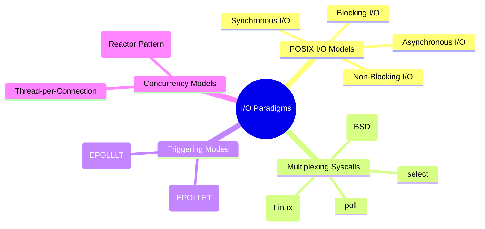

# 3.0.2. IO Multiplexing and Event-Driven Concurrency

> [!info] Note Orientation
> This note explores how operating systems handle high-concurrency workloads. We analyze the four core I/O paradigms defined by POSIX, trace the evolution of I/O multiplexing system calls from historical select/poll to modern O(1) engines like Linux epoll and BSD kqueue, compare Edge-Triggered and Level-Triggered signaling, and contrast Thread-per-Connection architectures with Event Loops.

---

## 1. The Four Core I/O Paradigms (POSIX)

Understanding how application space and kernel space interact during an I/O operation requires a strict distinction between **Blocking/Non-blocking** and **Synchronous/Asynchronous** paradigms. Under POSIX definitions, an I/O operation is split into two phases:
1. **Waiting Phase:** Waiting for the hardware (NIC, disk) to receive/buffer the data.
2. **Copying Phase:** Copying the buffered data from kernel space memory to application/user space memory.



### 1. Blocking I/O
* **Phase 1 (Waiting):** The thread invokes a system call (e.g., `recv()`). Execution halts; the thread is placed into a sleep state by the kernel scheduler.
* **Phase 2 (Copying):** Once data arrives at the network card, the kernel copies it into user space. The thread is awakened and execution resumes.
* **Property:** Simple to program, but ties up an entire thread for the duration of the network delay.

### 2. Non-Blocking I/O
* **Phase 1 (Waiting):** The thread invokes `recv()` on a non-blocking socket. If no data has arrived, the system call returns immediately with a `-1` and sets `errno` to `EAGAIN` or `EWOULDBLOCK`.
* **Phase 2 (Copying):** If data is present, the kernel copies it to user space and returns the read length.
* **Property:** The application must repeatedly check (poll) the socket's status in a loop (busy-waiting), which wastes substantial CPU cycles if not paired with multiplexing.

### 3. Synchronous I/O
* **Definition:** Any I/O model where the calling thread is blocked *during the copying phase* (Phase 2), as the CPU moves data from kernel space to user space memory.
* **Classification:** Blocking, Non-Blocking, and I/O Multiplexing are all subcategories of **Synchronous I/O**, because once data is ready, the application thread itself blocks to perform the `read()` or `recv()` system call.

### 4. Asynchronous I/O (True AIO)
* **Definition:** The application initiates an I/O operation (e.g., via POSIX `aio_read()` or modern Linux `io_uring`) and provides a target buffer in user space. The system call returns *instantly*.
* **Execution:** The kernel performs both Phase 1 (waiting) and Phase 2 (copying) completely in the background. Once the user buffer is fully populated, the kernel notifies the application via a signal or a completion queue.
* **Property:** The calling thread never blocks for any phase of the I/O operation.

---

## 2. The Evolution of I/O Multiplexing

I/O multiplexing solves a fundamental problem: how can a single thread monitor thousands of sockets simultaneously without busy-waiting?

### 1. `select()` (POSIX.1g)
* **Mechanism:** The application creates three bit arrays (`fd_set`), representing descriptors to watch for reading, writing, and exceptions. It passes these sets to `select(nfds, readfds, writefds, exceptfds, timeout)`.
* **The $O(N)$ Copying Penalty:** Every time `select()` is called, the application must copy all three bit arrays from user space to kernel space. The kernel modifies the arrays in-place to indicate ready descriptors, forcing the application to copy them back and parse them.
* **The $O(N)$ Scanning Penalty:** Once `select()` returns, the kernel does not specify *which* descriptors are ready. The application must iterate through every descriptor up to `nfds` using `FD_ISSET` to detect active streams.
* **The `FD_SETSIZE` Limit:** The system bitmask size is hardcoded in the kernel headers (typically `1024` on Linux). A single `select()` call cannot monitor more than 1024 file descriptors, making it unsuitable for modern, high-concurrency web servers.

### 2. `poll()` (System V)
* **Mechanism:** Eliminates the static 1024 limit by replacing bit arrays with a dynamically sized array of `struct pollfd`:
  ```c
  struct pollfd {
      int fd;        // File descriptor to watch
      short events;  // Requested events (POLLIN, POLLOUT)
      short revents; // Returned events (set by kernel)
  };
  ```
* **Comparison to `select()`:**
  * **Improvement:** Solves the arbitrary socket limit by using a pointer to an array of structs.
  * **Persistent Flaws:** Still copies the entire array between user and kernel space on every call ($O(N)$ data transfer), and still requires a complete loop over the array to locate ready file descriptors after returning ($O(N)$ lookup cost).

### 3. `epoll` (Linux 2.6+)
`epoll` completely re-engineers I/O multiplexing by shifting the state management into kernel space, achieving **$O(1)$ scaling performance**.

* **Step 1: Epoll Instance Creation (`epoll_create1`)**
  * The kernel creates an internal epoll instance represented by a file descriptor.
  * Inside kernel memory, it allocates two structures:
    * **The Interest List (Red-Black Tree):** A balanced search tree (specifically a red-black tree) that stores all file descriptors the application wants to monitor. It provides efficient insertion, deletion, and lookup ($O(\log N)$ scaling).
    * **The Ready List (Doubly Linked List):** A list containing only the file descriptors that have received network events and are ready for immediate read/write operations.

* **Step 2: Modifying Interest (`epoll_ctl`)**
  * To add, modify, or remove file descriptors, the application calls `epoll_ctl(epfd, op, fd, event)`.
  * The kernel updates the Red-Black tree. Unlike `select()` or `poll()`, the list of watched descriptors is persisted in the kernel. The application only sends changes, eliminating the need to copy the entire descriptor set on every monitor cycle.

* **Step 3: Waiting for Events (`epoll_wait`)**
  * The application calls `epoll_wait(epfd, events, maxevents, timeout)`.
  * The kernel checks the Ready List (linked list).
    * If the list is empty, the call blocks (or respects the timeout).
    * If descriptors are present, the kernel copies *only the ready descriptors* into the user-allocated `events` array.
  * **Performance Win:** `epoll_wait()` returns in $O(1)$ time relative to the total number of connections. If there are 100,000 active sockets but only 5 receive data, `epoll_wait()` returns instantly with an array of length 5. No scanning of inactive sockets is required.

### 4. `kqueue` (BSD / macOS)
`kqueue` is BSD’s equivalent to `epoll`, operating on similar $O(1)$ principles but utilizing `kevent` structures.
* **Generality:** While `epoll` is specifically designed for file/socket descriptors, `kqueue` is a highly generic event notification system. It can monitor sockets, files (directory changes), system signals, process lifecycles, and high-resolution hardware timers using unified "event filters."

---

## 3. Triggering Modes: Level-Triggered vs. Edge-Triggered

Multiplexers (like `epoll` or `kqueue`) can notify applications about events in two distinct modes: **Level-Triggered (LT)** and **Edge-Triggered (ET)**.

```
Buffer state: Empty ----> Data Arrives (50 bytes) ----> Read 20 bytes ----> Read 30 bytes
Level-Triggered:                  [TRIGGER]                 [TRIGGER]              (Quiet)
Edge-Triggered:                   [TRIGGER]                  (Quiet)               (Quiet)
```

### Level-Triggered (LT)
* **Behavior:** The default mode. `epoll_wait()` will repeatedly report a file descriptor as "ready" as long as the underlying event condition remains true.
* **Example:** If 100 bytes arrive on a socket, `epoll_wait()` triggers. The application reads 40 bytes. On the next call to `epoll_wait()`, the kernel will trigger *again* because 60 bytes remain unread in the receive buffer.
* **Pros:** Highly robust and forgiving. If a thread fails to read all available data, it will be notified on the next pass, preventing stalled reads.
* **Cons:** High system call overhead in high-throughput applications, as the kernel repeatedly monitors and reports sockets that still contain data.

### Edge-Triggered (ET / `EPOLLET`)
* **Behavior:** Triggers *only once* when the state of the watched file descriptor transitions from "not ready" to "ready." It will not trigger again for that event until the descriptor undergoes another state transition.
* **Example:** 100 bytes arrive. `epoll_wait()` triggers. The application reads 40 bytes and then calls `epoll_wait()` again. The call will block indefinitely, even though 60 bytes remain in the buffer, because no new data has arrived to trigger a new edge transition.
* **The Non-Blocking Requirement:** Edge-triggered sockets **must** be set to non-blocking mode.
* **The Loop-Until-EAGAIN Protocol:** When notified of an edge event, the application must execute a loop reading or writing data until the system call returns `-1` with `errno` set to `EAGAIN` or `EWOULDBLOCK`. This guarantees the buffer is completely drained and ensures future edge transitions will be detected correctly.
* **Pros:** Minimizes kernel-to-user context switches and system call overhead, offering maximum performance under heavy loads.
* **Cons:** Complex to implement safely; any logic gap that leaves unread data in a buffer can permanently stall that connection's event pipeline.

---

## 4. Thread-per-Connection vs. Event Loop Architectures

The selection of I/O system calls dictates the entire concurrency architecture of a backend server.

| Dimension | Thread-per-Connection (e.g., Tomcat, Gunicorn Sync) | Event Loop / Reactor Pattern (e.g., Node.js/libuv, Nginx) |
| :--- | :--- | :--- |
| **Concurrency Model** | Multithreading / Multi-processing. | Single execution thread utilizing I/O Multiplexing. |
| **Memory Footprint** | **High:** Each thread allocates a dedicated stack (typically 2MB–10MB). 5,000 threads can require 10GB–50GB of RAM just for stack allocation. | **Extremely Low:** A single thread handles execution. Minimal memory allocated per connection (only socket metadata and buffer states). |
| **CPU Overhead** | **High:** Heavy context switching. The OS kernel must repeatedly save register states, swap CPU page tables, and invalidate instruction caches. | **Minimal:** Zero context switching for I/O operations, as execution never leaves the primary event loop thread. |
| **I/O Strategy** | Synchronous, blocking system calls. | Synchronous non-blocking system calls managed by a multiplexer (`epoll`/`kqueue`). |
| **Limiting Factor** | Thread stack memory and OS thread scheduling limits. | CPU-bound computation. If a single request blocks the event loop with heavy math, all other connections are blocked. |

---

## 5. Tips, Tricks and Common Pitfalls

* **Starvation in Edge-Triggered Event Loops:**
  * In an edge-triggered loop, if you process a single active socket until it returns `EAGAIN` while it continuously receives a stream of incoming data, you can starve all other ready sockets in the queue.
  * **Mitigation:** Implement a limit on the number of consecutive reads per socket (a "fairness budget") before moving to other connections or yielding back to the event loop.

* **The EPOLLEXCLUSIVE Flag:**
  * When multiple worker threads or processes call `epoll_wait()` on the same shared listening socket, a single incoming connection can wake up *all* workers, even though only one can successfully call `accept()`. This is known as the **Thundering Herd Problem**.
  * **Solution:** On Linux 4.5+, use the `EPOLLEXCLUSIVE` flag in `epoll_ctl` to ensure the kernel only wakes up a single worker process/thread, preventing CPU waste.

---

## See Also

* [[3.0.1. Socket Abstractions and BSD Sockets API]] — The foundation of file descriptors and address structures.
* [[3.0.4. Gateway Interfaces and Web Server Runtimes]] — How the Node.js event loop maps onto libuv.
* [[3.1.6. Express Middleware Architecture]] — Chaining asynchronous execution in Node.js.

## References

* Love, R. (2013). *Linux System Programming: Talking Directly to the Kernel and C Library*. O'Reilly Media.
* Gamiel, A. (2016). *Event-Driven Architecture: Active Middleware and Event-Driven Concurrency*. Wiley.
* `epoll(7)` — Linux Man Pages.
