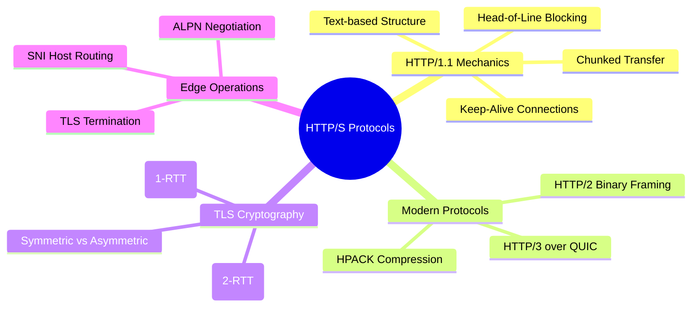

# 3.0.3. HTTP and HTTPS Protocol Mechanisms

> [!info] Note Orientation
> This note traces the mechanics of the web’s core application protocols. We analyze the textual layout and connection constraints of HTTP/1.1, examine the binary multiplexing of HTTP/2 and the UDP-based architecture of HTTP/3, dissect the cryptographic handshakes of TLS 1.2 and 1.3, and explore edge security patterns like TLS Termination and SNI.

---

## 1. HTTP/1.1: Syntax, Persistent Connections, and Limits

HTTP/1.1 (RFC 2616) is a stateless, text-based, request-response protocol operating at the application layer of the OSI model.



### Request and Response Structure
HTTP/1.1 requests and responses are transmitted across network sockets as plain ASCII text, delimited by carriage return and line feed characters (`\r\n`, or CRLF).

An HTTP/1.1 **Request** consists of:
1. **Request Line:** `Method Path Version\r\n` (e.g., `GET /index.html HTTP/1.1\r\n`).
2. **Headers:** Key-value pairs separated by colons (e.g., `Host: example.com\r\n`).
3. **Empty Line:** A single `\r\n` indicating the end of the headers block.
4. **Optional Message Body:** The raw payload (JSON, form data, binary).

An HTTP/1.1 **Response** consists of:
1. **Status Line:** `Version StatusCode StatusPhrase\r\n` (e.g., `HTTP/1.1 200 OK\r\n`).
2. **Headers:** Metadata regarding the payload (e.g., `Content-Type: application/json\r\n`).
3. **Empty Line:** A single `\r\n`.
4. **Message Body:** The returned payload.

### Framing and Transfer-Encoding
To read a dynamic response body safely, a client must know where the payload ends.
* **`Content-Length`:** A header specifying the exact size of the payload in bytes. While simple, it requires the server to buffer the entire response in memory before sending it, in order to calculate the byte length.
* **`Transfer-Encoding: chunked`:** Solves the buffering problem. The server streams the response in sequential "chunks." Each chunk begins with a hexadecimal number indicating the chunk's size in bytes, followed by CRLF, the chunk's raw data, and another CRLF. The stream is terminated by a chunk of size `0` followed by an empty line (`0\r\n\r\n`). This allows servers to stream large databases or dynamic templates directly to the socket as they are generated.

### Persistent Connections (`Keep-Alive`)
In early HTTP/1.0, every request required opening a new TCP connection, performing the three-way handshake, sending the request, receiving the response, and calling `close()`. For a webpage with 50 images, this required 50 separate handshakes.

HTTP/1.1 introduced **Persistent Connections** by default. Sockets remain open after a response completes, allowing subsequent requests to reuse the same established TCP connection. This is governed by the `Connection: keep-alive` header. The connection is kept open until a timeout (e.g., `KeepAliveTimeout` in Nginx) or a maximum request limit is reached, saving substantial CPU cycles and network round-trips.

### The Head-of-Line (HOL) Blocking Problem
While HTTP/1.1 supports reusing a connection, it enforces strict FIFO (First-In, First-Out) ordering: the server *must* send responses in the exact order requests were received.
* **The Pitfall:** If a client requests `style.css` followed by `slow-api-query`, and then `image.png` over a single connection, the server must process and send the CSS, then process the slow API. Even if `image.png` is cached and ready to send instantly, its transmission is blocked waiting for the slow API query to complete. This is known as **Application-Layer Head-of-Line Blocking**.

---

## 2. HTTP/2 and HTTP/3: Performance Revolutions

To bypass the structural limits of HTTP/1.1, the IETF developed two major protocol evolutions.

### HTTP/2 (Binary Framing and Streams)
HTTP/2 (RFC 7540) preserves HTTP's semantic methods and status codes but completely alters how data is framed and transported over TCP.

* **Binary Framing Layer:** Replaces the textual formatting of HTTP/1.1 with lightweight binary "frames." Headers and data are packed into distinct, typed binary frames (e.g., `HEADERS` frames, `DATA` frames) that are fast to parse and immune to string parsing vulnerabilities.
* **Multiplexing via Streams:** A single TCP connection is split into multiple bidirectional logical pathways called **Streams**. Frames from different streams can be interleaved concurrently across the single connection. This means a slow API request on stream 3 will not block a CSS download on stream 5; both run in parallel, completely resolving HTTP/1.1's application-layer Head-of-Line blocking.
* **HPACK Header Compression:** Since HTTP headers are highly repetitive (e.g., `User-Agent`, `Cookie`), HPACK compresses them using static and dynamic tables. The client and server track previously sent headers and transmit only index numbers or huffman-compressed differences, cutting down header sizes by up to 90%.

### HTTP/3 (QUIC over UDP)
While HTTP/2 resolved application-layer HOL blocking, it introduced a new bottleneck at the transport layer: **TCP Head-of-Line Blocking**.
* If a single TCP packet carrying data for stream 3 is lost in transit, the operating system kernel blocks *all* streams on that connection while it waits for the retransmission of the lost packet, as TCP must guarantee a strictly ordered stream.

HTTP/3 solves this by migrating from TCP to **QUIC (Quick UDP Internet Connections)**, running over **UDP**.
* **Stream-Level Independence:** QUIC handles packet retransmission at the individual stream level. If a packet for stream 3 is lost, the OS kernel continues delivering packets for streams 5, 7, and 9 to the application without interruption. Only stream 3 is paused.
* **Zero-RTT Handshake:** QUIC combines transport (connection setup) and cryptographic (TLS 1.3) handshakes into a single round-trip. On repeat connections, clients can use cached tokens to send encrypted data on the very first packet (0-RTT), eliminating handshake latency entirely.
* **Connection Migration:** QUIC identifies connections using a unique **Connection ID** rather than the standard IP/Port 4-tuple. This allows a user to migrate seamlessly from a Wi-Fi connection to a cellular data network without dropping active downloads or having to re-authenticate.

---

## 3. Cryptographic Handshakes: TLS 1.2 vs. TLS 1.3

HTTPS is simply HTTP running inside a cryptographically secure wrapper: **TLS (Transport Layer Security)**. TLS secures connections using asymmetric (public key) cryptography to negotiate a shared key, and symmetric cryptography to encrypt the subsequent traffic.

### TLS 1.2 Handshake (2 Round-Trips / 2-RTT)
```
Client                                      Server
ClientHello (Supported Ciphers) ------->
                                       <------- ServerHello (Selected Cipher + Certificate)
[Key Exchange Generation]
ClientKeyExchange --------------------->
[ChangeCipherSpec]                       <------- [ChangeCipherSpec]
[Encrypted Session Starts]
```
1. **ClientHello:** Client sends its supported TLS versions, a list of cipher suites, and a random number ($C_{rand}$).
2. **ServerHello + Certificate:** Server selects the highest mutually supported TLS version and cipher suite, sends its SSL/TLS certificate containing its public key, and a random number ($S_{rand}$).
3. **Key Exchange:** The client verifies the certificate against its trust store. It generates a pre-master secret, encrypts it with the server's public key, and sends it to the server (`ClientKeyExchange`).
4. **Key Derivation:** Both parties use the pre-master secret along with $C_{rand}$ and $S_{rand}$ to derive identical symmetric session keys. They signal the transition to encrypted mode (`ChangeCipherSpec`).

### TLS 1.3 Handshake (1 Round-Trip / 1-RTT)
TLS 1.3 (RFC 8446) overhauled this process by removing deprecated, insecure cryptographic algorithms and drastically reducing handshake latency.
```
Client                                      Server
ClientHello + KeyShare (Guess) -------->
                                       <------- ServerHello + KeyShare + Certificate + Finished
[Encrypted Session Starts]
```
1. **Speculative Key Share:** The client assumes a modern key-exchange algorithm (typically elliptic-curve Diffie-Hellman, ECDHE) and sends its public key share *inside the initial ClientHello*.
2. **Immediate Derivation:** The server selects the cipher, uses the client’s public share to calculate the shared symmetric key, and returns its server key share, certificate, and a cryptographically finished verification block in a single round-trip.
3. **Symmetric Encryption:** The handshake completes in 1-RTT, after which encrypted application data is sent.

---

## 4. Edge Routing & Deployment: SNI, ALPN, and TLS Termination

Deploying secure architectures in production requires careful configuration of several TLS extensions.

### Server Name Indication (SNI)
Historically, the server had to present its SSL/TLS certificate *before* receiving the HTTP request headers.
* **The Problem:** If a server had a single public IP address hosting three separate domains (`domain-a.com`, `domain-b.com`, `domain-c.com`), the web server had no way of knowing which domain the client was connecting to during the TLS handshake, making it impossible to present the correct certificate.
* **The Solution:** **SNI (Server Name Indication)** adds the target hostname (e.g., `Host: domain-a.com`) to the unencrypted `ClientHello` packet of the TLS handshake. This allows Nginx or an HAProxy load balancer to select and present the correct SSL certificate before initiating the secure tunnel.

### Application-Layer Protocol Negotiation (ALPN)
ALPN is a TLS extension that allows the client and server to negotiate which application protocol (HTTP/1.1 vs HTTP/2) they will use *within the TLS handshake itself*.
* During the `ClientHello`, the client includes a list of supported protocols (e.g., `h2`, `http/1.1`).
* The server selects the protocol and returns its choice inside the `ServerHello`. This prevents having to perform a separate HTTP `Upgrade` round-trip after the TLS handshake completes.

### TLS Termination at the Edge
A common production architecture is to offload the expensive cryptographic calculations of TLS encryption and decryption onto dedicated edge servers (reverse proxies like Nginx, HAProxy, or cloud load balancers).

```
Client === [ HTTPS / Encrypted ] ===> [ Nginx Edge ] --- [ HTTP / Plain ] ---> [ App Server ]
                                      (Terminates TLS)                          (Express / Flask)
```

* **The Setup:** The edge proxy handles SNI, cert renewals, and terminates the secure HTTPS connection. It then forwards the decrypted HTTP traffic to the backend application servers (Express, Flask, Spring Boot) over a secure, private network segment (LAN).
* **The Benefits:**
  * Application code remains simple and focused on business logic, avoiding the overhead of managing local certificate paths.
  * Private network round-trips are extremely fast, freeing up application server CPU cycles.
* **Security Warning:** The connection between the edge proxy and the application server is unencrypted. You must guarantee this private network segment is fully isolated and untrusted nodes cannot sniff local traffic.

---

## See Also

* [[3.0.1. Socket Abstractions and BSD Sockets API]] — Sockets as the underlying mechanism for HTTP.
* [[3.0.4. Gateway Interfaces and Web Server Runtimes]] — Mapping incoming HTTP requests to application interfaces.
* [[3.1.5. Query Parameters and Request Object]] — Reading HTTP parameters in Express.

## References

* Fielding, R., & Reschke, J. (2014). *Hypertext Transfer Protocol (HTTP/1.1): Message Syntax and Framing*. RFC 7230.
* Belshe, M., Peon, R., & Thomson, M. (2015). *Hypertext Transfer Protocol Version 2 (HTTP/2)*. RFC 7540.
* Rescorla, E. (2018). *The Transport Layer Security (TLS) Protocol Version 1.3*. RFC 8446.
