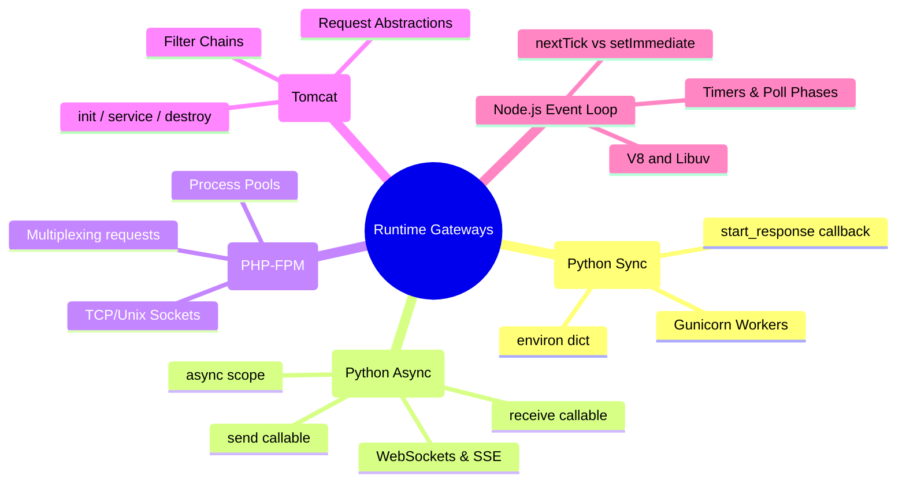

# 3.0.4. Gateway Interfaces and Web Server Runtimes

> [!info] Note Orientation
> This note bridges the gap between raw web servers (like Nginx, Apache) and backend application runtimes. We dissect the structural contracts of WSGI (Python Sync), ASGI (Python Async), FastCGI (PHP-FPM), Java Servlets (Tomcat), and Node.js’s Libuv-backed Event Loop, examining the execution models and protocol boundaries that power modern dynamic web services.

---

## 1. WSGI (PEP 3333): Synchronous Python Gateway

The **Web Server Gateway Interface (WSGI)** is a synchronous standard designed to decouple Python web frameworks (like Flask or Django) from web servers (like Apache, Nginx, or Gunicorn).



### The WSGI Design Contract
A WSGI application is a simple, synchronous, callable Python object (usually a function or a class method) that accepts exactly two arguments:

```python
def application(environ, start_response):
    status = '200 OK'
    response_headers = [('Content-Type', 'text/plain')]
    start_response(status, response_headers)
    return [b"Hello, World!"]
```

* **`environ`:** A standard Python dictionary containing CGI-style environment variables populated by the server. This includes request parameters like `PATH_INFO`, `REQUEST_METHOD`, `QUERY_STRING`, HTTP headers (e.g., `HTTP_USER_AGENT`), and server configuration variables (e.g., `wsgi.input`, a stream used to read the request body).
* **`start_response`:** A callable supplied by the WSGI server. The application invokes this callback with the HTTP status string and response headers before returning the response body.
* **Return Value:** An iterable yielding byte strings, allowing the server to stream the response chunks back to the client immediately.

### Execution Constraints
* **Synchronous Threading Model:** WSGI is fundamentally synchronous. If an application service calls a slow external API, the worker thread executing that callable blocks completely until the network request returns.
* **Scaling Strategy:** To handle concurrency, WSGI servers (like Gunicorn) run as pre-forked worker pools, spawning multiple operating system worker processes or thread pools. This model suffers from high memory consumption and context-switching overhead under heavy, long-lived connection loads (like WebSockets).

---

## 2. ASGI: Asynchronous Python Gateway

To support modern, asynchronous networking (WebSockets, HTTP/2, Server-Sent Events) in Python, the community developed **ASGI (Asynchronous Server Gateway Interface)**, which supersedes WSGI.

### The ASGI Design Contract
An ASGI application is an asynchronous callable that accepts three arguments:

```python
async def app(scope, receive, send):
    if scope['type'] == 'http':
        await send({
            'type': 'http.response.start',
            'status': 200,
            'headers': [[b'content-type', b'text/plain']]
        })
        await send({
            'type': 'http.response.body',
            'body': b"Hello, Asynchronous World!",
            'more_body': False
        })
```

* **`scope`:** A dictionary containing metadata about the current connection. Crucially, `scope` persists across the entire lifetime of the connection, containing details like the protocol type (`http` vs `websocket`), client IP, path, headers, and query parameters.
* **`receive`:** An asynchronous callable that the application uses to receive incoming event messages from the client. For HTTP, this yields chunks of the request body. For WebSockets, this yields incoming text or binary frames.
* **`send`:** An asynchronous callable that the application uses to dispatch outgoing event messages back to the server (and onward to the client).

### Execution Advantages
* **Native Async I/O:** ASGI is built to run on an event loop (using Python's `asyncio`). Workers handle thousands of concurrent, long-lived connections (like WebSockets) on a single thread using cooperative multitasking, resolving the thread-exhaustion limits of WSGI.

---

## 3. CGI, FastCGI, and PHP-FPM

The evolution of PHP execution models traces the history of web application performance optimization.

### Common Gateway Interface (CGI)
* **The Legacy Model:** For every incoming HTTP request, the web server forks a brand-new operating system process, loads the PHP interpreter executable, compiles the target `.php` script, executes it, returns the output, and terminates the process.
* **The Bottleneck:** Extremely high CPU overhead. Spawning thousands of processes per second exhausts system resources, making CGI entirely non-viable for modern web traffic.

### FastCGI
* **The Re-engineering:** FastCGI solves CGI's overhead by keeping application worker processes alive persistently. The web server communicates with a persistent FastCGI daemon over a local TCP socket or a Unix domain socket, passing requests and receiving responses using a lightweight binary protocol.

### PHP-FPM (FastCGI Process Manager)
PHP-FPM is the standard, production-ready FastCGI implementation for PHP. It manages a master process and pools of worker processes.

```
Nginx ---> [ Unix Socket ] ---> [ FPM Master Process ] ---> [ Worker Process ]
                                                            (Persistent Pool)
```

* **Process Management Modes:**
  * **Static:** Spawns a fixed number of worker processes (`pm.max_children`). Best for dedicated database-backed application nodes with predictable resource allocations.
  * **Dynamic:** Spawns a baseline pool of workers and dynamically scales them up/down based on traffic limits (`pm.start_servers`, `pm.min_spare_servers`, `pm.max_spare_servers`).
  * **On-Demand:** Spawns zero workers on idle; worker processes are only created when an HTTP request actively arrives on the FastCGI socket (`pm.process_idle_timeout`). Excellent for shared hosting or development servers, but introduces slight cold-start latencies.

---

## 4. Java Servlet Specification

In the Java enterprise ecosystem, **Servlets** define the standard execution contract for handling HTTP requests inside a **Servlet Container** (such as Apache Tomcat or Eclipse Jetty).

### Servlet Lifecycle
A servlet is a Java class that implements the `javax.servlet.Servlet` interface. Its execution is governed by a well-defined lifecycle managed by the container:
1. **`init()`:** Executed once when the servlet container loads and instantiates the servlet instance (e.g., at boot time or on first access). Used to initialize database pools or shared configuration.
2. **`service(ServletRequest, ServletResponse)`:** Invoked for every incoming request. The container assigns a thread from its connection pool to execute this method, which dispatches requests to method-specific handlers (`doGet()`, `doPost()`).
3. **`destroy()`:** Executed once when the container unloads the servlet (e.g., during a graceful shutdown), allowing the application to release resources and close database connections.

### Filter Chains (Intercepting Filter Pattern)
Servlets utilize **Filters** to handle cross-cutting concerns (authentication, compression, request logging).
* Filters are chained sequentially. Each filter implements `doFilter(request, response, filterChain)`.
* A filter can intercept the request, inspect it, modify headers, and either pass control to the next filter in the chain via `filterChain.doFilter(request, response)` or halt the request entirely by writing directly to the response and omitting the chain invocation. This is the direct architectural predecessor to the modern Middleware patterns found in Node.js and Flask.

---

## 5. Node.js Event Loop Architecture

Node.js executes JavaScript on a single thread using the V8 engine, but achieves highly concurrent, non-blocking I/O by delegating blocking operations to **libuv**, a multi-platform C library that wraps OS-level asynchronous primitives.

```
       [ Microtasks: process.nextTick & Promises resolved here ]
                                 |
                                 v
     +-------------------------------------------------------+
     |   1. TIMERS (setTimeout, setInterval callbacks)        |
     +-------------------------------------------------------+
                                 |
     +-------------------------------------------------------+
     |   2. PENDING CALLBACKS (TCP errors, etc.)             |
     +-------------------------------------------------------+
                                 |
     +-------------------------------------------------------+
     |   3. POLL (Calculate block time, execute I/O, wait)   |
     +-------------------------------------------------------+
                                 |
     +-------------------------------------------------------+
     |   4. CHECK (setImmediate callbacks)                   |
     +-------------------------------------------------------+
                                 |
     +-------------------------------------------------------+
     |   5. CLOSE CALLBACKS (socket.on('close'), etc.)       |
     +-------------------------------------------------------+
```

### The Libuv Thread Pool
While the main execution loop is single-threaded, libuv maintains a dedicated helper thread pool (default size of `4`, configurable via `UV_THREADPOOL_SIZE`).
* **Non-Blocking OS Operations:** Network sockets are handled natively and asynchronously by libuv using OS multiplexers (`epoll`, `kqueue`). They do *not* consume thread pool threads.
* **Thread Pool Delegations:** Operations that are blocking or have poor OS-level async support (such as filesystem access `fs.*`, DNS resolutions, and cryptographic math `crypto.*` like bcrypt hashing) are dispatched to the libuv thread pool. Once a thread pool thread completes the blocking task, it notifies the main thread, pushing the callback onto the event loop queue.

### Event Loop Phases
The event loop processes tasks in a series of distinct phases, executed sequentially in a continuous circle:

1. **Timers Phase:** Executes callbacks scheduled by `setTimeout()` and `setInterval()` whose timers have expired.
2. **Pending Callbacks Phase:** Executes I/O callbacks deferred from the previous loop iteration (such as certain TCP connection errors).
3. **Poll Phase:** Calculates how long the event loop should block waiting for new I/O events, then retrieves and executes ready I/O callbacks. If no timers are pending and the queue is empty, the loop may block here waiting for new packets to arrive on monitored sockets.
4. **Check Phase:** Executes callbacks registered with `setImmediate()`.
5. **Close Callbacks Phase:** Handles cleanup operations, executing close event callbacks (e.g., `socket.on('close')`).

### Microtasks: `process.nextTick()` and Promises
In Node.js, there are two special asynchronous queues that do *not* belong to any specific loop phase: the **nextTick queue** and the **microtask queue** (used for resolved Promises).
* **Execution Priority:** These queues are processed with the absolute highest priority. The event loop will pause between any phase of the loop and drain the nextTick queue and Promise microtask queue completely before resuming the standard loop phases.
* **The Event-Loop Freeze Pitfall:** If you write a recursive function that repeatedly calls `process.nextTick()`, Node will loop on the tick queue indefinitely, preventing the event loop from ever advancing to the Poll phase. This completely freezes the application's ability to process new socket I/O.

---

## See Also

* [[3.0.2. IO Multiplexing and Event-Driven Concurrency]] — The operating system layer beneath libuv.
* [[3.1.6. Express Middleware Architecture]] — Node's HTTP pipeline implementation.
* [[3.2.2. Project Structure]] — Flask’s WSGI runtime entrypoint.

## References

* Python Software Foundation, "PEP 3333 — Python Web Server Gateway Interface v1.0.1", https://peps.python.org/pep-3333/
* Django Software Foundation, "ASGI Specification", https://asgi.readthedocs.io/
* Node.js Foundation, "The Node.js Event Loop, Timers, and process.nextTick()", https://nodejs.org/en/guides/event-loop-timers-and-nexttick/
