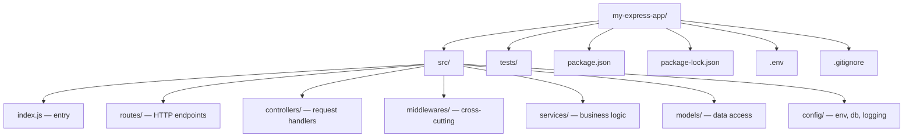

# 3.1.1. Installing Express.js

> [!info] Orientation
> This note walks through everything required to bootstrap an Express.js project from an empty directory: verifying the Node.js runtime, initializing `package.json`, installing Express and its development dependencies, and laying out the conventional folder structure that scales from a single-file demo to a production service.

## 1. Prerequisites: Node.js and npm

Express.js is a thin layer over Node.js's built-in `http` module, so before installing anything you need a supported Node.js runtime on your machine. The official recommendation is to install the **LTS (Long Term Support)** release from `https://nodejs.org`, because the LTS line receives bug fixes for thirty months and is what every major cloud provider and Linux distribution ships. Avoid chasing the "Current" release for production work unless you need a specific new feature, since npm packages occasionally lag behind the newest V8 engine changes by a few weeks.

After installation, verify both binaries are on your `PATH`. The `node` binary runs JavaScript files and exposes the V8 engine, while `npm` is the package manager that resolves and installs dependencies from the public registry at `registry.npmjs.org`. Run both version checks before doing anything else; if either fails you most likely need to add Node's install directory to your shell's PATH variable or restart the terminal.

```bash
node --version
npm --version
```

```text
v20.11.0
10.2.4
```

A node version of `v20.x` or higher is what you want for new Express work. Anything older than `v18` is past end-of-life and will not receive security patches, which matters because Express passes raw HTTP traffic into V8 and a stale runtime exposes the whole service to known CVEs. If you work on multiple Node projects with different version requirements, install `nvm` (Node Version Manager) or `fnm` so each project can pin its own Node version via a `.nvmrc` file.

## 2. Initializing the Project

Every Node.js project begins with a `package.json` manifest. This file declares the project name and version, lists runtime and development dependencies, defines executable `scripts`, and tells Node whether to load source files as CommonJS or ECMAScript modules. The fastest way to scaffold one is `npm init -y`, which accepts every default prompt and writes a minimal manifest you can edit later.

```bash
mkdir my-express-app
cd my-express-app
npm init -y
```

The default manifest is functional but bare. Three fields deserve immediate attention. `main` tells Node which file to execute when another package imports this one as a library; for an application rather than a library it is mostly cosmetic but should still point at your entry file. `scripts` is an object of named shell commands that you invoke with `npm run <name>`, and it is the canonical place to wire up `dev`, `start`, `test`, and `lint` shortcuts. `type` controls the module system: leaving it unset (or set to `"commonjs"`) keeps the classic `require`/`module.exports` semantics, while setting it to `"module"` opts into ES module syntax with `import`/`export` and a slightly different file resolution algorithm.

```json
{
  "name": "my-express-app",
  "version": "1.0.0",
  "type": "module",
  "main": "src/index.js",
  "scripts": {
    "dev": "nodemon src/index.js",
    "start": "node src/index.js"
  }
}
```

The choice between CommonJS and ESM is not purely stylistic. Some older middleware packages only ship CommonJS, and importing them from an ESM project requires the awkward `createRequire` workaround. For brand-new projects in 2024 and later, ESM is the safer long-term bet because the Node ecosystem is actively migrating and the syntax matches what bundlers and TypeScript emit by default. Just be aware that `__dirname` and `__filename` are not defined in ESM; you reconstruct them with `import.meta.url`.

## 3. Installing Express

With the manifest in place, install Express as a runtime dependency. npm downloads the package tarball, expands it into `node_modules/express/`, recursively installs Express's own transitive dependencies into `node_modules/`, and writes the resolved version range into the `dependencies` block of `package.json`. It also writes a complete dependency tree snapshot into `package-lock.json`, which is what guarantees that the next developer or CI runner installs byte-identical versions of every nested package.

```bash
npm install express
```

```json
{
  "dependencies": {
    "express": "^4.19.2"
  }
}
```

The caret (`^`) in front of the version means "any 4.x release at or above 4.19.2". npm will accept patch and minor updates but never a major bump, which protects you from breaking changes in Express 5 while still picking up security patches. If you want absolute reproducibility across machines, commit `package-lock.json` to version control. If you want even stricter pinning, run `npm install express --save-exact` and the caret is replaced with an exact version string.

## 4. Development Dependencies

Hot-reloading during development saves enormous amounts of time. `nodemon` watches your source files and restarts the server automatically whenever something changes, so you do not have to manually kill and relaunch the process after every edit. It is installed as a **dev dependency** because it has no role at runtime in production, and marking it as such keeps it out of the install tree when you run `npm install --omit=dev` in a Docker build stage.

```bash
npm install --save-dev nodemon
```

After installation the `devDependencies` block appears alongside `dependencies` in `package.json`, and the `dev` script wired up in section 2 becomes runnable as `npm run dev`. Other common dev dependencies you will reach for early are `eslint` and `prettier` for linting and formatting, `jest` or `vitest` for tests, and `supertest` for HTTP-level integration tests against your Express app without actually binding a port.

## 5. Express 4 vs Express 5

Express 4 has been the stable default for a decade and is what `npm install express` resolves to at the time of writing. Express 5 entered release-candidate status in 2024 and is installable with `npm install express@5`. The headline changes in v5 are dropped support for Node older than 18, removal of several deprecated APIs (`app.del`, `req.param`), more rigorous path matching that drops the optional `?` and `*` wildcards in favor of named parameters, and built-in `Promise`/`async` support that calls `next(err)` automatically when an async handler rejects. For new greenfield projects targeting the long term, Express 5 is the right choice; for legacy codebases or projects that depend on middleware not yet v5-compatible, Express 4 remains safe and well-supported.

## 6. Project Layout Convention

A flat `index.js` file is fine for a tutorial, but a real service needs separation between transport (routes), business logic (controllers/services), data access (models), and cross-cutting concerns (middlewares). The layout below is the de facto convention in the Express community and matches what generators like `express-generator` produce, extended with a `services/` layer for business logic and a `config/` layer for environment-specific values.



The `src/` directory keeps application code separate from configuration and tests at the root. `routes/` contains thin files that map HTTP verbs and paths to controller functions, `controllers/` extracts data from `req` and shapes `res`, `services/` holds business rules that have no knowledge of HTTP, and `models/` talks to the database. `middlewares/` collects reusable functions like authentication, request logging, and error normalization. `config/` centralizes environment loading, database connection setup, and logger configuration so that no other file in the project reaches for `process.env` directly.

## 7. The .gitignore File

Never commit `node_modules/` to version control. It can easily contain tens of thousands of files and hundreds of megabytes, it is fully reproducible from `package.json` and `package-lock.json`, and committing it produces noisy diffs and broken merges. The minimal `.gitignore` for a Node/Express project also excludes build artifacts, environment files that contain secrets, and operating-system metadata.

```text
node_modules/
npm-debug.log*
.env
.env.*
!.env.example
dist/
coverage/
.DS_Store
*.log
```

The `.env` exclusion is critical: this is where database URLs, JWT secrets, and API keys live, and leaking them through a git push is one of the most common causes of cloud account compromise. Keep a checked-in `.env.example` with placeholder values so other developers know which variables the project expects, but never commit the real `.env` file itself.

## Summary

Installing Express is a five-minute exercise but the conventions you adopt during those five minutes follow you for the lifetime of the project. Verify Node and npm versions, scaffold with `npm init -y`, install Express as a runtime dependency and `nodemon` as a dev dependency, pin Node and module system explicitly, and lay out the project into `routes/`, `controllers/`, `middlewares/`, `services/`, `models/`, and `config/` from day one. Commit `package.json` and `package-lock.json` but never `node_modules/` or `.env`.

## See Also

- [[3.1.2. First App and Project Structure]]
- [[3.1.3. GET Routes and Routing]]
- [[3.1.6. Express Middleware Architecture]]
- [[6.1. Docker Containerization and Networking]]

## References

- Node.js Release Schedule — `https://github.com/nodejs/release#release-schedule`
- npm CLI documentation — `https://docs.npmjs.com/cli/v10/commands`
- Express 5 migration guide — `https://expressjs.com/en/guide/migrating-5.html`
