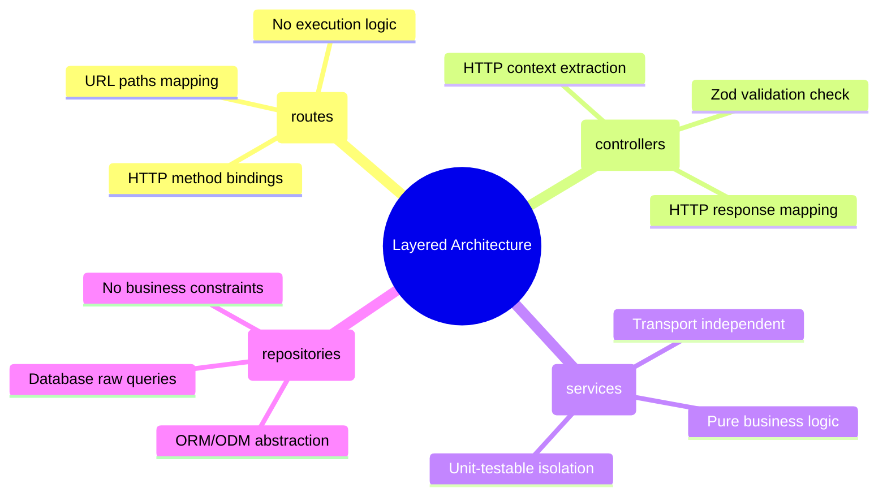

# 3.1.10. Express.js Layered Architecture and MVC

> [!info] Orientation
> In a minimalist framework like Express, project structure is not dictated by the framework itself. If left unmanaged, routing files bloat with complex database transactions, third-party calls, and output formatting. This note explores how to implement an industry-standard, layered application architecture to maintain strict Separation of Concerns, testability, and transport independence.

---

## 1. Why Layered Architecture?

Monolithic codebases where routing handlers query database pools, perform calculations, format dates, and send emails directly inside a single route function fail to scale. This is called the "Smart Route" anti-pattern.

By implementing a **Layered Architecture**, we break our server into distinct logical tiers. Each tier has a single responsibility and is strictly bounded:

1. **Routing Layer (`routes/`):** Maps incoming HTTP methods and URL paths to specific controllers.
2. **Controller Layer (`controllers/`):** Parses the HTTP context (extracting `req.body`, `req.query`, `req.params`), triggers the correct business logic service, maps return values, and formats the response (HTTP status, headers, JSON).
3. **Service Layer (`services/`):** The absolute core of your app. Contains pure business logic, calculations, domain-specific rules, and orchestration of other services (e.g., sending emails, fetching coordinates). **This layer should have zero knowledge of Express, HTTP request structures, or HTTP response details.**
4. **Data Access / Repository Layer (`repositories/` or `models/`):** Isolates database-specific queries (SQL/NoSQL). If you swap databases (e.g., moving from MongoDB to Postgres), only this layer changes.



---

## 2. Directory Layout Blueprint

Let's examine a standard directory layout that scales comfortably to hundreds of modules:

```text
src/
├── config/              # Centralized environment variable parsing and safety checks
│   └── database.js      # DB connection pools configuration
├── controllers/         # HTTP-specific request mapping & payload formatting
│   └── user.controller.js
├── middlewares/         # Custom authentication, logging, and rate-limiting
│   ├── auth.js
│   └── validate.js
├── models/              # Database models or ORM schemas (e.g. Prisma or Sequelize)
│   └── User.js
├── repositories/        # Database query abstractions
│   └── user.repository.js
├── routes/              # Declarative HTTP routers (no business logic)
│   └── user.routes.js
├── services/            # Pure, transport-independent business logic
│   └── user.service.js
├── app.js               # Global express configuration (middleware, routers mounting)
└── index.js             # Entry point (binds ports, configures cluster/cluster-workers)
```

---

## 3. Layer-by-Layer Implementation Code

Let's build a clean, end-to-end flow for registering a new user.

### A. Repository Layer
The Repository layer directly interacts with our database:

```javascript
// repositories/user.repository.js
import { UserDbModel } from '../models/User.js';

export class UserRepository {
  async findByEmail(email) {
    return await UserDbModel.findOne({ email });
  }

  async create(userData) {
    const user = new UserDbModel(userData);
    return await user.save();
  }
}
```

### B. Service Layer (Pure Logic)
The Service layer contains calculations and triggers secondary pipelines. It has no dependencies on `req` or `res`.

```javascript
// services/user.service.js
import bcrypt from 'bcrypt';

export class UserService {
  constructor(userRepository) {
    this.userRepository = userRepository;
  }

  async registerUser(username, email, rawPassword) {
    // 1. Business Invariant check
    const existing = await this.userRepository.findByEmail(email);
    if (existing) {
      const error = new Error('Email address already registered.');
      error.status = 409;
      throw error;
    }

    // 2. Cryptographic hashing
    const hashedPassword = await bcrypt.hash(rawPassword, 12);

    // 3. Persist to storage
    const newUser = await this.userRepository.create({
      username,
      email,
      password: hashedPassword,
    });

    // 4. Return pure domain entity (stripping credentials)
    return {
      id: newUser._id,
      username: newUser.username,
      email: newUser.email,
    };
  }
}
```

### C. Controller Layer (HTTP Specifics)
The Controller handles HTTP status mappings, calling the service, and error-catching:

```javascript
// controllers/user.controller.js
export class UserController {
  constructor(userService) {
    this.userService = userService;
  }

  register = async (req, res, next) => {
    try {
      const { username, email, password } = req.body;

      // Delegate pure task execution to Service Layer
      const registeredUser = await this.userService.registerUser(
        username,
        email,
        password
      );

      // Map to correct HTTP Status
      return res.status(201).json({
        status: 'success',
        data: { user: registeredUser }
      });
    } catch (err) {
      // Forward exceptions to centralized error middleware
      next(err);
    }
  };
}
```

### D. Routing Layer
The Routing file acts as a clean declarative map:

```javascript
// routes/user.routes.js
import { Router } from 'express';
import { UserController } from '../controllers/user.controller.js';
import { UserService } from '../services/user.service.js';
import { UserRepository } from '../repositories/user.repository.js';
import { validate } from '../middlewares/validate.js';
import { RegisterSchema } from '../schemas/auth.js';

const router = Router();

// Instantiate layers & Inject dependencies manually
const userRepository = new UserRepository();
const userService = new UserService(userRepository);
const userController = new UserController(userService);

// Bind routing declaration cleanly
router.post('/register', validate(RegisterSchema), userController.register);

export default router;
```

---

## 4. Decoupling app.js from index.js for Testing

A key practice in production Express environments is separating your application configuration (`app.js`) from the actual server port binding (`index.js`).

* **`app.js`:** Initializes Express, mounts global middleware, registers routes, and maps error handlers. It does NOT call `app.listen()`.
* **`index.js`:** Imports `app.js`, reads environment ports, binds DB pools, and launches the HTTP server listener.

This allows integration test suites (like Supertest) to import `app.js` directly and run fast, parallel queries against the Express pipeline in memory without creating TCP socket conflicts or occupying development ports.

---

## Summary

In Express.js, maintaining architecture discipline is the developer's responsibility. Separating a service into distinct routing, controller, service, and database repository layers creates highly maintainable, modular software components. Decoupling port-binding (`index.js`) from server configurations (`app.js`) completes the architectural division, empowering seamless integration testing.

## See Also

- [[3.1.2. First App and Project Structure]]
- [[3.1.6. Express Middleware Architecture]]
- [[3.1.8. Custom Middleware and Chaining]]
- [[3.1.11. Integration Testing with Supertest and Vitest]]
