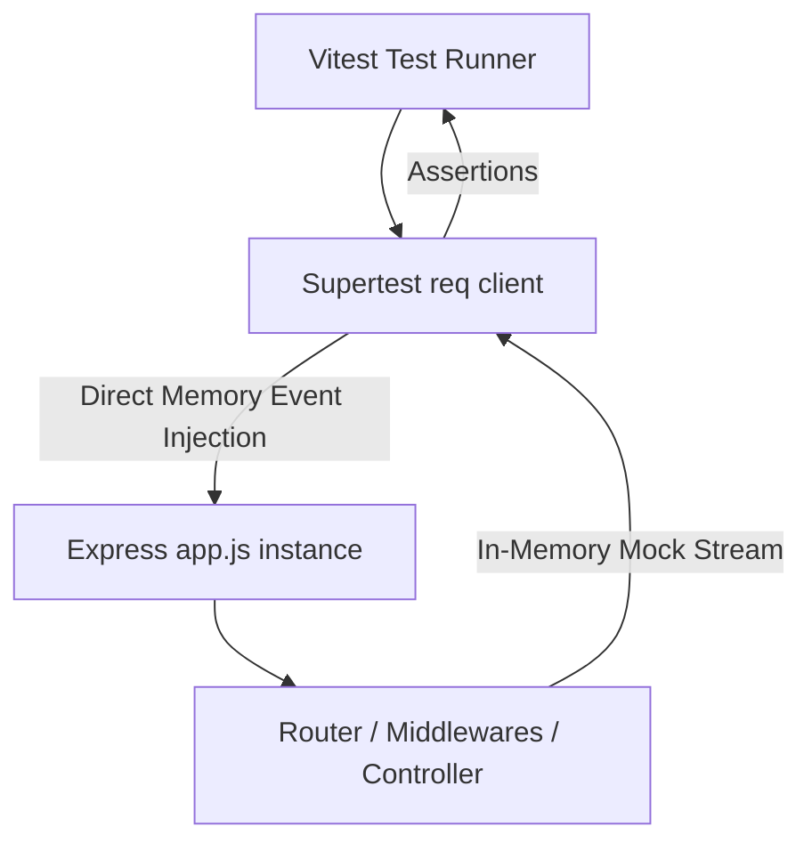

# 3.1.11. Integration Testing with Supertest and Vitest

> [!info] Orientation
> A robust backend must be guarded by reliable automated tests. While unit testing isolates individual functions, integration testing verifies the entire HTTP routing, validation, middleware, and exception-handling pipeline. This note details how to set up, write, and execute high-speed integration tests for Express.js using Vitest and Supertest without binding physical network ports.

---

## 1. Testing Without Network Port Conflicts

Traditional backend testing involves launching a test server on a specific port (e.g., `3001`), running HTTP queries against it, and closing it when done. However, this pattern has severe flaws:
* **Port Collisions:** Running multiple tests in parallel leads to `EADDRINUSE` port conflicts.
* **Process Leaks:** If a test suite crashes before reaching cleanup code, the test server process stays open, blocking future test runs.
* **Speed Penalties:** Binding physical TCP sockets adds unnecessary operating system overhead.

### The Solution: Direct Event Injection
Supertest solves this by utilizing Node's internal, server-agnostic event routing. You pass your un-listened `app` instance directly to Supertest. Supertest bypasses physical network sockets entirely and feeds mock HTTP request streams directly into your Express application's runtime event loop. This is extremely fast and completely eliminates port conflicts.



---

## 2. Setting Up Vitest and Supertest

First, we ensure our testing dependencies are installed as development requirements:

```bash
npm install --save-dev vitest supertest
```

Ensure your `package.json` includes the test command:

```json
{
  "scripts": {
    "test": "vitest run"
  }
}
```

---

## 3. Writing Integration Tests

Let's test our `POST /register` route. We mock the underlying repository calls using Vitest's mocking engine, allowing us to isolate our HTTP pipeline tests from our database cluster:

```javascript
// tests/user.integration.test.js
import { describe, it, expect, vi, beforeEach } from 'vitest';
import request from 'supertest';
import app from '../src/app.js'; // Decoupled from index.js (no app.listen!)
import { UserRepository } from '../src/repositories/user.repository.js';

// Mock the entire UserRepository class
vi.mock('../src/repositories/user.repository.js');

describe('POST /api/users/register', () => {
  beforeEach(() => {
    vi.clearAllMocks();
  });

  it('should successfully register a user and return 210 with safe payload', async () => {
    // 1. Arrange: Setup Repository Mocks
    UserRepository.prototype.findByEmail.mockResolvedValue(null);
    UserRepository.prototype.create.mockResolvedValue({
      _id: 'mock-user-uuid',
      username: 'tester',
      email: 'test@example.com',
    });

    // 2. Act: Execute request in-memory via Supertest
    const response = await request(app)
      .post('/api/users/register')
      .send({
        username: 'tester',
        email: 'test@example.com',
        password: 'securePassword123',
      });

    // 3. Assert: Verify HTTP pipeline outcomes
    expect(response.status).toBe(201);
    expect(response.headers['content-type']).toContain('application/json');
    expect(response.body).toEqual({
      status: 'success',
      data: {
        user: {
          id: 'mock-user-uuid',
          username: 'tester',
          email: 'test@example.com',
        }
      }
    });
  });

  it('should reject requests with missing fields and return 400 validation error', async () => {
    const response = await request(app)
      .post('/api/users/register')
      .send({
        email: 'invalid-email-shape',
      });

    expect(response.status).toBe(400);
    expect(response.body.error).toBe('Validation Failed');
    expect(response.body.issues).toBeDefined();
  });

  it('should return 409 conflict when registration email already exists', async () => {
    // Arrange: Mock user exists
    UserRepository.prototype.findByEmail.mockResolvedValue({ id: 'existing-id' });

    // Act
    const response = await request(app)
      .post('/api/users/register')
      .send({
        username: 'tester',
        email: 'test@example.com',
        password: 'securePassword123',
      });

    // Assert
    expect(response.status).toBe(409);
    expect(response.body.error.message).toBe('Email address already registered.');
  });
});
```

---

## 4. Testing Authenticated Endpoints

To test routes protected by authentication tokens (like a JWT check middleware), you can use Supertest's header-setting helper `.set()`:

```javascript
describe('GET /api/dashboard', () => {
  it('should allow access with a valid authorization header', async () => {
    const validToken = generateTestJwt({ userId: '123', role: 'user' });

    const response = await request(app)
      .get('/api/dashboard')
      .set('Authorization', `Bearer ${validToken}`);

    expect(response.status).toBe(200);
    expect(response.body.data).toBeDefined();
  });

  it('should reject access with a 401 when token is missing', async () => {
    const response = await request(app).get('/api/dashboard');

    expect(response.status).toBe(401);
    expect(response.body.error).toBe('Missing token');
  });
});
```

---

## 5. Summary and Best Practices

1. **Keep app.js Pure:** Never import `dotenv` or bind port connections inside `app.js`. Doing so forces tests to establish real configurations or crash.
2. **Atomic Test States:** Always run `vi.clearAllMocks()` or `vi.resetAllMocks()` between tests to prevent call count and return values leaking across tests.
3. **Database Isolation:** Use mocks or an in-memory database representation (like SQLite in memory or memory-mongodb-server) for database integration pipelines, preserving high speed.

---

## Summary

Integration testing in Express is exceptionally clean when leveraging Vitest and Supertest. By injecting request events directly into the `app` instance, we can assert route declarations, input constraints, custom middlewares, and arity-4 error routing behaviors with high speed and zero network socket complexity.

## See Also

- [[3.1.2. First App and Project Structure]]
- [[3.1.6. Express Middleware Architecture]]
- [[3.1.9. Input Validation with Zod]]
- [[3.1.10. Express.js Layered Architecture and MVC]]
