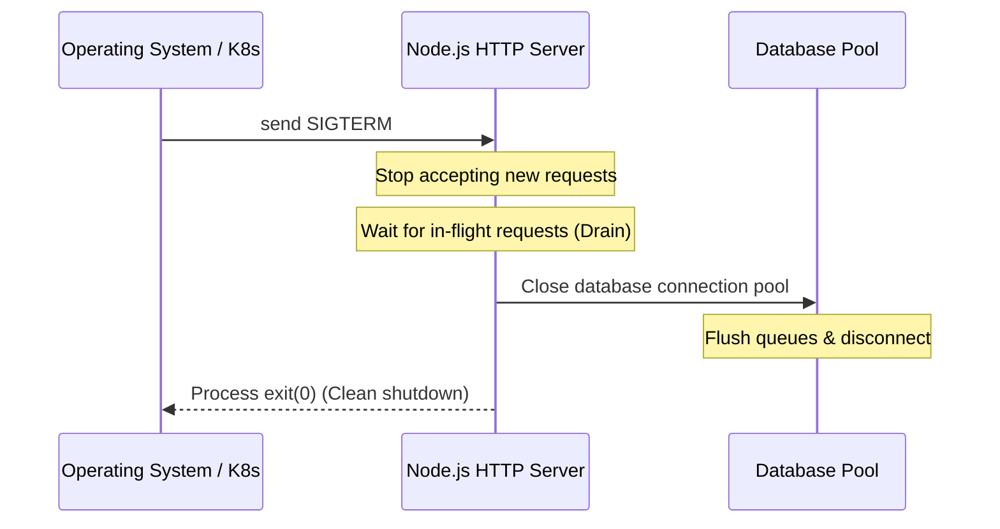

# 3.1.12. Graceful Shutdown and WebSocket Upgrades

> [!info] Orientation
> In enterprise environments, applications are constantly restarted or rescheduled by container orchestrators (like Kubernetes or Cloud Run). If a container terminates abruptly, active client downloads fail and unfinished transactions are aborted midway. This note explores how to implement a graceful shutdown process for Express and how to extract the underlying HTTP server to support WebSocket upgrades safely.

---

## 1. What is Graceful Shutdown?

A **Graceful Shutdown** ensures that when your application receives a termination signal from the operating system (like `SIGTERM` or `SIGINT`), it:
1. Stops accepting *new* incoming TCP connections immediately.
2. Allows *active* in-flight HTTP requests to complete within a given timeout threshold.
3. Closes persistent resource handles (such as database connection pools, Redis queues, or file descriptors).
4. Safely exits the Node.js process with a standard `0` status code (indicating clean termination).

Without a graceful shutdown hook, container orchestrators kill processes abruptly (SIGKILL), leaving database transactions hanging, resources leaked, and active connections severed without a response.



---

## 2. Accessing Node's Native HTTP Server Abstraction

In simple projects, developers boot Express with `app.listen(PORT)`. However, `app.listen()` is just a convenience function that instantiates Node's native `http.Server` and wraps your Express app as the main handler.

To implement advanced operations like WebSockets or graceful shutdown listeners, you must explicitly separate the HTTP server instantiation:

```javascript
// src/index.js
import http from 'http';
import app from './app.js';
import { connectDatabase, disconnectDatabase } from './config/database.js';

const PORT = process.env.PORT || 3000;

// 1. Establish database connection pool
await connectDatabase();

// 2. Explicitly create Node.js HTTP Server wrapper
const server = http.createServer(app);

// 3. Bind listeners
server.listen(PORT, () => {
  console.log(`Server listening on port ${PORT}`);
});
```

---

## 3. Implementing the Graceful Shutdown Hook

Now we wire system signal listeners onto our `server` and process execution handlers:

```javascript
// Hooking into OS Signal handlers
const SHUTDOWN_TIMEOUT_MS = 10_000; // 10 seconds limit to drain connections

function initiateShutdown(signal) {
  console.log(`Received ${signal}. Starting graceful shutdown...`);

  // 1. Instruct HTTP Server to stop accepting new requests and drain slowly
  server.close((err) => {
    if (err) {
      console.error('Error closing HTTP server:', err);
      process.exit(1);
    }
    
    console.log('HTTP Server closed. No more connections accepted.');

    // 2. Safely close database connection pools
    disconnectDatabase()
      .then(() => {
        console.log('Database connections terminated cleanly.');
        process.exit(0); // Success exit code!
      })
      .catch((dbErr) => {
        console.error('Error closing database pool during shutdown:', dbErr);
        process.exit(1);
      });
  });

  // 3. Safety net: Force kill process if requests take too long to drain
  setTimeout(() => {
    console.warn('Force shutting down. Active requests took too long to drain.');
    process.exit(1);
  }, SHUTDOWN_TIMEOUT_MS).unref(); // Use .unref() to prevent holding the event loop open
}

// Register listeners on standard OS signals
process.on('SIGTERM', () => initiateShutdown('SIGTERM'));
process.on('SIGINT', () => initiateShutdown('SIGINT'));
```

---

## 4. Upgrading to WebSockets (ws or socket.io)

HTTP is a half-duplex, client-driven protocol. Real-time features (like messaging, live dashboard feeds, or multiplayer rooms) require a full-duplex persistent connection: **WebSockets**.

Because WebSockets operate via an initial HTTP request that is "upgraded" to a TCP socket, we use our extracted `server` instance to handle these upgrades cleanly. Here is an example using the lightweight `ws` package:

```javascript
import { WebSocketServer } from 'ws';

// Create WebSocket server attached to the HTTP server
const wss = new WebSocketServer({ noServer: true });

// Listen to HTTP 'upgrade' event to route WS handshakes
server.on('upgrade', (request, socket, head) => {
  console.log('Parsing WebSocket upgrade request...');

  // Optional: Verify credentials from the upgrade request headers
  // const token = parseUrlToken(request.url);
  // if (!isValidToken(token)) {
  //   socket.write('HTTP/1.1 401 Unauthorized\r\n\r\n');
  //   socket.destroy();
  //   return;
  // }

  wss.handleUpgrade(request, socket, head, (ws) => {
    wss.emit('connection', ws, request);
  });
});

// Manage socket connections
wss.on('connection', (ws) => {
  console.log('Client connected successfully over WS!');
  
  ws.on('message', (message) => {
    console.log(`Received: ${message}`);
    ws.send(`Echo: ${message}`);
  });

  ws.on('close', () => {
    console.log('WS connection closed.');
  });
});
```

During a graceful shutdown, you should also close active WebSocket connections using `wss.close()` to ensure the clients are disconnected gracefully with an appropriate WS close code (e.g., `1001 Going Away`).

---

## Summary

Decoupling the Express application pipeline from Node's native `http.Server` wrapper empowers production architectures to run graceful connection drains, terminate database pools cleanly on OS `SIGTERM` signals, and mount robust WebSocket servers on shared ports.

## See Also

- [[3.1.2. First App and Project Structure]]
- [[3.1.6. Express Middleware Architecture]]
- [[3.1.10. Express.js Layered Architecture and MVC]]
