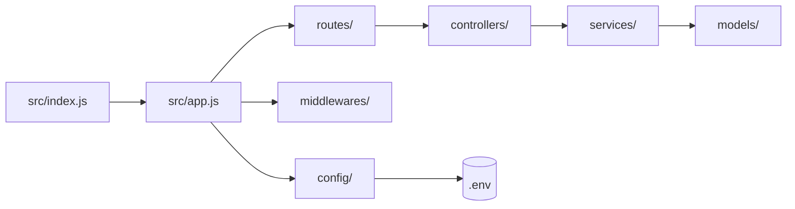

# 3.1.2. First App and Project Structure

> [!info] Orientation
> This note takes the freshly installed Express project from [[3.1.1. Installing Express.js]] and turns it into a running HTTP server, then steps back and shows how to organize the code so the same project can grow from a single `index.js` file into a multi-team service. It covers the four core Express objects, the role of `app.listen`, environment loading with `dotenv`, and the layered folder layout that keeps business logic out of route handlers.

## 1. A Minimal Hello World

The smallest Express application is four lines of substance and one line of boot logging. You import the framework, instantiate an application, register a single route handler on the root path, and start listening on a port. The whole program fits on one screen but it already exercises every major Express concept: the `app` object, the `req`/`res` pair, and the listener that turns a Node.js process into an HTTP server.

```javascript
import express from 'express';

const app = express();
const port = process.env.PORT ?? 3000;

app.get('/', (req, res) => {
  res.send('Hello from Express!');
});

app.listen(port, () => {
  console.log(`App running at http://localhost:${port}`);
});
```

Run it with `node src/index.js` and the process blocks, holding the port open and waiting for connections. Visit `http://localhost:3000/` in a browser or with `curl` and you get back the literal string `Hello from Express!` with a `Content-Type: text/html; charset=utf-8` header that Express inferred from the body. Stop the process with `Ctrl-C` and the port is released.

## 2. Running the App

The simplest invocation is plain `node` against the entry file. This works, but every code change requires killing and restarting the process, which becomes painful within minutes. The standard solution is `nodemon`, installed in [[3.1.1. Installing Express.js]] as a dev dependency. Running `nodemon src/index.js` starts the server once and then watches every file in the project tree; on any save it kills the child Node process and boots a fresh one in under a second.

Wiring this into `package.json` scripts gives the project a single canonical entry point that every developer and CI runner uses. The `dev` script runs the server under `nodemon` for local work, the `start` script runs it under plain `node` for production, and the `test` script runs the test runner of choice. The naming convention `dev`/`start`/`test` is not arbitrary — `npm start` and `npm test` are built-in aliases that work without the `run` keyword, while `npm run dev` requires the explicit `run` because `dev` is not a built-in.

```json
{
  "scripts": {
    "dev": "nodemon src/index.js",
    "start": "node src/index.js",
    "test": "node --test"
  }
}
```

## 3. What `express()` Returns

Calling `express()` constructs an Express `Application` object. Despite the lowercase name, this is a class under the hood — `express` is a factory function that returns a fresh instance every time, so calling it twice produces two independent applications that do not share middleware stacks or route tables. The application object is the central registry for everything: it holds the middleware stack, the route tree, the settings store (`app.set`/`app.get` for configuration), the template engine bindings, and the HTTP server that gets created lazily when you call `app.listen`.

`app.listen(port, callback)` is a thin wrapper around Node's `http.createServer(app).listen(port, callback)`. It creates an `http.Server` instance, hands it the Express application as the request listener, and binds to the supplied port. The callback fires once when the socket is open and listening. Because the server is a plain Node `http.Server`, you can extract it from `app.listen`'s return value and use it directly with WebSockets (`ws`), `server.close()` for graceful shutdown, or `server.setTimeout()` to override the default two-minute request timeout.

## 4. The Four Core Objects

Express collapses every HTTP interaction into a pipeline built around four objects. Understanding their roles up front makes every later topic — middleware, routing, error handling — straightforward, because each of them is fundamentally a different way of manipulating these four objects.

| Object | What it is | What you do with it |
| ------ | ---------- | ------------------- |
| `app` | The `Application` instance returned by `express()`. | Register middleware, define routes, set configuration, start the server. |
| `req` | An augmented `http.IncomingMessage`. Represents the request. | Read `params`, `query`, `body`, `headers`, `cookies`, `ip`, `method`. |
| `res` | An augmented `http.ServerResponse`. Represents the response. | Call `send`, `json`, `status`, `set`, `cookie`, `redirect`, `end`. |
| `next` | A function passed to middleware. Hands control to the next layer. | Call `next()`, `next(err)`, or `next('route')`. |

The `req` and `res` objects are not custom Express classes — they are Node's native `http.IncomingMessage` and `http.ServerResponse` with extra properties and methods glued on by Express middleware at the start of every request. This means anything that works on Node streams (piping, `on('data')`, `pipe()`) also works on `req` and `res`, which matters when you stream uploads to object storage or stream a large file back to the client without buffering it in memory.

## 5. A Real Project Structure

The single-file layout stops scaling the moment a second route appears. The standard Express project separates concerns along five axes: transport, business logic, data access, cross-cutting concerns, and configuration. Each concern gets its own folder so that adding a new endpoint touches one file in each folder rather than appending 200 lines to a monolithic `index.js`.



`index.js` is the only file that calls `app.listen`. It loads environment variables, constructs the app from `app.js`, and binds the port. `app.js` is where middleware, routers, and error handlers are wired onto the Express instance without binding a port — separating construction from boot makes the app testable because tests can `import app from '../src/app'` and run requests against it with `supertest` without actually opening a socket. `routes/` maps URLs to controllers, `controllers/` translate between HTTP and the service layer, `services/` hold business rules, `models/` talk to the database, and `middlewares/` holds reusable `(req, res, next)` functions.

## 6. Why Separation Matters

Splitting code into folders is not aesthetic theater; it has three concrete payoffs. Testability improves because services that take plain JavaScript arguments and return plain JavaScript values can be unit-tested without spinning up an HTTP server or a database. Readability improves because a new contributor can find the route they need in `routes/`, follow the named controller, and land in the service layer without wading through unrelated concerns. Team scaling improves because pull requests stop colliding — one developer can work on a new route while another refactors a service and a third adds a middleware, all in different folders with minimal merge conflicts.

A useful sanity check is the "transport independence" test. If your controller can be copy-pasted into a CLI tool or a cron job and still make sense, the separation is right. If the controller is full of `req` and `res` references and SQL queries, the layers have leaked into each other and the code will be painful to refactor when the next transport (a gRPC interface, a background job) is added.

## 7. Environment Variables with dotenv

Configuration that varies between environments — database URLs, JWT secrets, log levels, feature flags — must not be hard-coded. The Node convention is to read these from `process.env`, populated at boot time by the `dotenv` package from a `.env` file in the project root. Install it with `npm install dotenv`, then call `import 'dotenv/config'` at the very top of `src/index.js` so the values are loaded before any other module reads them.

```javascript
import 'dotenv/config';
import app from './app.js';

const port = process.env.PORT ?? 3000;

app.listen(port, () => {
  console.log(`App running at http://localhost:${port}`);
});
```

A `.env` file is a flat `KEY=value` text file that lives at the project root and is ignored by git (see [[3.1.1. Installing Express.js]]). It is the right place for local development secrets, but in production you should source the same variables from the runtime environment provided by your container orchestrator or platform-as-a-service, never from a checked-in file. The `??` operator in the snippet above is the nullish coalescing operator: it falls back to `3000` only when `process.env.PORT` is `undefined` or `null`, which is the correct behavior because an explicit empty string would otherwise override the default.

## 8. Starter Templates

`express-generator` is the official scaffolding tool and produces a working app with routes, views, and a sensible structure in one command: `npx express-generator my-app`. The output uses CommonJS and Jade/Pug templates by default, which feels dated for an API-only project. Most modern teams either skip the generator entirely and copy their own internal scaffold, or use a higher-level framework built on top of Express (NestJS, FoalTS) when the project is large enough to justify the additional conventions. For learning Express itself, hand-writing the layout described in section 5 is more instructive than running the generator.

## Summary

A minimal Express app is four lines plus a listen call, but production-grade structure separates `index.js` (boot), `app.js` (wiring), `routes/`, `controllers/`, `services/`, `models/`, `middlewares/`, and `config/` into distinct files and folders. The four core objects — `app`, `req`, `res`, `next` — recur in every later topic and are worth memorizing. Environment variables flow in through `dotenv` at the top of `index.js`, and the server itself is a plain Node `http.Server` returned by `app.listen`, available for graceful shutdown and WebSocket upgrades.

## See Also

- [[3.1.1. Installing Express.js]]
- [[3.1.3. GET Routes and Routing]]
- [[3.1.5. Query Parameters and Request Object]]
- [[3.1.6. Express Middleware Architecture]]
- [[6.3. Nginx Reverse Proxy and Load Balancing]]

## References

- Express application object — `https://expressjs.com/en/4x/api.html#app`
- `http.createServer` documentation — `https://nodejs.org/api/http.html#httpcreateserveroptions-requestlistener`
- dotenv repository — `https://github.com/motdotla/dotenv`
