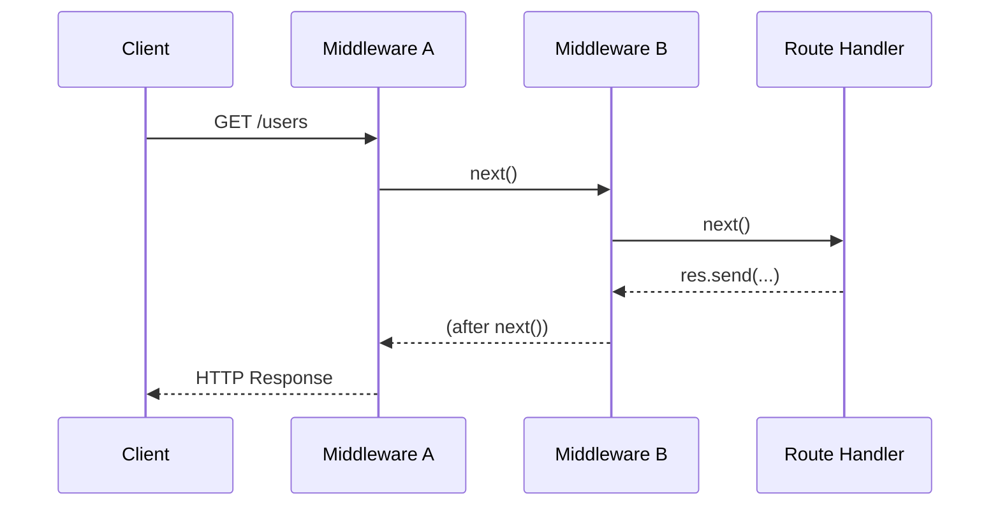
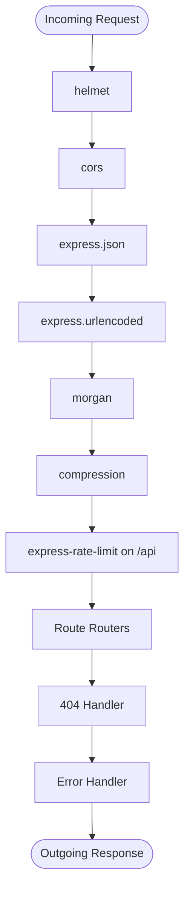

# 3.1.6. Express Middleware Architecture

> [!info] Orientation
> Middleware is the single most important concept in Express. Every request — every single one — flows through a stack of middleware functions registered in order, and every response flows back through the same stack in reverse. This note covers what middleware is, the five categories (app-level, router-level, error-handling, built-in, third-party), how `next()` controls the pipeline, the async gotcha that has bitten every Express developer at least once, and the production middleware stack you should reach for on day one.

## 1. What Middleware Is

A middleware is a function with the signature `(req, res, next) => { ... }`. It runs in the request-response cycle, has full read/write access to `req` and `res`, and decides what happens next by either ending the response itself (with `res.send`, `res.json`, etc.) or calling `next()` to hand control to the next middleware in line. There is nothing magical about the name "middleware" — it is the Chain of Responsibility pattern from GoF, specialized for HTTP, and the entire Express framework is essentially a registry and executor for this one function shape.

The pipeline executes middlewares in the order they were registered. A request enters at the top of the stack, passes through each middleware that matches its path and method, reaches a terminal handler that sends a response, and then control returns up through any code that ran after each `next()` call. This bidirectional traversal behaves like a call stack: code before `next()` runs on the way in, code after `next()` runs on the way out, and the same middleware can do both pre-processing and post-processing.



If a middleware neither calls `next()` nor terminates the response, the request hangs forever. The client's TCP connection stays open until its own timeout fires, the server holds the socket and any in-flight resources, and the only diagnostic is a missing log entry. This is the most common Express bug for newcomers and the reason every middleware function — without exception — must either end the response or call `next`.

## 2. App-Level Middleware

App-level middleware is registered with `app.use(...)` or `app.METHOD(...)` directly on the application object. It runs for every request that matches its optional path prefix. Without a path, it matches everything; with a path like `/api`, it matches only requests whose URL starts with `/api`. App-level middleware is the right place for global concerns: request logging, body parsing, CORS, security headers, and the final error handler.

```javascript
import express from 'express';
const app = express();

app.use(express.json());           // parse JSON bodies into req.body
app.use(express.urlencoded({ extended: true })); // parse form bodies
app.use((req, res, next) => {      // global request logger
  console.log(`${req.method} ${req.url}`);
  next();
});
```

The two built-in parsers in this example are technically middleware themselves — `express.json` returns a middleware function that reads the request stream, parses it as JSON, assigns the result to `req.body`, and calls `next()`. If the body is malformed JSON, it calls `next(err)` with a SyntaxError, which jumps straight to your error handler. Understanding that built-in features are just pre-shipped middleware is the key to composing your own.

## 3. Router-Level Middleware

`express.Router()` produces a mini-application with its own middleware stack, mounted under a path prefix on the parent app. Router-level middleware behaves exactly like app-level middleware but is scoped to the router — registering a logging middleware on a router only runs for requests that hit that router's prefix, not for the whole app. This is how you scope concerns like authentication to specific route groups without polluting the global stack.

```javascript
import { Router } from 'express';

const api = Router();
api.use((req, res, next) => {
  console.log(`API hit: ${req.url}`);
  next();
});

app.use('/api', api);
```

Routers can be nested arbitrarily deep, which lets you compose large route trees from small files. A common pattern is one router per resource (`users`, `articles`, `comments`) mounted under a versioned API router (`/v1`), which is itself mounted on the app. The result is a tree of middleware stacks where each layer adds the cross-cutting concerns appropriate to its scope.

## 4. Error-Handling Middleware

Error-handling middleware has a distinctive signature: **four** arguments instead of three — `(err, req, res, next)`. Express identifies error handlers by arity (the argument count), so even if you do not use `next` you must declare it; omitting the fourth argument makes Express treat the function as a regular middleware and your error handler never runs. Error handlers are registered last, after every route and normal middleware, and they catch any error passed via `next(err)` or thrown synchronously in a handler.

```javascript
app.use((err, req, res, next) => {
  console.error(err);
  res.status(err.status ?? 500).json({
    error: err.message || 'Internal Server Error',
  });
});
```

Centralizing error handling in one final middleware keeps route handlers clean — they can throw or call `next(err)` and trust that the response will be shaped consistently. The pattern also lets you normalize different error types (database errors, validation errors, third-party API errors) into a single response shape that your frontend can rely on.

## 5. Built-in and Third-Party Middleware

Express ships a small set of built-in middleware: `express.json`, `express.urlencoded`, `express.static`, `express.raw`, and `express.text`. The first two parse request bodies, `express.static` serves files from a directory (useful for serving a built SPA), and the last two handle raw `Buffer` and plain-text bodies. The list is deliberately short — Express's philosophy is to ship the minimum and let the ecosystem fill in the rest.

Third-party middleware fills the gaps. The five packages below are standard in almost every production Express app and should be the first things you reach for after the framework itself.

| Package | Purpose |
| ------- | ------- |
| `helmet` | Sets security headers (CSP, HSTS, X-Frame-Options, etc.). |
| `cors` | Configurable Cross-Origin Resource Sharing. |
| `morgan` | HTTP request logging in standard formats (combined, dev, json). |
| `compression` | Gzip/Brotli response compression. |
| `express-rate-limit` | Per-IP rate limiting to mitigate brute force and abuse. |

```javascript
import helmet from 'helmet';
import cors from 'cors';
import morgan from 'morgan';
import compression from 'compression';
import rateLimit from 'express-rate-limit';

app.use(helmet());
app.use(cors({ origin: process.env.CORS_ORIGIN }));
app.use(compression());
app.use(morgan('combined'));
app.use('/api', rateLimit({ windowMs: 60_000, max: 100 }));
```

## 6. Writing Custom Middleware

Custom middleware is just a function. The four patterns below cover most of what you will write: a request logger that records method, path, and duration; an auth middleware that verifies a JWT and attaches the user to `req`; a validation middleware that runs a Zod schema and rejects invalid input; and an error normalizer that converts thrown errors into a consistent shape before they reach the final handler.

```javascript
// Logger
function logger(req, res, next) {
  const start = Date.now();
  res.on('finish', () => {
    console.log(`${req.method} ${req.originalUrl} ${res.statusCode} ${Date.now() - start}ms`);
  });
  next();
}

// Auth
function requireAuth(req, res, next) {
  const token = req.headers.authorization?.replace('Bearer ', '');
  if (!token) return res.status(401).json({ error: 'Missing token' });
  try {
    req.user = verifyJwt(token);
    next();
  } catch (err) {
    next(err);
  }
}

// Validation
function validate(schema) {
  return (req, res, next) => {
    const result = schema.safeParse({ ...req.params, ...req.query, ...req.body });
    if (!result.success) return res.status(400).json({ errors: result.error.flatten() });
    req.validated = result.data;
    next();
  };
}
```

The logger uses `res.on('finish')` because the response has not been sent yet at the point `next()` is called — the duration is only known after the response finishes flushing. The auth middleware demonstrates the two ways to fail: end the response directly for a 401, or call `next(err)` for an unexpected error. The validation middleware is a factory that returns a middleware, which is the standard pattern for parameterized middleware.

## 7. `next()`, `next(err)`, and `next('route')`

The three call forms of `next` do three different things and confusing them is the source of many subtle bugs. `next()` with no arguments passes control to the next middleware in the stack. `next(err)` with a truthy argument skips all remaining non-error middleware and jumps directly to the first error-handling middleware. `next('route')` is special: it skips all remaining middleware on the **current route** and proceeds to the next matching route, which is useful when you want a conditional middleware to bail out of the current handler chain without erroring.

```javascript
app.get('/users/:id',
  (req, res, next) => {
    if (req.params.id === 'me') return next('route'); // skip to next route
    next();
  },
  getUserById,  // skipped for /users/me
);

app.get('/users/me', getMe);  // reached via next('route')
```

A common mistake is calling `next(err)` from inside an error handler, which re-enters the error pipeline and can produce infinite loops or skip subsequent error handlers. If you want one error handler to delegate to the next, call `next(err)` from a four-argument middleware — Express skips to the next four-argument middleware in that case, not back to the start.

## 8. The Async Middleware Gotcha

Express 4 was written before Promises were ubiquitous, and its middleware contract is synchronous: a middleware either calls `next()` synchronously or it does not, and Express has no way to know about a rejected Promise that was returned from an `async` function. If an `async` middleware throws inside an `await`, the rejection becomes an unhandled promise rejection, the request hangs, and the client eventually times out. This is the single most common production bug in Express 4 codebases.

The fix in Express 4 is to wrap every async middleware in a `try`/`catch` that calls `next(err)`, or to use a small wrapper that does it for you. Express 5 fixes this properly — it awaits returned Promises and forwards rejections to the error handler automatically — but until Express 5 is the default, the wrapper is mandatory.

```javascript
// Wrapper
const asyncHandler = (fn) => (req, res, next) =>
  Promise.resolve(fn(req, res, next)).catch(next);

// Usage
app.get('/users/:id', asyncHandler(async (req, res) => {
  const user = await db.user.findById(req.params.id);
  if (!user) throw { status: 404, message: 'User not found' };
  res.json(user);
}));
```

The alternative is the `express-async-errors` package, which monkey-patches Express at import time to add Promise handling to every middleware. Import it once at the top of `src/index.js` and the rest of the code can write `async` middleware without wrappers. The monkey-patch is ugly but battle-tested and is what most production Express 4 codebases use.

## 9. A Production Middleware Stack

Putting it all together, a production Express app's middleware stack reads top to bottom like a checklist of cross-cutting concerns. Security headers first, then CORS, then body parsers, then logging, then rate limiting on the API prefix, then routers, then the 404 handler, then the centralized error handler. The order matters: body parsers must run before routes that read `req.body`, rate limiters should run before expensive handlers, and the error handler must always be last.



This stack is not a template to copy blindly — every project has different requirements — but it is a sensible default. Helmet's defaults are conservative; review them against your frontend's needs. CORS configuration depends on whether you serve a same-origin SPA or a cross-origin API. Compression is unnecessary if you sit behind a CDN that compresses for you. Morgan's `combined` format is good for production logs, `dev` is more readable for local development. Each of these decisions is worth a few minutes of thought, but the stack as a whole is what "production-ready Express" looks like in 2024.

## Summary

Middleware is the Chain of Responsibility pattern specialized for HTTP: every `(req, res, next)` function runs in registration order, can read and mutate the request and response, and either ends the response or calls `next`. The five categories — app-level, router-level, error-handling, built-in, and third-party — cover every cross-cutting concern from body parsing to security headers. The async gotcha in Express 4 is the single most common production bug and requires either a wrapper or `express-async-errors`. A production middleware stack reads top to bottom: helmet, cors, body parsers, logging, compression, rate limiting, routers, 404, error handler.

## See Also

- [[3.1.2. First App and Project Structure]]
- [[3.1.3. GET Routes and Routing]]
- [[3.1.5. Query Parameters and Request Object]]
- [[1.6. API Authentication Patterns]]
- [[1.2. RESTful API Design and Constraints]]

## References

- Express middleware guide — `https://expressjs.com/en/guide/using-middleware.html`
- Express error handling — `https://expressjs.com/en/guide/error-handling.html`
- `express-async-errors` — `https://github.com/davidbanham/express-async-errors`
- Helmet documentation — `https://helmetjs.github.io/`
