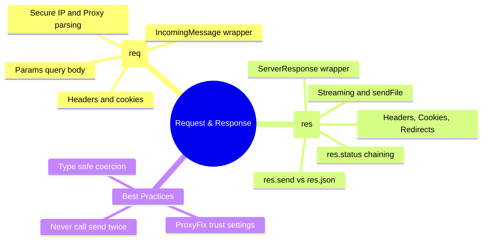

# 3.1.7. Express Request and Response Objects

> [!info] Orientation
> The Request (`req`) and Response (`res`) objects are the primary execution context within an Express.js pipeline. Rather than writing raw Node.js streams, Express augments the native `http.IncomingMessage` and `http.ServerResponse` objects with rich helper properties and methods. This note explores their internal mechanisms, core APIs, standard properties, and how to safely leverage them in production.

---

## 1. Native Node.js stream wrappers

At its heart, Express is a thin layer over Node's native `http` module. When an HTTP request reaches Node.js, the runtime parses the raw network packets and instantiates two objects:
1. `http.IncomingMessage`: A readable stream representing the incoming request payload and headers.
2. `http.ServerResponse`: A writable stream representing the outgoing response stream.

Express intercepts these objects and wraps them with its own prototype chains (`express.request` and `express.response`). This means:
* **No performance penalty:** Express does not copy or recreate the objects; it simply injects helpers onto their prototypes.
* **Stream inheritance:** You can still use native Node features like `req.on('data')`, `req.on('end')`, or `res.write()`, `res.pipe()`.



---

## 2. The Request Object (req) Detailed Breakdown

The `req` object represents the incoming HTTP request. In production, parsing raw header arrays is error-prone, so Express exposes pre-parsed properties:

### Query Strings vs Path Parameters vs Body Payload
* **`req.params`:** An object containing properties mapped to the named route "parameters". For example, if you have a route `/users/:id`, then `req.params.id` holds the value. These are always strings by default.
* **`req.query`:** An object containing the parsed query parameters (everything after the `?` in the URL). Express parses this using the `qs` library by default, which supports arrays and nested objects.
* **`req.body`:** An object containing the parsed body of the request (JSON, form-urlencoded, or text). This is `undefined` by default and must be populated using body-parsing middleware like `express.json()`.

### Header Inspection and Content Negotiation
* **`req.headers`:** A raw key-value map of lowercase HTTP headers sent by the client.
* **`req.get(headerName)`:** A helper method that retrieves the specified header case-insensitively. (`req.get('Content-Type')` works identically to `req.get('content-type')`).
* **`req.accepts(types)`:** Checks if the client accepts the given MIME types, based on the request's `Accept` header. This is essential for building APIs that support content negotiation (e.g., returning JSON or XML based on the client request).

### Network Metadata & Trusting Proxies
* **`req.ip`:** The remote IP address of the client.
* **`req.secure`:** A boolean indicating if the TLS connection was established (`true` if `req.protocol === 'https'`).

> [!warning] The Reverse Proxy Gotcha
> If your Express application sits behind a load balancer, reverse proxy, or CDN (like Nginx, AWS ALB, Cloudflare), the client's direct connection is terminated at the proxy. The raw socket IP will always be `127.0.0.1` or the private IP of your load balancer.
>
> To resolve this, you **MUST** configure Express to trust proxies using:
> `app.set('trust proxy', true);` (or specific IP ranges).
> This instructs Express to read the `X-Forwarded-For` and `X-Forwarded-Proto` headers populated by your proxy, mapping them correctly to `req.ip` and `req.secure`.

---

## 3. The Response Object (res) Detailed Breakdown

The `res` object represents the HTTP response that the Express server sends back to the client.

### Terminal Methods vs Setup Methods
It is critical to distinguish between methods that **terminate** the request-response cycle (sending data to the client and closing the connection) and those that simply **setup** headers, cookies, or status codes.

* **Setup Methods (Can be chained):**
  * `res.status(code)`: Sets the HTTP status code (e.g., `res.status(404)`).
  * `res.set(header, value)`: Sets a response header case-sensitively.
  * `res.cookie(name, value, options)`: Sets a cookie with security flags.
  
* **Terminal Methods (End the cycle):**
  * `res.send(body)`: Sends a generic response. Automatically sets the `Content-Type` header based on the type (string maps to `text/html`, object maps to `application/json`).
  * `res.json(body)`: Serializes an object/array to JSON and sends it. Sets `Content-Type: application/json`.
  * `res.sendStatus(code)`: Sets the status code and sends its string representation as the body (e.g., `res.sendStatus(401)` sends `'Unauthorized'`).
  * `res.end()`: Terminates the response without sending any body content. Used for HTTP 204 (No Content).
  * `res.sendFile(path)`: Streams a file to the client. Uses `mime-types` to determine the correct header.

```javascript
// ✅ Correct Method Chaining Pattern
res.status(201)
   .set('X-Resource-ID', '99')
   .json({ success: true, id: 99 });
```

---

## 4. Common Pitfalls and Best Practices

### The "Cannot set headers after they are sent to the client" Error
This is the most frequent Express runtime exception. It occurs when your code attempts to send a response (using a terminal method or setting a header) *after* a response has already been sent for the current request.

```javascript
// ❌ Buggy Code
app.get('/api/resource', (req, res) => {
  if (!req.query.token) {
    res.status(401).json({ error: 'No token provided' });
  }
  
  // This code still executes! It tries to send another response, causing the crash.
  res.json({ data: 'secret' });
});
```

To fix this, always **return** when invoking a terminal method in a conditional block:

```javascript
// ✅ Correct Code
app.get('/api/resource', (req, res) => {
  if (!req.query.token) {
    return res.status(401).json({ error: 'No token provided' });
  }
  
  res.json({ data: 'secret' });
});
```

### Response Size and Performance Considerations
* When sending massive payloads, avoid loading the entire dataset into memory to write with `res.json()`. Instead, stream the data using `res.pipe()` directly from your database or file system, which keeps the memory footprint of your Node.js process near constant.
* Ensure compression middleware is enabled globally to minimize payload transit times.

---

## Summary

The Express `req` and `res` objects are augmented prototypes of Node's native HTTP stream interfaces. In production, developers must understand route param and query extraction, content negotiation, safe cookie and header configuration, and proper usage of terminal return statements to avoid "headers already sent" crashes. When hosting behind an Nginx or Cloudflare edge, configuring `trust proxy` is mandatory for authentic security metadata.

## See Also

- [[3.1.3. GET Routes and Routing]]
- [[3.1.5. Query Parameters and Request Object]]
- [[3.1.6. Express Middleware Architecture]]
- [[3.1.8. Custom Middleware and Chaining]]
