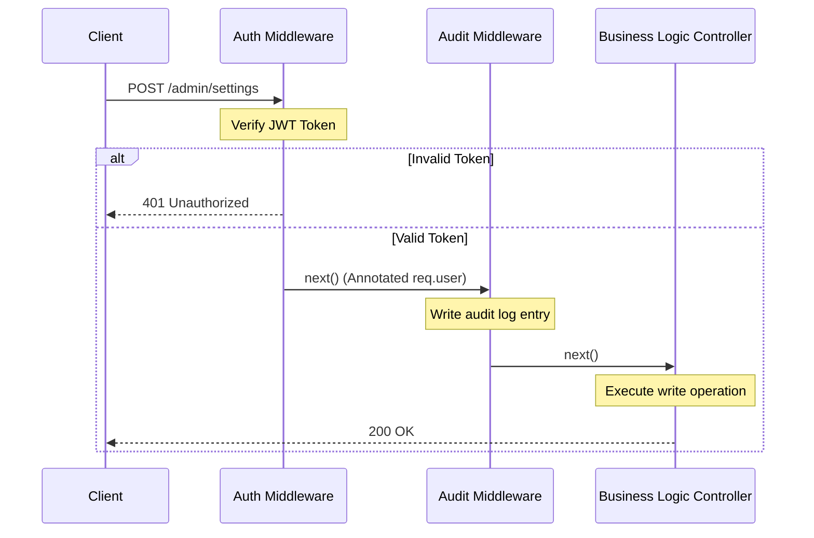

# 3.1.8. Custom Middleware and Chaining

> [!info] Orientation
> The core strength of Express.js lies in its ability to chain independent, single-purpose middleware blocks together to build complex processing pipelines. This note details how to design, write, and execute custom middleware, manage pipeline sequencing, pass variables between middlewares safely using the `res.locals` namespace, and architect bulletproof error-handling chains.

---

## 1. Middleware as the Chain of Responsibility

In software architecture, the **Chain of Responsibility** pattern decouples the sender of a request from its receivers by allowing multiple handlers to process the request sequentially. In Express, this pattern is implemented through the middleware function stack.

Every matching middleware in the stack has the opportunity to:
1. Examine and modify request (`req`) and response (`res`) attributes.
2. Short-circuit the request and return an HTTP response immediately (e.g., if a security check fails).
3. Call `next()` to hand control over to the next middleware in line.



---

## 2. Writing Parameterized Middleware Factories

Sometimes, you need a middleware to behave dynamically based on external configuration. Since a standard Express middleware must match the `(req, res, next)` signature, you can create a **middleware factory** (a high-order function) that accepts configuration parameters and returns a standard middleware function.

Let's look at an example that checks if a logged-in user possesses a required RBAC (Role-Based Access Control) role:

```javascript
// 🛠️ Parameterized Middleware Factory
export function requireRole(requiredRole) {
  return (req, res, next) => {
    // We assume an upstream auth middleware has verified the JWT and attached req.user
    if (!req.user) {
      return res.status(401).json({ error: 'Authentication required' });
    }

    const { role } = req.user;
    if (role !== requiredRole && role !== 'admin') {
      return res.status(403).json({ error: `Forbidden: requires ${requiredRole} role` });
    }

    // Role verified, proceed to the next handler
    next();
  };
}

// 🚀 Usage inside Route Configuration
import { requireRole } from './middlewares/auth.js';

app.post('/api/billing', requireRole('billing_manager'), (req, res) => {
  res.json({ message: 'Welcome billing manager!' });
});
```

---

## 3. Data Flow Between Middlewares via `res.locals`

A common requirement is sharing metadata generated by an upstream middleware (such as a database client, parsed JWT content, or correlation IDs) with downstream handlers.

While it is tempting to attach custom properties directly to the `req` object (e.g., `req.user = user;`), this can cause type collisions, especially when using TypeScript, and risks overshadowing standard HTTP request attributes.

Express provides a dedicated namespace for this exact purpose: **`res.locals`**.
* `res.locals` is an empty object scoped strictly to the current request-response cycle.
* It is guaranteed to be destroyed once the response is sent, preventing any memory leaks between requests.
* Template rendering engines (like EJS or Pug) automatically read from `res.locals`, making its attributes directly available in presentation code.

```javascript
// Upstream Middleware
app.use((req, res, next) => {
  res.locals.correlationId = req.headers['x-correlation-id'] || generateUuid();
  next();
});

// Downstream View/Controller
app.get('/dashboard', (req, res) => {
  // Access data safely
  const currentCorrelationId = res.locals.correlationId;
  res.render('dashboard', { id: currentCorrelationId });
});
```

---

## 4. Advanced Error-Handling Middleware Chains

Express differentiates regular middleware from error-handling middleware based on function **arity** (the number of declared arguments).
* **Regular Middleware:** `(req, res, next)`
* **Error Middleware:** `(err, req, res, next)`

If a regular middleware fails, it must pass the error using `next(err)`. This immediately halts the normal execution stack, causing Express to skip all downstream regular middleware and jump directly to the first registered error handler.

### Multiple Error Handlers (The Fallthrough Pattern)
You can register multiple error-handling middlewares in sequence at the bottom of your file to decouple concerns:

```javascript
// 1. Database Exception Normalizer
app.use((err, req, res, next) => {
  if (err.name === 'MongoServerError' && err.code === 11000) {
    return res.status(409).json({ error: 'Duplicate resource key exception.' });
  }
  // If it is not a database duplicate error, delegate up the error chain
  next(err);
});

// 2. Schema Validation Failure Normalizer
app.use((err, req, res, next) => {
  if (err.name === 'ZodError') {
    return res.status(400).json({ errors: err.errors });
  }
  next(err);
});

// 3. Fallback General Handler
app.use((err, req, res, next) => {
  const statusCode = err.status ?? 500;
  res.status(statusCode).json({
    error: {
      message: err.message || 'Internal Server Error',
      code: err.code || 'INTERNAL_ERROR'
    }
  });
});
```

---

## 5. Practical Implementation Guidelines

1. **Order of Registration Matters:** Downstream error middlewares must be written *after* all routers. If you place a router after an error handler, the router's exceptions will bypass that handler.
2. **Do Not Block the Thread:** Since Node.js is single-threaded, expensive synchronous computations inside a middleware will block the event loop for all other concurrent requests. Keep middlewares lightweight.
3. **Always Return on Failures:** When short-circuiting a request by sending a response early, always write `return next()` or `return res.send()` to stop execution of the rest of the current function scope.

---

## Summary

Custom middleware chaining forms the execution backbone of Express. By leveraging modular middleware patterns, developers can decouple authentication, parameter logging, authorization checks, and validation logic into pure, single-purpose testing units. To maintain safety, metadata should flow down the chain using `res.locals`, while unexpected exceptions are caught and classified using a tiered stack of arity-4 error-handling controllers.

## See Also

- [[3.1.2. First App and Project Structure]]
- [[3.1.6. Express Middleware Architecture]]
- [[3.1.7. Express Request and Response Objects]]
- [[3.1.9. Input Validation with Zod]]
