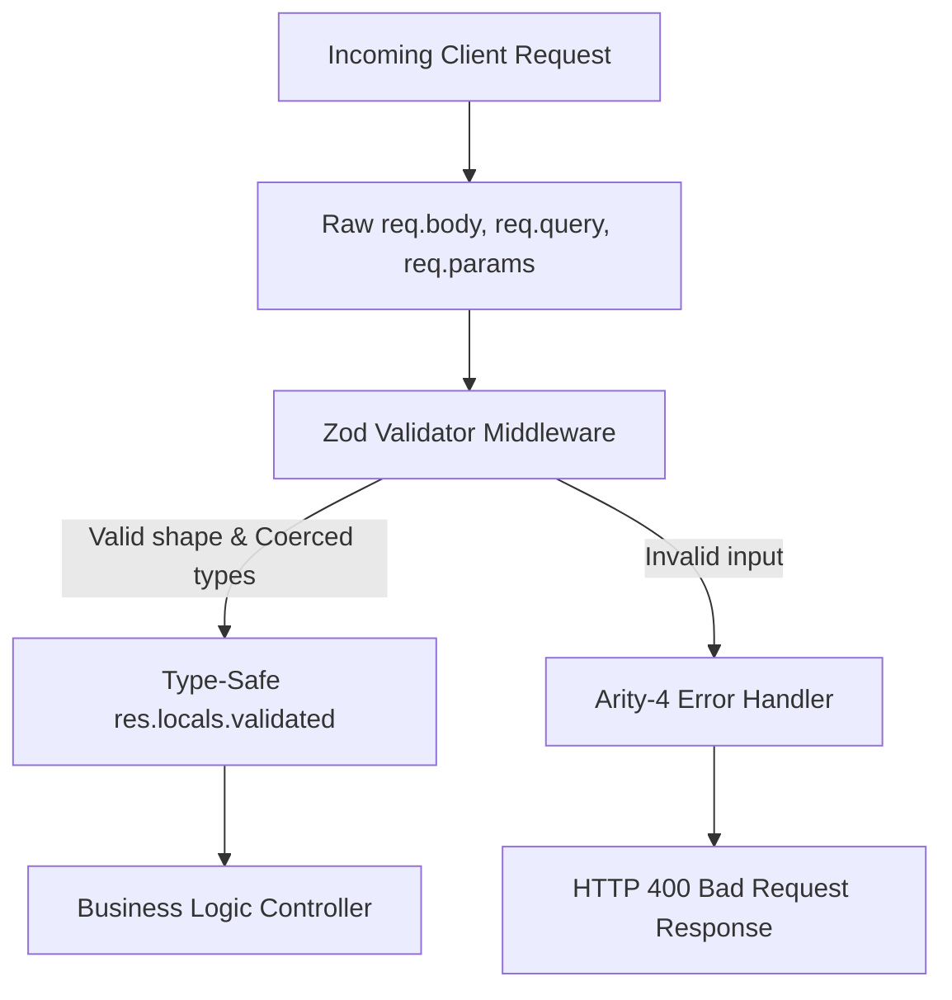

# 3.1.9. Input Validation with Zod

> [!info] Orientation
> Accepting untrusted user input directly into application handlers is the root cause of most security vulnerabilities and application runtime crashes. This note details how to build a production-ready, type-safe validation architecture in Express.js using Zod, an expressive schema validation library with native static type inference.

---

## 1. The Dangers of Untrusted Inputs

By default, an Express application parses request query strings and bodies into unvalidated, untyped JavaScript objects. This exposes your system to multiple risks:
* **Type Ambiguity:** Query parameters are parsed as strings by default. A missing check might treat a numeric ID `'123'` as a string, causing database search failures or weird mathematical errors.
* **Property Injection:** Malicious clients can submit unrequested keys (such as `role: 'admin'`) in a body payload. If you blindly spread `req.body` into a database update command, you create a privilege escalation vulnerability.
* **Malformed Payloads:** Missing required keys trigger `Cannot read properties of undefined` runtime crashes, which block the event loop or leak stack traces to clients.

### The Solution: Parse, Don't Validate
Following software engineering best practices, we use **Defensive Parsing**. Instead of writing complex `if/else` checks, we define a schema representing the expected shape and run it against the untrusted input. The schema rejects unexpected properties (strict mode), coerces types safely (e.g., converting dynamic numeric strings into floats), and strips out any unlisted fields.



---

## 2. Introducing Zod for TypeScript & JavaScript

Zod is a TypeScript-first schema declaration and validation library. It is widely preferred over alternatives like Joi or express-validator because it supports native **Static Type Inference** — you write the schema once, and Zod automatically derives TypeScript interfaces for you, preventing duplication.

### Defining Core Schemas
Let's define a schema for creating a new user:

```javascript
import { z } from 'zod';

// 📋 Define Schema
export const CreateUserSchema = z.object({
  body: z.object({
    username: z.string().min(3).max(30).trim(),
    email: z.string().email('Must be a valid email address'),
    password: z.string().min(8, 'Password must contain at least 8 characters'),
    age: z.coerce.number().int().positive().optional(),
  }),
  query: z.object({
    sendWelcomeEmail: z.coerce.boolean().default(false),
  }),
  params: z.object({
    orgId: z.string().uuid('Invalid Organization ID format'),
  })
});

// 🏷️ Infer TypeScript types
// type CreateUserPayload = z.infer<typeof CreateUserSchema>;
```

### Key Zod features highlighted in this schema:
1. **`z.coerce`:** Forces incoming dynamic HTTP strings (like query params or route parameters) to be cast safely to numbers or booleans.
2. **`trim()`:** Automatically strips leading and trailing whitespaces on strings.
3. **Structured Validation:** Validates `req.body`, `req.query`, and `req.params` simultaneously in a single, atomic operation.

---

## 3. Creating a Generic Validation Middleware

To apply this pattern elegantly across all endpoints, we write a generic Express validation middleware factory:

```javascript
// validate.js
export function validate(schema) {
  return async (req, res, next) => {
    try {
      // Parse the incoming request parts
      const parsed = await schema.parseAsync({
        body: req.body,
        query: req.query,
        params: req.params,
      });

      // Assign the validated and cleaned objects back to Express request namespaces
      req.body = parsed.body;
      req.query = parsed.query;
      req.params = parsed.params;

      // Proceed downstream with complete safety
      next();
    } catch (error) {
      // Pass the ZodError instance to the Express error handler
      next(error);
    }
  };
}
```

---

## 4. Normalizing Zod Errors inside the Error Handler

When a Zod schema validation fails, it throws a `ZodError` containing a highly detailed, nested array of validation issues (detailing the failing paths and exact reasons). We catch this in our centralized error handler and format it as a structured, client-friendly HTTP 400 payload:

```javascript
// error-handler.js
import { ZodError } from 'zod';

export function globalErrorHandler(err, req, res, next) {
  if (err instanceof ZodError) {
    return res.status(400).json({
      status: 'fail',
      error: 'Validation Failed',
      issues: err.errors.map(issue => ({
        location: issue.path[0], // 'body', 'query', or 'params'
        field: issue.path.slice(1).join('.'),
        message: issue.message,
      }))
    });
  }

  // General server errors fallback
  console.error(err);
  res.status(500).json({ status: 'error', message: 'Internal Server Error' });
}
```

---

## 5. Wiring Validation into Express Router Declarations

Now, your controller functions are completely decoupled from validation boilerplate. They can execute business logic with 100% confidence that the data matches the expected schema exactly:

```javascript
// routes/users.js
import { Router } from 'express';
import { validate } from '../middlewares/validate.js';
import { CreateUserSchema } from '../schemas/users.js';

const router = Router();

router.post(
  '/orgs/:orgId/users',
  validate(CreateUserSchema),
  async (req, res, next) => {
    try {
      // Safe to read knowing schema constraint checks have already run!
      const { orgId } = req.params;
      const { username, email, password } = req.body;
      const { sendWelcomeEmail } = req.query;

      // Execute controller logic ...
      res.status(201).json({ success: true, message: 'User created' });
    } catch (err) {
      next(err);
    }
  }
);

export default router;
```

---

## Summary

Defensive parsing with Zod eliminates the security risk of overposting / property injection, ensures absolute type consistency, and prevents application runtime crashes. By writing a generic `validate()` middleware wrapper, routing handlers remain declarative, isolating HTTP validation boundaries completely from downstream database and service modules.

## See Also

- [[3.1.5. Query Parameters and Request Object]]
- [[3.1.6. Express Middleware Architecture]]
- [[3.1.7. Express Request and Response Objects]]
- [[3.1.10. Express.js Layered Architecture and MVC]]
