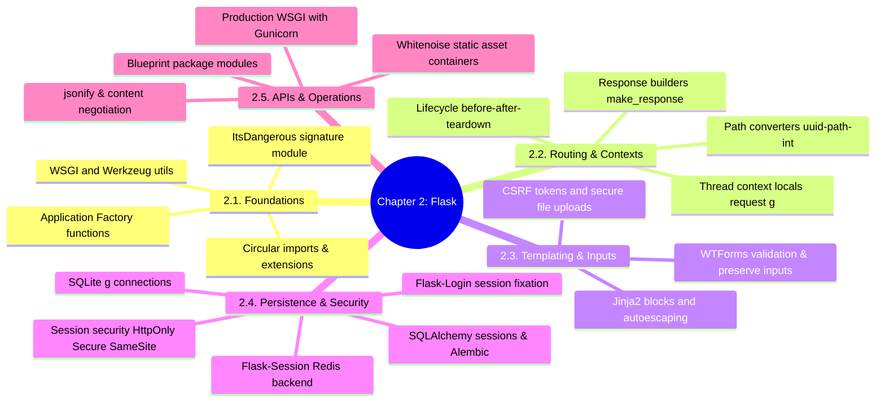

# 3.2.0. Flask MOC

> [!info] Map of Content Purpose
> This local index acts as your navigation hub for Chapter 2: Flask & Python Microframework Architecture. Flask is a highly lightweight, extension-driven Python framework. Here, we transition from minimal single-file endpoints to sophisticated application factory systems, SQLAlchemy integration, and blueprint-scoped web designs.

---

## 1. Chapter Mind Map

The mind map below lays out the key topics, configurations, and structures analyzed in this module:

---

## 2. Topic Outline & Atomic Notes

This module has 16 comprehensive notes structured to take you from a Python microframework starter to a secure web deployment:

### [[3.2.1. Introduction to Flask|1. Introduction to Flask & WSGI Primitives]]
*Understanding Flask's core engine footprint.*
* **Scope of Micro:** The core pallets dependencies (Werkzeug, Jinja2, Click, ItsDangerous, MarkupSafe).
* **WSGI Protocol:** Request/Response dictionary translation and synchronous multi-threaded worker configurations.

### [[3.2.2. Project Structure|2. Scaling with the Application Factory]]
*Structuring real-world code structures safely.*
* **Factories:** Writing `create_app()` functions to isolate testing settings and multiple app instantiations.
* **Extension Binds:** Registering extensions (e.g., `db.init_app(app)`) to prevent Python circular imports.

### [[3.2.3. Routes and Views|3. Routing, URL Conversion & Response States]]
*Setting up dynamic endpoints and managing response parameters.*
* **Path Converters:** Numeric, UUID, and directory-capturing converters (`<path:subpath>`).
* **Return Values:** Returning strings, dictionary payloads, status codes, and manual HTTP headers.

### [[3.2.4. Debugging and Dev Server|4. Interactive Debugging & CLI Engines]]
*Using tools to troubleshoot and inspect running servers.*
* **Werkzeug Debugger:** Interacting with browser exception frames using the debugger PIN mechanism.
* **Click CLI:** Adding commands via `@app.cli.command()`.

### [[3.2.5. Templates and Jinja2|5. Dynamic Views & Jinja2 Template Engine]]
*Building web views safely.*
* **Jinja2 Syntax:** Variable resolution, filter pipelines (`|safe`, `|tojson`), context injectors, and block override structures (`super()`).
* **XSS Defenses:** Autoescaping mechanisms and when/why raw formatting presents a security hazard.

### [[3.2.6. Forms and User Input|6. Form Processing, WTForms & Upload Rules]]
*Standardizing user input and protecting endpoints.*
* **WTForms abstraction:** Building declarative validator classes, preserving input, and CSRF token verification.
* **Secure Uploads:** Multi-part encoding, Werkzeug's `secure_filename()` tool, and capping request payload limits.

### [[3.2.7. Static Files|7. Managing Static Assets]]
*How web applications serve scripts, stylesheets, and images.*
* **Serving Files:** Static routing, cache busting via fingerprinted digests, and offloading serving bottlenecks using Nginx or WhiteNoise.

### [[3.2.8. URL Building and Redirects|8. Decoupled URL Mapping & Navigation Patterns]]
*Moving users safely across view states.*
* **Reverse Resolution:** Constructing absolute and relative routes with `url_for()`.
* **Redirects:** Redirecting flow and mitigating duplicate form submissions with the Post-Redirect-Get (PRG) pattern.

### [[3.2.9. Flask with SQLite and SQLAlchemy|9. The Data Persistence Layer]]
*From simple direct SQL query execution to enterprise ORM engines.*
* **Raw SQLite:** Connecting dynamically via Flask's thread context `g` object and closing with teardown callbacks.
* **SQLAlchemy & Migrations:** Defining models, loading strategies (lazy, dynamic, joined), managing transaction sessions, and versioning with Flask-Migrate (Alembic).

### [[3.2.10. Sessions and Cookies in Flask|10. State & Session Security]]
*Securing stateless client sessions and state storage.*
* **Session Storage:** Signed cookies (tamper-proof but readable) vs server-side sessions backed by Redis/databases.
* **Cookie Flags:** Mitigating XSS session theft and CSRF with `HttpOnly`, `Secure`, and `SameSite` flags.

### [[3.2.11. Blueprints and Modular Design|11. Blueprints and Modular Architecture]]
*Building pluggable feature containers in complex applications.*
* **Blueprint Modules:** Mounting sub-directories, blueprint-scoped hooks (`@bp.before_request`), and separate JSON/HTML exception handling.

### [[3.2.12. Authentication Basics in Flask|12. Building Authentication Pipelines]]
*Registering, hashing, and managing sessions.*
* **Hashing:** PBKDF2, scrypt, and Argon2 password hashing.
* **Flask-Login:** UserMixin bindings, tracking active session models, and avoiding session fixation.

### [[3.2.13. APIs with Flask and JSON|13. APIs with Flask & JSON Encodings]]
*Using Flask to return high-density data services.*
* **JSON APIs:** Content negotiation, Pydantic schemas, and marshaling structured responses.

### [[3.2.14. Error Handling|14. Exception Engines & Central Logging]]
*Interacting with errors and monitoring server diagnostics.*
* **Error Hooks:** Centralizing exception catch blocks, custom exception trees, and using `sentry-sdk`.

### [[3.2.15. Deploying to Railway or Render|15. WSGI Production Deployments]]
*Moving from local development code to high-availability servers.*
* **Production Servers:** Deploying with Gunicorn, adjusting concurrent process classes, and binding proxy correction middleware (`ProxyFix`).

### [[3.2.16. Resume Project Example|16. Comprehensive Capstone Example]]
*Putting everything together into a practical resume project.*
* **Review:** Analyzing a clean, complete implementation of Flask factories, SQLAlchemy tables, Blueprints, static rendering, and Gunicorn configurations.

---

## 3. Prerequisite Knowledge & Downstream Impact

* **Prerequisites:** 
  - Familiarity with Chapter 0 is highly helpful—especially [[3.0.4. Gateway Interfaces and Web Server Runtimes]] which introduces WSGI contracts.
* **Downstream Connections:**
  - Flask's micro-core contrasts with Django's batteries-included MVT stack discussed in Chapter 3 [[3.3.0. Django MOC]].
  - Flask-SQLAlchemy's Data Mapper pattern contrasts with Django's Active Record ORM [[3.3.4. Django ORM Deep Dive and Database Abstraction]].

---

*See also: [[00. Master Index]] — [[3.0. Chapter Index]]*
