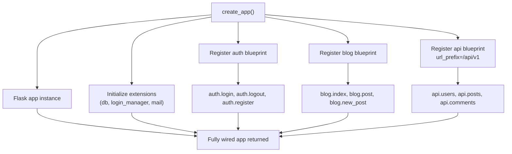

# 3.2.11. Blueprints and Modular Design

> [!info] Orientation
> Blueprints are Flask's mechanism for organizing an application into self-contained modules. This note covers what a blueprint is, creating and registering one, the `url_prefix` pattern, nested blueprints, blueprint-scoped hooks, blueprint static folders and templates, and the application factory pattern that brings it all together. A Mermaid diagram shows how the factory wires multiple blueprints into the app.

## 1. The Problem Blueprints Solve

A Flask app starts with one file containing one `app` object and a handful of `@app.route` decorators. By the time it has 30 routes, two database models, an admin section, an API, and a blog, that single module has become unmaintainable. Routes for unrelated features sit next to each other; configuration for one feature leaks into another; tests have to import the whole app to exercise any of it.

Blueprints solve this by letting you group related routes, templates, static files, and hooks into a "mini-application" that you then register on the real app. The blueprint does not have to know which app it will be attached to — it just declares its routes and hooks against itself, and the registration step binds them to the app's URL map and hook chain. The result is a project where each feature lives in its own package and can be developed, tested, and (if necessary) moved to its own service without touching the others.

## 2. What a Blueprint Is

A `Blueprint` object is a registration target that collects routes, hooks, error handlers, template filters, and CLI commands. It is not an application — it cannot serve requests on its own. It is a recipe for "when this blueprint is registered on an app, do these things".

```python
from flask import Blueprint

bp = Blueprint("auth", __name__, url_prefix="/auth")

@bp.route("/login", methods=["GET", "POST"])
def login():
    # ...
    return "Login form"

@bp.route("/logout")
def logout():
    # ...
    return "Logged out"
```

The first argument to `Blueprint()` is the **name**. It becomes the prefix for endpoint names: the `login` view above has the endpoint `auth.login`, so `url_for("auth.login")` resolves it. The `__name__` argument is used by Flask to locate the blueprint's `templates/` and `static/` folders relative to the file that defines it. The `url_prefix` is prepended to every route in the blueprint — `/login` becomes `/auth/login` at registration time.

## 3. Registering a Blueprint

The application factory registers each blueprint by calling `app.register_blueprint(bp)`:

```python
# app/__init__.py
from flask import Flask
from .auth.routes import bp as auth_bp
from .blog.routes import bp as blog_bp
from .api.routes import bp as api_bp

def create_app(config_class=Config):
    app = Flask(__name__)
    app.config.from_object(config_class)

    app.register_blueprint(auth_bp)
    app.register_blueprint(blog_bp)
    app.register_blueprint(api_bp, url_prefix="/api/v1")

    return app
```

The `url_prefix` can be passed at registration time as well as at construction time; the registration-time value overrides. This is useful when the same blueprint is mounted at different prefixes in different deployments (for example, an admin blueprint at `/admin` in production but at `/` in a single-tenant setup).

## 4. The Application Factory with Blueprints

The factory pattern from [[3.2.2. Project Structure]] pairs naturally with blueprints. The factory creates the app, initializes extensions, and registers blueprints; the blueprints themselves are defined in their own packages and know nothing about the app until registration.



This structure scales: a 50-feature app has 50 blueprints, each in its own package, each independently testable. Adding a feature means adding a package and one line to the factory. Removing a feature is the reverse.

## 5. A Real-World Layout

A medium-sized app might be organized like the following diagram, where each blueprint package owns its routes, forms, models, templates, and static files.

```mermaid
graph TD
    Root["myproject/"] --> App["app/"]
    App --> Init["__init__.py — create_app()"]
    App --> Ext["extensions.py — db, login_manager, mail"]
    App --> Conf["config.py"]
    App --> AuthPkg["auth/"]
    AuthPkg --> AuthInit["__init__.py — bp = Blueprint('auth', ...)"]
    AuthPkg --> AuthRoutes["routes.py — login, logout, register"]
    AuthPkg --> AuthForms["forms.py — LoginForm, RegisterForm"]
    AuthPkg --> AuthModels["models.py — User"]
    AuthPkg --> AuthTpl["templates/auth/ — login.html, register.html"]
    AuthPkg --> AuthStatic["static/ — auth.css"]
    App --> BlogPkg["blog/"]
    BlogPkg --> BlogInit["__init__.py — bp = Blueprint('blog', ...)"]
    BlogPkg --> BlogRoutes["routes.py — index, post, new_post"]
    BlogPkg --> BlogForms["forms.py — PostForm"]
    BlogPkg --> BlogModels["models.py — Post, Comment"]
    BlogPkg --> BlogTpl["templates/blog/ — index.html, post.html"]
    App --> ApiPkg["api/"]
    ApiPkg --> ApiInit["__init__.py — bp = Blueprint('api', ...)"]
    ApiPkg --> ApiRoutes["routes.py — users, posts, comments"]
    ApiPkg --> ApiSchemas["schemas.py — Marshmallow schemas"]
    App --> Tpl["templates/ — base.html (shared)"]
    App --> Static["static/css/ — main.css (shared)"]
    Root --> Tests["tests/ — conftest, test_auth, test_blog, test_api"]
    Root --> Mig["migrations/"]
    Root --> Req["requirements.txt"]
    Root --> Wsgi["wsgi.py"]
```



Each blueprint package contains everything that blueprint needs: routes, forms, models, templates, static files. Tests are organized the same way, so a test for `auth.login` lives in `tests/test_auth.py` and imports only the `auth` blueprint (plus a minimal app fixture). The `app/templates/` and `app/static/` folders at the top level hold app-wide resources that are not specific to any blueprint.

## 6. Template Lookup with Blueprints

Flask's template loader looks in the app's `templates/` folder first, then in each blueprint's `templates/` folder. To avoid name conflicts, blueprint templates live in a subfolder named after the blueprint:

```
app/auth/templates/auth/login.html
```

```python
# Inside auth blueprint
return render_template("auth/login.html", form=form)
```

This convention (folder name matching blueprint name) prevents two blueprints from accidentally shadowing each other's `login.html`. The app-level `templates/base.html` is found first, so blueprint templates can `` to use the shared layout.

## 7. Blueprint-Scoped Hooks

Blueprints can register `before_request`, `after_request`, `teardown_request`, and `errorhandler` hooks that apply only to requests hitting that blueprint. This is how you enforce auth on every route in a blueprint without touching the others.

```python
from flask import request, abort

@bp.before_request
def require_auth():
    if not current_user.is_authenticated:
        abort(401)

@bp.after_request
def add_cache_header(response):
    response.headers["X-Auth-BP"] = "1"
    return response
```

`@bp.before_request` runs only for requests that match a route in this blueprint. App-level `@app.before_request` runs for every request, regardless of blueprint. Use the blueprint-scoped form for concerns that are blueprint-specific (auth on admin routes, rate limiting on API routes); use the app-level form for concerns that apply everywhere (CSRF, request logging).

## 8. Blueprint Error Handlers

`@bp.errorhandler(403)` handles errors raised inside this blueprint's views only. This is useful when the API blueprint wants to return JSON errors but the HTML blueprints want HTML error pages:

```python
# api/__init__.py
@bp.errorhandler(404)
def api_not_found(error):
    return jsonify(error="Resource not found"), 404

@bp.errorhandler(400)
def api_bad_request(error):
    return jsonify(error=str(error.description)), 400
```

App-level error handlers run only if no blueprint-level handler matches. So the registration order is: blueprint handler → app handler → Flask's default error page.

## 9. Nested Blueprints

Flask 2.0 added support for nesting blueprints. A parent blueprint can register a child blueprint, and the child's routes inherit the parent's `url_prefix` and hooks. This is useful for grouping related sub-features:

```python
from flask import Blueprint

admin = Blueprint("admin", __name__, url_prefix="/admin")
admin_users = Blueprint("admin_users", __name__, url_prefix="/users")

@admin_users.route("/")
def list_users():
    return "User list"

admin.register_blueprint(admin_users)
app.register_blueprint(admin)
# Routes: /admin/users/ -> admin_users.list_users
```

The endpoint name is the dotted path: `admin_users.list_users`. Hooks registered on `admin` apply to routes in `admin_users`; hooks registered on `admin_users` apply only to its routes. Nesting deeper than two levels is usually a sign that the structure is wrong — prefer sibling blueprints with explicit prefixes.

## 10. Blueprint Static Files and CLI Commands

A blueprint can have its own `static/` folder, served at `/<bp_name>/static/<filename>` by default. Use it for plugin-style blueprints that ship their own CSS/JS:

```python
bp = Blueprint("admin", __name__, static_folder="static")
```

```html
<link href="{{ url_for('admin.static', filename='admin.css') }}" rel="stylesheet">
```

Blueprints can also register CLI commands with `@bp.cli.command("seed")`, invoked as `flask --app app admin seed`. This is how a `db` blueprint could expose `flask db seed` or `flask db reset` without polluting the global `flask` command namespace.

## Summary

Blueprints are self-contained modules that group routes, hooks, templates, static files, and CLI commands. You create one with `Blueprint(name, __name__, url_prefix=...)`, define views with `@bp.route`, and register it on the app with `app.register_blueprint(bp)`. The application factory pattern composes blueprints into a fully wired app, with each blueprint living in its own package and tested independently. Blueprint-scoped hooks (`@bp.before_request`, `@bp.errorhandler`) isolate cross-cutting concerns to the routes that need them. Nested blueprints allow hierarchical composition for large feature areas. The next note, [[3.2.12. Authentication Basics in Flask]], applies blueprints to a concrete use case: login, logout, and protected routes.

## See Also

- [[3.2.2. Project Structure]]
- [[3.2.12. Authentication Basics in Flask]]
- [[3.2.13. APIs with Flask and JSON]]
- [[3.2.16. Resume Project Example]]

## References

- Flask blueprints: https://flask.palletsprojects.com/en/latest/blueprints/
- Modular applications with blueprints: https://flask.palletsprojects.com/en/latest/patterns/packages/
- Nested blueprints (Flask 2.0+): https://flask.palletsprojects.com/en/latest/blueprints/#nested-blueprints
