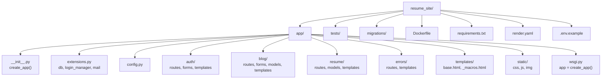

# 3.2.16. Resume Project Example

> [!info] Orientation
> This note ties together every concept in the Flask chapter by walking through a single deployable project: a personal resume plus a small blog. It covers the project structure, the blueprints (auth, blog, resume), the SQLAlchemy models, WTForms for blog post creation, Flask-Login for auth, Jinja2 templates with inheritance, environment-driven configuration, and deployment to Render. A Mermaid graph shows the file tree.

## 1. The Project

The goal is a personal site with three sections. A public resume page shows name, bio, and a list of projects. A blog lists published posts and shows individual posts on their own pages. An admin section, accessible only to the authenticated owner, lets the owner create, edit, and delete posts and projects. The whole thing deploys to Render on a single web service backed by PostgreSQL, with static assets served via Whitenoise and Sentry for error tracking.

The project exercises every major Flask concept: the application factory, blueprints, SQLAlchemy models and migrations, WTForms with CSRF, Flask-Login, Jinja2 inheritance, error handlers, environment configuration, Gunicorn, and a Dockerfile. It is small enough to fit in your head and large enough that the architectural choices matter.

## 2. File Structure



The `app/` package is the application code. Each feature has its own package (`auth/`, `blog/`, `resume/`, `errors/`) containing routes, forms, models, and templates specific to that feature. Shared templates live in `app/templates/`. Shared static files live in `app/static/`. The `wsgi.py` module at the top level is what Gunicorn imports. The `render.yaml` is Render's Blueprint file (optional but useful for reproducible deploys).

## 3. The Application Factory

```python
# app/__init__.py
import os
from flask import Flask
from flask_login import LoginManager
from flask_migrate import Migrate
from .extensions import db
from .config import Config


def create_app(config_class=Config):
    app = Flask(__name__)
    app.config.from_object(config_class)

    db.init_app(app)
    Migrate(app, db)

    login_manager = LoginManager()
    login_manager.init_app(app)
    login_manager.login_view = "auth.login"
    login_manager.login_message_category = "info"

    @login_manager.user_loader
    def load_user(user_id):
        from .auth.models import User
        return db.session.get(User, int(user_id))

    from .auth.routes import bp as auth_bp
    from .blog.routes import bp as blog_bp
    from .resume.routes import bp as resume_bp
    from .errors.routes import bp as errors_bp

    app.register_blueprint(auth_bp, url_prefix="/auth")
    app.register_blueprint(blog_bp, url_prefix="/blog")
    app.register_blueprint(resume_bp, url_prefix="/resume")
    app.register_blueprint(errors_bp)

    @app.context_processor
    def inject_globals():
        from flask_login import current_user
        return {"site_name": "Jane Doe", "current_user": current_user}

    @app.route("/health")
    def health():
        from sqlalchemy import text
        try:
            db.session.execute(text("SELECT 1")).scalar()
        except Exception:
            return "db down", 503
        return "ok", 200

    return app
```

The factory initializes extensions, registers blueprints, sets up the user loader, injects globals into every template, and exposes a `/health` endpoint for the platform's liveness checks. Note the local imports inside `user_loader` and `health` — they avoid circular imports that would arise from importing models at module top.

## 4. The Models

Three SQLAlchemy models back the site: `User` (the owner), `Post` (blog posts), and `Project` (resume projects).

```python
# auth/models.py
from datetime import datetime
from flask_login import UserMixin
from app.extensions import db


class User(UserMixin, db.Model):
    __tablename__ = "users"
    id = db.Column(db.Integer, primary_key=True)
    username = db.Column(db.String(80), unique=True, nullable=False)
    email = db.Column(db.String(120), unique=True, nullable=False)
    password_hash = db.Column(db.String(255), nullable=False)
    created_at = db.Column(db.DateTime, default=datetime.utcnow, nullable=False)


# blog/models.py
class Post(db.Model):
    __tablename__ = "posts"
    id = db.Column(db.Integer, primary_key=True)
    title = db.Column(db.String(200), nullable=False)
    slug = db.Column(db.String(220), unique=True, nullable=False, index=True)
    body = db.Column(db.Text, nullable=False)
    published = db.Column(db.Boolean, default=False, nullable=False)
    published_at = db.Column(db.DateTime, nullable=True, index=True)
    author_id = db.Column(db.Integer, db.ForeignKey("users.id"), nullable=False)
    author = db.relationship("User", backref="posts")


# resume/models.py
class Project(db.Model):
    __tablename__ = "projects"
    id = db.Column(db.Integer, primary_key=True)
    title = db.Column(db.String(200), nullable=False)
    description = db.Column(db.Text, nullable=False)
    url = db.Column(db.String(500), nullable=True)
    display_order = db.Column(db.Integer, default=0, nullable=False)
```

The `slug` column on `Post` lets URLs be `/blog/my-first-post` instead of `/blog/42`. The `published` flag plus `published_at` index let the blog index query show only published posts, ordered by date, with an indexed lookup. The `display_order` on `Project` lets the owner control the order projects appear in on the resume page without reordering IDs.

## 5. Auth Blueprint

```python
# auth/routes.py
from flask import Blueprint, render_template, redirect, url_for, request, flash
from flask_login import login_user, logout_user, login_required
from werkzeug.security import check_password_hash
from .forms import LoginForm
from .models import User

bp = Blueprint("auth", __name__)


@bp.route("/login", methods=["GET", "POST"])
def login():
    form = LoginForm()
    if form.validate_on_submit():
        user = User.query.filter_by(username=form.username.data).first()
        if user and check_password_hash(user.password_hash, form.password.data):
            login_user(user, remember=form.remember_me.data)
            next_url = request.args.get("next")
            if not next_url or not next_url.startswith("/"):
                next_url = url_for("blog.index")
            return redirect(next_url)
        flash("Invalid username or password.", "error")
    return render_template("auth/login.html", form=form)


@bp.route("/logout")
@login_required
def logout():
    logout_user()
    return redirect(url_for("blog.index"))
```

```python
# auth/forms.py
from flask_wtf import FlaskForm
from wtforms import StringField, PasswordField, BooleanField, SubmitField
from wtforms.validators import DataRequired


class LoginForm(FlaskForm):
    username = StringField("Username", validators=[DataRequired()])
    password = PasswordField("Password", validators=[DataRequired()])
    remember_me = BooleanField("Remember me")
    submit = SubmitField("Log in")
```

The login view validates `next` starts with `/` to prevent open redirects. The `LoginForm` is a standard WTForms class with `DataRequired` validators on both fields. The CSRF token is rendered automatically by `{{ form.csrf_token }}` in the template.

## 6. Blog Blueprint

```python
# blog/routes.py
from flask import Blueprint, render_template, redirect, url_for, abort
from flask_login import login_required, current_user
from .models import Post
from .forms import PostForm

bp = Blueprint("blog", __name__)


@bp.route("/")
def index():
    posts = Post.query.filter_by(published=True).order_by(
        Post.published_at.desc()
    ).limit(20).all()
    return render_template("blog/index.html", posts=posts)


@bp.route("/<slug>")
def show(slug):
    post = Post.query.filter_by(slug=slug).first_or_404()
    if not post.published and post.author_id != current_user.id:
        abort(404)
    return render_template("blog/post.html", post=post)


@bp.route("/new", methods=["GET", "POST"])
@login_required
def new_post():
    form = PostForm()
    if form.validate_on_submit():
        post = Post(
            title=form.title.data,
            slug=form.slug.data,
            body=form.body.data,
            published=form.published.data,
            author_id=current_user.id,
            published_at=datetime.utcnow() if form.published.data else None,
        )
        db.session.add(post)
        db.session.commit()
        return redirect(url_for("blog.show", slug=post.slug))
    return render_template("blog/edit.html", form=form)
```

The blog index shows only published posts, ordered by `published_at` descending. The `show` view returns 404 for unpublished posts unless the viewer is the author — a soft "preview" feature. The `new_post` view is protected by `@login_required` and uses the POST-REDIRECT-GET pattern from [[3.2.8. URL Building and Redirects]]: on successful POST, it redirects to the new post's page rather than rendering inline.

## 7. Templates

The base template holds the HTML skeleton, navigation, and footer. Every other template extends it.

```html
<!-- app/templates/base.html -->
<!DOCTYPE html>
<html lang="en">
<head>
  <meta charset="UTF-8">
  <meta name="viewport" content="width=device-width, initial-scale=1.0">
  <title>{{ site_name }}</title>
  <link rel="stylesheet" href="{{ url_for('static', filename='css/main.css') }}">
</head>
<body>
  <nav>
    <a href="{{ url_for('blog.index') }}">{{ site_name }}</a>
    <a href="{{ url_for('resume.index') }}">Resume</a>
    
      <a href="{{ url_for('blog.new_post') }}">New Post</a>
      <a href="{{ url_for('auth.logout') }}">Log out</a>
    
      <a href="{{ url_for('auth.login') }}">Log in</a>
    
  </nav>

  <main>
    
      
        <ul class="flashes">
          
            <li class="flash-{{ category }}">{{ message }}</li>
          
        </ul>
      
    
    
  </main>

  <footer>&copy; {{ site_name }}</footer>
</body>
</html>
```

```html
<!-- app/blog/templates/blog/index.html -->


Blog - {{ super() }}


  <h1>Blog</h1>
  
    <article>
      <h2><a href="{{ url_for('blog.show', slug=post.slug) }}">{{ post.title }}</a></h2>
      <time>{{ post.published_at.strftime("%Y-%m-%d") }}</time>
      <p>{{ post.body | truncate(200, true) }}</p>
    </article>
  
    <p>No posts yet.</p>
  

```

The base template uses `url_for` for every link, so a route rename propagates without touching templates. The `get_flashed_messages` block shows one-time messages from `flash()` calls. `{{ post.body | truncate(200, true) }}` produces a 200-character excerpt with ellipsis. The blog index extends `base.html` and overrides only `title` and `content` blocks; `super()` in the title block inserts the base's title for consistent branding.

## 8. Configuration

```python
# config.py
import os
from dotenv import load_dotenv

load_dotenv()


class Config:
    SECRET_KEY = os.environ["SECRET_KEY"]
    SQLALCHEMY_DATABASE_URI = os.environ.get("DATABASE_URL", "sqlite:///dev.db")
    SQLALCHEMY_TRACK_MODIFICATIONS = False
    SQLALCHEMY_ENGINE_OPTIONS = {
        "pool_size": 5,
        "pool_recycle": 1800,
        "pool_pre_ping": True,
    }
    SESSION_COOKIE_SECURE = True
    SESSION_COOKIE_HTTPONLY = True
    SESSION_COOKIE_SAMESITE = "Lax"
    WTF_CSRF_TIME_LIMIT = None


class DevConfig(Config):
    DEBUG = True
    SESSION_COOKIE_SECURE = False  # for local HTTP


class TestConfig(Config):
    TESTING = True
    SQLALCHEMY_DATABASE_URI = "sqlite:///:memory:"
    WTF_CSRF_ENABLED = False
```

Every secret comes from the environment. `SECRET_KEY` is read with `os.environ[]` so the app fails loudly if it is missing. The `DATABASE_URL` falls back to a local SQLite file for development convenience. The `SESSION_COOKIE_SECURE` toggle in `DevConfig` is necessary because local dev runs over HTTP and a `Secure` cookie would not be sent. CSRF is disabled in tests so test clients can POST without setting up the token.

## 9. Deployment to Render

```dockerfile
# Dockerfile
FROM python:3.12-slim

WORKDIR /app
COPY requirements.txt .
RUN pip install --no-cache-dir -r requirements.txt

COPY . .

EXPOSE 8000
CMD ["gunicorn", "wsgi:app", \
     "--workers", "4", "--threads", "8", \
     "--timeout", "30", "--bind", "0.0.0.0:8000"]
```

```text
# requirements.txt
Flask==3.0.3
Flask-SQLAlchemy==3.1.1
Flask-Migrate==4.0.7
Flask-Login==0.6.3
Flask-WTF==1.2.1
python-dotenv==1.0.1
psycopg2-binary==2.9.9
gunicorn==22.0.0
whitenoise==6.6.0
sentry-sdk[flask]==2.3.1
```

```yaml
# render.yaml
services:
  - type: web
    name: resume-site
    env: docker
    healthCheckPath: /health
    envVars:
      - key: SECRET_KEY
        sync: false
      - key: DATABASE_URL
        fromDatabase:
          name: resume-db
          property: connectionString
      - key: PYTHON_VERSION
        value: "3.12"
databases:
  - name: resume-db
    plan: starter
```

`render.yaml` lets you reproduce the entire infrastructure with one click. `sync: false` on `SECRET_KEY` marks it as a secret that must be entered manually in the dashboard rather than written to the YAML file. The `DATABASE_URL` is wired from the database service automatically. The `healthCheckPath: /health` tells Render to hit `/health` for liveness checks.

The deploy flow is: push to GitHub, Render builds the Docker image, Render starts the new container, the `/health` endpoint must return 200 within a few minutes or the deploy is rolled back. Migrations run as a "release command" (`flask --app wsgi db upgrade`) before the new container starts serving traffic.

## 10. What This Demonstrates

Every concept from the chapter appears in this project. The application factory (3.2.2), routes and views (3.2.3), the dev server and debugging (3.2.4), templates and Jinja2 (3.2.5), forms with WTForms (3.2.6), static files via Whitenoise (3.2.7), URL building with `url_for` (3.2.8), SQLAlchemy models and migrations (3.2.9), sessions via Flask-Login (3.2.10), three blueprints (3.2.11), authentication (3.2.12), the JSON `/health` endpoint (3.2.13), error handlers in the errors blueprint (3.2.14), Gunicorn + Render deployment (3.2.15). Build this once, deploy it, and you have a working mental model of a real Flask application.

## Summary

The resume site project ties together the application factory, blueprints, SQLAlchemy models, WTForms, Flask-Login, Jinja2 inheritance, environment-driven configuration, and Gunicorn deployment into a single deployable app. Three blueprints (auth, blog, resume) each own their routes, forms, models, and templates. The factory wires them together with shared extensions and a context processor. Configuration comes entirely from environment variables. Deployment uses a Dockerfile + `render.yaml` so the whole stack is reproducible from a single `git push`. This is the smallest project that exercises every major Flask concept; once you can build this from memory, you have the framework.

## See Also

- [[3.2.2. Project Structure]]
- [[3.2.11. Blueprints and Modular Design]]
- [[3.2.12. Authentication Basics in Flask]]
- [[3.2.15. Deploying to Railway or Render]]

## References

- Flask tutorial (official): https://flask.palletsprojects.com/en/latest/tutorial/
- Miguel Grinberg, *The Flask Mega-Tutorial*: https://blog.miguelgrinberg.com/post/the-flask-mega-tutorial-part-i-hello-world
- Render Blueprints: https://render.com/docs/blueprint-spec
- Flask deployment patterns: https://flask.palletsprojects.com/en/latest/patterns/
