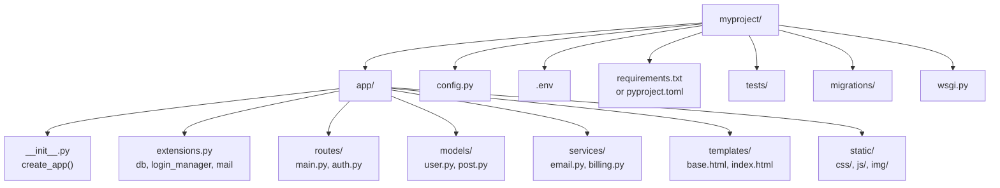

# 3.2.2. Project Structure

> [!info] Orientation
> A Flask app starts as a single file and almost always grows past it. This note covers the application factory pattern, the typical package layout, configuration management with environment variables, and the choice between `requirements.txt` and `pyproject.toml`.

## 1. Single-File Apps vs Packages

The Hello World example in [[3.2.1. Introduction to Flask]] is one file. That is genuinely fine for tiny scripts, demos, and learning exercises — Flask does not penalize you for it. The friction begins the moment you add a second route module, a database model, a background task, or a template. Imports become circular, configuration gets hardcoded, and tests have to spin up the whole app just to exercise one view. The cure is to convert the single file into a Python package and apply the **application factory pattern**.

A Python package is just a directory containing an `__init__.py` file. The presence of `__init__.py` makes the directory importable as `import myproject`, which is what `flask run` and your test suite expect. Inside the package you keep the Flask app instance, configuration, extensions, and the registration logic that wires everything together. Outside the package you keep the project root, the virtual environment, the `.env` file, and any Docker or deployment files.

## 2. The Application Factory Pattern

The application factory is a function called `create_app()` that builds and returns a configured Flask instance. Instead of creating `app = Flask(__name__)` at module level, you create it inside a function. This single change has three payoffs. First, you can pass a config name (`"testing"`, `"development"`, `"production"`) into the factory and have it load different settings. Second, your tests can call `create_app("testing")` for each test, getting a fresh app with no shared global state. Third, you can run multiple instances of the same app in the same process — useful for scripting, background workers, and some WSGI server configurations.

```python
# app/__init__.py
from flask import Flask
from .extensions import db, login_manager
from .config import Config, TestConfig

def create_app(config_class=Config):
    app = Flask(__name__)
    app.config.from_object(config_class)

    db.init_app(app)
    login_manager.init_app(app)

    from .routes.main import bp as main_bp
    from .routes.auth import bp as auth_bp
    app.register_blueprint(main_bp)
    app.register_blueprint(auth_bp, url_prefix="/auth")

    return app
```

The factory does five things: instantiate the app, load configuration, initialize extensions, register blueprints, and return the app. Extensions are defined in a separate `extensions.py` module so they can be imported without creating a circular dependency with the app factory. Blueprints are imported inside the function body, not at module top, for the same reason.

## 3. Typical Package Layout

A medium-sized Flask project looks like this:



The `app/` package contains the application code. `config.py` holds configuration classes (`Config`, `DevConfig`, `TestConfig`, `ProdConfig`) that read environment variables. `.env` (loaded by `python-dotenv`) holds the actual secrets — `SECRET_KEY`, `DATABASE_URL`, `SMTP_PASSWORD` — and is never committed to version control. `tests/` mirrors the package structure for unit and integration tests. `migrations/` is generated by `Flask-Migrate` (Alembic) and tracks schema evolution. `wsgi.py` is the entry point that production WSGI servers import.

The `routes/`, `models/`, and `services/` sub-packages separate the three concerns of HTTP handling, persistence, and business logic. A common mistake is to put database queries directly inside view functions; for anything non-trivial, push that logic into a `services/` module so views stay readable and the logic is testable without an HTTP request.

## 4. Configuration Management

Configuration in Flask is a plain dict-like object on `app.config`. The factory loads it with `app.config.from_object(config_class)`, where each class defines uppercase keys. Secrets come from environment variables, never from the class itself:

```python
# config.py
import os
from dotenv import load_dotenv

load_dotenv()

class Config:
    SECRET_KEY = os.environ["SECRET_KEY"]
    SQLALCHEMY_DATABASE_URI = os.environ.get("DATABASE_URL", "sqlite:///app.db")
    SQLALCHEMY_TRACK_MODIFICATIONS = False
    SESSION_COOKIE_SECURE = True
    SESSION_COOKIE_HTTPONLY = True
    SESSION_COOKIE_SAMESITE = "Lax"

class TestConfig(Config):
    TESTING = True
    SQLALCHEMY_DATABASE_URI = "sqlite:///:memory:"
    WTF_CSRF_ENABLED = False
```

Reading `SECRET_KEY` with `os.environ["SECRET_KEY"]` (no default) makes the app fail loudly at startup if the secret is missing — which is what you want, because a guessed or empty secret key breaks session security entirely. `python-dotenv`'s `load_dotenv()` reads `.env` automatically when the module is imported, so the variables are available before `Config` is evaluated.

## 5. requirements.txt vs pyproject.toml

Two packaging conventions coexist. `requirements.txt` is the older, simpler format — one pinned dependency per line, installed with `pip install -r requirements.txt`. It works fine for small projects and is what most deployment platforms expect by default. `pyproject.toml` is the modern PEP 621 standard, understood by `pip`, `poetry`, `hatch`, `uv`, and `pdm`. It declares project metadata, dependencies, dev dependencies, and tool configuration (Black, Ruff, Pytest) in one file.

```toml
# pyproject.toml
[project]
name = "myproject"
version = "0.1.0"
requires-python = ">=3.10"
dependencies = [
    "flask>=3.0",
    "flask-sqlalchemy>=3.1",
    "flask-login>=0.6",
    "python-dotenv>=1.0",
]

[project.optional-dependencies]
dev = ["pytest>=8.0", "ruff>=0.4"]

[tool.pytest.ini_options]
testpaths = ["tests"]
```

For new projects, prefer `pyproject.toml`. For existing projects that already have `requirements.txt`, do not migrate unless you have a reason — both work, and the migration churn is rarely worth it. Either way, pin your dependencies with exact versions in deployment (`pip freeze > requirements.txt`) to avoid surprise breakage from upstream releases.

## 6. The wsgi.py Entry Point

In development you start Flask with `flask run` or `python app.py`. In production, the WSGI server (Gunicorn, uWSGI) imports your app as a Python object. The convention is a top-level `wsgi.py` that calls the factory:

```python
# wsgi.py
from app import create_app

app = create_app()
```

Gunicorn is then invoked as `gunicorn 'wsgi:app'` (or `gunicorn 'app:create_app()'` if you prefer calling the factory inline). This indirection matters because it forces you to use the factory pattern, which in turn forces configuration to come from the environment rather than from module-level code — exactly what you need for clean deployment to Railway, Render, or a Docker container.

## Summary

A real Flask app is a Python package that exposes a `create_app()` factory, loads configuration from environment variables via `python-dotenv`, initializes extensions in a separate `extensions.py`, and registers blueprints for each major feature area. Choose `pyproject.toml` for new projects and `requirements.txt` for legacy ones, but pin both. The factory pattern pays off the first time you write a test or deploy to a second environment. The next note, [[3.2.3. Routes and Views]], covers how URL patterns map to view functions inside this structure.

## See Also

- [[3.2.1. Introduction to Flask]]
- [[3.2.3. Routes and Views]]
- [[3.2.11. Blueprints and Modular Design]]
- [[3.2.15. Deploying to Railway or Render]]

## References

- Flask application factories: https://flask.palletsprojects.com/en/latest/patterns/appfactories/
- Flask configuration: https://flask.palletsprojects.com/en/latest/config/
- PEP 621 — Storing project metadata in `pyproject.toml`: https://peps.python.org/pep-0621/
- python-dotenv: https://github.com/theskumar/python-dotenv
