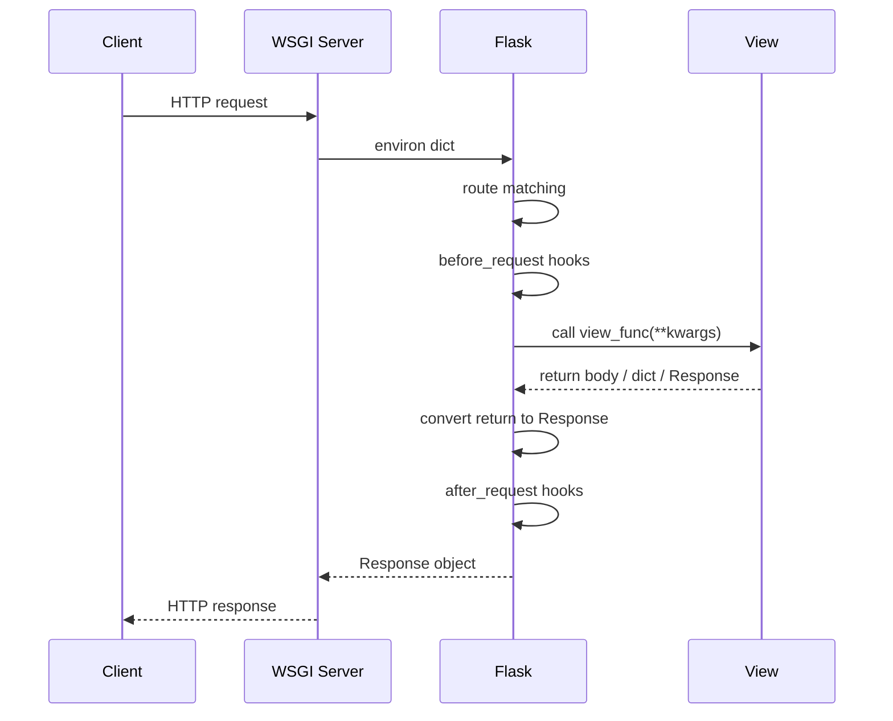

# 3.2.3. Routes and Views

> [!info] Orientation
> Routes and views are the backbone of every Flask application. This note covers the `@app.route` decorator, URL converters for typed path parameters, allowed HTTP methods, the alternative `add_url_rule()` API, trailing-slash behavior, and reverse URL building with `url_for()`. It also traces the full request-to-response lifecycle in a sequence diagram.

## 1. What Routes and Views Are

A **route** is a URL pattern that Flask recognizes. A **view function** is the Python callable that Flask invokes when an incoming request matches that pattern. Together they form the mapping between HTTP and your code. Flask stores routes in a `Map` provided by Werkzeug, and at request time the `MapAdapter` matches the request's path and method against the registered rules. The first matching rule wins, which is why order of registration does not matter but specificity does (a more specific rule should not be shadowed by a catch-all).

The contract for a view function is simple: accept any URL converters as keyword arguments, return a value Flask can convert into a response. Strings, dicts, tuples, and `Response` objects are all valid return values. The view function is also a normal Python function, which means you can unit-test it directly by calling it with the same arguments Flask would pass — no HTTP round-trip required.

## 2. The @app.route Decorator

The decorator is the most common way to register a route. It binds a URL pattern to the function immediately below it.

```python
from flask import Flask

app = Flask(__name__)

@app.route("/")
def index():
    return "Welcome to the homepage."

@app.route("/about")
def about():
    return "About this site."
```

`@app.route("/")` tells Flask that a request for the root path should call `index()`. `@app.route("/about")` does the same for `/about`. The decorator returns the original function unchanged, so `index` and `about` are still regular callables you can import and test. Under the hood, `@app.route` calls `app.add_url_rule(rule, endpoint, view_func)`, where the `endpoint` defaults to the view function's name.

## 3. URL Converters

Static routes are rarely enough. Real applications need to capture parts of the URL — an ID, a slug, a UUID — and pass them to the view. Flask uses `<converter:variable>` syntax inside the rule, where `converter` is optional and defaults to `string`.

| Converter | Matches | Python type | Example rule |
| --------- | ------- | ----------- | ------------ |
| `string` | Any text without slashes (default) | `str` | `/<string:name>` |
| `int` | Positive integers | `int` | `/<int:id>` |
| `float` | Positive floats | `float` | `/<float:price>` |
| `path` | Any text including slashes | `str` | `/<path:subpath>` |
| `uuid` | UUID strings with dashes | `uuid.UUID` | `/<uuid:uid>` |

```python
@app.route("/user/<username>")
def user_profile(username):
    return f"Profile of {username}"

@app.route("/post/<int:post_id>")
def show_post(post_id):
    return f"Post #{post_id} (type: {type(post_id).__name__})"

@app.route("/download/<path:filepath>")
def download(filepath):
    return f"Serving file at {filepath}"
```

If the converter cannot parse the URL segment (for example, `/post/abc` against `/<int:post_id>`), Flask returns a `404 Not Found` immediately — the view function is never called. This gives you free type validation at the routing layer, before any of your view code runs. Custom converters can be registered with `app.url_map.converters["regex"] = RegexConverter` for cases the built-ins do not cover.

## 4. HTTP Methods

By default a route answers `GET` and `HEAD` (Flask handles `HEAD` automatically). To accept `POST`, `PUT`, `PATCH`, or `DELETE`, pass the `methods` argument:

```python
from flask import request

@app.route("/login", methods=["GET", "POST"])
def login():
    if request.method == "POST":
        username = request.form.get("username")
        return f"Logging in {username}"
    return """
    <form method="post">
      <input name="username">
      <input type="submit" value="Login">
    </form>
    """
```

Inside the view, `request.method` tells you which verb was used. For APIs, a cleaner pattern is one route per method, or one route that delegates to a small dispatch table. Flask 2.0 also added `@app.get("/users")` and `@app.post("/users")` shortcuts for the common case where a route answers only one method.

If a request arrives with a method the route does not list, Flask responds `405 Method Not Allowed` and includes an `Allow` header listing the permitted methods. This is automatic; you do not need to handle it in the view.

## 5. View Return Values

A view function can return any of the following, and Flask converts it into a proper HTTP response:

| Return type | Result |
| ----------- | ------ |
| `str` | Body, status `200`, content type `text/html` |
| `dict` / `list` | JSON-serialized body, content type `application/json` (Flask 1.1+) |
| `tuple` of `(body, status)` or `(body, status, headers)` | Full control |
| `Response` object | Used as-is |
| Generator | Streamed response |

```python
@app.route("/api/health")
def health():
    return {"status": "ok", "version": "1.0"}

@app.route("/api/created", methods=["POST"])
def create():
    return {"id": 42}, 201, {"Location": "/api/42"}

from flask import Response

@app.route("/stream")
def stream():
    def generate():
        yield "data: chunk1\n\n"
        yield "data: chunk2\n\n"
    return Response(generate(), mimetype="text/event-stream")
```

Returning a dict is the most convenient way to build JSON endpoints. Flask uses the app's JSON provider to serialize it and sets the correct content type. For more control — custom serializers, status codes, headers — return a tuple or build a `Response` explicitly with `make_response()`.

## 6. add_url_rule — The Non-Decorator Form

`@app.route` is syntactic sugar for `app.add_url_rule`. The two are exactly equivalent, and `add_url_rule` is useful when you want to register a view that lives elsewhere (for example, a class-based view or a function imported from another module).

```python
def hello():
    return "Hello, world."

app.add_url_rule("/hello", "hello", hello)
app.add_url_rule("/hi", "hi", hello)  # same view, two URLs
```

The second argument is the **endpoint name**, which is what `url_for()` uses to reverse the URL. By default the endpoint equals the view function's name, so `url_for("hello")` returns `/hello`. Registering the same view under two URLs gives you two endpoints — `url_for("hello")` returns `/hello`, `url_for("hi")` returns `/hi`.

## 7. Trailing Slashes

Flask follows a convention that mirrors the file-system metaphor: a rule without a trailing slash matches a "file", a rule with a trailing slash matches a "directory". The result is two related behaviors you must understand.

If you register `@app.route("/projects/")` and a request arrives for `/projects`, Flask responds with a `308 Permanent Redirect` to `/projects/`. If you register `@app.route("/projects")` (no slash) and a request arrives for `/projects/`, Flask responds `404 Not Found`. The asymmetry is deliberate: it forces canonical URLs and avoids duplicate-content issues, but it surprises newcomers. Pick one convention for your project and stick to it — most Flask APIs prefer no trailing slashes, most Flask HTML apps prefer them.

## 8. url_for — Reverse URL Building

`url_for("endpoint_name", arg=value)` generates a URL by looking up the rule registered under that endpoint. It is the only correct way to build internal URLs in templates and view code, because it survives URL refactoring.

```python
from flask import url_for

@app.route("/user/<username>")
def profile(username):
    return f"Hi {username}"

with app.test_request_context():
    url_for("profile", username="alice")    # "/user/alice"
    url_for("profile", username="bob", q=1) # "/user/bob?q=1"
    url_for("static", filename="style.css") # "/static/style.css"
```

Hardcoding URLs in templates or `redirect()` calls is a maintenance trap. Rename a route and every hardcoded URL breaks silently. Use `url_for()` and the URL updates automatically. The same function works for static files, blueprint endpoints (`url_for("auth.login")`), and external URLs (`url_for("profile", username="alice", _external=True)`).

## 9. Request-Response Lifecycle

Flask's per-request flow is a sequence of well-defined steps. Understanding it tells you exactly when each hook runs and where to insert custom behavior.



`before_request` functions run before the view and can short-circuit by returning a response (used for auth checks, rate limiting). `after_request` functions run after the view and can modify the response (used for adding headers, logging). If the view raises an exception that matches an `errorhandler`, that handler runs instead and produces the response. `teardown_request` runs last, regardless of success or failure, and is used for cleanup like closing database connections.

## Summary

Routes are URL patterns registered with `@app.route` or `add_url_rule`. URL converters give you typed path parameters for free, the `methods` argument restricts which HTTP verbs a route answers, and `url_for()` is the only safe way to build internal URLs. The request lifecycle is a fixed sequence of matching, hooks, view, conversion, hooks — knowing it lets you reason about when custom code runs. The next note, [[3.2.4. Debugging and Dev Server]], covers the development server that runs all of this locally.

## See Also

- [[3.2.4. Debugging and Dev Server]]
- [[3.2.8. URL Building and Redirects]]
- [[3.2.13. APIs with Flask and JSON]]
- [[1.1. HTTP Protocol and Lifecycle]]

## References

- Flask routing: https://flask.palletsprojects.com/en/latest/quickstart/#routing
- Werkzeug URL converters: https://werkzeug.palletsprojects.com/en/latest/routing/
- Flask `url_for`: https://flask.palletsprojects.com/en/latest/quickstart/#url-building
