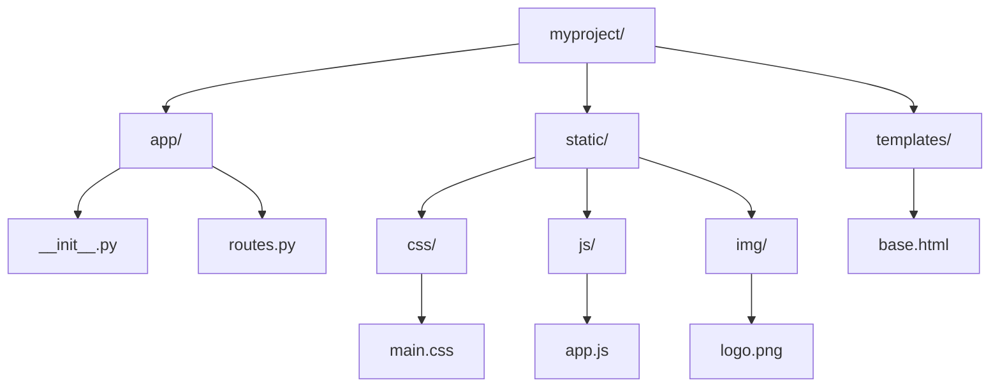
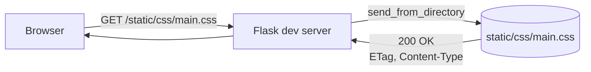
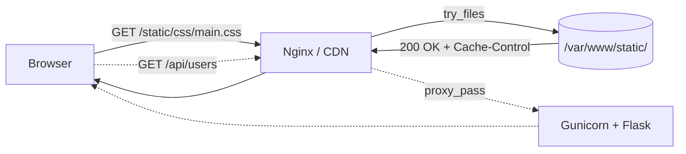

# 3.2.7. Static Files

> [!info] Orientation
> Flask serves static files (CSS, JS, images, fonts) from a `static/` folder during development. This note covers the `static/` convention, `url_for('static', filename='...')`, the `app.static_folder` and `app.static_url_path` settings, why the built-in static handler must never be used in production, cache headers, and fingerprinting for cache busting.

## 1. The static Folder Convention

Flask looks for a directory named `static` next to the application module by default. Any file inside that directory is served at the URL path `/static/<filename>`. The convention is so deeply baked in that `Flask(__name__)` configures the static route at construction time — you do not have to enable anything.

The default layout places `static/` next to the application package, with sub-folders for each kind of asset.



`main.css` is then reachable at `http://127.0.0.1:5000/static/css/main.css`. The folder can be nested arbitrarily deep; Flask serves any file under it.

## 2. url_for('static', ...)

The correct way to reference a static asset from a template is `url_for('static', filename='...')`. It generates the URL by looking up the static endpoint, which means it survives any change to `static_url_path` and works correctly when the static folder is moved or served from a CDN.

```html
<link rel="stylesheet" href="{{ url_for('static', filename='css/main.css') }}">
<script src="{{ url_for('static', filename='js/app.js') }}" defer></script>

```

Hardcoding `/static/css/main.css` in templates works until you switch to a CDN, change the static URL prefix, or fingerprint filenames for cache busting. `url_for` is one refactoring away from any of these. For a CDN, set `app.config["STATIC_URL_PATH"]` to the CDN base URL, or override the `static` endpoint with a custom view that 302-redirects to the CDN URL.

## 3. static_folder and static_url_path

Two attributes control where Flask looks for static files and where it serves them. Both are keyword arguments to `Flask()`.

```python
app = Flask(
    __name__,
    static_folder="assets",      # default: "static"
    static_url_path="/assets",   # default: "/static"
)
```

`static_folder` can be an absolute path, a path relative to the app root, or `None` to disable static serving entirely (useful for pure API apps). `static_url_path` is the URL prefix; it defaults to `/static` but can be any string. Setting `static_url_path=""` makes static files served from the root URL, which is occasionally useful but conflicts with any route whose path would also match.

Blueprints can have their own static folders. `Blueprint('admin', __name__, static_folder='static')` registers a `admin.static` endpoint serving `/admin/static/<filename>` — useful for keeping plugin-specific assets alongside the plugin code.

## 4. How Flask Serves Static Files in Development

When `DEBUG=True`, Flask registers a `static` endpoint backed by `flask.helpers.send_from_directory`. That helper calls `werkzeug.security.safe_join` to prevent path traversal, then `werkzeug.utils.send_file` to stream the file to the client with the correct `Content-Type`, `Content-Length`, and `ETag` headers.



The dev server sends an `ETag` (the file's hash) and respects `If-None-Match` conditional requests, returning `304 Not Modified` when the file has not changed. This is enough to make local development feel snappy without any configuration. It is **not** enough for production.

## 5. Why You Must Not Use the Dev Server for Static Files in Production

Flask's static handler reads the file from disk and streams it through Python on every request. For a small CSS file this is invisible. For a 5 MB PDF, a 200 KB JavaScript bundle, or a high-traffic image directory, it becomes a serious bottleneck: Python holds a worker for the duration of the transfer, and that worker is one of a small fixed number (Gunicorn's worker pool). A handful of concurrent downloads can starve the worker pool and make the entire app unresponsive.

The correct production setup puts a reverse proxy (Nginx, Caddy, or the platform's built-in CDN) in front of Flask and serves static files directly from disk without touching Python. Nginx's `try_files` directive is the canonical pattern:

```nginx
server {
    listen 80;
    server_name example.com;
    root /var/www/myproject;

    location /static/ {
        expires 30d;
        add_header Cache-Control "public, immutable";
        access_log off;
    }

    location / {
        proxy_pass http://127.0.0.1:8000;
        proxy_set_header Host $host;
        proxy_set_header X-Real-IP $remote_addr;
    }
}
```

The `location /static/` block matches first, so Nginx serves the file directly from `/var/www/myproject/static/` and never proxies the request to Flask. The `location /` block is the fallback that proxies everything else to Gunicorn. The same pattern works on Render and Railway by using a CDN (CloudFront, Cloudflare) in front of the app and serving static files from object storage (S3, R2) instead of from the app's filesystem.



## 6. Cache Headers

Two headers control how browsers and CDNs cache static files. `Cache-Control` is the modern directive; `ETag` and `Last-Modified` enable conditional requests (`If-None-Match`, `If-Modified-Since`) that return `304 Not Modified` when the file is unchanged. For static assets you want aggressively cached: `Cache-Control: public, max-age=31536000, immutable` says "anyone may cache this for a year, and it will never change." That last word — `immutable` — tells the browser it does not even need to revalidate, which removes the conditional request entirely.

The catch is that an aggressively cached file is hard to update. If you ship `app.js` and then fix a bug, every browser that has already cached it will keep using the old version for a year. The fix is fingerprinting.

## 7. Fingerprinting for Cache Busting

Fingerprinting means renaming the file to include a hash of its contents. `app.js` becomes `app.a3f9c2.js`; when the contents change, the hash changes, the filename changes, and the browser treats it as a new file. The HTML references the new filename, so the cache is bypassed exactly once, and then the new file is cached for another year.

Tools that do this for Flask include:

| Tool | How it works |
| ---- | ------------ |
| Flask-Assets | Build-time bundling + hash, generates `<link>` / `<script>` tags |
| Whitenoise | Serves fingerprinted files from the app, with long cache headers, designed for Heroku-style deploys |
| Vite / Webpack | Frontend build tools that emit hashed assets and a manifest your templates can read |
| Flask-Static-Digest | Generates hashed filenames at app startup, provides `{{ hashed_static('css/main.css') }}` |

```python
# Flask-Static-Digest example
from flask_static_digest import FlaskStaticDigest
FlaskStaticDigest().init_app(app)

# In templates
<link rel="stylesheet" href="{{ hashed_static('css/main.css') }}">
# Renders: /static/css/main.a3f9c2d1.css
```

With fingerprinting in place, you can safely set `Cache-Control: public, max-age=31536000, immutable` on every static response. The HTML itself (which is not fingerprinted, because it is generated per-request) should use a short cache or no cache at all.

## 8. Whitenoise for Container Deploys

When you deploy Flask as a Docker container (see [[6.1. Docker Containerization and Networking]]) and you do not want to run a separate Nginx, Whitenoise is the standard solution. It wraps the WSGI app and serves static files from disk with correct cache headers and gzip compression, with performance far better than Flask's built-in handler because it uses efficient file sendfile calls and serves compressed files pre-built at deploy time.

```python
from whitenoise import WhiteNoise
app = create_app()
app.wsgi_app = WhiteNoise(app.wsgi_app, root="static/", prefix="static/")
app.wsgi_app.add_files("static/", prefix="static/")
```

Whitenoise is not as fast as a dedicated Nginx or a CDN, but it is dramatically faster than Flask's dev handler and is the right default for small-to-medium deployments on Render, Railway, Fly.io, or any platform that runs your container directly without giving you an Nginx layer.

## Summary

Flask serves static files from a `static/` folder during development via `send_from_directory`, and templates reference them with `url_for('static', filename='...')`. In production, never use Flask's built-in static handler — put a reverse proxy (Nginx, Caddy) or a CDN in front, or use Whitenoise if you must serve from Python. Set long `Cache-Control` headers and use filename fingerprinting so you can cache aggressively without breaking updates. The next note, [[3.2.8. URL Building and Redirects]], covers `url_for`'s other major use: building URLs for routes and handling redirects.

## See Also

- [[3.2.5. Templates and Jinja2]]
- [[3.2.8. URL Building and Redirects]]
- [[6.3. Nginx Reverse Proxy and Load Balancing]]
- [[6.1. Docker Containerization and Networking]]

## References

- Flask static files: https://flask.palletsprojects.com/en/latest/quickstart/#static-files
- Werkzeug `send_file`: https://werkzeug.palletsprojects.com/en/latest/serving/
- Whitenoise: https://whitenoise.evans.io/
- MDN Cache-Control: https://developer.mozilla.org/en-US/docs/Web/HTTP/Headers/Cache-Control
