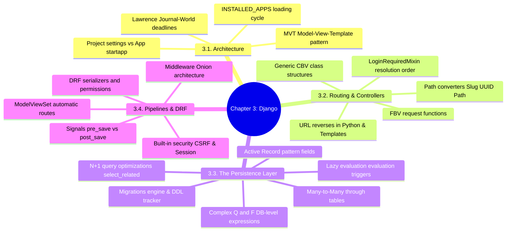

# 3.3.0. Django MOC

> [!info] Map of Content Purpose
> This local index acts as your navigation hub for Chapter 3: Django & "Batteries-Included" Architecture. Django is a highly structured framework emphasizing rapid development, clean design, and a complete pre-packaged suite of services. This MOC connects architectural definitions, model abstractions, performance structures, and REST API frameworks.

---

## 1. Chapter Mind Map

The mind map below lays out the key batteries-included services, objects, and mechanisms of Django:

---

## 2. Topic Outline & Atomic Notes

This module has 12 notes detailing how to harness the extensive power of the Django framework:

### [[3.3.1. Django Overview and MVT Pattern|1. Architecture, Philosophy & Patterns]]
*Understanding the batteries-included design choices of Django.*
* **Historical Origins:** Rapid, deadline-driven development rules.
* **MVT Framework:** Defining the boundaries of **Models** (invariants), **Views** (controllers), and **Templates** (presentation).
* **Code Packaging:** Decoupling projects (`settings.py`, `urls.py`) from modular reuse-oriented apps (`models.py`, `views.py`).

### [[3.3.2. Django Quiz Notes|2. Core Concepts Reference & Quiz]]
*A comprehensive review of the framework's architecture.*
* **Core Review:** Deep dive into settings, request scopes, templates, database configurations, and standard development lifecycle scenarios.

### [[3.3.3. Django URL Dispatcher and Request Routing|3. URL Dispatcher & Request Routing]]
*Configuring URL paths and naming rules.*
* **Routing Rules:** Mapping paths, delegating sub-routes with `include()`, using namespaces, and executing path variables (`slug`, `uuid`, etc.).
* **Reversibility:** Resolving URLs cleanly in views (`reverse()`) and templates (``).

### [[3.3.4. Django ORM Deep Dive and Database Abstraction|4. Django ORM & Active Record Abstractions]]
*Designing rich databases using declarative Python models.*
* **Field Declarations:** Model fields, options (`null` vs `blank`), database indexing, and constraints.
* **Relationships:** One-to-Many (`ForeignKey` deletion policies), One-to-One, and Many-to-Many relationship join structures (`through` tables).

### [[3.3.5. Django Views Function-Based vs Class-Based|5. Views: Function-Based vs Class-Based]]
*Comparing both view styles to pick the right abstraction level.*
* **FBVs vs CBVs:** Procedural loops vs generic controllers (`ListView`, `DetailView`).
* **Mixins & MRO:** Controlling access and permissions using Multiple Inheritance and Method Resolution Order.

### [[3.3.6. Django Middleware and Signals|6. Middleware Onion & Signals Engine]]
*Extending the request lifecycle and processing events.*
* **Built-in Systems:** CSRF protections, session variables, authentication headers, and security middleware.
* **Signals:** Decoupling features using publish/subscribe triggers (`pre_save`, `post_save`, `sender` filters).

### [[3.3.7. Django REST Framework DRF and Web APIs|7. Django REST Framework (DRF) Architecture]]
*Building web APIs with DRF.*
* **DRF Foundations:** ModelSerializers, data validation hooks, generic APIViews, ModelViewSets, and automated route generation.
* **Security & Auth:** Restricting scopes with authentication and permission classes.

### [[3.3.8. Django Admin Interface Customization|8. Admin Interface Customization]]
*Tailoring Django's powerful auto-generated dashboard.*
* **Admin Overrides:** Registering models, defining `list_display`, filter arrays, and adding custom forms or bulk actions.

### [[3.3.9. Django Authentication and Custom User Models|9. Custom Auth & User Models]]
*Getting security right from the start of a project.*
* **User Configuration:** Extending `AbstractUser` vs `AbstractBaseUser` for clean, modular, long-term database structures.

### [[3.3.10. Django Migrations System Engine|10. Database Schema Migrations Engine]]
*How Django tracks and applies database changes.*
* **Migration Workflows:** `makemigrations` vs `migrate`, inspection tasks (`sqlmigrate`), and the `django_migrations` DDL tracking table.

### [[3.3.11. Django Performance and Query Optimization|11. Resolving Performance Issues & Query Tuning]]
*Stopping N+1 database bottlenecks and writing optimized SQL.*
* **Query Optimizations:** Pre-fetching strategies—using `select_related()` (joins) and `prefetch_related()` (separate IN queries).
* **Database Operations:** Using `Q` (boolean logic), `F` expressions (preventing race conditions), and database aggregations/annotations.

### [[3.3.12. Django Middleware Internals and Custom Middlewares|12. Building Custom Middleware Internals]]
*Deep dive into writing custom HTTP interceptor logic.*
* **Middleware Interception:** Building request/response hooks, exception filters, and performance log systems.

---

## 3. Prerequisite Knowledge & Downstream Impact

* **Prerequisites:** 
  - Familiarity with the basic WSGI/ASGI application specifications discussed in [[3.0.4. Gateway Interfaces and Web Server Runtimes]] is useful.
* **Downstream Connections:**
  - Django's Active Record pattern is similar to Laravel's Eloquent [[3.5.0. Laravel MOC]], contrasting with Hibernate's Data Mapper in Spring Boot [[3.4.6. Spring Data JPA and Hibernate]].
  - Django's declarative admin dashboard is unique among the five frameworks and is often a major reason for selecting this framework stack.

---

*See also: [[00. Master Index]] — [[3.0. Chapter Index]]*
