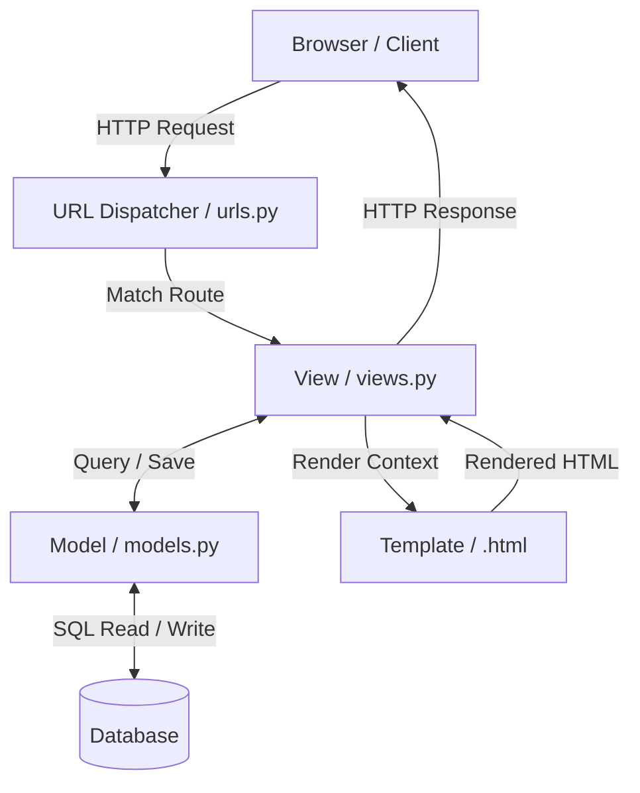
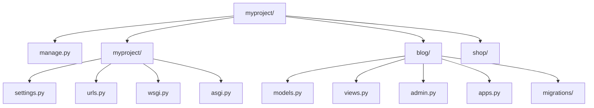

# 3.3.1. Django Overview and MVT Pattern

> [!info] Django is a high-level Python web framework that favours the "batteries-included" philosophy.
> This note covers what Django is, how its MVT pattern differs from classic MVC, the batteries that ship out of the box, the project/app split, and how WSGI and ASGI deployment shapes its runtime model.

## 1. What Django Is

Django was created in 2003 at the Lawrence Journal-World newspaper by Adrian Holovaty and Simon Willison, and was open-sourced in 2005 under a BSD licence. The framework was born from the practical pressures of a newsroom: journalists needed to publish stories quickly, developers needed to ship features under deadline, and the same patterns were being re-implemented across multiple content sites. Django distilled those patterns into a single, opinionated framework whose slogan became "the web framework for perfectionists with deadlines".

Django is a **batteries-included** framework, which distinguishes it sharply from micro-frameworks such as Flask. Where Flask deliberately ships only a request router and a response object, leaving you to choose your own ORM, forms library, admin interface, and authentication system, Django ships all of those components in the same distribution. The result is that a new Django project can have a working admin interface, database migrations, an authentication system, and CSRF protection in fewer than fifty lines of configuration. The trade-off is that you inherit Django's opinions: you will use Django's ORM if you want the admin to work, you will use Django's template engine if you want the form helpers, and you will structure your project the way Django expects.

Django is written in Python and is itself a Python package (`pip install django`). It runs on Python 3.8+ (Django 4.2 LTS) and Python 3.10+ (Django 5.x). It is request/response oriented, synchronous by default, with first-class async support added in Django 3.0 and progressively expanded through Django 4.x and 5.x. The framework is maintained by the Django Software Foundation (DSF), a non-profit that funds release management, security work, and community infrastructure.

## 2. The MVT Pattern

Django documents its architecture as **MVT — Model, View, Template**. The pattern is functionally equivalent to MVC, but the names are shifted in a way that frequently confuses newcomers who arrive from Rails, Spring, or Laravel. The mapping is straightforward once you internalise it: Django's *Model* is the MVC Model, Django's *Template* is the MVC View, and Django's *View* is the MVC Controller. The "C" in MVC is, in Django's telling, the framework itself — the URL dispatcher and the request/response machinery that routes an incoming HTTP request to the appropriate view function. Django's position is that the framework provides the controller, so the developer does not need to write one.



The **Model** lives in `models.py` and is a Python class that subclasses `django.db.models.Model`. Each attribute on the class maps to a database column, and Django's ORM translates the class definition into a `CREATE TABLE` statement when you run `makemigrations` and `migrate`. The model is also the locus of business invariants: validators, custom managers, and `save()` overrides all live here.

The **View** lives in `views.py` and is either a function (function-based view) or a class (class-based view). A view receives an `HttpRequest`, does whatever work the request requires — querying models, calling services, sending email — and returns an `HttpResponse`. Views are deliberately thin in well-structured Django code: they validate input, call into the model or service layer, and render a template. Heavy business logic should live in services or models, not in the view itself.

The **Template** is an HTML file with Django Template Language (DTL) syntax, although Jinja2 is supported as an alternative. Templates receive a context dictionary from the view and render the final HTML that is sent back to the client. Templates are intentionally restricted: they cannot execute arbitrary Python, they cannot make database queries, and their expression language is deliberately limited so that presentation logic stays out of the database layer. This restriction is a feature, not a limitation — it enforces a clean separation between presentation and business logic.

## 3. The Batteries

Django's "batteries" are the components that ship with the framework and that you would otherwise have to assemble yourself. The list is long, and most production Django projects use most of them.

| Battery | What it gives you |
| ------- | ----------------- |
| ORM | Database abstraction with migrations, querysets, and multi-database support |
| Admin | Auto-generated CRUD interface for models, free of charge |
| Auth | User model, password hashing, login/logout views, permission system |
| Sessions | Cookie- or DB-backed session framework |
| Forms | Form rendering, validation, and CSRF protection |
| Template engine | DTL or Jinja2 with template inheritance |
| Security middleware | CSRF, clickjacking, HSTS, SSL redirect, XSS-aware escaping |
| Caching framework | Unified API over Memcached, Redis, database, filesystem, local memory |
| i18n / l10n | Internationalisation and localisation of strings, dates, numbers |
| Signals | Decoupled event notification (`pre_save`, `post_save`, etc.) |
| Static files | Collection and serving of CSS, JS, and images in development and production |
| Email | SMTP abstraction and test backend |

The practical consequence of the batteries is that a Django project's `requirements.txt` is often short. A typical production Django app needs `django`, a database driver (`psycopg2` for PostgreSQL, `mysqlclient` for MySQL), `redis` for caching, and a WSGI/ASGI server such as `gunicorn` or `uvicorn`. Everything else is already in the box.

## 4. Project vs App Structure

A Django **project** is the collection of configuration and apps that together form a web application. A Django **app** is a self-contained module that does one thing — a blog, a polls feature, a forum — and can be plugged into any project. The split is enforced by two CLI commands: `django-admin startproject myproject` creates the project skeleton, and `python manage.py startapp blog` creates an app skeleton inside it.



The `manage.py` script is a thin wrapper around `django-admin` that sets the `DJANGO_SETTINGS_MODULE` environment variable for you. The inner `myproject/` package holds the settings module, the root URLconf, and the WSGI/ASGI entrypoints. Each app is a Python package with `models.py`, `views.py`, `admin.py`, `apps.py`, and a `migrations/` directory. Apps are reusable by design: many third-party packages (such as `django-allauth` for authentication or `django-cms` for content management) are simply Django apps that you install via pip and add to `INSTALLED_APPS`.

The settings module (`settings.py`) is the central configuration file. It contains `INSTALLED_APPS` (the list of apps Django should load), `MIDDLEWARE` (the request/response processing chain), `DATABASES` (connection configuration), `TEMPLATES` (template engine configuration), `STATIC_URL` and `MEDIA_URL`, and dozens of other knobs. The settings file is plain Python, which means you can branch on environment variables, compute values at import time, and import other configuration modules — but it also means that any import side-effect runs at process start, which is a common source of slow boot times in mature Django projects.

## 5. URL Dispatcher

The URL dispatcher is the mechanism that maps an incoming URL to a view. It is configured in `urls.py` via the `urlpatterns` list, which contains `path()` and `re_path()` entries. Each entry binds a URL pattern to a view callable, optionally captures path parameters, and optionally delegates to another URLconf via `include()`.

```python
from django.urls import path, include
from . import views

urlpatterns = [
    path('', views.index, name='index'),
    path('blog/', include('blog.urls')),
    path('article/<int:article_id>/', views.article_detail, name='article_detail'),
]
```

Path converters such as `<int:article_id>` are type-safe: Django converts the captured segment to the requested type before calling the view, and returns a 404 if the conversion fails. The `name=` argument makes a URL reversible, so that templates and views can refer to a URL by name rather than by its literal path. This is the same reversibility principle found in Flask's `url_for` and Laravel's `route()` helper.

## 6. The ORM and the Admin

Django's ORM lets you define a model in Python and have Django generate the SQL schema for you. A simple model:

```python
from django.db import models
from django.contrib.auth.models import User

class Article(models.Model):
    title = models.CharField(max_length=200)
    body = models.TextField()
    author = models.ForeignKey(User, on_delete=models.CASCADE)
    published_at = models.DateTimeField(auto_now_add=True)

    def __str__(self):
        return self.title
```

Running `python manage.py makemigrations` generates a migration file that describes the schema change, and `python manage.py migrate` applies it to the database. The ORM also powers the **admin**: registering `Article` with `admin.site.register(Article)` immediately gives you a list view, a create form, an edit form, delete confirmation, and search — all behind the admin's authentication wall at `/admin/`. The admin is not a substitute for a custom UI in a production SaaS, but it is exceptionally useful for internal tooling, content moderation, and data inspection.

## 7. manage.py Commands

The `manage.py` CLI is the day-to-day interface to a Django project. The most common commands are summarised below.

| Command | Purpose |
| ------- | ------- |
| `runserver` | Start the auto-reloading development server (port 8000 by default) |
| `makemigrations` | Generate migration files from model changes |
| `migrate` | Apply pending migrations to the database |
| `createsuperuser` | Create an admin user for the admin interface |
| `shell` | Open a Python shell with Django's environment loaded |
| `test` | Run the test suite |
| `dbshell` | Open a database CLI connected to the project's database |
| `collectstatic` | Copy static files into `STATIC_ROOT` for production serving |

Custom commands can be added by dropping a `management/commands/` package inside an app. This is the standard way to wire cron jobs, queue workers, and one-off data-migration scripts into the Django lifecycle.

## 8. WSGI and ASGI

Django 3.0 added ASGI support, and the framework now ships both a `wsgi.py` and an `asgi.py` entrypoint in every new project. **WSGI** (Web Server Gateway Interface) is the synchronous standard: one thread per request, blocking I/O, no WebSockets. **ASGI** (Asynchronous Server Gateway Interface) is the asynchronous standard: cooperative concurrency via `asyncio`, native WebSocket support, and the ability to fan out to hundreds of thousands of long-lived connections on a single process.

In production, WSGI deployments typically use **Gunicorn** or **uWSGI** behind Nginx. ASGI deployments typically use **Daphne** (the original ASGI server, from the Channels project), **Uvicorn**, or **Hypercorn**. The choice between WSGI and ASGI is not free: Django's ORM is still predominantly synchronous, and mixing sync and async code requires care (the `sync_to_async` and `async_to_sync` adapters exist precisely for this reason). Most Django projects today still run on WSGI with Gunicorn, and reserve ASGI for projects that genuinely need WebSockets or that have I/O-bound views where async offers a measurable throughput win.

Deployment topology — Gunicorn worker count, Nginx reverse-proxy configuration, container layout — is covered in [[6.1. Docker Containerization and Networking]] and [[6.3. Nginx Reverse Proxy and Load Balancing]].

## Summary

Django is a batteries-included Python web framework that organises code into the MVT pattern: Models define data, Views handle request/response logic, and Templates render presentation. Its built-in admin, ORM, auth, and middleware make it productive for content-heavy and CRUD-heavy applications, while its project/app split makes apps reusable across projects. Modern Django supports both WSGI (synchronous, Gunicorn) and ASGI (asynchronous, Uvicorn/Daphne) deployments, giving you the flexibility to choose the runtime that matches your workload.

## See Also

- [[3.3.2. Django Quiz Notes]]
- [[3.4.1. Spring Boot Overview and Starters]]
- [[3.5.1. Laravel Overview and Installation]]
- [[4.1. ORM Fundamentals]]
- [[2.3. MySQL Engine Internals]]

## References

- Django Software Foundation, "Django Documentation", https://docs.djangoproject.com/
- Holovaty, A. and Kaplan-Moss, J., *The Definitive Guide to Django*, Apress, 2nd ed.
- Pallets Projects, "WSGI" and "ASGI" specifications, https://wsgi.readthedocs.io/ and https://asgi.readthedocs.io/
