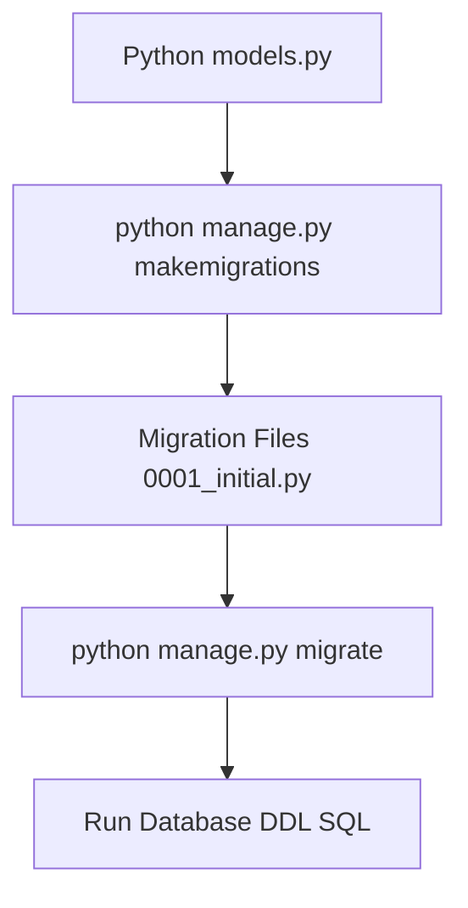

# 3.3.10. Django Migrations System Engine

> [!info] Orientation
> Database schema updates are a common pain point in modern software delivery. Django provides a fully-automated, declarative migration system that translates python model definitions into database-specific DDL scripts. This note details how the migration engine functions under the hood, how migrations are tracked, and how to write data migrations and resolve production schema conflicts.

---

## 1. Declarative Schemas vs. Imperative Migrations

Django takes a **declarative** approach to databases. You define your models inside `models.py` as pure Python classes, and Django's engine calculates what physical tables must exist to support that design.

A **migration** is an intermediate, version-controlled Python script describing the step-by-step SQL operations required to transform your *current* database schema into the state declared by your code.



* **`makemigrations`:** Scans current models, compares them to existing migration history files, and writes new instruction scripts (e.g., `0002_add_field.py`) inside your app's `migrations/` folder.
* **`migrate`:** Scans your target database's history table, identifies unapplied migrations, and executes them within transactional blocks.

---

## 2. Under the Hood: The `django_migrations` Table

To determine which migration files are pending, Django creates and manages a system table inside your database named **`django_migrations`**.

When you run `python manage.py migrate`, Django:
1. Performs a database query on `django_migrations`.
2. Compiles a list of applied migration IDs mapped to their application name and execution timestamp.
3. Reads the physical files on disk to identify unapplied migration scripts.
4. Executes the unapplied DDL in order (while respecting parent-child dependencies).
5. Writes a row back into `django_migrations` upon the successful completion of each file.

```sql
-- Conceptual Schema of the django_migrations table
SELECT id, app, name, applied FROM django_migrations;
```

---

## 3. Data Migrations: Safely Migrating Records

By default, Django automatically creates **schema migrations** (which modify columns and tables). However, if you need to mutate existing database values (such as splitting a `full_name` column into `first_name` and `last_name`), you must write a **Data Migration**.

Data migrations run inside your standard migration chain using Django's transactional ORM, ensuring data stays consistent across deployments.

### Walkthrough: Writing a custom data migration
1. Create an empty placeholder migration file using the CLI:
   `python manage.py makemigrations --empty accounts`
2. Open the newly created file (e.g., `0003_split_names.py`) and implement a custom function to migrate records:

```python
# accounts/migrations/0003_split_names.py
from django.db import migrations

def split_user_names(apps, schema_editor):
    # Retrieve the model registry from the migration context!
    # DO NOT import the model directly from models.py as the file state might be newer 
    # than this migration checkpoint, causing crashes.
    User = apps.get_model('accounts', 'CustomUser')
    
    # Run bulk database transactions
    for user in User.objects.all():
        if user.full_name:
            parts = user.full_name.split(' ', 1)
            user.first_name = parts[0]
            user.last_name = parts[1] if len(parts) > 1 else ''
            user.save()

def reverse_split_names(apps, schema_editor):
    User = apps.get_model('accounts', 'CustomUser')
    for user in User.objects.all():
        user.full_name = f"{user.first_name} {user.last_name}".strip()
        user.save()

class Migration(migrations.Migration):
    # Specify dependencies to enforce run order
    dependencies = [
        ('accounts', '0002_add_first_last_names'),
    ]

    operations = [
        # Bind our custom Python routines
        migrations.RunPython(split_user_names, reverse_code=reverse_split_names),
    ]
```

---

## 4. Resolving Conflicts and Squashing Migrations

### Migration Dependency Conflicts
If two developers create independent migrations (such as Developer A adding a field and Developer B adding an index) before merging their branches, Django will raise a **`MergeConflict`** exception:

```text
CommandError: Conflicting migrations detected in 'accounts' (0002_add_field, 0002_add_index).
You must merge these migrations before you can proceed.
```

To resolve this safely, execute:

```bash
python manage.py makemigrations --merge
```

Django will read both scripts, generate a brand-new merge migration file (e.g., `0003_merge_...py`) that lists both conflicting files as prerequisites, and safely heal your deployment timeline.

### Squashing Migrations
As your project grows, you might end up with hundreds of individual migration files, which slows down tests and application boots. You can consolidate your migration files into a single, comprehensive "initial" script using Django's squashing tool:

```bash
python manage.py squashmigrations accounts 0050
```

This merges migrations 1 through 50 into a single consolidated file, cleaning up your repository while keeping the history compatible with production databases that have already run the individual updates.

---

## Summary

Django's declarative database migrations system provides high consistency and automation. By tracking progress in the `django_migrations` table, resolving schema branches cleanly using automated merge scripts, and utilizing `RunPython` for data migrations, developers can deliver robust schema updates without data loss.

## See Also

- [[3.3.1. Django Overview and MVT Pattern]]
- [[3.3.4. Django ORM Deep Dive and Database Abstraction]]
- [[3.3.9. Django Authentication and Custom User Models]]
- [[3.3.11. Django Performance and Query Optimization]]
