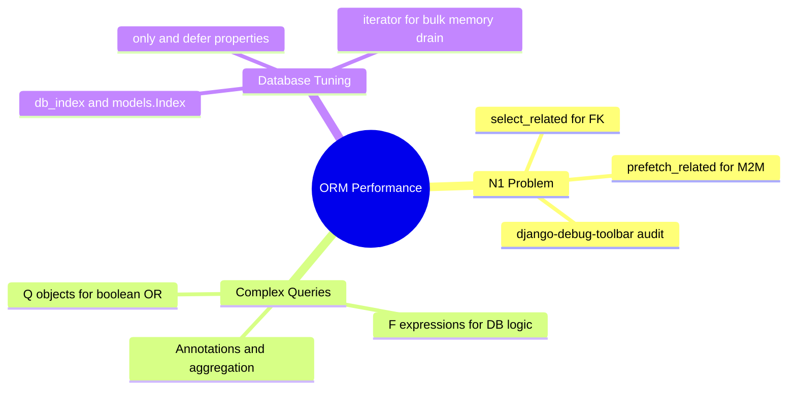

# 3.3.11. Django Performance and Query Optimization

> [!info] Orientation
> Django's Object-Relational Mapper (ORM) is a highly convenient tool, but hiding SQL queries behind Python syntax can lead to massive performance issues. This note explores how to diagnose, optimize, and resolve common performance bottlenecks in the Django ORM, focusing on query planning, relationship pre-fetching, database indexes, and complex analytical operations.

---

## 1. The Dynamic Query Engine & Lazy Evaluation

Understanding when the Django ORM executes queries is the first step in performance tuning.
Django QuerySets are **lazy**: declaring a QuerySet (e.g., `users = User.objects.all()`) does *not* query the database.

The query is only evaluated when you actively "trigger" the data:
* Iterating over the QuerySet (e.g., `for user in users:`).
* Slicing (e.g., `users[0:10]` - triggers evaluation if step is present).
* Calling `len()`, `list()`, or `bool()` on the QuerySet.
* Evaluating inside conditional blocks (e.g., `if users.exists():`).



---

## 2. Resolving the N+1 Query Problem

The most common ORM bottleneck is the **N+1 Query Problem**. This occurs when your code retrieves a list of parent records and then loops through them, performing a database query for each record's related child elements.

```python
# ❌ Horribly Slow Code: Triggers 1 query to fetch articles, plus N queries to fetch author names!
articles = Article.objects.all()
for article in articles:
    print(article.title, article.author.username)
```

To solve this, Django provides two powerful tools that pre-fetch related records inside unified, optimized SQL queries:

### A. `select_related()` (For One-to-One and Many-to-One relationships)
`select_related` modifies your QuerySet's SQL directly, performing an SQL **`INNER JOIN`** or **`LEFT OUTER JOIN`** on the related tables to retrieve all fields in a single, atomic database query.

```python
#  Optimized Code: Triggers exactly ONE query with an SQL JOIN!
articles = Article.objects.select_related('author').all()
for article in articles:
    print(article.title, article.author.username)
```

### B. `prefetch_related()` (For Many-to-Many and Reverse Foreign Keys)
Since SQL joins can produce massive, duplicate datasets when querying many-to-many relationships, `select_related` cannot be used. Instead, `prefetch_related` executes exactly **two** independent SQL queries:
1. One query to fetch the parent records.
2. A second query to fetch the related children using an SQL **`IN (...)`** statement.
3. Django's ORM engine then matches and stitches the records together in Python memory.

```python
#  Optimized Code: Triggers exactly TWO queries!
articles = Article.objects.prefetch_related('tags').all()
for article in articles:
    print(article.title, [tag.name for tag in article.tags.all()])
```

---

## 3. Q Objects, F Expressions, and DB-Level Arithmetic

To run optimized, performant applications, you should offload calculations and operations from Python memory onto your database engine whenever possible.

### Q Objects (Complex Boolean Operations)
Standard Django filters chain queries using `AND`. If you need to perform complex boolean operations (like `OR` or `NOT`), you must use **`Q` Objects**:

```python
from django.db.models import Q

# Fetch articles that are EITHER published OR written by a premium author
articles = Article.objects.filter(Q(status='published') | Q(author__is_premium=True))
```

### F Expressions (Database-Level Attribute Logic)
Usually, to update a model attribute (e.g., incrementing a view counter), you must retrieve the object into memory, increment the variable in Python, and save it back. This creates a severe **Race Condition** if multiple requests execute simultaneously.

An **`F` Expression** lets you modify database fields directly inside SQL, without reading the values into Python memory:

```python
from django.db.models import F

# 🚀 Safe, race-condition free update executed inside the database engine!
# Translates to: UPDATE article SET view_count = view_count + 1 WHERE id = ...
Article.objects.filter(id=1).update(view_count=F('view_count') + 1)
```

---

## 4. Analytical Operations: Annotations vs. Aggregations

Django provides two ways to run database calculations:

* **`aggregate()` (Terminal calculation):** Runs a calculation across the entire QuerySet and returns a flat Python dictionary (e.g., average price of all books).
* **`annotate()` (Per-record calculation):** Calculates values for *each* individual record inside the QuerySet, returning them as dynamic properties (e.g., counting the comments on each article).

```python
from django.db.models import Count, Avg

# 1. Aggregation Example (Returns flat dict)
average_views = Article.objects.aggregate(avg_views=Avg('view_count'))
# Output: {'avg_views': 452.12}

# 2. Annotation Example (Adds 'comment_count' attribute to every article row)
articles = Article.objects.annotate(comment_count=Count('comments'))
for article in articles:
    print(article.title, article.comment_count)
```

---

## 5. Implementing Indexes to Speed Up Queries

Adding indexes is the single most important database optimization you can make. By default, Django only creates database indexes for Primary Keys and fields marked `unique=True`.

You should explicitly index any fields that are frequently used in `filter()`, `exclude()`, `order_by()`, or relationship joins.

```python
# models.py
class Article(models.Model):
    title = models.CharField(max_length=200)
    # 1. Quick inline index creation
    status = models.CharField(max_length=20, db_index=True)
    created_at = models.DateTimeField(auto_now_add=True)

    class Meta:
        # 2. Advanced composite indexes
        indexes = [
            models.Index(fields=['status', 'created_at'], name='status_created_idx'),
        ]
```

---

## Summary

Query optimization turns slow Django applications into highly performant backend systems. By using `select_related` and `prefetch_related` to resolve the N+1 query problem, offloading computations to SQL with `F` and `Q` expressions, executing aggregations with `annotate`, and adding database indexes, applications can scale comfortably to millions of transactions.

## See Also

- [[3.3.1. Django Overview and MVT Pattern]]
- [[3.3.4. Django ORM Deep Dive and Database Abstraction]]
- [[3.3.10. Django Migrations System Engine]]
