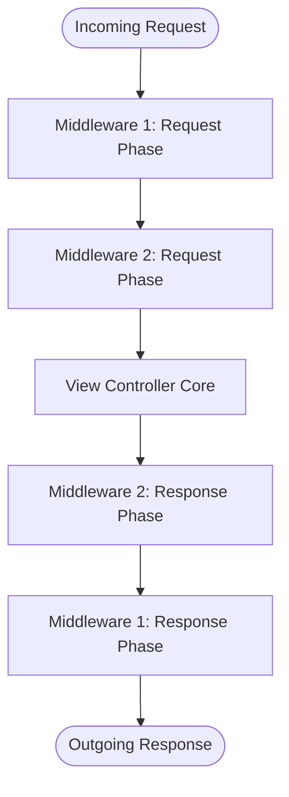

# 3.3.12. Django Middleware Internals and Custom Middlewares

> [!info] Orientation
> Middleware is a framework of hooks into Django’s request/response processing. It’s a light, low-level "plugin" system for globally altering Django’s input or output. This note details the underlying Onion Architecture of Django's middleware pipeline, breaks down built-in security middlewares, and shows how to write custom middlewares.

---

## 1. The Onion Architecture of Middleware

Django processes requests and responses using an **Onion (or Layered) Architecture**.

When a client sends an HTTP request, it enters the system at the outermost layer of the middleware chain, passes through each middleware sequentially, and finally reaches the routing engine and active view controller at the core.

Once the view generates an HTTP response, control bubbles back outward through the same middleware chain in **reverse order**, giving each middleware an opportunity to modify headers, compress data, or update cookies before sending the response back to the client.



> [!important] Order of Middleware Matters
> Since the middlewares execute sequentially, their registration order inside `settings.py` is critical.
>
> For example, `AuthenticationMiddleware` (which retrieves and attaches the user to `request.user`) must run **after** `SessionMiddleware` (which parses and manages active session cookies). If you reverse them, the authentication middleware won't have access to session data, and the request will fail.

---

## 2. Writing a Custom Middleware Class

In modern Django, a middleware is represented as a callable Python class. The class must implement:
1. An `__init__(self, get_response)` constructor method called once upon server bootstrap.
2. A `__call__(self, request)` method executed on every request-response cycle.

Here is a custom middleware class that measures and logs the execution duration of every HTTP request, while injecting a unique request ID for distributed tracing:

```python
# middleware.py
import time
import uuid
import logging

logger = logging.getLogger(__name__)

class RequestCorrelationMiddleware:
    """Middleware to inject a unique trace ID and log request duration."""
    
    def __init__(self, get_response):
        # get_response is the next middleware or view in the chain
        self.get_response = get_response

    def __call__(self, request):
        # --- 1. Request Phase (Top-Down) ---
        # Generate or capture correlation ID from headers
        correlation_id = request.headers.get('X-Correlation-ID', str(uuid.uuid4()))
        
        # Attach to request object for easy downstream access in views
        request.correlation_id = correlation_id
        
        start_time = time.perf_counter()

        # --- 2. Delegate to next middleware / view ---
        response = self.get_response(request)

        # --- 3. Response Phase (Bottom-Up) ---
        duration = time.perf_counter() - start_time
        
        # Add correlation ID to outgoing client headers
        response['X-Correlation-ID'] = correlation_id
        
        # Log metrics
        logger.info(
            f"Path: {request.path} | Method: {request.method} | "
            f"Status: {response.status_code} | Duration: {duration:.4f}s"
        )

        return response
```

---

## 3. Advanced Middleware Hook Methods

Beyond the core `__call__` interface, Django middleware can declare specialized hook methods to handle specific processing states:

* **`process_view(request, view_func, view_args, view_kwargs)`:** Called immediately *before* Django executes the view controller. Returning an `HttpResponse` here short-circuits the pipeline, bypassing the view entirely.
* **`process_exception(request, exception)`:** Called when a view raises an uncaught exception. Returning an `HttpResponse` here lets you handle errors gracefully, while returning `None` lets the exception bubble up to Django's standard error handlers.
* **`process_template_response(request, response)`:** Called if the active view returns a `SimpleTemplateResponse` object, giving you an opportunity to modify template rendering contexts.

```python
class BlockIPMiddleware:
    def __init__(self, get_response):
        self.get_response = get_response
        self.blacklisted_ips = ['192.168.1.100']

    def process_view(self, request, view_func, view_args, view_kwargs):
        # Check client IP before executing views
        client_ip = request.META.get('REMOTE_ADDR')
        if client_ip in self.blacklisted_ips:
            from django.http import HttpResponseForbidden
            return HttpResponseForbidden("Your IP has been blacklisted.")
        return None  # Continue normal pipeline
```

---

## 4. Built-in Production Middlewares Explained

Let's look at the standard middlewares registered in a default Django project and understand what security and operational protections they provide:

| Middleware Class | Purpose |
| :--- | :--- |
| **`SecurityMiddleware`** | Protects against basic web exploits (enforces SSL redirects, sets `X-Content-Type-Options: nosniff`, `X-Frame-Options` Clickjacking mitigations). |
| **`SessionMiddleware`** | Decodes the session cookie and attaches a session engine (`request.session`) to keep track of user state between requests. |
| **`CommonMiddleware`** | Normalizes URL structures (e.g., redirecting `/about` to `/about/` if `APPEND_SLASH` is active) and enforces `DISALLOWED_USER_AGENTS` blocks. |
| **`CsrfViewMiddleware`** | Implements robust Cross-Site Request Forgery protections by injecting and validating unique tokens on state-changing requests (POST, PUT, DELETE). |
| **`AuthenticationMiddleware`**| Retrieves the user ID from the active session and assigns a helper proxy `request.user` to track the logged-in user. |
| **`MessageMiddleware`** | Coordinates cookie/session-based flash messages (`messages.success()`, `messages.error()`) across request cycles. |

---

## Summary

Django's Onion middleware pipeline intercepts and processes requests globally before they reach routing handlers, and alters responses before they reach the network interface. By understanding middleware ordering constraints in `settings.py` and implementing custom callable classes with targeted hook methods (like `process_view` or `process_exception`), developers can cleanly inject security controls, logging frameworks, and caching layers.

## See Also

- [[3.3.1. Django Overview and MVT Pattern]]
- [[3.3.3. Django URL Dispatcher and Request Routing]]
- [[3.3.9. Django Authentication and Custom User Models]]
