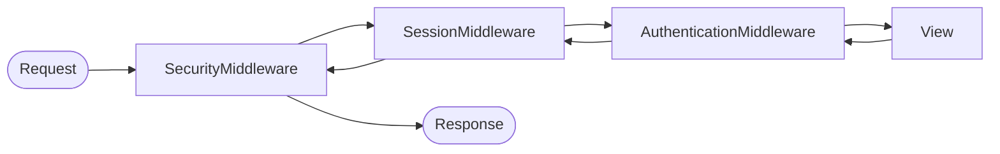

# 3.3.2. Django Quiz Notes

> [!info] A Q&A study note seeded from the old vault's "Django/Quiz/Q1" file.
> The original quiz was mis-filed: it covered Python's `socket` module, not Django. This note preserves those questions with added reasoning (networking is foundational to Django deployment), then expands with the Django-specific Q&As that were missing from the old vault.

## 1. Python Networking Primitives (Seed Quiz)

These questions test the low-level socket primitives that sit underneath every WSGI/ASGI server. Understanding them clarifies why Gunicorn spawns workers, why `listen()` has a backlog argument, and why a slow upstream API blocks a whole synchronous worker.

### Q1: The `socket` module in Python only supports communication via the TCP protocol.

**Answer: False.** The `socket` module supports multiple protocol families — `AF_INET` (IPv4), `AF_INET6` (IPv6), `AF_UNIX` (Unix domain sockets) — and multiple socket types — `SOCK_STREAM` (TCP), `SOCK_DGRAM` (UDP), `SOCK_RAW` (raw IP). A single module exposing all of these is precisely what makes it a thin wrapper around the BSD sockets API rather than a TCP-only helper.

### Q2: `socket.AF_INET` is the constant used to specify the IPv4 address family when creating a socket.

**Answer: True.** `AF_INET` tells the kernel to use IPv4 addressing. The companion constant `AF_INET6` selects IPv6, and `AF_UNIX` selects Unix domain sockets (used internally by Postgres, Redis, and Gunicorn's worker sockets). You pass the address family as the first argument to `socket.socket(family, type, protocol)`.

### Q3: `socket.SOCK_STREAM` indicates that a UDP socket should be created.

**Answer: False.** `SOCK_STREAM` selects a connection-oriented, reliable byte stream — i.e. TCP. UDP is selected by `SOCK_DGRAM` (datagram). The distinction matters at the syscall level: a `SOCK_STREAM` socket requires `connect()`, `listen()`, and `accept()`, whereas a `SOCK_DGRAM` socket can `sendto()` and `recvfrom()` without ever establishing a connection.

### Q4: The `bind()` method is used by a TCP server to start listening for incoming connections.

**Answer: False.** `bind()` only associates the socket with a local address (IP and port). To actually start accepting connections the server must additionally call `listen()`, which transitions the socket to the passive listening state and configures the connection backlog. The two calls are almost always paired, but they are distinct operations with distinct semantics — `bind()` does not begin listening.

### Q5: The `listen()` method in a TCP server specifies the maximum number of connections that can be queued before refusing new ones.

**Answer: True.** The integer argument to `listen(backlog)` is the maximum length of the queue of pending connections — those that have completed the TCP handshake but have not yet been returned to the application via `accept()`. When the queue is full, the kernel drops or refuses new SYN packets. Gunicorn's `--backlog` flag controls exactly this value for its worker sockets.

### Q6: The `connect()` method is typically called on the client-side socket to establish a TCP connection with a server.

**Answer: True.** On the client, `connect((host, port))` initiates the TCP three-way handshake against the server's listening socket. The call blocks until the handshake completes or fails. A non-blocking socket returns immediately with `EINPROGRESS` and the application must poll for writability to learn when the connection is established.

### Q7: UDP, often used with `socket.SOCK_DGRAM`, is a connection-oriented protocol ensuring guaranteed delivery.

**Answer: False.** UDP is **connectionless** and **unreliable**: datagrams may be lost, duplicated, or reordered, and the kernel makes no attempt to retransmit or acknowledge them. The trade-off is speed and multicast support — UDP is the right choice for DNS, NTP, video streaming, and game state where occasional loss is preferable to retransmission latency.

### Q8: The `recvfrom()` method is the standard way to receive data on a connected TCP socket.

**Answer: False.** `recvfrom()` returns both the data and the sender's address, which is the semantics needed for UDP (where every datagram can come from a different peer). On a connected TCP socket, the peer is already known and the standard call is `recv(bufsize)`. Using `recvfrom()` on a TCP socket works but returns an empty address tuple and is the wrong idiom.

### Q9: Using threads is a common technique to allow a server to handle multiple client connections concurrently.

**Answer: True.** The classic BSD-socket server pattern is `accept()` a connection, spawn a thread (or fork a process) to handle it, then loop back to `accept()` the next one. This is exactly what Gunicorn's threaded worker does, and what `socketserver.ThreadingTCPServer` provides in the Python standard library. The downside is per-connection memory cost; the alternative is event-driven I/O via `selectors` or `asyncio`, which is what ASGI servers like Uvicorn use.

### Q10: By default, Python sockets operate in non-blocking mode, meaning calls like `recv()` return immediately even if no data is available.

**Answer: False.** Sockets are blocking by default — `recv()` will block the calling thread until at least one byte arrives (or the connection closes). Non-blocking mode must be explicitly enabled via `sock.setblocking(False)` or `sock.settimeout(...)`. The choice of default matters because it lets simple blocking servers work without any event loop, at the cost of requiring threading for concurrency.

## 2. Django Model Relationships

### Q11: What is the difference between `ForeignKey`, `OneToOneField`, and `ManyToManyField` in Django models?

**Answer:**
- `ForeignKey` creates a many-to-one relationship. The model carrying the `ForeignKey` is the "many" side; the model it points to is the "one" side. At the database level, Django adds a column named `<field>_id` to the child table holding the parent's primary key. Each parent can have many children; each child has exactly one parent.
- `OneToOneField` is essentially a `ForeignKey` with `unique=True`. Each row on the child side maps to exactly one row on the parent side. This is the standard pattern for extending the built-in `User` model with a `Profile` model — one user, one profile.
- `ManyToManyField` creates a many-to-many relationship. Django creates an intermediary join table automatically (with a name like `<app>_<model>_<field>`). Either side can have many of the other; e.g. an `Article` can have many `Tag`s and a `Tag` can be on many `Article`s.

The choice between them is dictated by the cardinality of the relationship. Getting it wrong at design time forces painful data migrations later — for example, collapsing a `ManyToManyField` into a `ForeignKey` because you assumed each article would only ever have one tag.

## 3. The N+1 Problem

### Q12: What is the N+1 query problem, and how do `select_related` and `prefetch_related` solve it?

**Answer:** The N+1 problem occurs when code fetches a list of N objects and then accesses a foreign-key or many-to-many attribute on each, triggering one extra query per object — N+1 queries total instead of one or two. The classic Django example:

```python
# 1 query for all articles, then 1 query PER article to fetch the author
for article in Article.objects.all():
    print(article.author.name)  # extra query each iteration
```

The two solutions are:
- **`select_related`** — for `ForeignKey` and `OneToOneField`. Performs a SQL `JOIN` and returns the related object in the same query. Underlying SQL is one `SELECT ... FROM article INNER JOIN auth_user ON ...`.
- **`prefetch_related`** — for `ManyToManyField` and reverse `ForeignKey` relations. Performs a separate `IN (...)` query and joins the results in Python. Two queries instead of N+1.

```python
Article.objects.select_related('author').all()              # 1 query
Article.objects.prefetch_related('tags').all()              # 2 queries
Article.objects.select_related('author').prefetch_related('tags').all()  # 2 queries
```

The rule of thumb: use `select_related` for single-valued relations (joins), use `prefetch_related` for multi-valued relations (separate query). Misusing them — e.g. calling `select_related` on a `ManyToManyField` — silently does nothing in older Django versions and raises `FieldError` in modern ones.

## 4. Middleware Execution Order

### Q13: In what order does Django execute middleware on the request and on the response?

**Answer:** Django's `MIDDLEWARE` list is processed **top-down on the request** and **bottom-up on the response**, forming a symmetric onion. The first middleware in the list is the outermost layer; it sees the request first and the response last. The last middleware is the innermost layer; it sees the request last (just before the view runs) and the response first (just after the view returns).



This ordering matters for correctness. `SecurityMiddleware` must run before `SessionMiddleware` so that the HTTPS redirect happens before any cookie is set. `AuthenticationMiddleware` must run after `SessionMiddleware` because it reads the session to resolve `request.user`. If you write a custom middleware that depends on `request.user`, it must be listed *after* `AuthenticationMiddleware` — otherwise it will see `AnonymousUser` even for authenticated traffic.

## 5. Signals

### Q14: What are Django signals, and when should you use `pre_save` vs `post_save`?

**Answer:** Signals are a publish/subscribe mechanism that lets decoupled code react to events in the model lifecycle. Django emits signals at well-defined points: `pre_init`, `post_init`, `pre_save`, `post_save`, `pre_delete`, `post_delete`, and `m2m_changed`. You connect a callback with `django.dispatch.receiver`:

```python
from django.db.models.signals import post_save
from django.dispatch import receiver
from django.contrib.auth.models import User

@receiver(post_save, sender=User)
def create_profile(sender, instance, created, **kwargs):
    if created:
        Profile.objects.create(user=instance)
```

The distinction between `pre_save` and `post_save` is the database state at the moment the signal fires:
- **`pre_save`** fires *before* the `INSERT`/`UPDATE` is sent. The model instance is in memory but the row does not yet exist in the database (or has not been updated). Use it to mutate fields on the instance — e.g. normalising a slug, setting an `updated_at` timestamp — because the changes will be persisted by the upcoming write.
- **`post_save`** fires *after* the write has been committed to the database (within the same transaction, assuming default `ATOMIC_REQUESTS` behaviour). Use it for side-effects that depend on the row existing, such as creating a related `Profile`, sending a welcome email, or pushing an event to a queue.

Signals are powerful but easily abused. They make control flow implicit — a junior developer reading the view has no visible indication that a `post_save` handler will fire. For non-trivial logic, a service-layer method called explicitly from the view is usually clearer than a signal.

## 6. Class-Based Views vs Function-Based Views

### Q15: When should I use class-based views (CBVs) instead of function-based views (FBVs)?

**Answer:** FBVs are plain Python functions that take a request and return a response. They are explicit, easy to read, and easy to test. CBVs are classes that subclass `View` (or one of its generic descendants like `ListView`, `DetailView`, `CreateView`) and dispatch on HTTP method: a `get()` method handles GET, a `post()` method handles POST, and so on.

Use **FBVs** when the logic is custom, multi-step, or hard to express as one of the generic CBV patterns. FBVs make every line of the request-handling code visible, which is a virtue when the view is doing something unusual — calling three services, branching on query parameters, rendering different templates per condition.

Use **CBVs** when the view fits a standard CRUD shape. `ListView` with `model = Article` and `template_name = 'article/list.html'` gives you pagination, context naming, and template rendering in four lines. `DetailView` handles the `get_object_or_404` dance for you. The cost is that CBVs rely on mixins and MRO, which can be opaque to readers who have not internalised the class hierarchy. The pragmatic line: start with an FBV; refactor to a CBV when the view grows repetitive boilerplate that a generic CBV would eliminate.

## 7. Q Objects for Complex Queries

### Q16: How do you express an OR condition or nested boolean logic in a Django queryset?

**Answer:** Django's filter-by-keyword syntax (`filter(a=1, b=2)`) always ANDs its arguments together. To express OR, NOT, or nested boolean logic you wrap conditions in `Q` objects and combine them with `|` (OR), `&` (AND), and `~` (NOT). A `Q` object encapsulates a single lookup as a Python value that can be composed.

```python
from django.db.models import Q

# Articles that are published OR were authored by Alice
Article.objects.filter(
    Q(status='published') | Q(author__name='Alice')
)

# Articles that are published AND (authored by Alice OR by Bob), but NOT tagged 'draft'
Article.objects.filter(
    Q(status='published') &
    (Q(author__name='Alice') | Q(author__name='Bob')) &
    ~Q(tags__name='draft')
)
```

Without `Q` objects the second query is impossible to express in a single `filter()` call — you would have to chain filters and accept the implicit join semantics, which can produce duplicate rows. With `Q` the entire expression compiles to one SQL `WHERE` clause, preserving correctness and minimising round-trips. For more on the underlying ORM patterns, see [[4.1. ORM Fundamentals]] and [[4.2. SQLAlchemy Core vs ORM Internals]].

## Summary

The old vault's seed quiz was a Python sockets quiz misfiled under Django. Preserved here with reasoning, it documents the networking primitives underneath every WSGI/ASGI server. The expanded Django Q&As cover the topics that trip up experienced developers in code review: relationship field choice, the N+1 problem and its two solutions, middleware onion ordering, signal timing, the CBV/FBV trade-off, and `Q` objects for complex boolean queries. Read this note alongside [[3.3.1. Django Overview and MVT Pattern]] for the conceptual framework these Q&As are grounded in.

## See Also

- [[3.3.1. Django Overview and MVT Pattern]]
- [[4.1. ORM Fundamentals]]
- [[4.2. SQLAlchemy Core vs ORM Internals]]
- [[3.4.2. SpringBoot IoC and Core Internals]]

## References

- Django Software Foundation, "Making queries — Q objects", https://docs.djangoproject.com/en/stable/topics/db/queries/
- Django Software Foundation, "Middleware", https://docs.djangoproject.com/en/stable/topics/http/middleware/
- Django Software Foundation, "Signals", https://docs.djangoproject.com/en/stable/ref/signals/
- Python Software Foundation, "`socket` — Low-level networking interface", https://docs.python.org/3/library/socket.html
