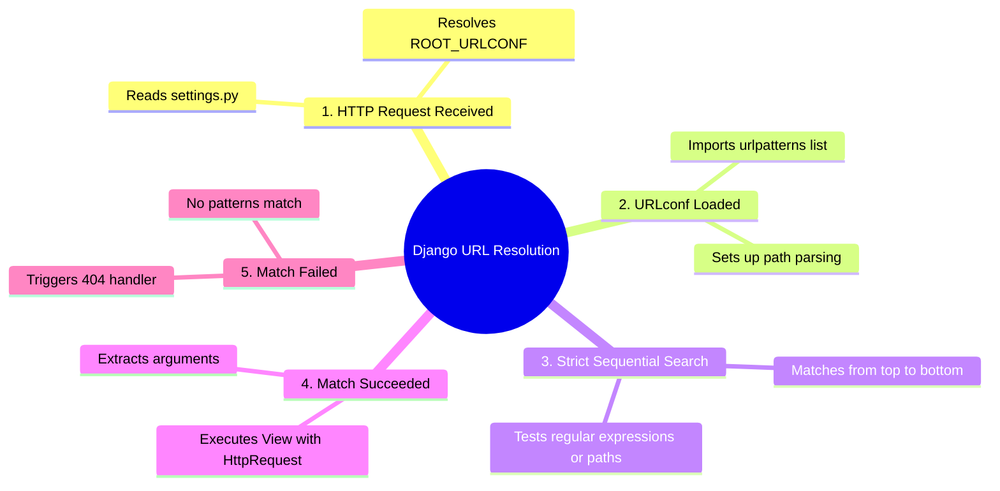

# 3.3.3. Django URL Dispatcher and Request Routing

> [!info] The URL Dispatcher is Django's routing engine. It acts as the traffic controller, mapping incoming HTTP request URLs to callable view functions or classes.
> This note provides an exhaustive, production-grade explanation of Django's routing infrastructure, path converters, dynamic routing, namespacing, URL reversing, and the mechanics of the URL dispatcher.

---

## 1. Core Routing Architecture

At the heart of any web framework is the routing engine: the subsystem that intercepts an incoming HTTP request, parses its URI path, and dispatches execution to a controller (which Django calls a **View**). Django’s routing engine is configured using a plain Python list of URL patterns, typically defined in a module named `urls.py`.

Unlike frameworks that use decorators (such as Flask or FastAPI), Django decouples route configuration from request handlers. This design has distinct enterprise benefits:
1. **Centralized Configuration:** You can view every endpoint supported by the application in one file rather than scanning the codebase.
2. **Order-Based Evaluation:** Routes are evaluated top-to-bottom in a strict sequence. The first pattern that matches "wins." This is predictable and prevents accidental overrides, unlike non-deterministic annotation scanners.
3. **Decoupled View Signatures:** Views do not need to know what URLs they are bound to; they focus purely on receiving an `HttpRequest` and returning an `HttpResponse`.

### 1.1 The Root URLconf Resolution Sequence

When a request enters a Django application, the framework follows this precise routing lifecycle:



1. **Setting Lookup:** Django reads the `settings.py` file and looks up the `ROOT_URLCONF` string setting (e.g., `'myproject.urls'`). This string indicates which Python module contains the root configuration.
2. **Module Import:** Django imports that module and expects to find a module-level variable named `urlpatterns`. This variable must be a list of `django.urls.path` and/or `django.urls.re_path` instances.
3. **Regex Matching:** Django strips the leading slash from the request URL path (e.g., `/articles/2026/` becomes `articles/2026/`) and begins matching against each pattern in the list from top to bottom.
4. **View Execution:**
   - If a match is found, Django imports and calls the associated view function, passing an `HttpRequest` instance along with any captured path arguments (as keyword or positional arguments).
   - If no match is found, or if an exception is raised during matching, Django invokes the appropriate error handler (e.g., `handler404` for Page Not Found).

---

## 2. Path Syntax and Path Converters

Django introduces a clean, legible path syntax via the `path()` function. It provides built-in type coercion and parameter validation directly in the URL matching phase.

### 2.1 Standard Path Matching

The syntax for capturing a parameter is `<type:name>`:

```python
from django.urls import path
from . import views

urlpatterns = [
    path('articles/', views.article_list, name='article_list'),
    path('articles/<int:pk>/', views.article_detail, name='article_detail'),
]
```

When a request for `/articles/42/` is made:
1. The prefix `articles/` matches.
2. `<int:pk>` intercepts `42`.
3. The `int` converter successfully converts the string `'42'` to the Python integer `42`.
4. Django executes `views.article_detail(request, pk=42)`.

If the request path is `/articles/draft/`, the `int` converter fails because `'draft'` contains non-digit characters. Django continues down the list. If no other patterns match, a 404 is returned.

### 2.2 Built-In Path Converters

Django provides five core path converters out of the box:

| Converter | Regex Pattern | Description | Python Type |
| :--- | :--- | :--- | :--- |
| **`str`** | `[^/]+` | Matches any non-empty string, excluding the path separator `/`. This is the default if no converter is specified (e.g., `<name>` is equivalent to `<str:name>`). | `str` |
| **`int`** | `[0-9]+` | Matches one or more decimal digits. | `int` |
| **`slug`** | `[-a-zA-Z0-9_]+` | Matches any slug string consisting of ASCII letters, numbers, hyphens, and underscores. | `str` |
| **`uuid`** | `[0-9a-f]{8}-[0-9a-f]{4}-[0-9a-f]{4}-[0-9a-f]{4}-[0-9a-f]{12}` | Matches a standardized UUID string. | `uuid.UUID` |
| **`path`** | `.+` | Matches any non-empty string, including the path separator `/`. This is useful for routing file paths or hierarchical categories. | `str` |

### 2.3 Custom Path Converters

If the built-in converters are insufficient (for example, you want to match a 4-digit year, a hexadecimal string, or a specific ISO-8601 date format), you can register a custom path converter.

A custom converter is a plain Python class containing:
1. A class attribute `regex` representing the regular expression pattern to match.
2. A `to_python(self, value)` method that takes the matched string and returns the coerced Python value. It must raise a `ValueError` if the value is invalid.
3. A `to_url(self, value)` method that does the reverse: taking a Python object and converting it to a string for reverse URL generation.

#### Example: Four-Digit Year Converter

```python
# converters.py
class FourDigitYearConverter:
    regex = '[0-9]{4}'

    def to_python(self, value):
        return int(value)

    def to_url(self, value):
        return f'{value:04d}'
```

To use it, register it with `register_converter` in your URLconf:

```python
# urls.py
from django.urls import path, register_converter
from . import converters, views

register_converter(converters.FourDigitYearConverter, 'yyyy')

urlpatterns = [
    path('articles/<yyyy:year>/', views.year_archive, name='year_archive'),
]
```

This ensures that only 4-digit integers will route to `views.year_archive`, and they will arrive inside the view as an integer (e.g., `year=2026`).

---

## 3. Regular Expression Routing (`re_path()`)

While `path()` satisfies 95% of use cases, complex routing rules require the full power of Regular Expressions. Django provides `re_path()` for this purpose. It uses Python’s named regular expression groups syntax: `(?P<name>pattern)`.

```python
from django.urls import re_path
from . import views

urlpatterns = [
    # Matches /articles/2026/ or /articles/1999/
    re_path(r'^articles/(?P<year>[0-9]{4})/$', views.year_archive, name='year_archive'),
    # Matches a hexadecimal hash, e.g., /archives/a1b2c3d4/
    re_path(r'^archives/(?P<hash>[0-9a-f]{8})/$', views.hash_detail, name='hash_detail'),
]
```

### Key Differences Between `path()` and `re_path()`
* `path()` is cleaner, more readable, and automatically converts data types.
* `re_path()` captures everything as **strings**. The view signature must handle its own type casting and conversion, increasing the risk of boilerplate errors.
* Always default to `path()`; use `re_path()` only when complex character matching, specific counts, or lookaheads are required.

---

## 4. Nested Routing and `include()`

In an enterprise-grade Django project, placing all URL patterns in a single root `urls.py` file creates a monolithic bottleneck. Django solves this by allowing nested, app-specific routing via the `include()` function.

### 4.1 Delegation Mechanics

The root `urls.py` delegates subpaths to individual application sub-routing files:

```python
# myproject/urls.py (Root URLconf)
from django.contrib import admin
from django.urls import path, include

urlpatterns = [
    path('admin/', admin.site.urls),
    path('blog/', include('blog.urls')),      # Delegates '/blog/*' to blog/urls.py
    path('api/v1/', include('api.urls')),    # Delegates '/api/v1/*' to api/urls.py
]
```

Then, inside the `blog` app, you create a dedicated `urls.py`:

```python
# blog/urls.py
from django.urls import path
from . import views

urlpatterns = [
    path('', views.blog_index, name='index'),               # Matches /blog/
    path('post/<slug:slug>/', views.post_detail, name='detail'), # Matches /blog/post/hello-world/
]
```

When Django matches `/blog/post/hello-world/`:
1. It matches the prefix `blog/` in the root URLconf.
2. It strips the matched portion (`blog/`) from the path.
3. It passes the remaining string (`post/hello-world/`) to `blog.urls` for sub-matching.
4. The sub-router matches `post/<slug:slug>/`, capturing `slug='hello-world'`.
5. It resolves the request to `views.post_detail(request, slug='hello-world')`.

This nested approach allows teams to work independently on their respective app routing files without causing merge conflicts in the root configuration.

---

## 5. Namespacing and Reversibility

Hardcoding URLs in views (`redirect("/blog/post/12/")`) or HTML templates (`<a href="/blog/post/12/">`) violates the DRY (Don't Repeat Yourself) principle. If you ever rename a path in `urls.py`, you would have to search and replace every hardcoded link throughout the application, risking broken links and deployment-blocking bugs.

Django implements **Reversible URL Resolution**: given a route's logical name and its parameters, Django automatically reconstructs the exact URL string.

### 5.1 Reversing in Python vs Templates

For a route named `'article_detail'`:

```python
path('articles/<int:pk>/', views.article_detail, name='article_detail')
```

#### Reversing in Python Code

Using `django.urls.reverse`:

```python
from django.urls import reverse
from django.http import HttpResponseRedirect

def my_view(request):
    # Resolves to: "/articles/42/"
    target_url = reverse('article_detail', kwargs={'pk': 42})
    return HttpResponseRedirect(target_url)
```

#### Reversing in Django Templates

Using the `` template tag:

```html
<!-- Renders: <a href="/articles/42/">Read More</a> -->
<a href="">Read More</a>
```

### 5.2 Application and Instance Namespaces

When your project scales, multiple apps might use identical route names (e.g., a `blog` app has an `'index'` route, and a `shop` app also has an `'index'` route). To prevent collisions, Django provides namespacing.

#### Setting up Namespaces

You define an `app_name` inside the app's `urls.py`:

```python
# blog/urls.py
from django.urls import path
from . import views

app_name = 'blog'  # Sets the application namespace

urlpatterns = [
    path('', views.blog_index, name='index'),
]
```

And in the shop app:

```python
# shop/urls.py
app_name = 'shop'

urlpatterns = [
    path('', views.shop_index, name='index'),
]
```

#### Resolving Namespaced URLs

To reverse a namespaced URL, join the namespace and the route name using a colon (`:`):

```python
# Resolves to "/blog/"
blog_url = reverse('blog:index')

# Resolves to "/shop/"
shop_url = reverse('shop:index')
```

```html
<!-- Template usage -->
<a href="">Visit our Blog</a>
<a href="">Shop Now</a>
```

---

## 6. Tips, Tricks, and Pitfalls

### 6.1 The Trailing Slash Rule (`APPEND_SLASH`)
By default, Django is opinionated about trailing slashes. If `settings.APPEND_SLASH` is `True` (which is the default):
* If a request is made to `/articles` (no trailing slash) and no pattern matches `/articles` exactly, but a pattern *does* match `/articles/` (with a trailing slash), Django issues an HTTP 301 Permanent Redirect to `/articles/`.
* This ensures clean, canonical URIs, preventing duplicate content SEO penalties.
* **Gotcha:** If you make a POST request to `/articles` and Django redirects to `/articles/`, some HTTP clients convert the request to a GET on redirect, dropping the POST payload. Always include the trailing slash in form action URLs and API requests.

### 6.2 The Order of Routing Evaluation
Because routing is matched from top to bottom, a generic pattern placed too high can "shadow" a specific pattern placed below it.

```python
# ❌ BAD: Generic slug pattern shadows the specific 'archive' pattern
urlpatterns = [
    path('articles/<slug:slug>/', views.article_detail, name='detail'),
    path('articles/archive/', views.article_archive, name='archive'), # This route is UNREACHABLE!
]
```

If a user requests `/articles/archive/`, the string `'archive'` is matched by `<slug:slug>` first. Django routes the request to `views.article_detail` with `slug='archive'`.
To fix this, always place literal routes above dynamic parameterized routes:

```python
# ✅ CORRECT: Specific routes first, generic patterns later
urlpatterns = [
    path('articles/archive/', views.article_archive, name='archive'),
    path('articles/<slug:slug>/', views.article_detail, name='detail'),
]
```

---

## 7. Summary

The URL Dispatcher is a centralized, order-based router that decodes incoming HTTP paths and directs them to Views. Path converters (`str`, `int`, `slug`, `uuid`, `path`) handle type checking and coercion automatically, while `re_path` provides regular expression fallback. Multi-app projects scale cleanly by nesting sub-routes with `include()`. Namespacing prevents route name collisions and enables robust reverse URL resolution (`reverse()` and ``) which isolates routing configurations from templates and controllers.

---

## See Also

- [[3.3.1. Django Overview and MVT Pattern]]
- [[3.3.4. Django ORM Deep Dive and Database Abstraction]]
- [[3.3.5. Django Views Function-Based vs Class-Based]]
- [[3.3.9. Django Middleware Onion Architecture]]
