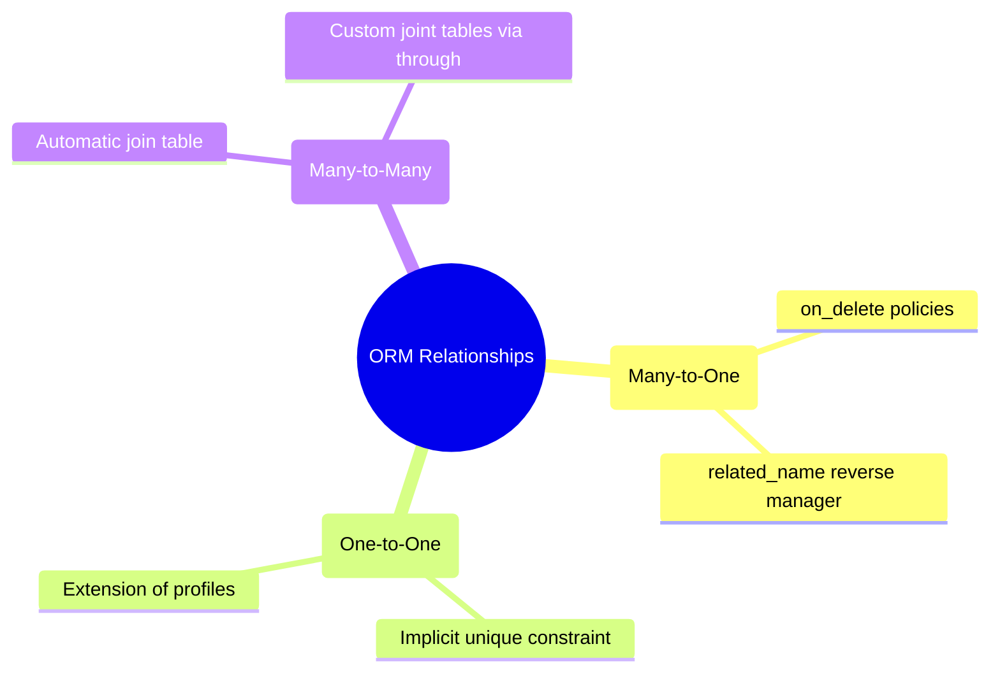

# 3.3.4. Django ORM Deep Dive and Database Abstraction

> [!info] Django's Object-Relational Mapper (ORM) is a powerful, expressive database abstraction engine that lets you define database tables as Python classes, manage schemas via migrations, and build high-performance SQL queries using a fluent, lazy-evaluated API.
> This note covers model definition mechanics, fields and relations, advanced QuerySet evaluation, the N+1 query problem, and complex expressions (Q objects, F objects, Aggregations, and Annotations).

---

## 1. Active Record Implementation vs Data Mapper

The Django ORM implements the **Active Record** architectural pattern. In an Active Record framework:
1. A **Model Class** maps directly to a relational database table.
2. An **Instance of that class** represents a single row in that table.
3. The Model class itself contains the behaviors for data persistence, validation, and querying.

This is in contrast to the **Data Mapper** pattern (used by Hibernate/Spring Data in Java or SQLAlchemy in Python), which separates the domain model from database persistence. The comparative table below summarizes the trade-offs:

| Metric | Active Record (Django ORM, Laravel Eloquent) | Data Mapper (SQLAlchemy, Hibernate) |
| :--- | :--- | :--- |
| **Simplicity** | High. Models are easy to write, instantiate, and persist. | Low to Medium. Demands explicit session management and mappings. |
| **Separation of Concerns** | Low. Database schemas and business code are combined in the same class. | High. Business domain models can be pure, decoupled Python/Java objects. |
| **Development Speed** | Exceptionally fast for standard CRUD and business applications. | Slower up front, but robust for complex enterprise data models. |
| **Data Synchronization** | Handled automatically via instance save/delete methods. | Managed explicitly by flush and commit commands on a unit of work (session). |

---

## 2. Model Definitions and Core Field Types

Django models are declared by subclassing `django.db.models.Model`. Every attribute on the model represents a database field.

```python
from django.db import models
import uuid

class Article(models.Model):
    # UUID as Primary Key instead of default auto-incrementing integer
    id = models.UUIDField(primary_key=True, default=uuid.uuid4, editable=False)
    title = models.CharField(max_length=200, db_index=True)
    slug = models.SlugField(max_length=250, unique=True)
    body = models.TextField()
    status = models.CharField(
        max_length=10, 
        choices=[('draft', 'Draft'), ('published', 'Published')],
        default='draft'
    )
    published_at = models.DateTimeField(null=True, blank=True)
    view_count = models.PositiveIntegerField(default=0)

    class Meta:
        db_table = 'articles_custom'  # Explicit table name override
        ordering = ['-published_at']   # Default query sorting order

    def __str__(self):
        return self.title
```

### 2.1 Critical Field Options

Options passed to fields control database schema constraints and form validation:

* **`null=True` vs `blank=True`:**
  * `null=True` is a **database-level** option. It allows the database column to store `NULL` values.
  * `blank=True` is a **validation-level** option. It permits forms or serializers to submit empty values (empty strings).
  * *Pitfall:* Avoid setting `null=True` on string-based fields like `CharField` and `TextField`. Django's convention is to store empty values as empty strings (`""`) to prevent having two distinct "empty" states (`NULL` and `""`). Use `blank=True` instead.
* **`db_index=True`:** Instructs the database to create an index on this column. Essential for columns heavily used in filtering or sorting (e.g., `status`, `published_at`).
* **`unique=True`:** Enforces database-level unique constraints. Automatically creates an index.

---

## 3. Database Relationships & Cardinality

Django supports three main types of relational fields:



### 3.1 ForeignKey (Many-to-One)
Defines a many-to-one relationship. The table representing the "many" carries the foreign key column.

```python
author = models.ForeignKey('auth.User', on_delete=models.CASCADE, related_name='articles')
```

#### On-Delete Policies:
* **`CASCADE`:** If the parent model (User) is deleted, all child models (Articles) are automatically deleted.
* **`PROTECT`:** Prevents deletion of the parent model by raising a `ProtectedError` if child articles exist.
* **`SET_NULL`:** Sets the foreign key column to `NULL` (requires `null=True`).
* **`SET_DEFAULT`:** Resets the foreign key column to its default value (requires a default).

#### The `related_name` parameter:
The `related_name` defines the attribute name on the *parent* model that points back to the *child* collection. If `related_name='articles'`, then given a `user` instance, you retrieve all their articles via `user.articles.all()`. If omitted, Django defaults to `article_set` (the child model name suffixed with `_set`).

### 3.2 OneToOneField (One-to-One)
Functionally identical to a `ForeignKey` with `unique=True`. It establishes a symmetric one-to-one relationship, perfect for dividing monolithic tables or creating user profiles.

```python
class Profile(models.Model):
    user = models.OneToOneField('auth.User', on_delete=models.CASCADE, related_name='profile')
    bio = models.TextField(blank=True)
```

Accessing the inverse relation returns a single model instance rather than a manager: `user.profile`.

### 3.3 ManyToManyField (Many-to-Many)
Creates an intermediary join table automatically containing the foreign keys of both models.

```python
tags = models.ManyToManyField('Tag', related_name='articles')
```

#### Custom Intermediary Tables (`through`):
If your join table needs to store extra metadata (e.g., when a user joined a group, or who authorized the relationship), you must specify a custom model using the `through` parameter:

```python
class Enrollment(models.Model):
    student = models.ForeignKey('Student', on_delete=models.CASCADE)
    course = models.ForeignKey('Course', on_delete=models.CASCADE)
    enrolled_at = models.DateTimeField(auto_now_add=True)
    grade = models.CharField(max_length=2, blank=True)

class Course(models.Model):
    students = models.ManyToManyField('Student', through=Enrollment)
```

---

## 4. QuerySet Architecture & Lazy Evaluation

A `QuerySet` is a representation of a collection of objects from your database. It can have zero, one, or many filters. Creating a QuerySet **does not** hit the database.

### 4.1 Lazy Evaluation Mechanics

```python
# 1. No database hit. Just constructs a QuerySet object in memory.
query = Article.objects.filter(status='published').order_by('-published_at')

# 2. Still no database hit. Modifies the internal SQL AST representation.
query = query.filter(view_count__gt=100)

# 3. Database is hit here! Iteration triggers evaluation.
for article in query:
    print(article.title)
```

#### Evaluation Triggers:
A QuerySet hits the database only when it is "evaluated." Triggers include:
* **Iteration:** `for obj in queryset:`
* **Slicing with Step:** `queryset[0:10:2]` (Standard slicing without step, like `queryset[0:10]`, returns another unevaluated QuerySet using `LIMIT` and `OFFSET`).
* **Pickling / Caching:** Converting the QuerySet into a pickle or storing it in cache.
* **Type Conversion:** Calling `repr()`, `len()`, `list()`, or `bool()` on the QuerySet.

---

## 5. Query Optimization and the N+1 Problem

The N+1 problem occurs when you fetch a parent model and then loop over the results to fetch related items, executing a database query *per parent row*.

```python
# ❌ BAD: Triggers N+1 database queries
articles = Article.objects.all() # 1 Query to fetch all articles
for article in articles:
    print(article.author.username) # N Queries! (One database hit per article author)
```

Django provides two optimization methods to solve this:

### 5.1 `select_related()` (SQL Join)
Used for single-valued relationships (`ForeignKey` and `OneToOneField`). It forces Django to run an SQL `INNER JOIN` or `LEFT JOIN` in the initial query, loading the parent and child models simultaneously.

```python
# ✅ OPTIMIZED: 1 Query total
articles = Article.objects.select_related('author').all()
for article in articles:
    print(article.author.username) # Already loaded in memory! No extra queries.
```

### 5.2 `prefetch_related()` (Separate Sub-Query)
Used for multi-valued relationships (`ManyToManyField` and reverse `ForeignKey` managers). It runs two separate queries: one for the main model, and one for the related model, linking them together in Python memory.

```python
# ✅ OPTIMIZED: 2 Queries total
articles = Article.objects.prefetch_related('tags').all()
for article in articles:
    for tag in article.tags.all(): # Loaded in memory! No extra hits.
        print(tag.name)
```

---

## 6. Advanced Query Expressions

For complex business requirements, Django provides several query tools:

### 6.1 Q Objects (Complex Boolean Operations)
Standard filters are joined by an implicit `AND`. To create queries with `OR`, `NOT`, or complex parenthetical nesting, wrap conditions in `Q` objects:

```python
from django.db.models import Q

# Matches articles that are either in 'draft' status OR have more than 10,000 views
query = Article.objects.filter(
    Q(status='draft') | Q(view_count__gt=10000)
)

# Matches published articles that are NOT written by user with ID 5
query = Article.objects.filter(
    Q(status='published') & ~Q(author_id=5)
)
```

### 6.2 F Expressions (Database-Level Calculations)
F expressions refer to a model field's value directly inside the database, bypassing Python memory. This solves two problems:
1. **Performance:** Eliminates the need to load the value into Python, mutate it, and save it back.
2. **Race Conditions:** Safe concurrent increments.

```python
from django.db.models import F

# ❌ BAD: Subject to race conditions if two users click at the same time
article = Article.objects.get(id=1)
article.view_count += 1
article.save()

# ✅ CORRECT & CONCURRENT-SAFE: Runs UPDATE table SET view_count = view_count + 1 WHERE id = 1
Article.objects.filter(id=1).update(view_count=F('view_count') + 1)
```

### 6.3 Aggregations vs Annotations

* **`aggregate()`:** Computes a summary value over an entire QuerySet. It returns a Python **dictionary**, terminating the QuerySet chain.
* **`annotate()`:** Calculates a summary value for **each individual row** in the QuerySet. It returns an updated, chainable QuerySet with the dynamic column attached.

```python
from django.db.models import Avg, Count

# 1. Aggregation Example: Average views across ALL articles
# Returns: {'view_count__avg': 420.5}
average_views = Article.objects.aggregate(Avg('view_count'))

# 2. Annotation Example: Attaching comment count to EACH article row
# Each returned article will have a dynamically computed '.comment_count' property
articles = Article.objects.annotate(comment_count=Count('comments'))
for a in articles:
    print(f"Article: {a.title} has {a.comment_count} comments.")
```

---

## 7. The Schema Migration Engine

Migrations are Django’s way of propagating changes you make to your models (adding a field, deleting a model, changing an index) into your database schema.

### 2.1 The Two-Step Cycle
1. **`python manage.py makemigrations`:** Inspects current models, compares them with the previous migration files, and writes a new deterministic declarative Python migration file in your app's `migrations/` directory.
2. **`python manage.py migrate`:** Compiles the migration files into raw DDL statements for your configured database engine, runs them, and tracks execution in the `django_migrations` database table.

```python
# A typical auto-generated migration file
from django.db import migrations, models

class Migration(migrations.Migration):
    dependencies = [
        ('blog', '0001_initial'),
    ]
    operations = [
        migrations.AddField(
            model_name='article',
            name='is_featured',
            field=models.BooleanField(default=False),
        ),
    ]
```

### 2.2 Critical Commands
* `python manage.py showmigrations`: Displays a checklist of applied and pending migrations per application.
* `python manage.py sqlmigrate blog 0002`: Compiles and displays the exact raw SQL that would be run for a specific migration without actually modifying the database. Indispensable for DBA audits.

---

## 8. Summary

The Django ORM is an Active Record abstraction that translates Python class definitions into database schemas. Using field options properly enforces data integrity. Developers must remain vigilant about QuerySet lazy evaluation to proactively avoid N+1 query bottlenecks via `select_related` and `prefetch_related`. Q and F expressions bring SQL operators and database-level computations into elegant Python code, and the migration system serves as a reproducible database schema version control.

---

## See Also

- [[3.3.1. Django Overview and MVT Pattern]]
- [[3.3.3. Django URL Dispatcher and Request Routing]]
- [[3.3.8. Django ORM Optimization and N1 Problem]]
- [[4.1. ORM Fundamentals]]
