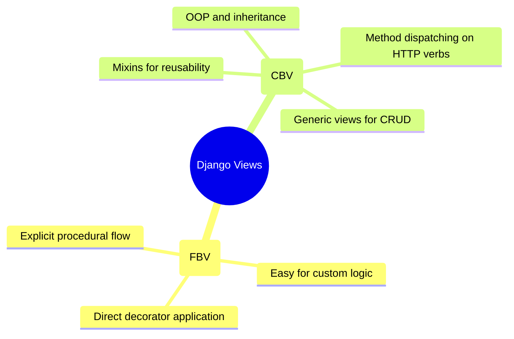

# 3.3.5. Django Views: Function-Based vs Class-Based

> [!info] Django Views are the controllers of the MVT architecture. They process an incoming `HttpRequest`, execute business and database logic, and return an `HttpResponse`.
> This note analyzes the architectural trade-offs between procedural Function-Based Views (FBVs) and object-oriented Class-Based Views (CBVs), explains Django's generic editing and display views, and demonstrates security integration via Mixins and decorators.

---

## 1. Architectural Paradigms

A Django view is simply a Python callable that takes an `HttpRequest` object as its first argument and returns an `HttpResponse` object. This callable can be expressed in two paradigms:



### 1.1 Function-Based Views (FBVs)
An FBV is a standard Python function. It uses explicit conditional branching to process different HTTP methods (verbs):

```python
from django.shortcuts import render, get_object_or_404, redirect
from django.contrib.auth.decorators import login_required
from .models import Article
from .forms import ArticleForm

@login_required
def article_edit(request, pk):
    article = get_object_or_404(Article, pk=pk)
    if request.method == 'POST':
        form = ArticleForm(request.POST, instance=article)
        if form.is_valid():
            form.save()
            return redirect('article_detail', pk=article.pk)
    else:
        form = ArticleForm(instance=article)
    
    return render(request, 'blog/article_form.html', {'form': form, 'article': article})
```

#### Advantages of FBVs:
* **Explicit Flow:** There are no hidden class hierarchies, magic parent classes, or implicit mixin methods. Any developer can read the function from top to bottom and understand exactly what is happening.
* **Easy Decoration:** Django decorators (`@login_required`, `@require_http_methods`) map directly onto functions.
* **Flexibility:** Perfect for non-standard routes, integration endpoints, or views with highly custom logic.

---

## 2. Class-Based Views (CBVs)

CBVs use object-oriented programming to solve code reuse. Instead of checking `if request.method == 'POST'`, Django's `View` class uses an internal dispatcher that matches the HTTP verb to an equivalent class method name (`get()`, `post()`, `put()`, `delete()`):

```python
from django.views import View
from django.http import HttpResponse

class ContactView(View):
    def get(self, request, *args, **kwargs):
        # Handles GET requests
        return HttpResponse("This is a GET response")

    def post(self, request, *args, **kwargs):
        # Handles POST requests
        return HttpResponse("This is a POST response")
```

### 2.1 The Underlying Mechanics: `as_view()`
In your `urls.py`, you cannot register a class directly because the URL dispatcher expects a callable function. CBVs solve this via the static class method `as_view()`:

```python
urlpatterns = [
    path('contact/', ContactView.as_view(), name='contact'),
]
```

When Django boots:
1. `as_view()` is called. It creates an closure (a function wrapper) that instantiates the class on every incoming request.
2. The closure assigns `request`, `args`, and `kwargs` as attributes on the class instance.
3. It calls the `dispatch()` method.
4. `dispatch()` inspects `request.method`, checks if a corresponding lower-case method exists on the class, and executes it. If not, it raises an `HttpResponseNotAllowed` (HTTP 405) error.

---

## 3. Generic Display and Editing Views

Django ships with "Generic Class-Based Views" to eliminate boilerplate code for standard database CRUD operations.

### 3.1 Display Views: `ListView` and `DetailView`

#### `ListView` (For collections of records)
Retrieves a list of records from the database, paginates them, and passes them to a template context.

```python
from django.views.generic import ListView
from .models import Article

class ArticleListView(ListView):
    model = Article
    template_name = 'blog/article_list.html'
    context_object_name = 'articles'  # Defaults to 'object_list'
    paginate_by = 10                  # Automatic pagination built-in!

    def get_queryset(self):
        # Override to filter dynamically
        return Article.objects.filter(status='published')
```

#### `DetailView` (For a single record)
Fetches a single object by primary key (`pk`) or `slug` in the URL, automatically returning a 404 if not found.

```python
from django.views.generic import DetailView
from .models import Article

class ArticleDetailView(DetailView):
    model = Article
    template_name = 'blog/article_detail.html'
    context_object_name = 'article'  # Defaults to 'object'
```

### 3.2 Editing Views: `CreateView`, `UpdateView`, and `DeleteView`

These views automatically instantiate a ModelForm, render it to a template, handle validation, handle file uploads, and save the model to the database.

```python
from django.views.generic import CreateView, UpdateView, DeleteView
from django.urls import reverse_lazy
from .models import Article

class ArticleCreateView(CreateView):
    model = Article
    fields = ['title', 'body', 'status']  # Automatically generates a ModelForm
    template_name = 'blog/article_form.html'
    success_url = reverse_lazy('article_list') # reverse_lazy prevents premature import of URLconfs

    def form_valid(self, form):
        # Inject the logged-in user as the article author before saving
        form.instance.author = self.request.user
        return super().form_valid(form)
```

---

## 4. CBV Mixins and Method Resolution Order (MRO)

CBVs achieve functionality composition through Python's **multiple inheritance**. These helper classes are called **Mixins**. A Mixin is a parent class designed to inject specific methods or attributes into a CBV (e.g., security checking or context modification).

### 4.1 Mixing Order Rules
Because Python uses **MRO (Method Resolution Order)**, the order in which you inherit from classes matters. **Mixins must always be listed FIRST (leftmost) in the class declaration**, with the base generic view listed last (rightmost).

```python
from django.contrib.auth.mixins import LoginRequiredMixin, PermissionRequiredMixin
from django.views.generic import CreateView
from .models import Article

class SecureArticleCreateView(LoginRequiredMixin, PermissionRequiredMixin, CreateView):
    login_url = '/accounts/login/'
    redirect_field_name = 'next'
    
    permission_required = 'blog.add_article'  # Checked by PermissionRequiredMixin
    
    model = Article
    fields = ['title', 'body']
    template_name = 'blog/article_form.html'
```

If you list `CreateView` before `LoginRequiredMixin`, Python’s MRO will find and execute `CreateView`'s lifecycle methods (like `dispatch()`) before the Mixin can run its security checks, exposing your secure view to unauthenticated requests.

---

## 5. Security Integration: CBVs vs FBVs

Securing endpoints is the core task of any views structure.

### 5.1 Securing FBVs (Decorators)
FBVs are secured using standard Python decorators applied directly over the function definition:

```python
from django.contrib.auth.decorators import login_required, permission_required
from django.views.decorators.http import require_POST

@login_required
@permission_required('blog.delete_article', raise_exception=True)
@require_POST
def delete_article(request, pk):
    # This view is only reachable if:
    # 1. User is authenticated
    # 2. User has the blog.delete_article permission
    # 3. HTTP method is POST
    ...
```

### 5.2 Securing CBVs (Mixins vs `method_decorator`)
With CBVs, you have two choices for security enforcement:

#### Option A: Mixins (Recommended)
This is clean, elegant, and leverages standard object inheritance:

```python
class MySecureView(LoginRequiredMixin, View):
    # Secured automatically!
    ...
```

#### Option B: `@method_decorator`
If you want to apply a standard functional decorator (e.g., a custom logger or third-party check) to a class method, you must adapt it using `@method_decorator`:

```python
from django.utils.decorators import method_decorator
from django.contrib.auth.decorators import login_required
from django.views import View

# Decorate the dispatch method to apply login check to ALL methods in the class
@method_decorator(login_required, name='dispatch')
class MyDecoratedView(View):
    def get(self, request):
        return HttpResponse("Logged in GET")
```

---

## 6. Summary and Decision Guide

Choosing between FBVs and CBVs is not about "which is better," but "which is right for the current requirement."

* **Use FBVs when:**
  * You are writing highly unique code (like handling an incoming webhook callback).
  * You need total, explicit control over the step-by-step logic.
  * You are building a quick prototype or API endpoint.
* **Use CBVs when:**
  * You are building standard database-driven CRUD operations.
  * You can leverage Django’s Generic Views (`ListView`, `DetailView`, `CreateView`, `UpdateView`, `DeleteView`) to save hundreds of lines of code.
  * You want to share features (like security profiles) across multiple views via clean, reusable Mixins.

---

## See Also

- [[3.3.1. Django Overview and MVT Pattern]]
- [[3.3.3. Django URL Dispatcher and Request Routing]]
- [[3.3.6. Django Middleware and Signals]]
