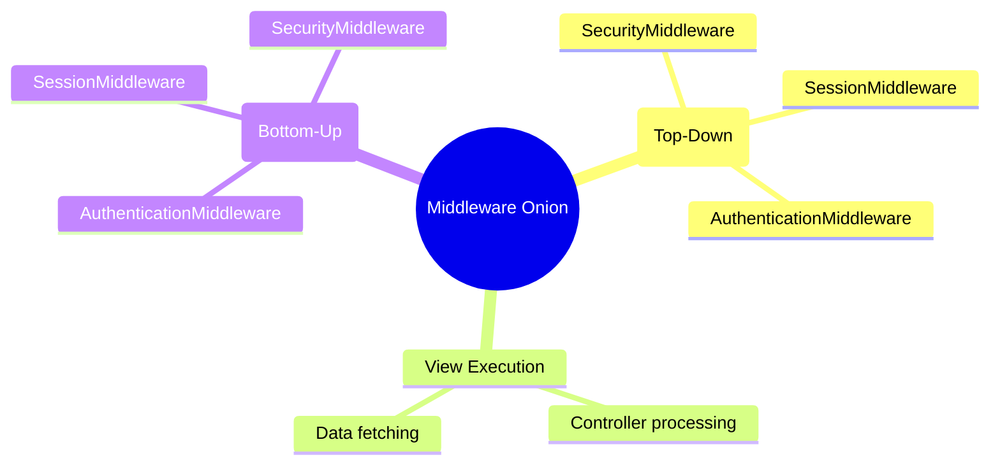

# 3.3.6. Django Middleware and Signals

> [!info] Middleware and Signals are Django’s primary interception frameworks. Middleware operates as a bidirectional pipeline wrapping the request/response cycle, while Signals implement a publish-subscribe event bus that decouples core database operations from downstream side-effects.
> This note explains the onion architecture of Django’s middleware pipeline, demonstrates writing custom middleware, details built-in security middlewares, and covers the mechanics and gotchas of the Signals engine.

---

## 1. Middleware Onion Architecture

Django middleware acts as a framework of hooks that wrap around Django's request-handling process. It is a light, low-level plugin system for globally altering Django's input or output.

The middleware system is structured as an **onion (or symmetric pipeline)**. The list of middlewares defined in `settings.py` is executed sequentially:
1. **Request Phase (Top-Down):** Executed from the first middleware in the list down to the last. This phase executes before the URL resolver maps the path to a View.
2. **View Phase:** The view processes the request.
3. **Response Phase (Bottom-Up):** Executed from the last middleware in the list up to the first. This phase post-processes the HTTP response before it is written back to the WSGI/ASGI server.



---

## 2. Setting Middleware Execution Order

The order of `MIDDLEWARE` in `settings.py` is critical because middlewares frequently depend on attributes attached to `request` by earlier middlewares:

```python
# settings.py
MIDDLEWARE = [
    'django.middleware.security.SecurityMiddleware',
    'django.contrib.sessions.middleware.SessionMiddleware',
    'django.middleware.common.CommonMiddleware',
    'django.middleware.csrf.CsrfViewMiddleware',
    'django.contrib.auth.middleware.AuthenticationMiddleware',
    'django.contrib.messages.middleware.MessageMiddleware',
    'django.middleware.clickjacking.XFrameOptionsMiddleware',
]
```

### Critical Dependency Chain:
1. **`SecurityMiddleware`** is placed first to enforce HTTPS redirection, HSTS headers, and SSL configurations before any session cookies are sent or read.
2. **`SessionMiddleware`** must execute before `AuthenticationMiddleware`. It reads the session cookie from the headers, loads the session database record, and attaches the active session object to `request.session`.
3. **`AuthenticationMiddleware`** relies on `request.session` to find the user ID. It retrieves the user record from the database and attaches it to `request.user`.
4. **`CsrfViewMiddleware`** is placed after `SessionMiddleware` but before view execution to intercept unsafe HTTP methods (POST, PUT, DELETE) and validate CSRF tokens against active session hashes.

If you place a custom middleware that accesses `request.user` above `AuthenticationMiddleware`, the code will crash or fail because `request.user` does not exist yet.

---

## 3. Writing Custom Middleware

In modern Django, a middleware can be written as a function or a class whose instance is callable.

### 3.1 Custom Request ID Middleware Example
The following middleware generates a unique UUID (Request ID) for every incoming request, attaches it to the request and response objects, and injects it into thread-local variables for logging correlation:

```python
import uuid
import logging

logger = logging.getLogger('django')

class RequestIDMiddleware:
    def __init__(self, get_response):
        # One-time configuration and initialization.
        # This is executed once when the web server boots up!
        self.get_response = get_response

    def __call__(self, request):
        # 1. REQUEST PHASE (Before the View executes)
        # Check if the client or proxy passed a Request ID, otherwise generate one
        request_id = request.headers.get('X-Request-ID', str(uuid.uuid4()))
        request.request_id = request_id
        
        logger.info(f"Started Request {request.path} with ID {request_id}")

        # Pass the request to the next middleware (or the View)
        response = self.get_response(request)

        # 2. RESPONSE PHASE (After the View executes)
        # Inject the Request ID into the outgoing HTTP headers
        response['X-Request-ID'] = request_id
        logger.info(f"Finished Request {request.path} with ID {request_id}")

        return response
```

To register it, add the full Python import path of your middleware class to the `MIDDLEWARE` list in `settings.py`.

---

## 4. Built-In Security Middlewares

Django ships with robust, default security middlewares to safeguard applications from the OWASP Top 10 vulnerabilities:

* **`SecurityMiddleware`:**
  * **SSL Redirection:** If `SECURE_SSL_REDIRECT = True`, it redirects all non-HTTPS requests to their HTTPS equivalent.
  * **HSTS (HTTP Strict Transport Security):** Enforces HTTPS browser compliance via the `Strict-Transport-Security` header.
  * **X-Content-Type-Options:** Attaches the `nosniff` value to prevent browsers from content-sniffing away from specified MIME types.
* **`CsrfViewMiddleware`:**
  * Mitigates Cross-Site Request Forgery.
  * It generates a random token associated with the session cookie. Any POST/PUT/DELETE request must provide this token via a hidden form input (`csrfmiddlewaretoken`) or HTTP Header (`X-CSRFToken`).
  * If validation fails, it short-circuits the pipeline immediately, returning an HTTP 403 Forbidden response without executing the view.
* **`XFrameOptionsMiddleware`:**
  * Mitigates Clickjacking.
  * It sets the `X-Frame-Options` header to `DENY` or `SAMEORIGIN` by default, preventing malicious external sites from rendering your pages inside invisible iframes.

---

## 5. The Signals Engine (Pub-Sub)

Signals are Django's implementation of the **observer design pattern**. They allow decoupled applications to get notified when actions occur elsewhere in the framework (particularly during database model transactions).

### 5.1 Common Built-In Signals
* **`pre_save` / `post_save`:** Triggered before and after a model’s `save()` method is invoked.
* **`pre_delete` / `post_delete`:** Triggered before and after a model’s row is deleted.
* **`m2m_changed`:** Emitted when a `ManyToManyField` on a model is modified.
* **`request_started` / `request_finished`:** Emitted when Django begins and ends HTTP request processing.

### 5.2 Connecting a Signal Receiver

The standard way to wire a receiver is using the `@receiver` decorator:

```python
# blog/signals.py
from django.db.models.signals import post_save
from django.dispatch import receiver
from django.contrib.auth.models import User
from .models import Profile

@receiver(post_save, sender=User)
def create_user_profile(sender, instance, created, **kwargs):
    """
    Automatically creates a Profile row whenever a new User row is committed.
    """
    if created:
        Profile.objects.create(user=instance)
```

### 5.3 Timing Difference: `pre_save` vs `post_save`

Choosing between `pre_save` and `post_save` is dictated by the database state and your architectural goals:

| Feature | `pre_save` | `post_save` |
| :--- | :--- | :--- |
| **Execution Point** | Before the database write is committed. | After the database write is committed. |
| **Primary Use Case** | Modifying internal model properties (e.g., auto-slug generation, default normalizations). | Triggering downstream side-effects (e.g., creating profiles, sending emails, publishing events). |
| **Object Primary Key** | If creating, the instance does **not** have an ID yet. | The instance **guarantees** a valid primary key. |
| **Save Behavior** | Modifying fields (e.g., `instance.slug = ...`) is saved automatically without any extra database queries. | Modifying the instance requires calling `instance.save()`, which triggers an infinite recursion loop unless guarded. |

---

## 6. Critical Signal Gotchas and Avoidance

Signals can make your codebase difficult to maintain and debug if misused.

### 6.1 Implicit Flow and Cognitive Load
Signals are executed **synchronously** in the same execution thread as the caller. There is no visible indication in a view (e.g., `User.objects.create()`) that multiple signal handlers will run. This makes code hard to trace and debug, as errors inside a signal handler will roll back the entire transaction.
* *Best Practice:* Use signals sparingly. If two events are tightly coupled, create an explicit **Service Layer** function (e.g., `user_registration_service(username, email)`) that creates both the user and the profile explicitly rather than hiding the logic inside a signal handler.

### 6.2 Infinite Saving Loops
If you call `instance.save()` inside a `post_save` receiver, it triggers the signal again, causing an infinite recursion loop that crashes your worker thread:

```python
# ❌ INCORRECT: Causes infinite recursion!
@receiver(post_save, sender=Article)
def update_view_metrics(sender, instance, **kwargs):
    instance.some_field = "updated"
    instance.save() # Triggers post_save again!
```

To safely modify and persist model changes in a `post_save` receiver without re-triggering the signal, pass `update_fields` or disconnect the signal temporarily:

```python
# ✅ CORRECT: Specifying update_fields skips re-triggering this specific hook
# (if you guard or check which fields changed)
@receiver(post_save, sender=Article)
def update_view_metrics(sender, instance, **kwargs):
    if instance.some_field != "updated":
        instance.some_field = "updated"
        instance.save(update_fields=['some_field'])
```

---

## 7. Summary

Django Middleware operates as a bidirectional onion pipeline that wraps around request routing and view execution, enforcing authentication, session control, and CSRF protection in a strict top-down sequence. Django Signals decouple the model lifecycle from downstream side-effects using an event-driven pub-sub architecture, though developers must manage the implicit execution flow and avoid infinite loop recursions.

---

## See Also

- [[3.3.1. Django Overview and MVT Pattern]]
- [[3.3.4. Django ORM Deep Dive and Database Abstraction]]
- [[3.3.5. Django Views Function-Based vs Class-Based]]
