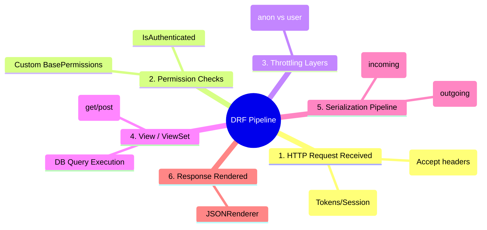

# 3.3.7. Django REST Framework DRF and Web APIs

> [!info] Django REST Framework (DRF) is the industry-standard toolkit for building robust, scalable web APIs on top of Django.
> This note explains DRF's architecture, details custom serializers, outlines model-driven validation pipelines, and demonstrates how to build and secure RESTful endpoints using ViewSets, Routers, and custom Permissions.

---

## 1. DRF Architecture

While standard Django is designed to render HTML templates, modern web applications often demand stateless, structured data payloads (typically JSON) to feed mobile apps and single-page applications (SPAs like React, Vue, or Angular).

**Django REST Framework (DRF)** overlays Django’s standard request/response model to handle:
1. **Content Negotiation:** Automatically determining which renderer (JSON, XML, or HTML) to use based on the client's `Accept` headers.
2. **Serialization:** Parsing complex relational model instances into native Python datatypes that can easily be serialized into JSON, and vice versa.
3. **Authentication & Permissions:** Declarative, pluggable security strategies per view or project-wide.



---

## 2. Serializers and Validation Pipelines

Serializers are the core of DRF. They behave like Django's `Form` and `ModelForm` classes, but operate on structured data structures (JSON/Dicts) rather than raw HTML forms.

### 2.1 The Two-Way Street of Serialization
* **Serialization (Read):** Model Instance (DB Row) $\rightarrow$ Python Primitive Dict $\rightarrow$ JSON String.
* **Deserialization (Write):** JSON String $\rightarrow$ Python Primitive Dict $\rightarrow$ Validated Model Instance.

### 2.2 Serializer Example with Custom Validation

```python
from rest_framework import serializers
from .models import Article

class ArticleSerializer(serializers.ModelSerializer):
    # Read-only field computed on the fly
    author_name = serializers.CharField(source='author.username', read_only=True)
    
    class Meta:
        model = Article
        fields = ['id', 'title', 'slug', 'body', 'status', 'view_count', 'author_name', 'published_at']
        read_only_fields = ['id', 'view_count', 'published_at']

    # 1. Field-Level Validation: validate_<field_name>()
    def validate_title(self, value):
        if len(value) < 10:
            raise serializers.ValidationError("The title must be at least 10 characters long.")
        return value

    # 2. Object-Level Validation: validate()
    def validate(self, data):
        """
        Validates multiple fields together.
        """
        if data.get('status') == 'published' and not data.get('body'):
            raise serializers.ValidationError({
                "body": "A published article must contain body text."
            })
        return data
```

---

## 3. ViewSets and Routing Mechanics

DRF provides several abstractions for creating views, ranging from manual control to high-level automation.

### 3.1 The View Abstraction Hierarchy
1. **`APIView`:** Subclasses standard Django `View`. It wraps incoming requests in DRF `Request` objects, handles API exceptions, and returns DRF `Response` objects.
2. **`GenericAPIView`:** Extends `APIView`, adding helpers for database querysets and serialization. Frequently paired with `Mixins` (e.g., `ListModelMixin`, `CreateModelMixin`).
3. **`ModelViewSet`:** The highest-level abstraction. It inherits all standard mixins to automatically provide a full suite of read/write REST endpoints (`list`, `create`, `retrieve`, `update`, `partial_update`, `destroy`) from a single class.

### 3.2 ViewSet Example

```python
from rest_framework import viewsets
from rest_framework.permissions import IsAuthenticatedOrReadOnly
from .models import Article
from .serializers import ArticleSerializer

class ArticleViewSet(viewsets.ModelViewSet):
    """
    A fully functional ViewSet providing GET, POST, PUT, PATCH, and DELETE
    for the Article model out of the box.
    """
    queryset = Article.objects.all()
    serializer_class = ArticleSerializer
    permission_classes = [IsAuthenticatedOrReadOnly] # Pluggable permission layer

    def perform_create(self, serializer):
        # Automatically set the author of the article to the active user
        serializer.save(author=self.request.user)
```

### 3.3 Routing ViewSets with Routers
ViewSets eliminate the need to write separate URL mappings for each HTTP method. Instead, you register the ViewSet with a **Router** which generates the complete list of endpoint configurations automatically:

```python
# urls.py
from django.urls import path, include
from rest_framework.routers import DefaultRouter
from .views import ArticleViewSet

# Create a router and register our ViewSet
router = DefaultRouter()
router.register(r'articles', ArticleViewSet, basename='article')

# The router-generated URLs are now wired into our URLconf
urlpatterns = [
    path('', include(router.urls)),
]
```

#### Generated REST Endpoints:
The router above generates the following endpoints for free:
* `GET /articles/` $\rightarrow$ `list` action
* `POST /articles/` $\rightarrow$ `create` action
* `GET /articles/<pk>/` $\rightarrow$ `retrieve` action
* `PUT /articles/<pk>/` $\rightarrow$ `update` action
* `PATCH /articles/<pk>/` $\rightarrow$ `partial_update` action
* `DELETE /articles/<pk>/` $\rightarrow$ `destroy` action

---

## 4. Permission and Authentication Layers

Security is paramount in web APIs. DRF splits security into two distinct checking phases:
1. **Authentication:** Proving *who* a user is (attaching an identity to `request.user`).
2. **Permissions:** Determining *what* that authenticated user is allowed to do.

### 4.1 Custom Object-Level Permissions
The following custom permission class blocks modifying a resource (PUT/DELETE) unless the requesting user is the original creator of that specific resource:

```python
from rest_framework import permissions

class IsAuthorOrReadOnly(permissions.BasePermission):
    """
    Custom permission to only allow authors of an article to edit or delete it.
    """
    def has_permission(self, request, view):
        # Read permissions are allowed to any request,
        # so we always allow safe HTTP methods (GET, HEAD, OPTIONS)
        if request.method in permissions.SAFE_METHODS:
            return True
        
        # Write permissions require authentication
        return request.user and request.user.is_authenticated

    def has_object_permission(self, request, obj, view):
        # Read permissions are allowed
        if request.method in permissions.SAFE_METHODS:
            return True

        # Write permissions are only allowed if the authenticated user is the author
        return obj.author == request.user
```

To apply it to your ViewSet, simply declare it inside the `permission_classes` list:

```python
permission_classes = [IsAuthorOrReadOnly]
```

---

## 5. Summary

Django REST Framework (DRF) converts standard Django models into highly scalable, stateless REST APIs. DRF's pipeline handles content negotiation, authenticates users, and checks permissions before routing requests. Serializers manage the bidirectional conversion between database rows and JSON payloads, executing field-level and object-level validations. By using ViewSets and Routers, developers can produce full, standardized CRUD resource directories while keeping the routing configurations minimal.

---

## See Also

- [[3.3.1. Django Overview and MVT Pattern]]
- [[3.3.4. Django ORM Deep Dive and Database Abstraction]]
- [[3.3.5. Django Views Function-Based vs Class-Based]]
- [[1.2. RESTful API Design and Constraints]]
