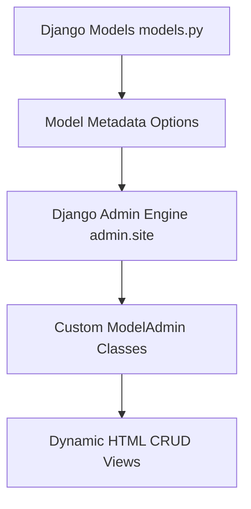

# 3.3.8. Django Admin Interface Customization

> [!info] Orientation
> Django is famous for its "batteries-included" philosophy, and its most iconic built-in feature is the auto-generated administrative CRUD panel. This note explores how the admin interface operates under the hood, how to customize model registration using `ModelAdmin`, implement custom administrative actions, secure list views with optimized queries, and safely customize the visual appearance.

---

## 1. The Auto-Generated Admin Panel

When you run `django-admin startproject`, Django automatically registers the administrative dashboard in your global `urls.py` pattern list at `/admin/`.

The administrative panel is not a static tool; it is a dynamic application powered completely by your Django model configurations. The framework reads model metadata and builds forms, validations, listing tables, filters, and write operations automatically in real-time.



To access the panel locally, you must create a administrative user (superuser) using Django's CLI:

```bash
python manage.py createsuperuser
```

---

## 2. Model Registration and `ModelAdmin` Customization

To expose your database models inside the admin panel, you must register them in your application's `admin.py` file. Instead of doing a simple registration, we can subclass `admin.ModelAdmin` to customize the visual structure and behavior of our CRUD views.

```python
# admin.py
from django.contrib import admin
from .models import Article, Category

# Decorator-based registration (Clean & Modern)
@admin.register(Article)
class ArticleAdmin(admin.ModelAdmin):
    # 1. Custom Column display in tabular lists
    list_display = ('title', 'author', 'category', 'status', 'created_at', 'get_word_count')
    
    # 2. Clicking these columns navigates to details form
    list_display_links = ('title', 'author')
    
    # 3. Quick inline filters on the right sidebar
    list_filter = ('status', 'category', 'created_at')
    
    # 4. Search bar configuration (using lookup fields)
    search_fields = ('title', 'content', 'author__username')
    
    # 5. Dynamic slug pre-population based on another text field
    prepopulated_fields = {'slug': ('title',)}
    
    # 6. Pagination count adjustment
    list_per_page = 25
    
    # 7. Restricting editable fields in details forms
    readonly_fields = ('created_at', 'updated_at')

    # Custom callable column logic
    @admin.display(description="Word Count")
    def get_word_count(self, obj):
        return len(obj.content.split())
```

---

## 3. Optimizing Admin Views (Preventing N+1 Queries)

One of the most common production bottlenecks in Django applications is running too many database queries when the admin panel displays lists of objects with foreign key relations.

If your registered model features multiple relationships (like `author` and `category` above), Django's default behavior is querying the database once for *each* related field on *every single row* displayed in the list view (the classic N+1 query problem).

To fix this, we override the default database query retrieval on our `ModelAdmin` using `select_related()` and `prefetch_related()`:

```python
@admin.register(Article)
class ArticleAdmin(admin.ModelAdmin):
    # ... previous fields ...

    # 🚀 Optimize the SQL queries behind the admin table view
    def get_queryset(self, request):
        queryset = super().get_queryset(request)
        # Select related Author (foreign key) and prefetch Tags (many-to-many)
        return queryset.select_related('author', 'category')
```

---

## 4. Writing Custom Admin Actions

Django admin allows administrators to perform batch actions on multiple records simultaneously from the list view. By default, it registers "Delete selected items". We can declare custom, custom actions for specific batch operations (such as mass-publishing articles):

```python
# admin.py
@admin.register(Article)
class ArticleAdmin(admin.ModelAdmin):
    # ... listing fields ...
    actions = ['make_published']

    @admin.action(description='Mark selected articles as Published')
    def make_published(self, request, queryset):
        # Trigger an atomic database UPDATE
        updated_count = queryset.update(status='published')
        
        # Display a flash message in the administrative panel
        self.message_user(
            request, 
            f'Successfully marked {updated_count} articles as published.'
        )
```

---

## 5. Inline Model Editing

If you have a parent-child relationship (such as an `Invoice` with multiple `LineItems`), editing them across separate admin panels is frustrating. Django provides `InlineModelAdmin` classes to display child forms inline inside the parent's form:

```python
# admin.py
from django.contrib import admin
from .models import Invoice, LineItem

# Define the Inline representation
class LineItemInline(admin.TabularInline): # Or admin.StackedInline
    model = LineItem
    extra = 1 # Number of empty extra forms to display

@admin.register(Invoice)
class InvoiceAdmin(admin.ModelAdmin):
    inlines = [LineItemInline]
```

---

## Summary

Django's Admin panel is a powerful administrative engine that reads application models to dynamically compile web management panels. By subclassing `ModelAdmin` and tailoring columns, search indexes, custom actions, inline sub-forms, and overriding lookup queries via `select_related`, developers can safely build enterprise CRM portals with rich security protections.

## See Also

- [[3.3.1. Django Overview and MVT Pattern]]
- [[3.3.4. Django ORM Deep Dive and Database Abstraction]]
- [[3.3.9. Django Authentication and Custom User Models]]
- [[3.3.11. Django Performance and Query Optimization]]
