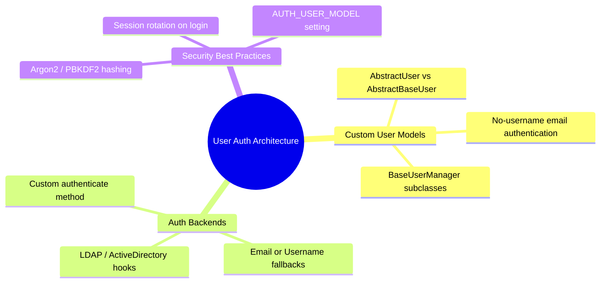

# 3.3.9. Django Authentication and Custom User Models

> [!info] Orientation
> A secure authentication system is critical for web applications. While Django provides a robust, built-in User model out of the box, standard defaults are rarely adequate for real production applications. This note details how Django's authentication architecture operates and walks step-by-step through setting up custom User models, custom managers, and multiple custom authentication backends.

---

## 1. Why a Custom User Model is Mandatory from Day One

Django ships with a preconfigured `User` class mapping fields like `username`, `first_name`, `last_name`, `email`, and `password`.

However, in modern web applications:
* Most sites prefer to authenticate users by their **email address** rather than a username.
* You may need custom fields, such as `phone_number`, `profile_picture`, or complex user hierarchies.

> [!danger] Critical Production Warning
> You **MUST** define and register a custom user model at the **very start** of your project (before running your first migration).
>
> Swapping or modifying the User model *after* migrating database relationships to Django's default `auth_user` table is an incredibly complex operation that requires manual SQL modifications, dropping foreign key constraints, and database downtime. Even if you don't need custom fields immediately, configure a basic custom user subclass on day one.



---

## 2. AbstractUser vs. AbstractBaseUser

Django provides two base classes for creating custom user models:

1. **`AbstractUser` (Recommended for most cases):**
   * Subclasses Django's standard user structure while keeping all default fields (`username`, `first_name`, `last_name`, `is_staff`, `is_active`, `date_joined`).
   * Lets you add custom columns (e.g., `phone`) without overriding core password-handling or permission structures.
   
2. **`AbstractBaseUser` (For complete control):**
   * Pure "blank slate" containing *only* password-hashing, login status flags, and custom column definitions.
   * You must write your own fields, email validation logic, and active/staff management routines. Use this if you want to drop the concept of a `username` field entirely.

---

## 3. Implementing a Username-free, Email-centric User Model

Let's build a custom user model from scratch using `AbstractBaseUser` that authenticates users purely using their **email address**:

### Step A: Create the Custom UserManager
Since our user model uses `email` instead of `username`, we must rewrite the UserManager class to query and create records with this constraint:

```python
# models.py
from django.db import models
from django.contrib.auth.models import AbstractBaseUser, BaseUserManager, PermissionsMixin

class CustomUserManager(BaseUserManager):
    """Custom manager to handle email-based authentication creation."""
    
    def create_user(self, email, password=None, **extra_fields):
        if not email:
            raise ValueError('The Email field must be set')
        email = self.normalize_email(email)
        user = self.model(email=email, **extra_fields)
        user.set_password(password)  # Securely hashes the password (default: PBKDF2)
        user.save(using=self._db)
        return user

    def create_superuser(self, email, password=None, **extra_fields):
        extra_fields.setdefault('is_staff', True)
        extra_fields.setdefault('is_superuser', True)
        extra_fields.setdefault('is_active', True)

        if extra_fields.get('is_staff') is not True:
            raise ValueError('Superuser must have is_staff=True.')
        if extra_fields.get('is_superuser') is not True:
            raise ValueError('Superuser must have is_superuser=True.')

        return self.create_user(email, password, **extra_fields)
```

### Step B: Define the Custom User Model
Next, we map the columns and instruct Django to read `email` as our primary credential identifier:

```python
# models.py (continued)
class CustomUser(AbstractBaseUser, PermissionsMixin):
    email = models.EmailField(unique=True, db_index=True)
    full_name = models.CharField(max_length=150)
    phone_number = models.CharField(max_length=20, blank=True, null=True)
    
    # Required system status flags
    is_active = models.BooleanField(default=True)
    is_staff = models.BooleanField(default=False)
    date_joined = models.DateTimeField(auto_now_add=True)

    # Assign custom manager
    objects = CustomUserManager()

    # Re-map standard credentials identifiers
    USERNAME_FIELD = 'email'  # Field used as the identifier
    REQUIRED_FIELDS = ['full_name']  # Required prompt inputs for createsuperuser

    def __str__(self):
        return self.email
```

### Step C: Update `settings.py` Configuration
Before running migrations, instruct Django to substitute its standard User model with your newly defined custom model:

```python
# settings.py
# Format: 'app_name.ModelName'
AUTH_USER_MODEL = 'accounts.CustomUser'
```

---

## 4. Custom Authentication Backends

By default, Django relies on `ModelBackend` to authenticate users, matching usernames and passwords. If you want to authorize users against multiple databases, support username-or-email authentication, or connect to external LDAP servers, you can build a **Custom Authentication Backend**.

To implement a custom authentication backend:
1. Create a class that inherits from `BaseBackend`.
2. Implement the `authenticate(request, username=None, password=None, **kwargs)` method.
3. Implement `get_user(user_id)` to resolve user instances during active session lookup calls.

Here is an backend allowing users to log in with *either* their username or email address:

```python
# authentication.py
from django.contrib.auth.backends import ModelBackend
from django.contrib.auth import get_user_model
from django.db.models import Q

User = get_user_model()

class EmailOrUsernameModelBackend(ModelBackend):
    def authenticate(self, request, username=None, password=None, **kwargs):
        if username is None:
            username = kwargs.get(User.USERNAME_FIELD)
        
        try:
            # Match either the email address or the username (if defined)
            user = User.objects.get(Q(email__iexact=username) | Q(username__iexact=username))
        except User.DoesNotExist:
            # Prevent timing attacks by running the password hasher's dummy method
            User().set_password(password)
            return None
        except User.MultipleObjectsReturned:
            # Handle rare race condition safely
            return None

        # Validate hashed credentials
        if user.check_password(password) and self.user_can_authenticate(user):
            return user
        return None
```

Now, wire your custom backend inside `settings.py`:

```python
# settings.py
AUTHENTICATION_BACKENDS = [
    'accounts.authentication.EmailOrUsernameModelBackend',
    'django.contrib.auth.backends.ModelBackend',  # Keep default as fallback
]
```

---

## Summary

Designing and implementing custom User models on day one is a critical requirement for production systems. By subclassing `AbstractBaseUser` and pairing it with custom UserManager classes, applications can securely adopt modern, email-centric user schemas. Utilizing custom authentication backends further allows seamless scaling, supporting multiple authentication paradigms safely.

## See Also

- [[3.3.1. Django Overview and MVT Pattern]]
- [[3.3.4. Django ORM Deep Dive and Database Abstraction]]
- [[3.3.8. Django Admin Interface Customization]]
- [[3.3.11. Django Performance and Query Optimization]]
