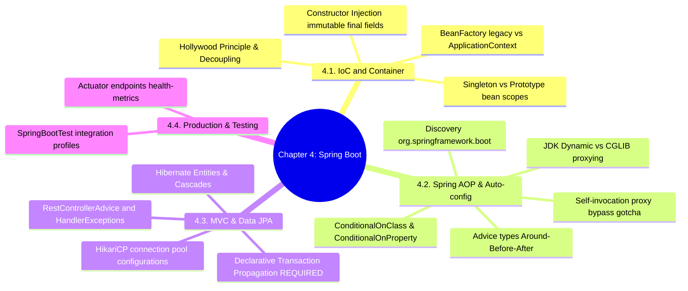

# 3.4.0. Spring Boot MOC

> [!info] Map of Content Purpose
> This local index acts as your navigation hub for Chapter 4: Spring Boot & Enterprise Java Architecture. Spring Boot is an opinionated, compile-time type-safe Java framework. This MOC connects Dependency Injection patterns, AOP proxies, transaction lifecycles, and observability systems inside Java's enterprise runtime.

---

## 1. Chapter Mind Map

The mind map below lays out the enterprise architecture concepts of Spring Boot:

---

## 2. Topic Outline & Atomic Notes

This module has 12 notes detailing the design patterns, lifecycles, and architecture of Spring Boot:

### [[3.4.1. Spring Boot Overview and Starters|1. Enterprise Java & Starter Starters]]
*Transitioning from legacy Spring configurations to modern Boot systems.*
* **Historical Baggage:** XML-based configurations, `web.xml`, and the manual servlet containers of legacy Spring.
* **Boot Solution:** Auto-configuration, Maven/Gradle dependencies, and embedded servers (Tomcat).

### [[3.4.2. SpringBoot IoC and Core Internals|2. Inversion of Control & Spring IoC Container]]
*Decoupling object instantiation from business logic.*
* **Hollywood Principle:** "Don't call us, we'll call you."
* **Container Abstractions:** `BeanFactory` (lazy) vs `ApplicationContext` (enterprise features, eager singletons).

### [[3.4.3. Spring Bean Lifecycle and Scopes|3. Spring Bean Lifecycle & Bean Scopes]]
*How Spring instantiates, configures, wraps, and destroys beans.*
* **Lifecycle Sequence:** Instantiation, properties injection, aware callbacks, PostProcessors, init hooks, and destroy handlers.
* **Scopes:** Singletons, Prototypes, Web request/session scopes, and injecting prototypes into singletons safely.

### [[3.4.4. Spring Aspect-Oriented Programming AOP|4. Aspect-Oriented Programming (AOP)]]
*Extracting cross-cutting operations like logging, metrics, and security.*
* **Aspect Terminology:** Pointcuts, JoinPoints, and Advices (`@Around`, `@Before`, etc.).
* **Proxies:** JDK Dynamic Proxies (interfaces) vs CGLIB (subclasses), and how to avoid the internal self-invocation proxy bypass bug.

### [[3.4.5. Spring Boot MVC Web Layer and Global Exception Handling|5. Spring MVC Web Layer & Global Exceptions]]
*Exposing REST endpoints and centralizing error handling.*
* **HTTP Mapping:** RestControllers, path variables, query parameters, and validating request body schemas.
* **Global Advising:** intercepting exceptions with `@RestControllerAdvice` and `@ExceptionHandler`.

### [[3.4.6. Spring Data JPA and Hibernate|6. Spring Data JPA & Hibernate Core]]
*Database mapping using Java persistent standards.*
* **Data Mapping:** Hibernate entity schemas, relationships, cascading operations, and lazy fetch loading constraints.
* **HikariCP Tuning:** Configuring and optimizing the Hikari connection pool limits for production.

### [[3.4.7. Spring Boot Auto-Configuration Mechanics|7. Auto-Configuration Internals]]
*Demystifying Spring Boot's "magic" startup configuration.*
* **Bootstrap Entry:** Annotations like `@SpringBootApplication` and discovering classes using conditional selectors (`@ConditionalOnClass`, `@ConditionalOnProperty`).

### [[3.4.8. Spring Boot Actuator and Observability|8. Actuator & Production Telemetry]]
*Observability, monitoring, and inspecting live applications.*
* **Actuator Endpoints:** Exposing `/health` (liveness vs readiness), `/metrics`, `/env`, and export mappings with Micrometer and Prometheus.

### [[3.4.9. Spring Data JPA Advanced Queries and Performance|9. JPA Advanced Queries & Performance]]
*Optimizing Hibernate performance and writing robust queries.*
* **Query Building:** Query methods, JPQL/HQL strings, native SQL queries, and solving the Hibernate N+1 entity select bottleneck.

### [[3.4.10. Spring Transaction Management and Propagation|10. Transaction Management & Propagation]]
*Configuring ACID transaction boundaries.*
* **Declarative Transactions:** Annotation `@Transactional` boundaries, propagation configurations (`REQUIRED` vs `REQUIRES_NEW`), and rollback conditions.

### [[3.4.11. Spring Boot Integration Testing with SpringBootTest|11. Testing Your Spring Boot Code]]
*Test-driven development for enterprise Java pipelines.*
* **Tests:** Integration testing using `@SpringBootTest`, mock beans, slice test configurations, and WebTestClient.

### [[3.4.12. Spring Profiles and Configuration Management|12. Spring Profiles & Config Management]]
*Managing properties cleanly across development stages.*
* **Profiles:** Activating dynamic properties (`application.yml`) across Dev, Test, and Prod stages.

---

## 3. Prerequisite Knowledge & Downstream Impact

* **Prerequisites:** 
  - Having a strong grasp of the Java Servlet lifecycle discussed in [[3.0.4. Gateway Interfaces and Web Server Runtimes]] is useful.
* **Downstream Connections:**
  - Spring's Constructor Injection is highly explicit, contrasting with Laravel's automatic container auto-wiring [[5.2.1 IoC Container Mechanics]].
  - Hibernate's Data Mapper model contrasts with Django's Active Record ORM [[3.3.4. Django ORM Deep Dive and Database Abstraction]] and Laravel's Eloquent [[5.3.1 Active Record Implementation]].

---

*See also: [[00. Master Index]] — [[3.0. Chapter Index]]*
