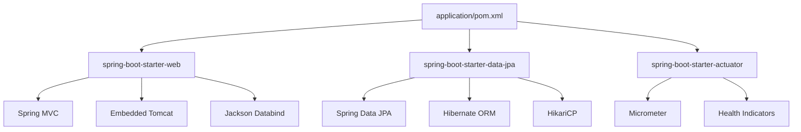

# 3.4.1. Spring Boot Overview and Starters

> [!info] Spring Boot is an opinionated layer on top of the Spring Framework that removes the boilerplate of XML configuration, manual dependency wiring, and external servlet containers.
> This note covers what Spring Boot is, how it differs from raw Spring Framework, the starter dependency model, the bootstrap annotation, configuration files, the actuator, and the build-tool story.

## 1. What Spring Boot Is

Spring Boot is a Java application framework first released in 2014 by Pivotal (now Broadcom's Spring team) and built on top of the Spring Framework, which dates back to 2003. The "Spring Framework" itself is a comprehensive programming and configuration model for Java — inversion of control, dependency injection, declarative transactions, AOP, and an abstraction layer over JDBC, JPA, messaging, and web servlets. The framework is powerful but historically verbose: a typical Spring 2.x or 3.x application required a `web.xml` deployment descriptor, multiple XML application context files, explicit bean definitions, and a manually installed servlet container (Tomcat or Jetty) on which to deploy the resulting WAR file.

Spring Boot was created to collapse that boilerplate. It is **opinionated**: it makes sensible default choices for you (embedded Tomcat, Logback for logging, Jackson for JSON, Jackson-datatype-jsr310 for Java 8 time types), it prefers **convention over configuration** (a class named `Application` in the root package is auto-scanned), and it ships an **embedded servlet container** so that the build output is a runnable JAR rather than a deployable WAR. The runnable JAR is the keystone of the Spring Boot production model: `java -jar myapp.jar` is the entire deployment command, no application server required.

The framework is mature, the documentation is exhaustive, and the talent pool is the largest in the JVM ecosystem. These three properties explain why Spring Boot dominates enterprise Java: it is the default choice for new greenfield JVM services at banks, airlines, telcos, and most large European and Asian enterprises, and it is the framework that the Spring team and the wider community write tutorials, certifications, and Stack Overflow answers against.

## 2. Spring Boot vs Raw Spring Framework

The clearest way to understand Spring Boot is to contrast it with the raw Spring Framework it sits on top of. The table below summarises the differences that an application developer feels day to day.

| Concern | Raw Spring Framework | Spring Boot |
| ------- | -------------------- | ----------- |
| Configuration | XML files or `@Configuration` classes, hand-written | Auto-configured by `@EnableAutoConfiguration` based on classpath |
| Servlet container | External (Tomcat installed separately, deploy WAR) | Embedded Tomcat, Jetty, or Undertow (run JAR) |
| Dependency management | Hand-pick versions, hope for compatibility | Starter POMs curate a tested version set |
| Properties | `PropertyPlaceholderConfigurer` over `.properties` | `application.properties` / `application.yml` with relaxed binding |
| Actuator / ops | Roll your own health endpoints | Built-in `/actuator/health`, `/actuator/metrics`, etc. |
| Build artifact | WAR | Runnable JAR (or WAR if you really want one) |

A Spring Boot application *is* a Spring Framework application — every annotation (`@Component`, `@Service`, `@Autowired`, `@Transactional`) behaves identically. Spring Boot adds the bootstrap, the auto-configuration, the starters, and the production tooling; it does not replace the core IoC container or the AOP machinery. For an in-depth treatment of those, see [[3.4.2. SpringBoot IoC and Core Internals]].

## 3. Starters

A Spring Boot **starter** is a Maven or Gradle dependency that pulls in a curated set of libraries for a particular concern. The starter POM does not itself contain code — it is a pure dependency-aggregation POM that lists transitive dependencies with versions chosen to be mutually compatible. The compatibility guarantee is what makes starters valuable: if you mix `spring-boot-starter-web` 3.2 with `spring-boot-starter-data-jpa` 3.2, the Spring team guarantees the Jackson, Hibernate, and Tomcat versions will not collide.

| Starter | Pulls in |
| ------- | -------- |
| `spring-boot-starter` | Core Spring, Spring Boot autoconfigure, logging (Logback), YAML support |
| `spring-boot-starter-web` | Spring MVC, embedded Tomcat, Jackson, validation |
| `spring-boot-starter-data-jpa` | Spring Data JPA, Hibernate, transaction management |
| `spring-boot-starter-security` | Spring Security, default filter chain, password encoders |
| `spring-boot-starter-actuator` | Production endpoints (health, metrics, env, info) |
| `spring-boot-starter-test` | JUnit 5, Mockito, AssertJ, Spring Test, JSONPath |
| `spring-boot-starter-validation` | Bean Validation (Hibernate Validator) |
| `spring-boot-starter-data-redis` | Lettuce client, Spring Data Redis |
| `spring-boot-starter-amqp` | RabbitMQ client, Spring AMQP |



The graph above shows what each starter transitively pulls in. The transitive closure is sizeable — a minimal `spring-boot-starter-web` application has roughly 60–80 JARs on its classpath — but the alternative (hand-picking every version) is worse in every dimension except JAR count.

## 4. The Bootstrap Annotation

Every Spring Boot application has an entry-point class annotated with `@SpringBootApplication`. The annotation is a meta-annotation that combines three concerns:

```java
package com.example.myapp;

import org.springframework.boot.SpringApplication;
import org.springframework.boot.autoconfigure.SpringBootApplication;

@SpringBootApplication
public class Application {
    public static void main(String[] args) {
        SpringApplication.run(Application.class, args);
    }
}
```

Decomposed, `@SpringBootApplication` is:

- **`@Configuration`** — marks the class as a source of bean definitions (you can put `@Bean` methods directly on it).
- **`@EnableAutoConfiguration`** — triggers Spring Boot's auto-configuration mechanism, which inspects the classpath and conditionally applies configuration classes (e.g. if `spring-web` is present, configure Spring MVC; if a `DataSource` is present, configure JPA).
- **`@ComponentScan`** — scans the package of the annotated class (and below) for `@Component`, `@Service`, `@Repository`, `@Controller`, `@Configuration` classes and registers them as beans.

The `SpringApplication.run()` call is the bootstrap entrypoint. It creates an `ApplicationContext`, runs component scanning, applies auto-configuration, starts the embedded servlet container, and registers a JVM shutdown hook so the context closes cleanly on `SIGTERM`. The placement of the `Application` class matters: because `@ComponentScan` starts from the class's package, putting `Application` in `com.example.myapp` causes every class under `com.example.myapp` to be scanned, while putting it in `com.example.myapp.config` would silently skip your controllers in `com.example.myapp.web`. Convention is to put it at the root of your base package.

## 5. Application Properties

Spring Boot externalises configuration through `application.properties` or `application.yml`, loaded from the classpath root (typically `src/main/resources/`) at startup. Properties can also be overridden by environment variables, command-line arguments, JNDI attributes, or external files — there is a well-defined precedence order documented in the reference.

```yaml
# application.yml
server:
  port: 8080
  servlet:
    context-path: /api

spring:
  datasource:
    url: jdbc:postgresql://localhost:5432/myapp
    username: myapp
    password: ${DB_PASSWORD}
  jpa:
    hibernate:
      ddl-auto: validate
    show-sql: false

management:
  endpoints:
    web:
      exposure:
        include: health,info,metrics
```

Profile-specific files follow the convention `application-<profile>.yml`. Activating the `prod` profile (`--spring.profiles.active=prod`) loads `application-prod.yml` on top of the base file, with profile-specific values overriding base ones. The `${DB_PASSWORD}` syntax above is property placeholder substitution — it reads the `DB_PASSWORD` environment variable, and fails fast if the variable is unset unless a default is supplied as `${DB_PASSWORD:changeme}`.

The relaxed binding rules let you write `server.port` in YAML and read it as `server.port` in `@Value("${server.port}")` or via a `@ConfigurationProperties` class — case, kebab-case, snake_case, and camelCase are all equivalent. This is a quality-of-life feature that the raw Spring Framework did not have.

## 6. The Actuator

Spring Boot Actuator is the production-grade operations module. Adding `spring-boot-starter-actuator` to your build exposes a set of HTTP (or JMX) endpoints under `/actuator/*` that give visibility into the running application.

| Endpoint | What it exposes |
| -------- | ---------------- |
| `/actuator/health` | Application health (database connectivity, disk space, custom indicators) |
| `/actuator/info` | Build information, Git commit, custom info contributors |
| `/actuator/metrics` | Micrometer metrics — JVM memory, HTTP request counts, HikariCP pool stats |
| `/actuator/env` | Environment variables and property sources (sensitive values masked) |
| `/actuator/loggers` | Live log-level inspection and modification |
| `/actuator/threaddump` | JVM thread dump |
| `/actuator/heapdump` | JVM heap dump (downloadable HPROF) |
| `/actuator/mappings` | All `@RequestMapping` routes and their handlers |

For security, most endpoints are disabled or HTTP-restricted by default. The `health` and `info` endpoints are typically exposed publicly so that a load balancer can probe them, while `env`, `threaddump`, and `heapdump` are restricted to internal operators. Micrometer — the metrics facade bundled with the actuator — is the integration point for Prometheus, Datadog, New Relic, and CloudWatch: register a `MeterRegistry` bean and every metric flows to your monitoring system automatically.

## 7. Maven vs Gradle

Spring Boot supports both Maven and Gradle. Maven is the more conservative choice; Gradle is the more flexible one. Both are first-class and both produce the same runnable JAR via the Spring Boot plugin.

For Maven, the `spring-boot-starter-parent` POM is the conventional parent. It pins Spring Boot's dependency versions, configures the Java compiler version, sets the UTF-8 source encoding, and wires in the `spring-boot-maven-plugin`. The plugin's `repackage` goal repackages the standard JAR into a *fat JAR* that contains all dependency classes and a special `JarLauncher` main class. Running `mvn package` produces `target/myapp-1.0.0.jar` which you launch with `java -jar target/myapp-1.0.0.jar`.

For Gradle, the equivalent is the `org.springframework.boot` plugin applied in `build.gradle`. The `bootJar` task produces the fat JAR; the `bootRun` task starts the application in-place for development. Gradle's incremental build and configuration cache make it noticeably faster on large multi-module projects, but Maven's dominance in enterprise environments means more CI templates, more internal plugins, and more internal expertise are Maven-shaped.

A modern alternative is the Spring Boot Buildpacks integration: `spring-boot:build-image` (Maven) or `bootBuildImage` (Gradle) produces an OCI container image without a Dockerfile. The resulting image layers the application code on top of the `paketobuildpacks/base` image, which is useful for organisations that want reproducible container builds without maintaining a Dockerfile per service. The container deployment story is picked up in [[6.1. Docker Containerization and Networking]].

## 8. Why Spring Boot Dominates Enterprise Java

Three structural reasons explain Spring Boot's enterprise dominance. First, the ecosystem: Spring has integrations with virtually every JVM-relevant technology — Kafka, RabbitMQ, Redis, MongoDB, Neo4j, GraphQL, gRPC, Batch, Integration, Cloud (which wraps Spring Boot apps with service discovery, circuit breakers, and config servers). The breadth is unmatched by any other JVM framework. Second, the documentation: the Spring reference docs are exhaustive, versioned, and kept in sync with the framework releases; the Spring guides repository has 200+ runnable sample applications. Third, the talent pool: Java is the most-taught object-oriented language in universities worldwide, Spring is the most-taught Java web framework, and certifications (Spring Professional, VMware Spring Certified) provide a recognised skills signal. Enterprises hire for skills they can find, and Spring skills are the easiest JVM skills to find.

## Summary

Spring Boot is an opinionated layer over the Spring Framework that replaces XML boilerplate, manual dependency wiring, and external servlet containers with auto-configuration, starter POMs, and an embedded Tomcat. The `@SpringBootApplication` annotation bootstraps the application context, component scanning, and auto-configuration in one shot. Application configuration is externalised through `application.yml` with profile overrides and relaxed binding. The Actuator provides production-grade health, metrics, and operational endpoints. Maven and Gradle are both first-class build tools, both producing runnable fat JARs via the Spring Boot plugin.

## See Also

- [[3.4.2. SpringBoot IoC and Core Internals]]
- [[3.3.1. Django Overview and MVT Pattern]]
- [[3.5.1. Laravel Overview and Installation]]
- [[6.1. Docker Containerization and Networking]]
- [[6.3. Nginx Reverse Proxy and Load Balancing]]

## References

- Spring team, "Spring Boot Reference Documentation", https://docs.spring.io/spring-boot/docs/current/reference/html/
- Walls, C., *Spring in Action*, 6th ed., Manning.
- Spring team, "Spring Boot Starters", https://docs.spring.io/spring-boot/docs/current/reference/html/using.html#using.build-systems.starters
